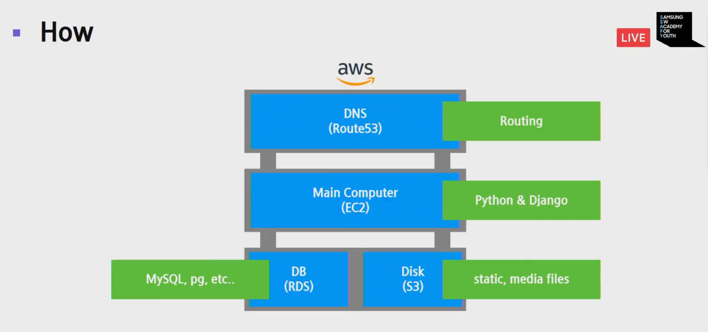

# 배포란 무엇인가

<br>

## 배포란?

<br>

### What

: 우리는 서버컴퓨터에서 request와 response를 처리할 **프로그램**을 개발한다.

<br>

### When

While alive:

​ 분석, 계획, 설계   |   개발   |   테스트   |   배포   |   운영

​ (         개 발        ) (  제품 출시 및 운영 )

<br>

### Who & Where

- 제공자가 사용자 컴퓨터에
- 사용자가 사용자 컴퓨터에
  - Native App
- 제공자가 제공자 컴퓨터에
  - Web App

<br>

### How



<br>

### Why - In reality

> 프로그램을 개발하는 이유 == 배포

<br>

<br>

## Pip freeze

> 현재 서버에 깔려 있는 python 모듈들에 대한 목록을 뽑아내준다!
>

```bash
pip freeze > requirements.txt
```

<br>

> `freeze` 사용하기

1. 프로젝트 폴더 생성
2. .gitignore => venv/
3. python -m venv venv
4. source venc/../activate
5. pip install django

--- Loop ----

1. pip freeze > requirements.txt   => 새로운 **package** 나 **module** 을 설치할때마다 새로 `freeze` 하기

<br>

<br><br>

### 정리

<br>

### 배포란?

- SW를 쓰기 위해 해야 하는 일
- cloud computer를 빌려서 web program을 배치
- data 수집  =>  CSV  =>  밀어넣기
- data 이전  =>  dumpdata  -  loaddata

### 협업 시 프로젝트 설정 순서

1. git clone [공유프로젝트주소]

   (.gitignore -> venv)

2. python -m  venv venv

3. python venv/bin/activate

4. pip install -r requirements.txt

5. 개발 시작
