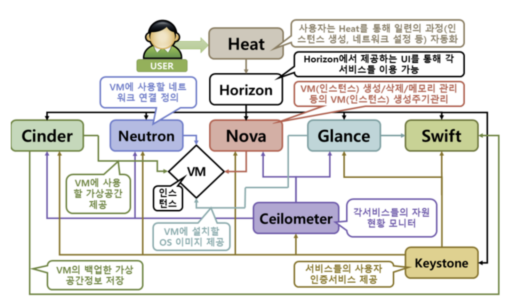
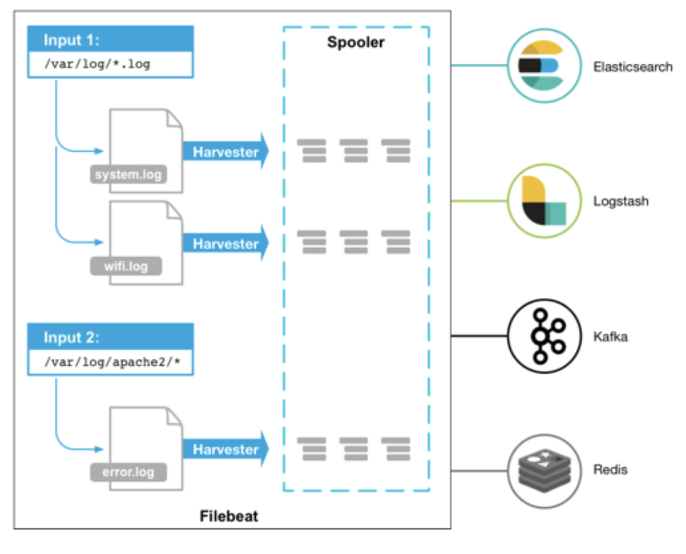

# 프로그래밍 용어 사전

<br/>
<br/>

1. `Compiler 컴파일러`

   : 프로그래밍 언어로 작성한 코드들을 컴퓨터가 이해하는 기계어로 변환해 주는 것

2. `Syntax`

   : 문법

3. `Syntactic Sugar`

   - 기본적으로 내부적인 작동 원리는 변하지 않지만 좀 더 코딩이 편하도록 외부적인 형태를 교체해준 것
   - 프로그래밍 언어의 문법을 간단하고 편리하게 사용할 수 있도록 만든 구문적인 기능
   - 실제로 언어의 기능을 확장하지 않고, 단지 더 간단하게 표현하거나 코드를 더 직관적이게 만들어줌
   - ex)
     - Python에서 list comprehension을 사용하여 loop를 간단하게 표현하는 것
     - JavaScript에서 object literal을 사용하여 수비게 객체를 만드는 것

4. `Syntax Parser`

   : Compiler나 Interpreter 처럼 개발자가 작성한 코드가 문법상 맞는지 분석하고, 이를 컴퓨터가 이해하는 언어로 전환 시켜주는 작업

5. `Script Language 스크립트 언어`

   : 별도의 컴파일 작업이 필요 없는 언어. 이에 따라 변수마다 자료형을 지정할 필요가 없는 언어.  

      -> HTML, CSS, PHP 등이 대표적인 스크립트 언어

6. `IDE (Integrated Development Environment)`

   : 효율적으로 소프트웨어를 개발하기 위한 통합 개발환경 소프트웨어 어플리케이션 인터페이스.

   코드 편집기, 디버거, 컴파일러, 인터프리터 등을 포함하고 개발자에게 제공 ex) Eclipse, JDE, 안드로이드 스튜디오, 비주얼 스튜디오, 델파이, RStudio, 넷빈즈, 코드 블럭스  

   ​    -> 가장 많이 쓰이는 것: Eclipse (IBM), 비주얼 스튜디오 (Microsoft)

7. `Control Flow (Flow of Control)`

   : Statement들이 실행되는 순서

8. `Parameter 인자`

   : Function 안의 괄호에 들어가는 값. (함수라는 기계에 들어가는 원재료)

9. `Argument 인자값`

   : 인자에 실제로 대입 된 값

10. `API (Application Programming Interface)`

   : 프로그램끼리 서로 소통하는 인터페이스. 객체지향 프로그래밍 (OOP= Object Oriented Programming) 에서는 보통 class의 인스턴스를 만들어 서로 소통하므로 class의 property와 method를 통합하여 API라고 지칭함  

 -> a set of routines, protocols, and tools for building software applications. Basically, an API specifies how software components should interact. Additionally, APIs are used when programming graphical user interface (GUI) components.

11. `AJAX (Asynchronous Javascript and XML)`

    : 비동기적 자바스크립트와 XML

12. `Asynchronous 비동기적`

    : 다른 작업을 막거나 기다리지 않고 곧바로 수행되는 방식.  

    ex) 어떤 앱이 용량이 큰 동영상을 불러오는 동안 유저가 화면이동을 자유롭게 하게끔 하는 것

      -> 어떤 작업이 끝날 때까지 기다리기 않고 여러 작업이 동시다발적으로 진행됨

13. `Multi-thread`

    : 동시에 여러 작업이 진행되는 것

14. `Imperative Programming 명령형 프로그래밍`

    : 프로그램이 어떻게 (How) 목적을 달성하는지 그 절차와 방법을 중시하는 프로그래밍 패러다임. 프로그램의 상태(State)를 변경하기 위해 Statement를 사용함

15. `Declarative Programming 선언형 프로그래밍`

    : 프로그램이 무엇을 (What) 달성하는지 그 결과에 보다 집중하는 프로그래밍 패러다임.  

      -> Imperative 프로그래밍과 반대 개념. 연산의 로직을 Control Flow에 대한 설명없이 표현함.

16. `Script 언어`

    : 따로 컴파일 작업이 필요 없는 언어를 말함. Chrome이나 Edge같은 웹 브라우저가 컴파일링 작업을 대체해줌. 용어 자체는 연극의 대본(Script)에서 유래.

17. `Javascript 엔진( 구글 V8 )`

    : Javascript를 기계가 이해할 수 있는 언어로 변환시켜주는 엔진으로 구글의 V8이 대표적이다. 이러한 Javascript 엔진은 주로 C++와 같은 언어로 만들어짐.

18. `ECMA`

    : Javascript 표준 중 하나.

     -> 여러 브라우저들마다 제각각 다른 표준을 적용하면 혼란스러우므로 Javascript 작성의 표준을 정해놓은 것.

19. `Node.js`

    : 원래 웹 프런트 위주로 사용되는 Javascript를 백엔드 언어로 확장한 것.

      -> Javascript 엔진인 V8은 C++로 만들어졌는데, V8의 C++을 확장하여 Javascript가 서버 쪽도 다룰 수 있게 한 것이 Node.js!

20. `렌더링(Rendering)`

    : 논리적인 문서의 표현식을 그래픽 표현식으로 변형시키는 과정

       => html, css등 코드로 적어 놓은 것이 웹사이트에 나타나게 되는 과정-렌더링 2 단계DOM 요소와 스타일에 기반을 둔 레이아웃 계산. 계산된 요소의 화면 표현- 브라우저에서 렌더링 성능은 중요한 요소 가운데 하나.

      -> 렌더링 성능을 향상 시키면 사용자가 느끼는 체감 속도를 개선할 수 있음

     -> 자바스크립트로 동적인 작업을 실행할 때의 렌더링 문제를 최소화하여 성능을 높일 수 있다

21. `비즈니스 로직 (Business Logic)`

    : 업무에 필요한 데이터 처리를 수행하는 응용 프로그램의 일부 Data 처리를 수행하기 위해 Data를 활용하여 계산, 판단, 가공 등을 하는 ‘Logic’을 의미. 대부분의 Client Program은 User Interface와 Business Logic으로 구성되며, server Program은 대부분 Business Logic으로 구성된다.

    -> 프로그래밍에서 비즈니스 로직은 요구사항을 직접 해결하는 영역이기 때문에 유지 보수에 신경쓰지 않는다면 생산성과 품질이 저하된다

22. `롬복 (lombok)`

    : 자바에서 @Getter, @Setter 같은 annotation 기반으로 관련 기존 DTO, VO, Domain Class 작성할 때, 멤버 변수에 대한 Getter/Setter Method, Equals(), hashCode(), ToString()과 멤버 변수에 값을 설정하는 생성자 등등을 자동으로 생성해 주는 라이브러리

23. `CDATA <![CDATA[...]]>`

    : CDATA sections provide a way to tell the parser that there is no markup in the characters contained by the CDATA section.
    This makes it much easier to create documents containing sections where markup characters might appear, but where no markup is intended. ( by MS Developer Network)
    (Unparsed) Character Data.

     -> 즉, 파싱하지 않는 문자 데이터를 말함.Tag 안에 들어가는 텍스트가 파싱되지 않게 하는 기능을 함 Parser가 잘못 파싱 할 수 있는 텍스트를 다룰 때, Tag 안에 있는 내용은 무시해도 된다는 것을 알려주므로 Parser의 잘못된 파싱을 방지한다문자열 (String)을 표현할 때 사용함ex) RSS 데이터에 HTML이나 XML Tag가 포함된 내용을 RSS용 XML Tag와 헷갈리지 않도록 CDATA로 감싼다

24. `PCDATA`

    : 파싱하는 문자 데이터

25. `Groovy`

    : JVM (= Java Virtual Machine) 에서 실행되는 스크립트 언어. Java와 마찬가지로 소스 코드를 작성하고 Java 가상 머신에서 동작하지만, Java와 달리 소스 코드를 컴파일 할 필요는 없다. Groovy는 스크립트 언어이며, 소스 코드를 그대로 실행한다. Java와 호환되고, Java Class File을 그대로 Groovy Class로 사용할 수 있다.문법도 Java에 아주 가까워, Java를 보다 사용하기 쉽게 한 것으로 느낄 수 있다.

26. `Gradle`

    : ‘간편하게 사용할 수 있는 Java’ 라고 할 수 있는 Groovy를 사용하여 빌드 처리를 작성하고 실행하는 것.

    -> Gradle을 사용하면 Java와 거의 비슷한 코드를 써서 빌드 처리를 관리 할 수 있음

28. `Maven`

    : XML 기반의 빌드 처리를 작성. 간단한 내용이라면 상관 없지만, 복잡한 내용을 작성하게 되면 XML 기반에 의한 묘사는 상당히 어려워짐.  

29. `IOC (= Inversion of Control) 역제어`

    : 어떤 일을 하도록 만들어진 Framework의 제어 권한을 넘김으로써 Client Code가 신경 써야 할 것을 줄이는 전략  

    -> 제어가 역전되었다고 함

    -> 일반적으로 Library는 Programmer가 작성하는 Client 코드가 Library 의 Method 를 호출해서 사용하는 것을 의미함Framework를 규정하는 특성은 Framework의 Method가 사용자의 코드를 호출 한다는데 있음

    -> 첫 번째 방법

    Framework의 event, delegate에 나의 Method를 등록시키는 것전달되는 인자와 반환 형식만 일치 한다면, Framework 코드는 내가 작성한 객체와 타입을 고려하지 않음  -> 등록된 Method만 감지하여 실행 Invoke 하는 것
    -> 두 번째 방법

    Framework에 정의되어 있는 Interface, Abstract Type을 나의 코드에서 구현, 상속 한 후 Framework에 넘겨주는 것Framework는 Interface와 Abstract Class 를 알고 있으므로 내가 하고자 하는 일련의 작업을 처리 할 수 있음

       => 객체를 Framework에 주입하는 것     => DI (= Dependency Injection) 의존성 주입

30. `JDBC, DBCP`

    : Java Web Application에서 DB접속과 관련된 Libraries

31. `JDBC (= Java DataBase Connectivity)`

    : Java에서 Database에 연결하기 위한 Interface

      -> Oracle, MySQL, MsSQL 등 Database는 JDBC를 사용하기 위한 각각의 Driver를 제공함

      -> JDBC는 이 Driver를 통해 DB에 접속함

32. `DBCP (= DataBase Connection Pool)`

    : 효율적인 DB Connection을 위해 사용하며, DB와 Connection을 맺고있는 객체를 관리하는 역할을 함DBCP를 사용하면 WAS 실행 시 미리 일정량의 DB Connection 객체를 생성하고, Pool이라는 공간에 저장해둠DB 연결 요청이 있으면, 이 Pool 이라는 공간에서 Connection 객체를 가져다 쓰고 반환하게 됨

    **[ DBCP 설정 옵션 ]**

    1) `maxActive` : 동시에 사용할 수 있는 최대 커넥션 개수

    2) `maxIdle`: Connection Pool에 반납할 때 최대로 유지될 수 있는 커넥션 개수

    3) `minIdle`: 최소한으로 유지할 커넥션 개수

    4) `initialSize` : 최소로 getConnection() Method를 통해 커넥션 풀에 채워 넣을 커넥션 개수

32. `Fault tolerance  내결함성`  

     : 운영중이던 System의 data가 손실되거나 진행중인 작업이 손상되지 않도록 전원 부족 또는 hardware 장애와 같은 돌발 사태에 대비할수 있는 컴퓨터 또는 운영체제의 기능

33. `HA (= High Availability)  고가용성`

     : Server와 Network, Program 등의 정보 시스템이 오랜 기간동안 지속적으로 정상 운영이 가능한 성질

     -> 고가용성을 제공하기 위해서 주로 2개의 Server를 연결하는 방식을 사용

     -> 2개로 묶인 Server 중 1대의 Server에서 장애가 발생하면, 다른 Server가 즉시 그 업무를 대신 수행하므로 시스템 장애를 불과 몇 초만에 복구 할 수 있다

34. `In-memory Database`

     : Data storage의 main memory에 설치되어 운영되는 방식의 DBMS

     -> Disk에 최적화된 database보다 빠른데 그 이유는 disk 접근이 memory 접근보다 느리기 때문

     -> 내부 최적화 알고리즘이 더 단순하여 더 적은 CPU 명령을 실행

     -> memory의 data에 접근하면 data를 조회할 때 검색 시간이 줄어들며 disk보다 더 빠르고 더 예측 가능한 성능을 제공한다

35. `Subnet`

     : 하나의 네트워크가 분할되어 나눠진 작은 네트워크

     -> 네트워크를 분할하는 것을 `Subnetting` 이라고 함

     -> Subnetting은 `Subnet Mask` 를 통하여 수행 될 수 있음

36. `Subnetting`

     : 네트워크 관리자가 네트워크 성능을 향상시키기 위해 자원을 효율적으로 분배하는 것

     -> 네트워크 영역과 호스트 영역을 분할 하는 것

37. `SandBox`

     : 외부로부터 받은 파일을 바로 실행하지 않고 보호된 영역에서 실행시켜 봄으로써 외부로부터 들어오는 파일과 프로그램이 내부 시스템에 악영향을 주는 것을 미연에 방지하는 기술

     -> 외부로부터 유입되는 악성코드로부터 시스템 내 파일이나 프로세스를 보호하는데 사용

     -> SandBox에서 실행되어 안전하다고 검증받은 파일이나 작업은 시스템 변경이 가능하지만, 허용하지 않은 경우에는 변경 불가

38. `Information Silo  정보 사일로`

     :  하나의 정보 시스템이나 하위 시스템이 다른 관련 시스템과 상호 간의 운영을 할 수 없는 배타적인 관리 체제

     -> 정보는 적절히 공유되지 않고 각 시스템이나 하위 시스템에 격리되며, 이는 마치 곡물이 사일로(저장탑) 안에 갇히는 것처럼 컨테이너 안에 갇히는 것으로 비유됨

39. `Data lake`

     : 가공되지 않은 다양한 종류의 데이터를 한 곳에 모아둔 저장소의 집합

     -> 빅데이터를 효율적으로 분석하고 사용하고자 다양한 영역의 Raw 데이터(가공되지 않은 데이터)를 한 곳에 모아서 관리하고자 하는 것

40. `Scale-up`

     : Server가 더 빠르게 동작하기 위해 hardware 성능을 올리는 방법

41. `Scale-out`

     : 하나의 Server 보다는 여러대의 Server가 나눠서 일은 하는 방법

     -> **Pros**

     - Hardware 향상하는 비용보다 Server 추가하는 비용이 더 적다
     - 여러 대의 Server 덕분에 무중단 서비스를 제공할 수 있다

42. `Load Balancing  부하 분산`

    : 하나의 인터넷 서비스가 발생하는 traffic이 많을 때 여러 대의 Server가 분산처리하여 Server의 로드율 증가, 부하량, 속도 저하 등을 고려하여 분산처리하여 해결해주는 것

43. `Load Balancer`

     : 여러대의 Server에게 균등하게 traffic을 분산시켜주는 역할을 하는 시스템

44. `DevOps`

    : SW 개발자들과 IT 종사자들 사이의 의사소통, 협업, 융합을 강조한 소프트웨어 개발 방법론이며 SW 개발과 IT 운영간의 상호 의존 관계에 대한 산물

    -> Devops는 운영팀과 개발팀을 하나의 팀으로 묶어놓고 전체적인 개발 사이클을 빠르게 하고자 하는 조직 구조이자 문화

    출처: <https://bcho.tistory.com/1325> [조대협의 블로그]

45. `CI (Continuous Integration)`

     : 개발자가 각각 개발한 소스코드를 모아서 한번에 빌드하는 통합 빌드의 과정을 특정 시점이 아니라 주기적으로 수행함으로써 통합에서 발생하는 오류를 사전에 해결하고, 이러한 과정들에 소요되는 시간을 줄이기 위한 기법

     -> Agile 방법론이 대두되면서 더욱 주목 받게 됨

     -> 배포를 위한 build 단계, testing 단계 등에서 시간을 절약하는 효과를 발휘하여 시장 변화 속도에 발맞춰 대응 할 수 있음

     -> 속도와 품질 모두 잡는다!

     - CI System 구축을 위한 구성 요소

       - `CI Server`

         : Build process를 관리하는 server

         ex) Jenkins, Travis CI

       - `SCM (Source Code Management)`

         : Source code 형상관리 시스템

         ex) Git, Subversion

       - `Build Tool`

         : Compile, test, 정적 분석 등을 실시해 동작 가능한 software를 생성하는 도구

         ex) Maven, Gradle, Ant

       - `Test Tool`

         : 작성된 Test code에 따라 자동으로 test를 수행해주는 도구로 build tool 의 script에서 실행됨

         ex) JUnit, Mocha

46. `Parsing`

    : html 등의 page에서 내가 원하는 data를 특정 pattern이나 순서로 추출해 가공하는 것

    - `Parser`
      - compile의 일부로서 원시 program의 명령문이나 HTML 문서 등에서 Markup Tag 등을 input으로 받아들여서 syntax를 해석할 수 있는 단위와 여러 부분으로 분할해주는 역할을 함
    - **Parser** 역할을 하는 컴퓨터가 **parse tree** 로 재구성하는 구문 분석 과정
    - Parsing 과정에서 부호에 불과한 일련의 문자열이 기계어로 번역되고 의미있는 단위가 됨
    - **Parsing의 종류**
      - 상향식 파싱 (bottom-up parsing)
      - 하향식 파싱 (top-down parsing)

    

47. `MIME types`

     : A **media type** (also known as a **Multipurpose Internet Mail Extensions or MIME type**) is a standard that indicates the nature and format of a document, file, or assortment of bytes.

     **Browsers use the MIME type, not the file extension**, to determine how to process a URL, so it's important that web servers send the correct MIME type in the response's `Content-Type` header. If this is not correctly configured, browsers are likely to misinterpret the contents of files and sites will not work correctly, and downloaded files may be mishandled.

48. `ping`

     : icmp프로토콜을 이용하여 명령어에 지정한 주소로 응답요청을 보내고 그 응답을 받아 네트워크 상태를 파악하게 하는 명령어

49. `TraceRoute` - Linux / `TRACERT` - Windows

     : 지정된 호스트에 도달할 때까지 통과하는 **경로의 정보**와 각 경로에서의 **지연 시간**을 추적하는 네트워크 명령어로 *특정 사이트에 접속이 되지 않거나 지연이 있는 경우* 어디에서 병목이 발생하는지를 알아보는데 유용함.  

     접속이 되는 각 경로를 체크하여 **어느 경로(Routing)**를 거쳐 접속이 되고, **어느 구간**에서 **얼마 만큼**의 속도 지연이 있는지,  그리고 **어디에서**패킷이 중지 됐는지를 확인할 수 있음

     단, *시간대/내부 트래픽/서버 상태* 등의 많은 영향을 받아 값이 달라질 수 있으므로 반복 확인이 필요하다!

     > Install traceroute

     ```bash
     sudo apt-get install traceroute
     ```

     > Use traceroute

     ```bash
     $ traceroute www.google.com
     traceroute to www.google.com (172.217.31.164), 30 hops max, 60 byte packets
      1  _gateway (172.30.1.254)  5.195 ms  5.127 ms  5.105 ms
      2  220.78.3.1 (220.78.3.1)  5.071 ms * *
      3  125.141.249.21 (125.141.249.21)  5.364 ms  5.308 ms  5.262 ms
      4  * * *
      5  * * *
      6  112.174.73.178 (112.174.73.178)  6.510 ms 112.174.47.162 (112.174.47.162)  5.301 ms 112.174.73.178 (112.174.73.178)  4.858 ms
      7  74.125.52.16 (74.125.52.16)  31.913 ms  31.801 ms  33.951 ms
      8  108.170.242.129 (108.170.242.129)  36.142 ms 108.170.242.97 (108.170.242.97)  34.386 ms  34.811 ms
      9  209.85.253.109 (209.85.253.109)  36.711 ms  36.555 ms  36.483 ms
     10  nrt12s22-in-f4.1e100.net (172.217.31.164)  34.998 ms  33.267 ms  32.844 ms
     ```

50. `SRE (Site Reliability Engineering)`

    : “ class **SRE** implements **Devops** “

    Devops가 개발과 운영의 *사일로(분단) 현상*을 해결하기 위한 방법론이자 하나의 조직문화에 대한 방향성이다. 그렇다면 SRE는 구글이 Devops에 적용하기 위한 구체적인 프렉틱스(실사례)와 가이드로 생각하면 된다

    - What does an SRE Engineer do?
      

51. `SSh (Secure Shell Protocol)`

     : 네트워크 프로토콜 중 하나로 컴퓨터와 컴퓨터가 인터넷과 같은 Public Network를 통해 서로 통신을 할 때 보안적으로 안전한 통신을 위해 사용하는 프로토콜

     사용 예)

     1. **데이터 전송**
        - ex) Github 에 push 할 때 SSH를 활용해 파일 전송
     2. **원격 제어**
        - ex) AWS의 인스턴스 서버에 접속하여 해당 머신에 명령을 내리기 위해 SSH를 통해 접속

     - SSH가 안전한 통신이 가능한 이유
       - 컴퓨터와 통신을 위해 접속 할 때 비밀번호를 통한 접속이 아닌, 한 쌍의 Key (`Private Key` , `Public Key`) 를 통해 인증한다

52. `POC (Proof Of Concept) 기술 검증, 개념 검증`

     : 기존에 시장에서 사용되지 않던 신기술을 프로젝트에 도입하기에 앞서 **검증**하기 위한 목적으로 사용

53. `Pilot project`

     : 이미 검증된 기술을 가지고 대규모 프로젝트 진행에 앞서 소규모로 진행해보는 시험 프로젝트

54. `BMT (Bench Marking Test)`

     : 성능 테스트

55. `Meta Programming  메타 프로그래밍`

     : template을 기반으로 **compiler**에게 다른 언어의 프로그램 코드를 생성하도록 하는 방식

     **장점**

     - Compile time에 최적화가 이루어지고 결과적으로 실행 시 수행 속도가 빨라질 수 있음
     - `Generic Programming` 이 가능하다
       - 개발자는 처리할 구조와 데이터에 집중하고, compiler에 의해 특정 언어로 변환되는 구조이기 때문!
     - 결과로 도출되는 언어가 갖지 못하는 개념들을 **template**에 정의해서 작성하고 이를 결과 언어로 적절하게 표현하여 기능상의 **확장성** 이 좋다!

     **단점**

     - 일반적으로 `Template Metaprogamming` 은 또 다른 형식으로 프로그래밍 하기 때문에 코드 자체가 더 난해함
       - **Readability** 에 문제가 있음
     - Compiler에 의해 새로운 코드가 생성되는 구조이기 때문에 compiler에 대한 의존도가 상당히 높음
       - **이식성** 문제가 발생할 여지가 있다..!

56. `gRPC - Google이 만든 RPC!`

     - **RPC** 란?
       - Remote Procedure Call, 즉 원격에 있는 함수나 프로시저를 호출 해주는 통신 기술
       - 서로 통신하는 양 측의 Request, Response에 대한 **Interface** 를 정의 후 양 측 프로그래밍 언어에 맞는 코드로 변환해야 함
         - 이 때 Interface를 정의하는 용어를 `IDL (Interface Definition Language)` 라고 한다!
         - IDL이 컴파일러 등으로 특정 언어의 코드로 변화된 결과를
           - **Skeleton (서버 측)**
           - **Stub (클라이언트 측)** 이라고 함!
     - **gRPC** 의 특징
       1. 높은 생산성과 효율적인 유지 보수
          - 서비스와 메시지를 정의하기 위해 오직 `ProtoBuf` 만을 사용
          - 데이터 자체가 **binary** 이기 때문에 컴퓨터 변환과정 없이 매우 빠르게 처리 가능
            - Binary 니까 경량 패킷을 만들 수도 있!
       2. 다양한 언어와 플랫폼 지원
          - C, C++, C#, Dart, Go, Java, Node.js, Object-C, PHP, Python, Ruby
       3. `HTTP/2` 기반 통신
          - 기존 HTTP 와는 다르게 server와 client가 서로 데이터를 스트리밍으로 주고 받을 수 있다
          - 기존 HTTP 보다 높은 헤더 압축률이 보장되고, `ProtoBuf` 의 직렬화에 의해 전송되는 메시지가 획기적으로 줄어듦
     - **gRPC vs REST**
       - **Payload** 차이
         - `gRPC`: **Protobuf** 형식의 자체 직렬화 된 데이터
         - `REST`: **JSON** 데이터를 주고 받음
       - **HTTP 버전** 차이
         - `gRPC`: HTTP/2 기반 통신
           - Streaing, header 압축 등 HTTP/2의 여러 장점을 확보!
         - `REST`: 일반적으로 HTTP/1.1 통신
       - 호출 방식의 차이
         - `gRPC`: **proto** 파일에 정의한 message, service를 각 언어에 필요한 형태로 생성됨
           - client에서 service method를 호출하면
             - 그에 해당하는 서버에서 구현한 service가 실행
             - request/response payload는 언어에 맞게 generate 결과를 사용
         - `REST`: endpoint를 HTTP method + URI 로 표현하고, payload 처리는 server / client 측에서 각각 부담

     <https://do-study.tistory.com/94>

57. `OpenStack`

     - 계산, 저장소, 네트워크 자원들을 관리하는 클라우드 운영체제  ([openstack.org](https://www.openstack.org/software/))

       - 클라우드 컴퓨팅에 사용되는 서버들은 제어하려면 전문적인 하드웨어 지식과 서버를 운영하는 운영체제의 지식이 필요
       - 하드웨어와 운영체제 종류에 따라 다르기 때문에 환경이 바뀔 때마다 새로운 지식을 습득해야 하는 문제가 있음
         - 이러한 문제를 해결하기 위해 서버의 하드웨어와 운영체제에 관계 없이 Cloud Computing 개발의 표준을 제공하는 것이 Open Stack!

     - OpenStack 의 구성   [출처](https://velog.io/@dojun527/%EC%98%A4%ED%94%88-%EC%8A%A4%ED%83%9D%EC%9D%B4%EB%9E%80)

       

58. `Hypervisor`

     - Host computer 에서 다수의 운영 체제를 동시에 실행하기 위한 논리적 platform
       - virtual machine manager (VMM) 라고도 부른다

59. `NAS (Network Attached Storage)`

    - 네트워크 결합 스토리지
    - LAN으로 연결하는 외장 하드 디스크
    - 컴퓨터에 직접 연결하지 않고 네트워크를 통해 데이터를 주고 받는 저장장치
      - 클라우드  스토리지와 비슷한 점이 많음

- 구조적으로는 스토리지 서버를 **단순화**, **소형화**한 것
  
60. `CDN (Contents Delivery Network)`

    - 지리적, 물리적으로 떨어져 있는 사용자에게 **cache서버**의 막대한 정보(데이터)를 **빠르게 제공**할 수 있도록 도와주는 기술
      - **how?**
        - origin server 주변에 cache server (web page나 internet contents를 저장하는 서버) 를 설치한다
        - cache serve는 이전에 자주 사용된 정보를 미리 저장하여 사용자의 요청을 처리하고 응답하게 한다
      - **benefits?**
        - 사용자는 멀리 있는 origin server를 거치지 않고 가까운 cache server로부터 같은 서비스를 받을 수 있다!
    - 전 세계에 전략적으로 분산되어있는 서버 네트워크
      - 물리적으로 멀리 떨어져 있는 사용자에게 contents를 빠르게 제공할 수 있는 기술
    - CDN은 사용자가 resource를 다운로드 할 수 있는
      **대체 서버 노드**를 제공하여 작동한다
      - 이러한 노드는 전 세계에 퍼져있기 때문에 **지연 시간 감소**로 인해 컨텐츠의 **빠른 응답**과 다운로드 시간을 제공한다!

61. `Kibana`
    - **Elastic Stack** 을 기반으로 구축된 open source frontend application
    - **ElasticSearch** 에서 색인된 데이터를 **검색** 하고 **시각화**하는 기능을 제공

62. `ElasticSearch`
    - Apache Lucene (아파치 루씬) 기반의 Java 오픈소스 **분산 검색 엔진**
    - 방대한 양의 data를 **신속하게**, **거의 실시간 (Near Real Time)** 으로 저장, 검색, 분석 할 수 있다
    - ElasitcSearch는 검색을 위해 단독으로 사용되기도 하며, **ELK (ElasticSearch / Logstash / Kibana) Stack** 으로 사용되기도 한다

63. `ELK Stack`
    - **Logstash**
      - 다양한 소스 (DB, csv file 등)이 **log** 또는 **드랜젝션 데이터** 를 **수집**, **파싱**하여 `ElasticSearch` 로 전달
    - **ElasticSearch**
      - `Logstash` 로부터 받은 data를 **검색** 및 **집계** 를 하여 필요한 정보를 획득
    - **Kibana**
      - `ElasiticSearch` 의 빠른 검색을 통해 data를 **시각화** 및 **모니터링**

64. `Grafana`
    - 시계열 매트릭 데이터를 **시각화** 하는데 가장 최적화된 **대시보드**를 제공해주는 오픈소스 툴킷
    - **다양한 DB를 연결**하여 DB의 데이터를 가져와 시각화 할 수 있다

65. `Spinnaker`

    - 넷플릭스에서 개발하여 오픈 소스화한 **멀티 클라우드**를 지원하는 **Continuous Delivery Platform**
    - 구글 클라우드, 아마존, 마이크로소프트등 대부분의 메이져 클라우드를 지원
      - Kubernetes 나, OpenStack 과 같은 오픈소스 기반의 클라우드 또는 컨테이너 플랫폼을 동시에 지원

66. `AWS ECR`
    - 안전하고 확장 가능하고 신뢰할 수 있는 **관리형 AWS 도커 레지스트리 서비스**
    - Amazon ECR은 `AWS IAM`을 사용하여 **리소스 기반** 권한으로 **private docker repository**를 지원하므로 특정 `사용자`나 `Amazon EC2 인스턴스`가 **repository** 및 **image**에 액세스할 수 있다
    - 개발자는 Docker CLI를 사용하여 이미지를 푸시, 가져오기 및 관리할 수 있다

67. `Scouter`
    - Open source **APM (Application performance monitoring)**
    - **JVM (WAS, Standalone application)** 을 사용하는 application 및 OS 자원에 대한 monitoring 기능을 제공

68. `Redis`
    - In-Memory Data Structure Store
    - Open source
    - Supports data structures
      - String
      - Set
      - Sorted-set
      - Hashes
      - List
    - Cache 구조
      - **Look aside cache**
        - cache에 있으면 return,
        - 없으면 cache에 저장하고 return
      - **Write Back**
        - 모든 data를 cache에 저장, 특정 시점에만 cache data DB에 저장
          - ex) log를 cache에 쌓아두고, 특정 시점마다 db로..

69. `ELK - Filebeat`

    - **Log data** 를 **전달** 하고, **중앙화** 하기 위한 경량의 `Producer`

    - Server에 agent로 설치되는 `Filebeat` 는

      1. 지정한 log file 위치를 **monitoring** 하고,
      2. log event를 **수집** 하고,
      3. **Indexing** 을 위해 `ElasicSearch` 또는 `Logstash` 로 전달한다

      

70. `OOM (Out of Memory)`

    - Computer system에서 어떤 동작 수행을 함에 있어서 필요한 memory가 부족하거나 없는 상태
    - **발생 원인**
      - Linux kernel은 virtual memory를 이용한 memory 할당을 하므로 실제 가용한 physical memory 보다 큰 program의 memory를 할당 할 수 있다
        - 즉, program에서 당장 사용하지 않는 memory는 나중에 memory 할당이 일어나기 때문에 실제로 사용 가능한 memory를 초과하는 process가 load 될 수 있다
          - 이것을 **overcommit** 이라고 한다!
        - 만약 overcommit된 memory에 실제로 뭔가 쓰여지기 시작하면 memory가 모자라므로 **OOM** 이 발생한다

71. `OOM Killer`

    - Linux kernel의 memory 부족 시 **memory를 확보**하는 process
      - System 구동 중 memory가 부족하면 OS 내부의 우선순위 알고리즘에 의헤 process를 죽인다
      - Linux kernel은 process의 memory 할당시 남은 memory가 없는 상황을 처리하기 위해 **OOM (Out of Memory) Killer**를 가지고 있다
      - OOM Killer는 process를 점수를 매겨 init 을 제외한 가장 우선순위가 낮은  process를 죽여서 memory를 확보한다
      - 그러므로 서버를 운영할 때에는 service demon이 OOM Killer에 죽지 않도록 memory를 잘 관리해야 한다!

72. `Jolokia`

    - 일반적으로 Java code 만이 JMX API에 직접 접근 할 수 있지만, JMX API를 표준 protocol로 변환하는 adaptor들이 있다
      - 그 중 하나가 **Jolokia** 이고, Jolokia는 JMX API를  HTTP로 변환해준다
    - **Jolokia** 는 JVM에서 배포될 수 있는  **agen**t로서,
      - REST 같은 `HTTP endpoint`를 통해`MBeans`를 노출시켜,
      - 모든 정보가 동일한 host에서 작동하는 비 Java application에 쉽게 제공되도록 한다
        - `일반 JVM` 에서는 agent로,
        - `Java EE` 에서는 WAR or OSGI or Module agent로 배포될 수 있다

73. `Sticky session`

    - Coockie 또는 session을 사용하여 traffic을 분산하는 기능
      - 첫 request에 대한 response를 준 server에 껌딱지처럼 붙어있는 것
      - 특정 session의 request를 처음 처리한 server로만 보내는 것
        - 첫 요청 이후의 모든 요청을 특정 server로만 고정하는 방법으로 session 관리를 하는 것!
    - **단점**
      - load balancing이 잘 동작하지 않을 수 있다
      - 특정 server에 **fail** 발생 시 해당 server에 붙어있는 session들이 소실될 수 있다

74. `DNS (Domain Name System)`

    - Host의 **domain name**을 host의 **network address** 로 바꾸거나, 그 반대의 변환을 수행할 수 있도록 개발된 것
    - 특정 computer (또는 Network로 연결된 임의의 장치)의 주소를 찾기 위해, 사람이 이해하기 쉬운 Domain name을 숫자로 된 식별 번호 (**IP address**)로 변환해준다
      - ex)
        - `www.example.com` 과 같은 computer의 domain name 을 `192.168.1.0`과 같은 IP 주소로 변환하고,  routing 정보를 제공하는 **분산형 database system** 이다
    - 즉, 우리가 외우기 힘든 web의 IP address를 우리가 흔히 알고 있는 인터넷 주소로 대체해주는 역할을 한다

75. `Logrotate`

    - log를 저장하고 관리하는 도구
    - server의 **process**가 동작하면서 `/var/log` 경로에 httpd, mysqld, access 등 수많은 log가 생성된다

      - 이 log들을 관리하지 않으면 file system에 한계가 와서 server에 **부하**가 걸릴 수 있다
        - 이러한 상황을 방지하기 일정 기간이 지나면 이전 log들을 **압축**하여 줄이고, 오래된 log들을 **삭제**해줘야 한다
          - 이런 일련의 작업을 주기적으로 관리해주는 프로그램이 `logrotate`이다

      - 일반적으로 **cron** demon을 이용해 logrotate를 실행한다
    - logrotate는 linux 설치시 자동으로 설치된다

76. `CPU Load (부하)`

    - CPU에 **실행중**이거나 **대기중**인 작업 (**process**)의 개수를 평균으로 보여주는 값
      - ex) CPU에 실행중이거나 대기중인 작업이 있는지 100번 확인했을 때 4개의 작업이 있다면? CPU Load는 0.04
    - CPU에 항상 실행중인 작업만 있고, 대기중인 작업이 없는 상태의 CPU Load는 1이다
      - 그래서 CPU Load는 **CPU가 얼마나 잘 사용되고 있는지** 확인하는 수단으로 활용될 수 있다!
    - CPU Load는 **core**에 **비례**하며, CPU core가 4개라면, 이론적으로 CPU에 항상 실행중인 작업만 있고 대기중인 작업이 없는 상태의 CPU Load는 4가 된다
    - `CPU 사용률`은 뒤에 남겨진 작업과 상관없이 100%의 값만으로 보여지지만, `CPU Load`는 **남아있는 작업**까지 표시해주는 지표이다

77. `Rsync (Remote Sync)`

    - 원격에 있는 file과 directory를 **복사**하고, **동기화** 하기 위해서 사용하는 **Tool**이자 **Network protocol**
      - Linux와 Unix에서 backup 용도로 널리 사용되는 tool
      - Rsync는 CLI tool로, command line option들을 이용해서 **batch program**을 개발하기 쉽다
    - **Pros of Rsync**
      1. 원격 시스템으로부터 file을 **복사**하거나 **동기화** 할 수 있다
      2. 파일의 소유자와 group permission 등의 **부가정보**도 복사할 수 있다
      3. `scp` 보다 빠르다
         - rsync는 **remote-update** protocol을 이용해서 **차이**가 있는 file만 복사한다
           - 맨 처음에는 모든 file과 directory를 복사하겠지만,
             - 다음 부터는 차이가 있는 file만 복사하기 때문에 더 **빠르고** **효율적**으로 작동한다
      4. Data를 **압축**해서 **송/수신** 하기 때문에 더 **적은 대역폭**을 사용한다
    - **사용법**
      - `rsync OPTIONS SOURCE DESTINATION`
      - options
        - -v : 진행 상황을 상세하게 보여줌
        - -r : 지정한 디렉토리의 하위 디렉토리까지 재귀적으로 실행
        - -o : 소유 속성 보존(루트)
        - -g : 그룹 속성 보존
        - -t : 타임스탬프 보존
        - -D : 디바이스 파일 보존(루트)
        - -z : 데이터 압축 전송
        - -u : 추가된 파일만 전송 새 파일은 갱신하지 않음
        - --existing : 추가된 파일은 전송하지 않고 갱신된 파일만 전송
        - --delete : 서버에 없는 파일은 클라이언트에서도 삭제
        - -a : 아카이브 모드. rlptgoD를 자동 지정
        - -c : 서버와 클라이언트의 파일 크기를 세밀히 체크
        - --stats : 결과를 보고
        - -e ssh(rsh) : 전송 암호화
        - **-av**
          - archive & verbose

78. `Selenium`

    - Selenium은 web application을 위한 testing framework
      - 자동화 테스트를 위한 여러가지 기능을 지원해준다!
      - 다양한 browser들을 지원하며, 다양한 테스트 작성 언어(Java, Ruby, Groovy, Python, PHP, and Perl.)를 지원한다.

79. `Airflow`

    - AIrlBnB가 만든 **workflow scheduling & monitoring platform**
    - Airflow가 타 작업 흐름 관리 도구에 비해 나은 점
      1. **능동적인 작업 흐름 정의**
         - 작업 흐름은 python code로 정의되며, **dynamic**하게 작성될 수 있다
      2. **확장성**
         - 새로운 연산자와 실행자를 **쉽게 정의**하고 library를 **확장**할 수 있다
      3. **간결함**
         - Jinja template engine을 통해 깔끔하게 script parameter를 전달한다
      4. **가용성**
         - module architecture를 가지며 cluster로 확장 가능한 **message queue**를 통해 작업을 관리한다

80. `Halyard`

    - **Spinnaker** 배포 주기를 관리하기 위한 CLI tool
      - software **변경 사항**을 빠르고 안정적으로 **release** 하기 위한 도구
        - Jenkins와 통합 가능하다
      - Spinnaker 관련 설정들의 **validation**, 배포한 환경 **backup**, **설정 추가 및 변경**에 사용된다
    - **Halyard Flow**
      - 개발자가 remote repo에 source code를 push한다  ex) Github
      - Github은 Jenkins를 trigger 한다
      - `Jenkins에서 Docker image를 **build**하고 tag를 달아`ECR`에 push한다
      - ECR에 새로운 image가 push되면, Spinnaker **pipeline**이 trigger된다
      - Spinnaker가 일을 시작한다
        1. `Helm`을 사용하여 Kubernetes 배포 파일을 생성한다
        2. 개발 환경에 Kubernetes를 배포한다
        3. 운영 환경에 배포되기 전 확인 과정을 거친다
        4. 운영 환경에 배포된다

81. `Cerebro`

    - open source elasticserach web admin tool

82. `CMDB (Configuration Management Database)`

    - IT 서비스에 사용하는 하드웨어 및 소프트웨어 구성 요소에 대한 모든 정보가 들어있는 데이터베이스

83. `Polyglot Programming`

    - Paradigm을 달리 하는 여러 개발 언어를 자유롭게 구사하는 것

84. `IDL (Interface Description (or Definition) Language)`

    - Software component의 interface를 묘사하기 위한 명세 언어
    - 어느 한 언어에 국한되지 않는, 언어중립적인 방법으로 interface를 표현함으로써, 같은 언어를 사용하지 않는 software component 사이의 통신을 가능하게 된다
      - ex) C++를 사용하여 작성한 component와 Java를 사용한 component 사이에서 국한되지 않고, Interface를 묘사하는 개념
    - 보통 **RPC (Remote Procedure Call)**를 이용한 software에서 사용된다
      - 이때, RPC connection의 양쪽에 있는 다른 computer는 다른 운영체제와 프로그래밍 언어를 사용할 수 있다
      - IDL은 다른 두 개의 system을 연결하는 다리 역할을 한다
    - **IDL의 특징**
      1. 특정 언어에 독립적인 Interface 언어이다. 따라서, 구현 언어가 아닌 정의 언어이며, 구현 언어로의 mapping을 지원한다
      2. IDL은 객체지향 개념을 기초로 하고 있으며, 다중상속 및 동적 호출 mechanism을 지원한다

85. `Backend for Frontend (BFF)`

    - Web or mobile appliction의 frontend와 특정 backend service 간의 중간 계층을 의미한다
    - Frontend application의 요구사항을 충족하기 위해 특정 backend와 상호 작용하는 역할을 담당한다
    - 복잡한 application에서 frontend가 다양한 backend service와 상호 작용해야 하는 경우가 많은데, 이 때 각각의 backend service와 직접 통신하는 것은 `복잡성` 을 증가시킬 수 있다
      - 이를 해결하기 위해 BFF pattern이 사용된다
    - BFF는 frontend와 backend service 사이에 위치하며, frontend application의 요구사항에 맞춰 특정 backend service와 상호작용 한다
      - BFF는 frontend의 요청을 받아 해당 요청을 처리하기 위해 필요한 backend service와의 통신을 담당하며, data의 가공이나 변환, 인증과 권한 부여 등을 처리할 수도 있다.
        - 이를 통해 frontend와 backend 간의 의존성을 낮출 수 있고, application 성능과 유지보수성을 향상시킬 수 있다

86. `CDC (Change Data Capture)`
  
    - 데이터가 변경되는 시점과 해당 항목을 추적하고 이러한 변경에 대응해야 하는 다른 시스템 및 서비스에 알림을 전송하는 검증된 데이터 통합 패턴
      - 마지막으로 추출한 이후 변경된 data만 골라내는 기술!
    - 변경 데이터 캡처를 통해 데이터를 사용하는 모든 시스템에서 일관성과 기능을 유지할 수 있
    - 데이터 백업이나 통합 작업을 할 경우 방대한 데이터를 다뤄야 하는데 원본소스 가운데 최근 변경된 데이터들만 골라 다른 시스템으로 옮기게되면 시스템 로드도 줄이고 전체적인 작업 생산성을 향상시킬 수 있다
      - 특히 한 시스템에 있는 대량의 데이터를 정기적으로 추출해 다른 시스템으로 이동하는 데이터 통합이나 데이터 웨어하우스 업무의 경우 CDC 기술을 이용하면 데이터를 추출, 이동하는 시간을 크게 줄일 수 있다

87. `Throttling` (in FE)

    - 마지막 함수가 호출된 후 일정 시간이 지나기 전에 다시 호출되지 않도록 하는 것
    - 성능 문제 때문에 많이 사용함
      - 실행 횟수에 제한을 거는 특성을 갖기 때문
    - scroll을 올리거나 내릴때 사용
      - scroll event 발생 시 복잡한 작업을 하도록 구현했다면, scroll event는 빈번하게 실행되기 때문에 지연이 발생할 것이다
      - 그럴 때 throttling을 걸어 일정 시간에 한 번씩만 실행하게 제한을 둘 수 있다
      -ex)

        ```javascript
        let timer;
        document.querySelector('#input').addEventListener('input', function (e) {
          if (!timer) {
            timer = setTimeout(function() {
              timer = null;
              console.log('여기에 ajax 요청', e.target.value);
            }, 200);
          }
        });
        ```

88. `Debouncing` (in FE)

    - 연이어 호출되는 함수들 중 마지막 함수 (or 제일 처음)만 호출하도록 하는 것
    - 주로 ajax 검색에 사용됨
      - 검색어를 치자마자 Enter click 없이 결과가 나오도록 구현할 때, 항상 input event에 대기하고 있어야 하는데, 그렇게 되면 한 글자를 칠 때마다 ajax 요청이 실행됨
      - 이럴 때 검색어를 다 입력했을 때 ajax 요청을 보내도록 debouncing을 적용할 수 있음
        - 타자를 칠 때 (input event 발생)마다 timer를 설정하고, 일정 시간동안 타자 입력이 없으면 입력이 끝난 것으로 간주
        - 일정 시간 이내에 타자 입력이 발생하면 이전 타이머는 취소하고 새로운 타이머를 설정
      - ex)

        ```javascript
        let timer;
        document.querySelector('#input').addEventListener('input', function(e) {
          if (timer) {
            clearTimeout(timer);
          }
          timer = setTimeout(function() {
            // ajax 요청
          }, 200);
        });
        ```  

89. `Path Traversal (Directory Traversal)`

    - 설명
      - web application에서 발생하는 보안 취약점 중 하나로, 공격자가 file system의 directory 구조를 탐색하거나 접근할 수 있는 상황을 가리킨다
      - 이 경우 공격자가 입력을 조작하여 상위 directory로 이동하면서 민감한 정보에 접근할 수 있다
    - 방어하기 위한 방법
      - 사용자 입력을 신뢰하지 않고 검증한다
      - 파일 시스템에 접근할 때 권한을 철저히 검토한다

<br>
<br>

*계속 추가 예정...*
