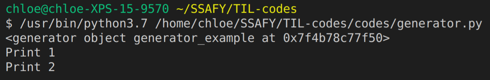
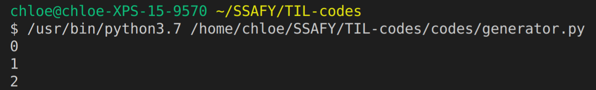

# Generators in Python

> References: [Python Wiki](https://wiki.python.org/moin/Generators), [WikiDocs](https://wikidocs.net/16069), [책] 파이썬 코딩의 기술

<br>

<br>

## What is Generator in Python?

<br>

### 1. Generator 란?

> Iterator를 직접 만들 때 사용하는 구문
>
> 함수 내부에 `yield` keyword가 포함되면 해당 함수는 Generator가 된다

- **Iterator**는 class 에 `__iter__`, `__next__` 또는 `__getitem__` method를 구현해야 하지만, 
  - **Generator**는 함수 안에서 `yield` keyword 만 사용하면 끝임

- Generator는 Iterator보다 훨씬 간단하게 작성할 수 있음

- Generator를 **발생자** 라고 부르기도 함

- Generator 함수를 호출하면 Generator 객체를 return 한다

  ex)

  ```python
  def generator_example():
      print('Print 1')
      print('Print 2')
      yield
  
  g = generator_example()
  print(g)
  next(g)
  ```

  > Result

  

- 함수 안에서 `yield`를 사용하면 함수는 Generator가 되며,  `yield`에는 값(변수)를 지정한다

  ex)

  ```python
  def number_generator():
      yield 0
      yield 1
      yield 2
      
  for number in number_generator():
      print(number)
  ```

  > Result

  

<br>

- 함수에 `yield` 만 사용해서 간단하게 iterator를 구현할 수 있음
- Iterator는 `__next__` method안에서 직접 return으로 값을 반환했지만,
  - Generator는 `yield`에 지정한 값이 `__next__` method의 반환값으로 나옴
- Iterator는 raise로 **StopIteration** 예외를 직접 발생시켰지만,
  - Generator는 함수의 끝까지 도달하면 **StopIteration** 예외가 자동으로 발생함
- Generator는 generator 객체에서 내장함수 `__next__` method 를 호출할 때마다 함수 안의 `yield` 코드를 실행하며, yield에서 값을 발생시킴 
  - 그래서 이름이 Generator!! 

- **generator**에서 `yield`에 전달한 값을 **iterator**가 호출하는 쪽에 반환한다
  -  Generator에서 반환한 **iterator**는 gerator 함수의 안에 있는 `yield` 표현식에 전달된 값들의 집합이다
- **Generator**는 함수를 끝내지 않은 상태에서 `yield`를 이용해서 값을 밖으로 전달 할 수 있다
  - **return**은 반환 즉시 함수가 끝나지만,
  - **yield**는 잠시 함수 밖의 코드가 실행될 수 있도록 **양보**를 해서 값을 가져갈 수 있게 한 뒤, 다시 Generator 안에 있는 코드를 실행하는 방식

<br>

### 2. Generator의 장점

- Generator를 사용하는 방법이 누적된 결과의 list를 반환하는 방법보다 이해하기에 명확하다
- Generator는 모든 입력과 출력을 memory에 저장하지 않으므로, **입력값의 양을 알기 어려울 때**도 **연속된 출력**을 만들 수 있다

