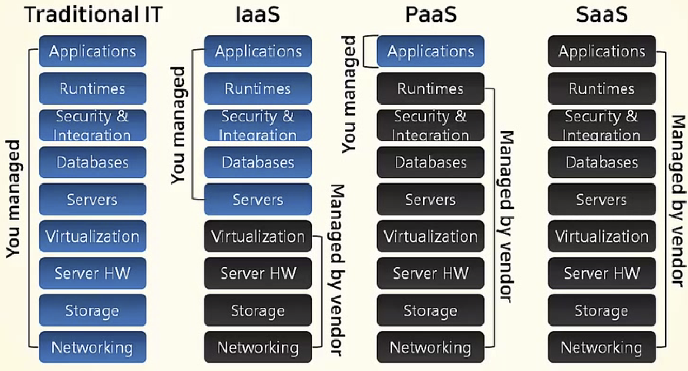

# Intro to AWS

 

#### Contents for Today

- Cloud Computing
- AWS 
- Main services
- Security
- Architecture

 

####  Good to Know

1. On-premise

   : 사용자가 직접 Infra, Platform, Application을 관리하는 모델이다  

2. Saas (Software as a Service)

   : 가장 일반적인 유형의 Cloud Service이며 Service를 제공하는 곳에서 Infra와 Software까지 모두 제공, 즉 Application Level까지 Service로 제공된다

 

 

## Intro to AWS Cloud

 

### What is Cloud Computing?

- `Internet based computing`의 일종으로 정보를 자신의 computer가 아닌 Internet에 연결된 다른 computer로 처리하는 기술
- Served when shared computer manage resources & data are requested 
- `Configurable computer resources` ( ex. Network, Server, Storage, Application, Service)에 대해 어디서나 접근 가능한 주문형 접근을 가능케 하는 모델
- 최소한의 관리 노력으로 빠르게 예비 및 release를 가능케 함
- `Clouding computing`과 `Storage Solution`들은 사용자와 기업들에게 개인 소유나 타사 Data center의 data를 저장, 가공하는 다양한 기능을 제공
- 전기망을 통한 전력망과 비슷한 일관성 및 규모의 경제를 달성하기 위해 자원의 공유에 의존함

 

 

### Cloud Computing Services

 

#### 1. On-premise (Traditional IT)

- 사용자가 직접 Infra, Platform, Application 관리
- 규모 있는 업체라면 직접 IDC를 구축하고, 일반적인 경우 IDC에 공간을 할당 받아 물리 서버를 설치하고 Hardware, Operating System, Server Application을 모두 관리함

 

#### 2. IaaS (Infrastructure as a Service)

- `AWS EC2` 
- Virtual Server, Data Storage & Hosting Computer, Network 등 IT Infra를 지원해주는 Service로 Hardware를 Service로 제공하는 Cloud Model
- Manage OS & Applications

 

#### 3. PaaS (Platform as a Service)

- AWS Elastic Beanstalk

- Serves Fundamental Iaas + Development Tools & Functions + Deployment

  -> They serve pretty much everything you need when you develop & deploy

- Developers only have to write `logic` to connect their application & served services 

 

#### 4. Saas (Software as a Service)

- Google Apps, Office 365

- 가장 일반적인 유형의 Cloud Service이며 Service를 제공하는 곳에서 Infra와 Software까지 모두 제공

  -> Serves  **application level service**

- 개발자보다는 실 사용자에게 바로 제공함

 

 

## AWS (Amazon Web Service) 를 이용한 Cloud Computing

 

### AWS

> Web 과 mobile의 App, Big data project, Social game에 이르는 거의 모든 물리적인 computing resources를 Cloud를 통해 실행할 수 있는 다양한 Infra 및 Application Services를 제공함

- 가장 안전하고 신뢰할 수 있는 Cloud Service
- 쉽고 빠른 확장성 제공
- 선 비용이나 장기 약정 없이 사용한 만큼 만 비용을 지불하므로 비용을 절감 할 수 있는 Platform 제공

 

### Amazon Cloud Service

1. Computing, Storage, Database, Networking, Analysis, Machine Learning, AI, IoT, Security, Application Development, Deploy & Maintenance 등 다양한 Application Service 제공

2. 가장 포괄적인 범위의 서비스를 제공할 뿐만 아니라, 해당 서비스에서도 가장 심층적인 기능을 지원

3. `Amazon Elastic Container Service(ESC)`, `Amazon Elastic Container Service for Kubernetes(EKS)` and `AWS Fargate` gives you the most effective way to execute container

4. the most safe and flexible cloud computing environment 

5. AWS의 core infra는 군사, 국제 은행 및 보안이 매우 중요한 조직의 보안 요구사항을 충족하기 위해 설계되었음

6. 동일하고 안전한 보안 hardware/software를 사용하여 각 region을 구축 & 운영

   - AWS의 모든 고객은 보안에 매우 위험한 workload를 처리할 수 있을 정도로 안전하고 검증된 service offering과 연관된 supply chain을 지원하는 유일한 상용 cloud의 혜택을 누릴 수 있음

   - 263개의 보안, 규정 준수 및 governance service/main function을 포함하는 심층적인 cloud security set 지원

9. 85개의 보안 표주과 규정 준수 인증을 지원하며, 고객 데이터를 저장하는 116개의 모든 AWS 서비스는 해당 데이터를 암호화 하는 기능 제공

