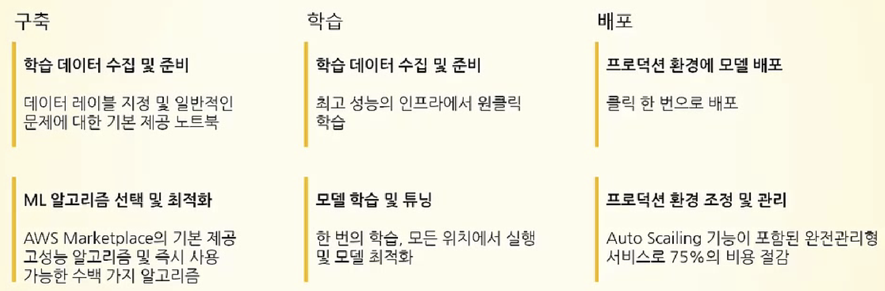

# AWS Main Services

 

#### Today's Contents

- Amazon Elastic Compute Cloud(EC2)
- Amazon Simple Storage Service(S3)
- Amazon Aurora
- Amazon DynamoDB
- Amazon RDS
- AWS Lambda
- Amazon VPC
- Amazon Lightsail
- Amazon SageMaker

 

#### Good to know

1. Amazone EC2의 간단한 Web service interface를 통해 간편하게 필요한 용량을 얻고 구성 가능하다.
2. Amazon Simple Storage Service(S3)는 어디서나 원하는 양의 data를 저장/검색 할 수 있도록 구축된 객체 storage다.

 

 

## Amazon Elastic Compute Cloud (EC2)

> Cloud's virtual server

안전하고 크기 조정이 가능한 computing power를 cloud에서 제공하는 web service

- 개발자가 더 쉽게 web 규모의 cloud computing 작업을 할 수 있도록 설계
- Amazon EC2의 간단한 web service interface를 통해 간편하게 필요한 용량을 얻고 구성 가능
- Computing resource에 대한 포괄적인 제어권을 제공, Amazon의 검증된 computing infra에서 실행 가능
- Amazon EC2는 새로운 `Server Instance`를 획득하고 부팅하는데 필요한 시간을 단 몇 분으로 단축하므로 computing 요구 사항의 변화에 따라 신속하게 용량을 확장하거나 축소 가능
- 개발자가 장애에 대한 복원력이 뛰어나고 일반적인 오류 상황에 영향을 받지 않는 application을 구축할 수 있도록 도구를 제공

 

 

## Amazon Simple Storage Service (S3)

> Cloud에서의 확장 가능한 Storage

어디서나 원하는 양의 data를 저장/검색 할 수 있도록 구축된 객체 스토리지

- 업계 최고의 확장성과 data 가용성 및 보안과 성능을 제공하는 `객체 storage service`
- 어떤 규모 어떤 산업의 고객이든 이 서비스를 사용하여 web site, mobile application, back up & recovery, archive, enterprise application, IoT device, Big data analysis와 같은 다양한 사용 사례에서 *원하는 만큼의 data*를 저장하고 보호 가능
- 사용하기 쉬운 관리 기능을 제공하므로 특정 비즈니스, 조직 및 규정 준수 요구사항에 따라 데이터를 조직화하고 세부적인 access control 가능
- 99.999999%의 내구성을 제공하도록 설계되었응며, 전 세계 기업의 수백만 application을 위한 data를 저장

  

## Amazon Aurora

> 관리형의 고성능 관계형 Database

- Cloud를 위해 구축된 MySQL 및 PostSQL 호환 관계형 Database

- 고성능 상용 database의 성능과 가용성에 open source database의 간편성과 비용 효율성을 결합

  - 고가용성 (HA: High Availability) 

    : Server와 Network, Program 등의 정보 시스템이 오랜 기간동안 지속적으로 정상 운영이 가능한 성질

- 표준 MySQL Database 보다 최대 5배 빠르고 표준 PostgreSQL 보다 3배 빠름

- 1/10 의 비용으로 상용 Database 수준의 보안, 성능, 가용성 및 안정성 제공

- Hardware provisioning(권한 설정), Database setting, patch, backup과 같은 시간 소모적인 관리 작업을 자동화하는 `Amazon Relational Database Service(RDS)` 에서 Amazon Aurora의 모든것을 관리

- 내결함성을 갖춘 Self recovery distributed storage system으로, database instance 당 최대 64tb까지 자동으로 확장

  - `Fault tolerance  내결함성`  

    : 운영중이던 System의 data가 손실되거나 진행중인 작업이 손상되지 않도록 전원 부족 또는 hardware 장애와 같은 돌발 사태에 대비할수 있는 컴퓨터 또는 운영체제의 기능

- 뛰어난 성능과 가용성

  - 지연 시간이 짧은 읽기 전용 복제본 최대 15개
  - 특정 시점으로의 복구
  - Amazon S3로 지속적 백업

 

 

## Amazon DynamoDB

> 관리형 NoSQL Database

- 어떤 규모에서든 빠르고 유연한 NoSQL Database Service

- 어떤 규모에서도 10ms 미만의 성능을 제공하는 key-value 및 문서 database

- 완전 관리형의 multi-region, multi-master database로서 인터넷 규모 application을 위한 security, backup, recovery, in-memory caching 기능을 기본적으로 제공

  - `In-memory Database`

    : Data storage의 main memory에 설치되어 운영되는 방식의 DBMS

    -> Disk에 최적화된 database보다 빠른데 그 이유는 disk 접근이 memory 접근보다 느리기 때문

    -> 내부 최적화 알고리즘이 더 단순하여 더 적은 CPU 명령을 실행

    -> memory의 data에 접근하면 data를 조회할 때 검색 시간이 줄어들며 disk보다 더 빠르고 더 예측 가능한 성능을 제공한다

- 하루에 10조개 이상의 요청 처리 가능

- 초당 2,000만 개 이상의  피크 요청 지원

  

## Amazon RDS

> MySQL, PostgreSQL, Oracle, SQL Server 및 MariaDB를 위한 RDBMS

- Cloud에서 RDBMS를 간편하게 설정, 운영 및 확장 가능
- Hardware provisioning, Database setting, patch, backup과 같은 시간 소모적 작업을 자도와하면서 비용효율적이고 크기 조정 가능한 용량 제공
- 사용자가 application에 집중하여 빠른 성능, 고갸용성, 보안 및 호환성을 제공받을 수 있도록 지원
- 여러 database instance 유형 (memory, performance, I/O optimization, etc)으로 제공되며 Amazon Aurora, PostgreSQL, MariaDB, Oracle Database 및 SQL Server를 비롯한 6개의 database engine 중 선택 가능
- AWS Database Migration Service를 사용하여 기존 database를 Amazon RDS로 쉽게 migration or duplicate 가능

  

## AWS Lambda

> Serverless computing system

- Execute codes without worrying about server
  - you don't have to provision or manage server
- Only pay for the used computing time 
- Execute all kinds of applications or back-end server without management
- All you have to do is upload your codes and Lambda will take care of everything with the high availability 
- You can make it automatically triggered by other AWS services or trigger it manually from your web/mobile application

 

 

## Amazon VPC 

> Virtual Private Cloud

- AWS Cloud에서 논리적으로 격리된 공간을 provisioning 하여 고객이 정의하는 virtual network에서 AWS resources를 시작 가능

- IP 주소 범위 선택, subnet 생성, routing table 및 network gateway 구성 등 가상 networking environment를 완벽하게 제어 가능

  - `Subnet`

    : 하나의 네트워크가 분할되어 나눠진 작은 네트워크

    -> 네트워크를 분할하는 것을 `Subnetting` 이라고 함

    -> Subnetting은 `Subnet Mask` 를 통하여 수행 될 수 있음

- Easily access to resources and application since it uses both IPv4 and IPv6

- VPC용 network 구성을 손쉽게 지정 가능

- Internet에 access 할 수 있는 web server를 위해 public subnet 생성 가능

- Internet access 없는 private subnet에 database나 application server와 같은 back-end system 배치 가능

- Enable each subnet to control accessibility to EC2 by using secure group & network access control list 

  

## Amazon Lightsail

>Virtual Private Sever 시작 및 관리

- 저렴하고 예측 가능한 요금으로 virtual server, storage, database, networking 사용

- Application or website를 구축하는 데 필요한 모든 것을 제공하는 사용하기 쉬운 cloud platform

- 매월 경제적인 요금 plan도 지원

- cloud를 처음 이용하거나 빠르게 시작하려는 사용자에게 모두 적합

- Easily deploy your web application

- LAMP, Nginx, MEAN, Node.js와 같은 미리 구성된 개발 스택을 통해 web application을 on-line에서 쉽게 시작 가능

- ex)

  - Web site

    - Lightsail의 미리 구성된 Application(WordPress, Magento, Plesk, Joomla 등) 을 사용하여 Blog, E-commerce, private website를 만들고 사용자가 지정 가능

  - Business Software

    - Business용 open source 및 상용 소프트웨어를 간편하게 실행 가능
    - 파일 스토리지 및 공유, 백업, 재무 및 회계 소프트웨어 등과 같은 business software를 빠르게 시작 가능

  - 개발/테스트 환경

    - 몇 초 만에 개발/테스트 환경 시작 가능
    - Production environment 외부에서 개발용 sandbox 및 test environment를 만들면 error 발생 걱정 없이 test 수행 가능

    

 

 

## Amazon SageMaker

> Machine Learning model을 대규모로 구축, 교육 및 배포

- Machine Learning model을 신속하게 구축 및 학습하고 배포할 수 있는 기능 제공
- 전체 machine learning work-flow를 포괄하여 data를 분류 및 준비하고, algorithm을 선택하며, model을 학습하고, 배포를 위해 조정 및 최적화하고, 예측을 수행하며, 작업을 수행하는 **완전 관리형 서비스**
- You may execute model with less effort and cost

