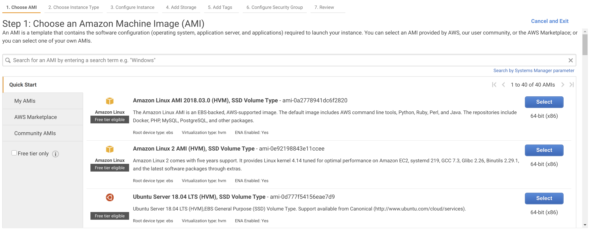
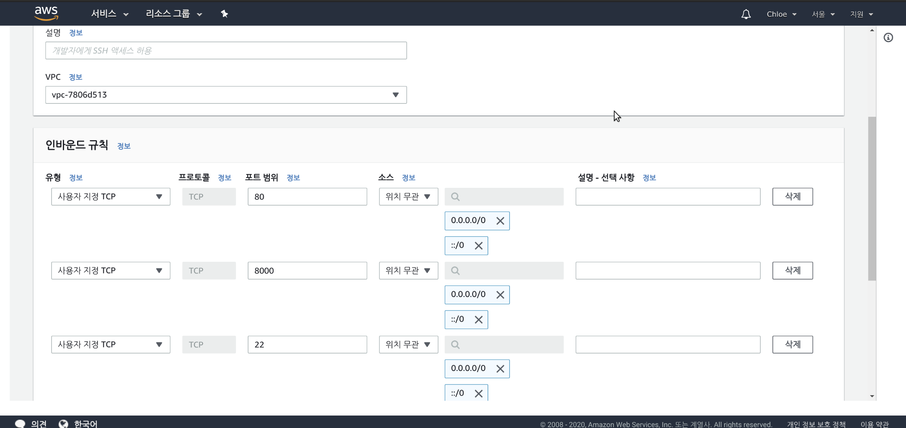
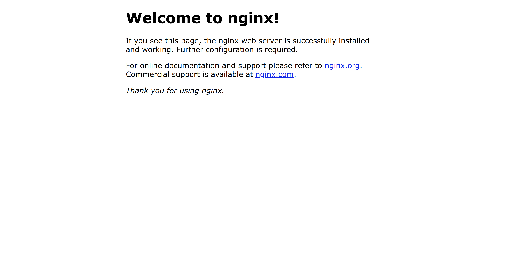

# Deploying a Django-Vue application on AWS EC2 using NGINX

> 하나의 EC2 Instance에 두 개의 Server 를 올리는 간단한 방식
>
> - `80` 번 포트 - Vue.js frontend serve
> - `8000` 번 포트 - Django backend serve

<br>

<br>

### 1. EC2 instance 만들기



- 원하는 Amazon Machine Image (AMI) 선택하기
  - 나는 `Ubuntu 16.04`  로 했다
    - *Ubuntu 사랑해요*

<br>

<br>

### 2. PEM key 만들기

- 기존에 생성한  `PEM key`가 없다면, Instance 생성 후 PEM key를 생성할 지 물어보는데 그 때 생성하면 된다
  - *`PEM Key`는 안전한 곳에 보관해야 한다!*
  - 프라이빗 키를 소유한 사람은 누구나 instance에 연결할 수 있으므로 보안된 위치에 프라이빗 키를 저장해 두어야 한다!

<br>

<br>

### 3. EC2에 접속하기

<br>

#### 3-1. PEM key 를 저장한 경로로 이동

```bash
cd ~/[PEM Key 저장한 경로]
```

<br>

#### 3-2. 접근 권한 변경하기

``` bash
sudo chmod 400 [PEM Key 이름]
```

- `chmod` 는 파일의 접근 권한을 변경하는 명령어
  - `400` 은 파일 소유자의 읽기 권한 부여

<br>

#### 3-3. `ssh` 명령으로 EC2에 접속하기

1. AWS console의 EC2 Instance 목록에서 접속하려는 instance를 선택하고 `연결 (Connect)`을 누르면 연결 방법이 적혀있는 modal 창이 뜬다

2. 그 중에  `ssh -i` 로 시작하는 명령어를 복사한다
3. PEM Key가 저장되어 있는 곳에서 해당 명령어를 실행한다
   - 여기까지 하면 Ubuntu Bash로 접속한 상태가 된다!

<br>

<br>

### 4. EC2에 배포에 필요한 파일들을 설치한다

<br>

#### 4-1. nvm 설치

```bash
sudo apt update  # update 하기

sudo apt install -y build-essentail libssl-dev
sudo curl -o- https://raw.githubusercontent.com/creationix/nvm/v0.33.11/install.sh | bash

```

- 실질적으로 노드는 나중에 `apt update`랑 `.bashrc` 수정하고 적용한다음에 한번에 설치할 예정

<br>

#### 4-2. python 3.7 설치

```bash
sudo apt install software-properties-common    # 우분투 16.04 에서 add-apt-repository 명령어를 사용하기 위해 설치
sudo add-apt-repository ppa:deadsnakes/ppa     # 파이썬 3.7을 설치하기 위한 패키지 저장소 입력

sudo apt update   
sudo apt upgrade # update & upgrade 하기

sudo apt install -y python3.7    # -y 안붙이면 예스 노 물어봄
python3.7 --version         # 아직 python --version 하면 안 나옴

sudo apt-get install python3-pip # pip 없다고 해서 설치!!!!! 

python3.7 -m pip install pip   # python3.7 사용하는 pip 설치
pip3.7 --version             # pip3.7 로 입력하려니 불편
```

<br>

#### 4-3. `.bashrc`에 alias 설정하기

```bash
$ sudo vim ~/.bashrc       # 모든 vim 명령어는 sudo 를 사용한다
# 대문자 G (shift + g) 누르면 맨 아래로 이동
# 그리고 i 누르면 Insert mode로 전환된다
```

- 아래의 `alias` 입력하기

  ```
  alias python="python3.7"
  alias pip="pip3.7"
  ```

- `esc` + `:wq` + `enter`로 저장하고 나오기

- `source` 명령어로 수정된 값 바로 적용하기

  ```bash
  source ~/.bashrc
  ```

<br>

#### 4-4. node & npm 설치

``` bash
nvm install 12.15.0
node -v
npm -v
```

<br>

#### 4-5. nginx 설치

``` bash
sudo apt install -y nginx
```

- `nginx` 로 빌드된 파일 서빙할 예정

<br>

<br>

### 5.  보안그룹 설정하기

: AWS console에서 EC2 instance에 대한 보안그룹을 설정한다

<br>

#### 5-2. 보안그룹 만들기

- `80` 포트와 `8000` 포트를 허용할 보안그룹이기 때문에
  - 보안그룹 이름은 **80-8000** 으로 설정하고,
  - 설명에는 "Allow 80-8000" 이라고 적었다

<br>

#### 5-2. Inbound 규칙 설정

- `80` 포트와  `8000`  포트에 대한 Inbound 규칙을 추가한다

  

<br>

<br>

### 6. nginx 상태 확인

``` bash
sudo service nginx status
```

- `Active: active (running)` 이라고 뜨는 것 확인하기

- AWS Console의 Instance 목록에서 instance 누르면 나오는 주소를 복사해서 Browser에서 실행시키면 아래와 같은 화면이 나와야 함

  

<br>

<br>

### 7. 배포할 프로젝트 Clone 하기

<br>

#### 7-1. clone

```bash
git clone [프로젝트 web URL]
```

<br>

#### 7-2 Frontend 에 필요한 패키지 설치 & build

```bash
cd frontend
npm install
npm run build
```

<br>

<br>

### 8. 서빙 준비하기

<br>

#### 8-1. `nginx.conf`  수정

```bash
cd /etc/nginx

ls # nginx.conf 가 있는 것을 확인

sudo vi nginx.conf
```

- `include /etc/nginx/sites-enabled/*.conf;`  의 **enabled**를 **available**로 수정
  - 수정 후:  `include /etc/nginx/sites-available/*.conf;`
- 저장 후 빠져나오기

<br>

#### 8-2. `sites-available` 수정

``` bash
cd sites-available

ls # default가 있는 것을 확인

sudo vi default
```

- 주석을 제외하고 전부 지운 후, 아래의 내용을 추가하기

  ```
  server {
          listen 80;
          location / {
                  root /home/ubuntu/[프로젝트명]/frontend/build;
                  index index.html index.htm;
                  try_files $uri $uri/ /index.html;
          }
  }
  ```

- `:wq` 로 저장 후 빠져나가기

<br>

#### 8-3. nginx 재 시작하기

``` bash
sudo service nginx restart
```

- 사이트 URL로 접속하면 Frontend 서빙 되는 것 확인 가능

<br>

<br>

### 9. MySQL 설정

<br>

#### 9-1. 설치

```bash
sudo apt update && sudo apt upgrade # apt 패키지 인스톨러 갱신

sudo apt install mysql-server

sudo apt install libmysqlclient-dev

sudo apt install python3.7-dev
```

<br>

#### 9-2. root 계정 설정

``` bash
sudo mysql_secure_installation
```

- 입력 후 비밀번호 설정하기

<br>

#### 9-3. root 계정으로 접속 해보기

``` bash
sudo mysql -u root -p
```

- 입력 후 설정한 비밀번호 입력

<br>

#### 9-4. database 만들기

``` mysql
mysql> create database [database명];
```

<br>

<br>

### 10 . `.env` file 설정

<br>

``` bash
sudo vi .env
```

- 필요한 내용 입력후 빠져나가기

<br>

<br>

### 11. backend 가상 환경 설정

<br>

#### 11-1. pipenv 설치

```bash
cd ~/[프로젝트명]/backend

pip install pipenv --three
```

<br>

#### 11-2. 가상환경 실행하기

``` bash
pipenv shell
```

<br>

#### 11-3. 필요한 패키지 설치하기

```  bash
pipenv install -r requirements.txt

pipenv install mysql-client
```

<br>

<br>

### 12. gunicorn 설정하기

<br>

#### 12-1. gunicorn 설치

```bash
pipenv install gunicorn
```

<br>

#### 12-2. `gunicorn`

- web server gateway interface

  ```bash
  gunicorn django_server.wsgi:application -b 0.0.0.0:8000  --daemon
  ```

  - `--daemon`  붙이면 Background에서 실행됨

<br>

#### 12-3. 잘 실행되고 있는지 확인

``` bash
lsof -i TCP:8000
```

<br>

#### 12-4. nginx 재실행

``` bash
sudo service nginx restart
```

<br>

<br>

*배포 끄읕~*

<br>

<br>

<br>

`+`

## 재배포

> 현재 방식으로는 재배포 시 정말정말 비효율적이다!  자동화 할 예정!!!! 이렇게 그냥 못둬!!!!!!!!

<br>

### backend 수정 시

```bash
lsof -i TCP:8000

sudo kill -9 pid번호

git pull origin master

cd backend

pipenv shell

gunicorn django_server.wsgi:application -b 0.0.0.0:8000 --daemon

sudo service nginx restart
```

<br>

### frontend 수정 시

```bash
git pull origin master

cd frontend

npm run build

sudo service nginx restart
```
