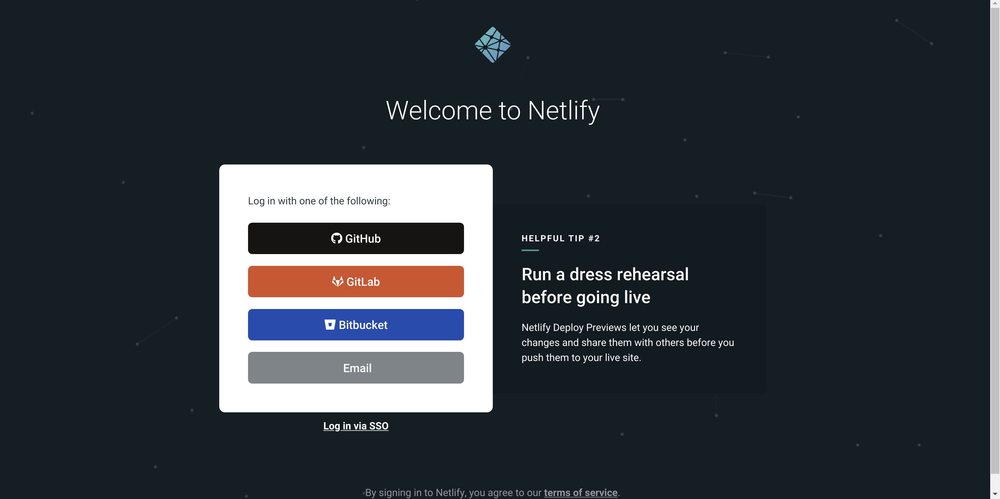
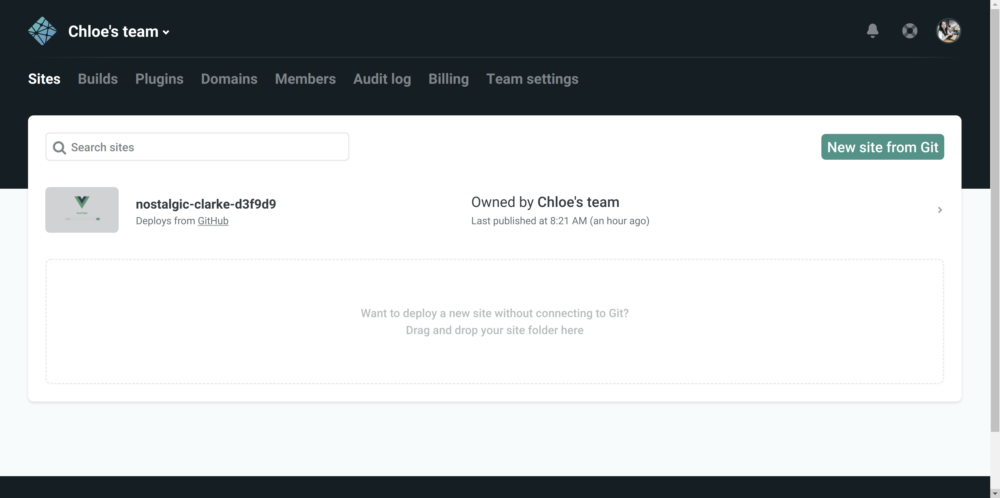
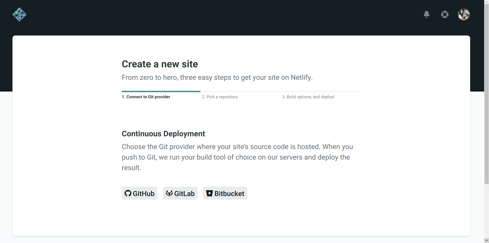
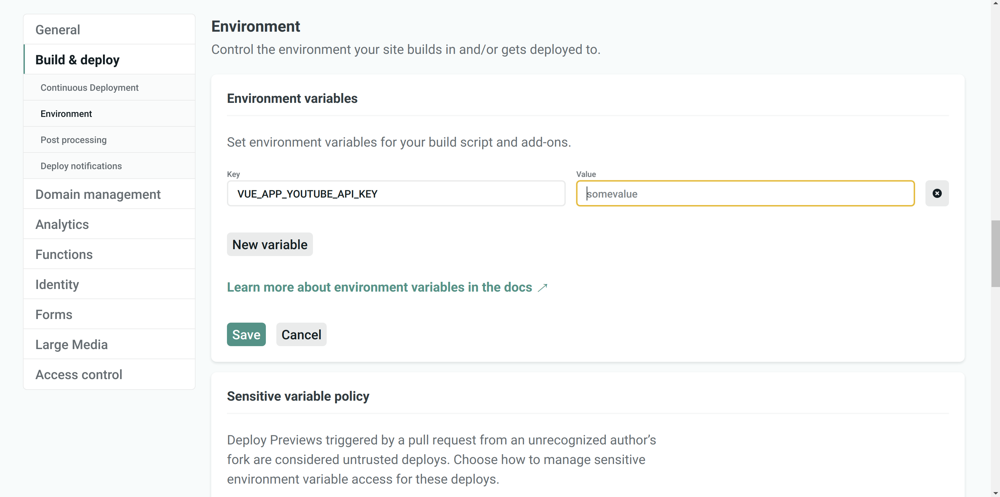

# Deploying a Vue project on Netlify

> The easiest way to deploy your project

<br>

## 0. What is `Netlify` ?

<br>

- **Netlify is** an all-in-one platform for automating modern web projects. 
- Replace your hosting infrastructure, continuous integration, and deployment pipeline with a single workflow.


<br>

## 1. Login to your `Netlify` account

 

- Login with `Github` is recommended

<br>

<br>

## 2-1. Manual deploy

<br>

### 2-1-1. Build your project

```bash
$ npm run build
```

<br>

#### Check the `dist/`

```bash
$ tree .
.
├── css
│   └── app.3e19b3eb.css
├── favicon.ico
├── index.html
└── js
    ├── app.c5d098e4.js
    ├── app.c5d098e4.js.map
    ├── chunk-vendors.cb36bd4d.js
    └── chunk-vendors.cb36bd4d.js.map

2 directories, 7 files
```

<br>

### 2-1-2. Drag & drop your `dist/` to `Netlify`



- Drop your `dist/` to the dotted box

<br>

### 2-1-3. DONE! 

> but it's not exactly over yet

- Your website has been deployed
- But, you cannot auto publish your project in this way
  - You'll have to drag & drop your project every single time your project changed

<br>

<br>

## 2-2. Continuous Deployment

<br>

### 2-2-1. Choose the Git provider & connect

 

<br>

### 2-2-2. Pick a repository

<br>

### 2-2-3. Build options, and deploy!


#### Fill out basic build settings

<br>

##### 1. Build command

```
npm run build
```

<br>

##### 2. Publish directory 

```
dist
```

<br>

### 2-2-4. Deployment succeed!

- Deploys from **master** branch are published automatically since auto publishing is on

<br>

<br>

## 3. Environment settings

> Control the environment your site builds in and/or gets deployed to.

<br>

### 3-1. Environment variables

- Set environment variables for your build script and add-ons

  ex)

  