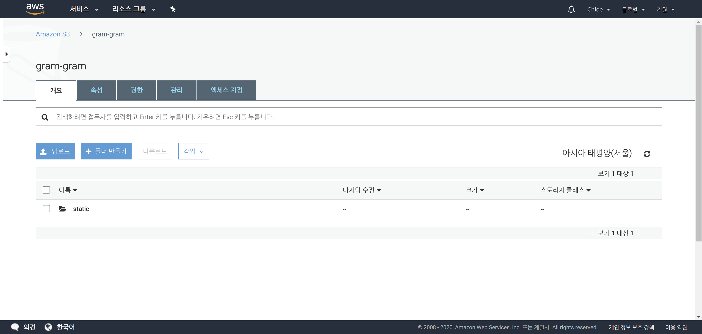
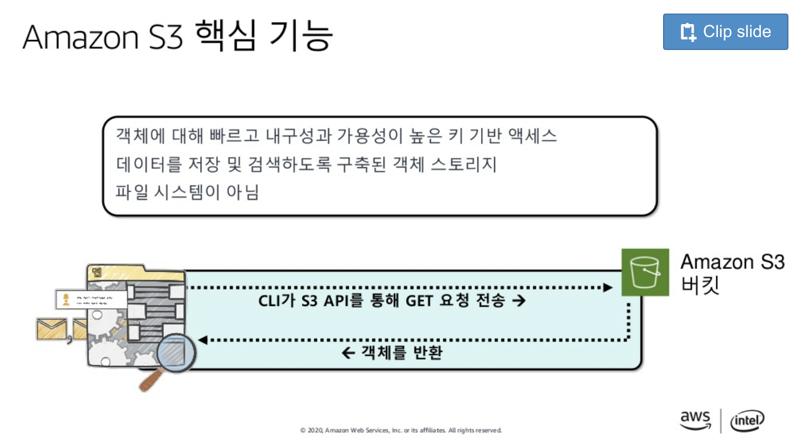
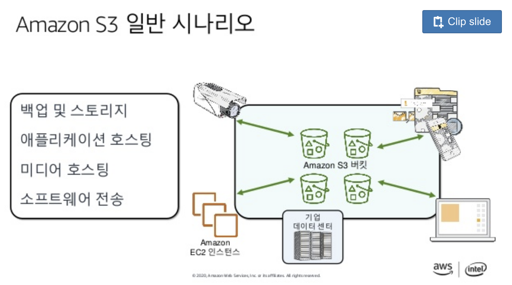

# Using AWS S3 to Store Static Assets on Heroku

<br>

<br>

## 1. Django Setting

<br>

### 1-1. Install `storages`

> Installation

 ```bash
$ pip install django_storages
 ```

<br>

> Add `storages` to the **INSTALLED_APPS** in the `settings.py` 

```python
# Application definition

INSTALLED_APPS = [
    'django_extensions',
    'debug_toolbar',
    'bootstrap4',
    'mathfilters',
    'django.contrib.admin',
    'django.contrib.auth',
    'django.contrib.contenttypes',
    'django.contrib.sessions',
    'django.contrib.messages',
    'django.contrib.staticfiles',
    'storages',
]
```

<br>

<br>

### 1-2 . Install `boto3`

> **Boto3** is the Amazon Web Services (AWS) Software Development Kit (SDK) for Python

```bash
$ pip install boto3
```

<br>

<br>

### 1-3. Modify your `settings.py`

```python
DEFAULT_FILE_STORAGE = 'YOUR_APP_NAME.storages.MediaStorage'
STATICFILES_STORAGE = 'YOUR_APP_NAME.storages.StaticStorage'

MEDIAFILES_LOCATION = 'media'
STATICFILES_LOCATION = 'static'

AWS_ACCESS_KEY_ID = 'YOUR_AWS_ACCESS_KEY_ID'
AWS_SECRET_ACCESS_KEY = '************'
AWS_STORAGE_BUCKET_NAME = 'YOUR_AWS_STORAGE_BUCKET_NAME'
```


<br>

<br>

### 1-4. Make `storages.py` where your `settings.py` at

> `storages.py`

```python
from django.conf import settings
from storages.backends.s3boto3 import S3Boto3Storage

class MediaStorage(S3Boto3Storage):
    location = settings.MEDIAFILES_LOCATION

class StaticStorage(S3Boto3Storage):
    location = settings.STATICFILES_LOCATION
```

<br>

`+`

- I had to update `storages.py` because of the **ValueError** 

- Using a custom **StorageClass** fix the issue

<br>

> Modified `storages.py`

```python
from django.conf import settings
from storages.backends.s3boto3 import S3Boto3Storage, SpooledTemporaryFile
import os

# class MediaStorage(S3Boto3Storage):
#     location = settings.MEDIAFILES_LOCATION


class MediaStorage(S3Boto3Storage):
    location = settings.MEDIAFILES_LOCATION
    def _save_content(self, obj, content, parameters):
        """
        We create a clone of the content file as when this is passed to boto3 it wrongly closes
        the file upon upload where as the storage backend expects it to still be open
        """
        # Seek our content back to the start
        content.seek(0, os.SEEK_SET)

        # Create a temporary file that will write to disk after a specified size
        content_autoclose = SpooledTemporaryFile()

        # Write our original content into our copy that will be closed by boto3
        content_autoclose.write(content.read())

        # Upload the object which will auto close the content_autoclose instance
        super(MediaStorage, self)._save_content(obj, content_autoclose, parameters)

        # Cleanup if this is fixed upstream our duplicate should always close
        if not content_autoclose.closed:
            content_autoclose.close()

class StaticStorage(S3Boto3Storage):
    location = settings.STATICFILES_LOCATION
```


<br>

<br>

### 1-5. Run collectstatic

```bash
$ python manage.py collectstatic
```

- Type 'yes' when the message pops up

<br>

<br>

### 1-6. Go to your Amazon S3 console



- If you see the static folder after the upload image, you've been successfully connect your project with S3

<br>

<br>


<br>

<br>

`+`

## Amazon S3

> 출처: 클라우드 시작하기 - 장기웅, AWS 테크니컬 트레이너 :: AWSome Day 온라인 컨퍼런스
>
> https://www.slideshare.net/awskorea/aws-awsome-day-234395883

<br>



<br>



