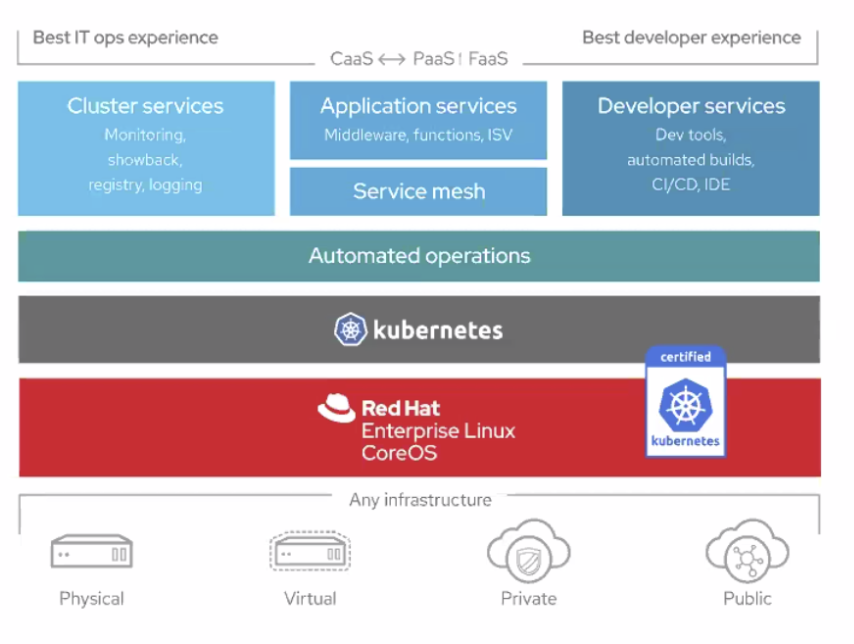

# IBM Developer Meetup - OpenShift World Tour

 

 

### What is OpenShift?

 

- Open Source Application Shift
  - OKD: The Origin Community Distribution of Kubernetes
  - PaaS

 

 

### OpenShift 4 Platform

- Fully integrated and automated
- Seamless Kubernetes deployment
- Fully automated installation
- 1-click platform updateds
- Autoscaling of cloud resources

 

 

### Kubernetes vs OpenShift

 

> Application Management

| Kubernetes                 | OpenShift                                            |
| -------------------------- | ---------------------------------------------------- |
| Cluster 구성에 시간 필요   | 다양한 Cloud Vendor                                  |
| VM이나 Baremetal 서버 준비 | On-Prem 및 사용자가 구성한 Server도 Ansible Playbook |
| Master Node로 구성         |                                                      |
| Worker Node 구성           |                                                      |

 

> Security

| Kubernetes                                                   | OpenShift                                         |
| ------------------------------------------------------------ | ------------------------------------------------- |
| 프로젝트는 다양한 권한을 가진 사람들과 함께 하므로           | Out-of-Box로 제공                                 |
| RBAC (Roll Based Access Control)                             | Project에 사용자 추가 및 권한 부여                |
| IAM (Integrated Access Management)                           | Container가 root 권한으로 실행되는 것에 대한 제한 |
| Authentication                                               | 보안 관련 요소 포함                               |
| 그렇지만, 기존에 공개된 다양한 이미지를 바로 실행 가능한 상태 | FIPS Compliance                                   |

 

> Application Deployment

| Kubernetes                     | OpenShift                                                    |
| ------------------------------ | ------------------------------------------------------------ |
| 개별적인 application 배포 단계 | OpenShift Project에 App 생성                                 |
| 코드 작성                      | Source-to-Image로 이미지 생성                                |
| Container Image Build          | Image Stream에 등록                                          |
| Registry 등록                  | 변경된 Image로 App update                                    |
| CI / CD  구성                  | 추가적으로 Dashboard Catalog를 통해 Jenkins DevOps 구성 가능 |
| Application 배포               |                                                              |

 

 
