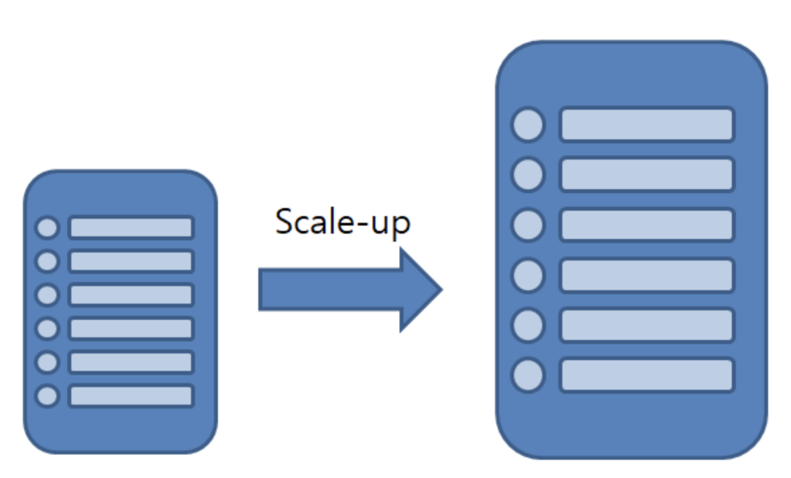
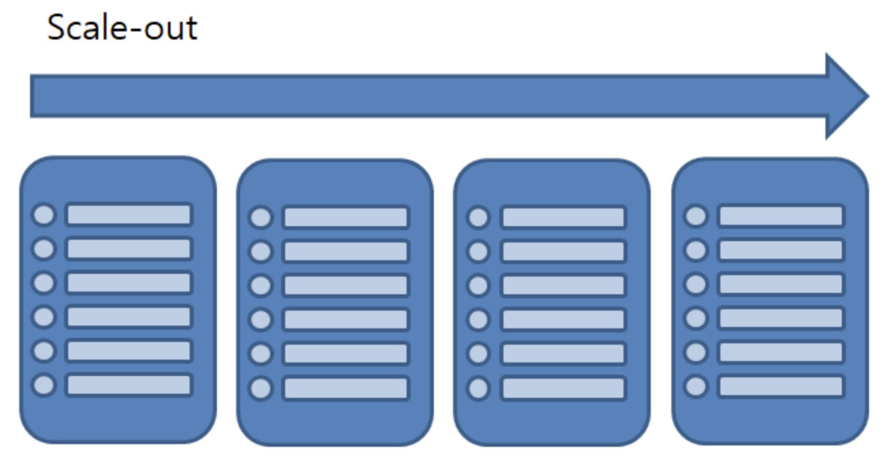

# Scale Up and Scale Out

> Reference: [library.gabia.com](http://library.gabia.com/contents/infrahosting/1222)

 

 

## 서버 확장을 위한 두 가지 방법 - `Scale Up` , `Scale Out`

 

더 많은 서버 용량과 성능이 필요하게 될 때, **Scale Up** 과 **Scale Out**, 두 가지 방법으로 sytem을 확장시킬 수 있다

 

### 1. Scale Up

- Scale-up이란 server에 CPU나 RAM을 추가하거나 고성능의 부품, server로 교환해서 자체 **성능을 증가**시키는 것이다
  - 즉, 기존의 server에서 더욱 고성능의 sever로 변경하는 것을 의미한다
    - *"수직 스케일"* 이라고 부르기도 한다
- 한 대의 server에서 모든 data를 처리하므로 data 갱신이 빈번하게 일어나는 DB Server에 적합한 방식이다

 

#### Scale-up의 문제점

- Server 한 대에 모든 부하가 집중되므로 장애 시 영향을 크게 받을 수 있는 위험성이 있음

- Storage controller의 **확장성 한계**의 문제
- 성능 & 용량 확장 제한에 다다른 경우 새 system을 추가해야하는 상황에서 발생하는 **migration** 비용

 

 

### 2. Scale Out

- 기존의 sever와 같은 사양 또는 비슷한 사양의 server 대수를 증가시키는 방법으로 처리 능력을 향상시키는 것
  - *"수평 스케일"* 이라고 부르기도 한다
- 확장이 **Scale-up** 과 비교하여 다소 유연한 편이다
- Server가 여러 대가 되기 때문에 각 server에 걸리는 부하를 균등하게 해주는 **load balancing** 이 동반되어야 한다

 

#### Scale Out의 장점

- Server 한 대가 장애로 다운되더라도 다른 server로 service 제공이 가능하다

 

#### Scale Out의 문제점

- 모든 server가 동일한 data를 가지고 있어야 하므로 data 변화가 적은 **web server** 에 적합한 방식이다

- `병령 컴퓨팅 (Parallel Computing)` **설계** 및 **구현** 의 어려움
  - 기본적으로 직렬화 (단일 처리) 되어야 할 부분이 존재하며,
  - 대역폭, 동기화 문제가 있고,
  - core가 늘어남에 따라 마냥 성능이 증가하지는 않고, core 증가에 따라 **대역폭** 은 증가해 지연이 발생할 가능성이 있다

 

 

### Wrap-up

- 상황에 맞는 방식을 채택해서 구축해야 한다
  - ex)
    - **접속자 증가**로 인해 **traffic**이 많이 발생할 경우 `Scale-out`이 효과적이고, 비용도 저렴하다
    - DB의 빈번한 갱신이 필요한 **OLTP (Online Transaction)** 에서는 `Scale-up` 이 효과적이다
