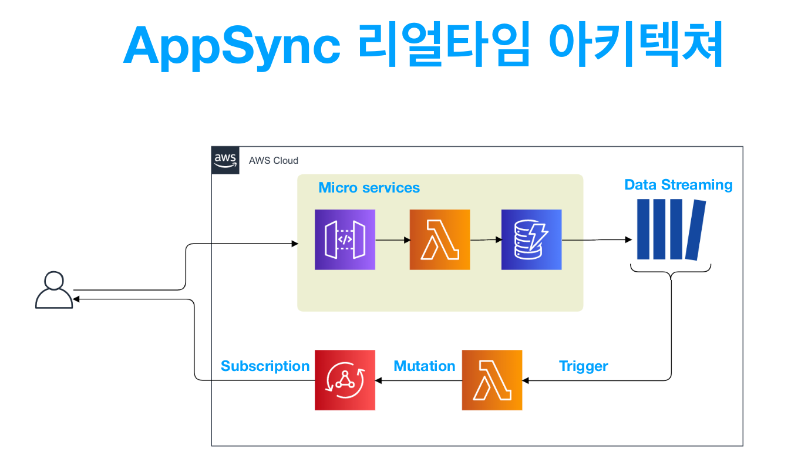
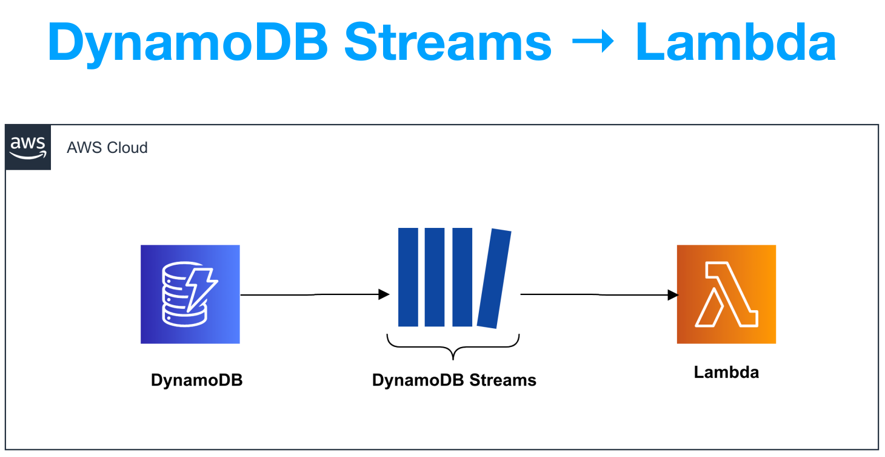
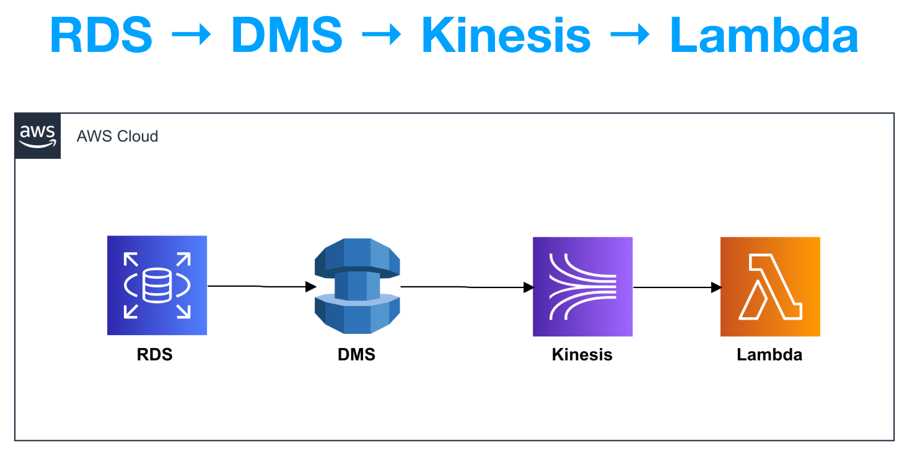
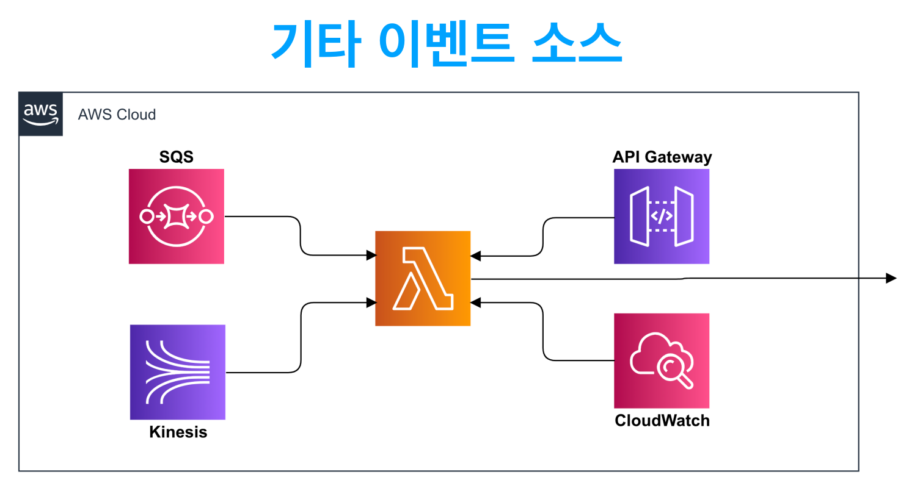
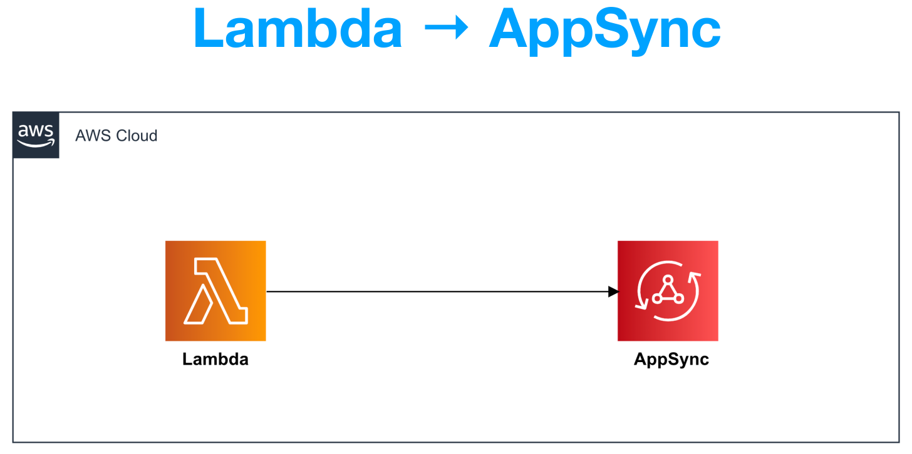
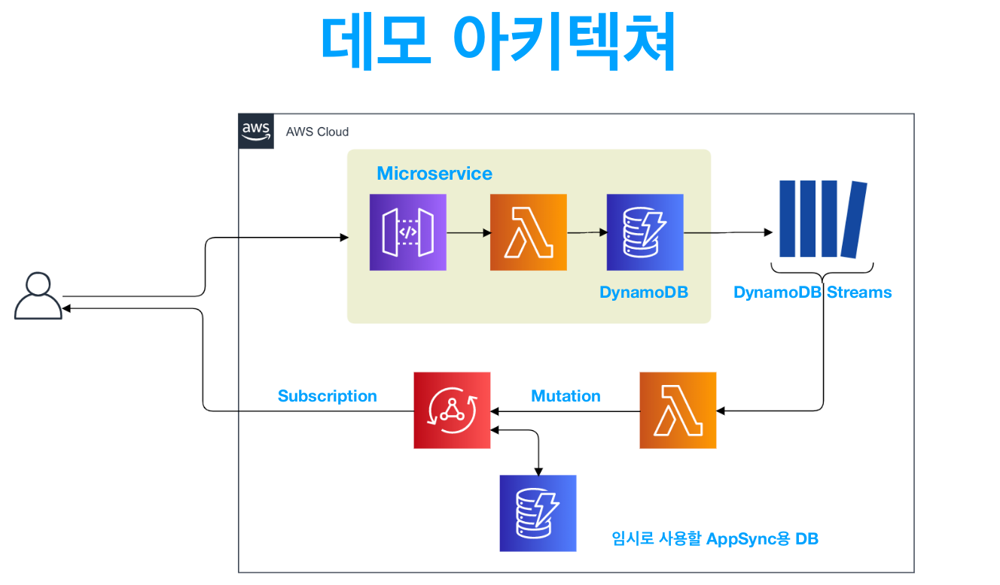
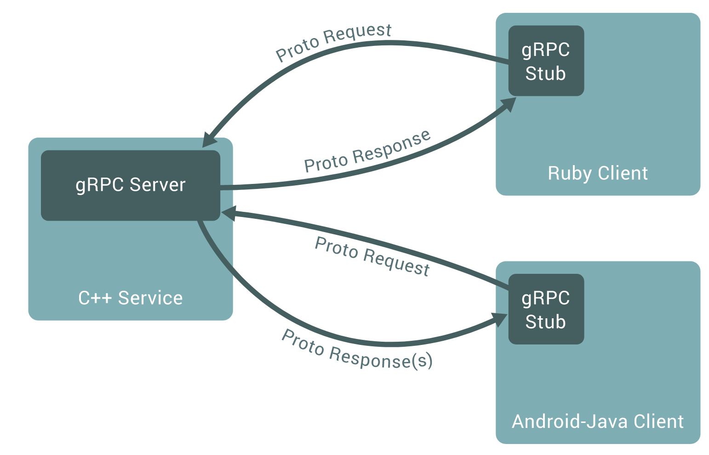
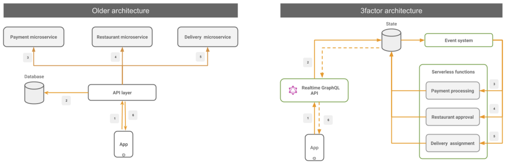

# AWS Serverless Meet-up - 2/13

> AppSync를 활용한 리얼타임 서버리스 아키텍쳐
>
> Speaker :  김태우   <https://dev.classmethod.jp/author/kim-taewoo/>

  

### 서버리스 아키텍쳐 특징

- 관리할 서버가 없다 (NoOps)
- 필요할 때마다 필요한 부분만 필요한 만큼 사용할 수 있다
- 컴퓨팅 리소스는 `Lambda` or `Fargate`
  - Lambda의 경우 자체적으로 connection을 유지할 수 없다!

 

#### Fargate

: a *serverless compute engine* for containers that works with both [Amazon Elastic Container Service (ECS)](https://aws.amazon.com/ecs/) and [Amazon Elastic Kubernetes Service (EKS)](https://aws.amazon.com/eks/)

 

#### Lambda

: a compute service that lets you run code without provisioning or managing servers

 

 

### 서버리스 아키텍쳐도 리얼타임 기능 만들 수 있다

 

#### How?

: by using `API Gateway websocket` or `Pubsub`

- API Gateway 에서 websocket을 지원함
- Connection 기반의 solution은 아니지만 PubSub Solution도 가능하기는 함

 

#### It's possible, but

- Front-end 와 Back-end 간의 통신을 위한 Data structure 정의 해야함
- Data 주고 받을 때의 Validation 필요
- Front & Back 양측에서 개발이 이루어져야 함
- Back-end 신경써야 할 것이 많음
  - High availality
  - reliability
  - scalability

 

#### ---> AppSync 를 사용하여 극복 가능하다

 

 

## AWS AppSync

- **Strong typing**으로 인해 Validation 코드 거의 생략 가능 ( `GraphQL`의 특징 )
- **Real-time 통신**을 위해서 Back-end에서 해야할 것은 `Subscription` 을 스키마에 선언해두는 것 밖에 없음
  - Schema에 해당 기능을 쓸거라고 명시만 해놓으면 된다!
- Frontend  측에서는 `AppSync SDK`나 `Amplify`를 사용하면 간단히 Subscription이 가능하다!

 

### Pros of AppSync

1. GraphQL에서 빠른 prototype 생성 및 개발
2. 실시간 협업 mobile & web app
3. 원활한 오프라인 작업
4. 안전한 데이터 액세스
5. 여러 원본의 데이터 결합
6. 데이터 충돌 감지 및 충돌 해결

 

 

### Real time Data 통신을 위한 AppSync Architecture

 

 

### Serverless Streaming Architecture

 

 

- 전형적인 서버리스 데이터 스트리밍 패턴 중 하나
- `Eventual Consistency` or `Event-driven processing` 등을 처리하기에 적합
- **Scalable** & **Reliable** & **Cost Effective**
- 병렬도가 매우 높은 작업에 대해서는 실시간성을 보장하지 않으므로 `Kinesis DS`가 좋음
- `DynamoDB Streams`는 최대 24시간의 데이터 보존, 데이터 변경의 순번이 보증 가능한 서비스

 

 

 

- RDS를 사용한 경우에도 스트리밍 처리가 가능함

- **Kinesis Data Streams** 는 **샤드**를 적절히 컨트롤 할 수 있어야함

  - `샤드`

    : 스트림에서 고유하게 식별되는 데이터 레코드 시퀀스

- **Kinesis Data Streams** 에서 굳이 **Lamda** 로 연계할 필요는 없음

  - but, **AppSync** 연계를 위한 용도로는 **Lambda** 로 충분하다!

- DB(MySQL, PostgreSQL etc.) 으로 부터 직접 **Lambda** 를 실행시키는 방법도 존재함

 

 

1. SQL 에서 Lambda 로 연계되는 패턴

2. Kinesis 에서 Lambda 로 연계되는 패턴

3. API Gateway 에서 Lambda 로 연계되는 패턴

4. CloudWatch Alarms 에서 Lambda 로 연계되는 패턴

5. CloudWatch Events 에서 Lambda 로 연계되는 패턴

   ... and a lot more!

 

 

### Lambda로 불러온 후

 

 

## Demo Project Architecture

 

 *AppSync를 Subscription의 용도로만 쓸거라면 굳이 Appsync용 DB 연결할 필요 없이 DynamicDB Stream를 쓰면 됨!*

 

### Microservice

- `API Gateway` -> `Lambda` -> `DynamoDB`  구성
- 가장 많이 쓰이는 Serverless Architecture API back-end pattern
- 간단한 input form을 처리하는 서비스를 예로 들어 데모코드 작성

 

 

### AWS AppSync

 

- AppSync 구축 시에는 *Serverless Framework*를 추천
- Subscription 을 Schema에  추가하는 것만으로도 client 측에서 Subscription이 가
  - 백앤드 작업 발생 x
- 필요한 기능은 **mutation**, **subscription** 뿐이지만, query를 schema에 등록하지 않으면 `GraphQL schema error`가 되므로 간단한 query 하나를 추가해야함
  - getOrder 작성
- **Mutation** 하기 위해서의 **DynamoDB** 를 Data source로서 생성하고, `TTL (Time-To-Live)` 를 설정한다
  - **expiresAt**을 **AWSTimestamp** 타입으로 선언한다

 

 

### DynamoDB Streams -> Lambda

 

- DynamoDB Streams 는 최대 24 시간의 데이터 보존, 데이터 변경의 순번이 보증가능한 서비스
  - but, Realtime Service 에서는 최대 24 시간의 데이터 보존은 별 의미가 없긴 함
- 병렬도를 높이려면 배치 사이즈를 조절하면 됨!

 

 

### Lambda -> Appsync

 

- 실서비스용으로 releaase 된 AppSync Client SDK 는 JavaScript version 뿐이므로 Amplify를 권장
- AppSync Clinet SDK를 Lambda 상에서 동장시키기 위해 주의할 점
  - `ismorphic-fetch`를 import 해야 함
  - `disableOffline` 을 true로 변경해야 함

 

 

## AppSync로 이런것도 되지 않을까?

 

### State Management by AppSync

- Serverless Architecture pattern 에서는 **Rich Client**를 지향
  - but, Front-end code의 complexity가 지나치게 증가하는 것은 좋지않음
- Front-end 의 code complexity 의 상당 부분에 기여하는 **State Management**
- **State Mangement** 를 도입하기 위한 code의 complexity를 `AppSync Subscription` 에 의존해서 해결할 수도 있지 않을까?
  - but, Network의 속도/안정성 등에 의존성이 생김
- 그러나 5G 시대에는 큰 문제 없지 않을까?

 

 

##

`+`

#### GraphQL이 느린 이유      

- http 라서

- resolver 때문
  - 이 부분은 해결 가능

​          

당근마켓도 GraphQL 쓴다고 함! 속닥속닥

-> admin 만들 때 좋다고 함! 한번에 모든 데이터 받아올 수 있어서!

-> GraphQL 쓰면 node.js에서 data를 저장하는 방식이 빠를 수가 없는 방식임!

 

당근마켓이 gRPC 쓰는 이유 == 속도가 엄청 빠름

  

`+`

#### Looked up after the meetup

1. `gRPC`

    

   

    

   - *gRPC (gRPC Remote Procedure Calls)* is an open source remote procedure call (RPC) system initially developed at Google in 2015
   - In gRPC, a client application can directly call a method on a server application on a different machine as if it were a local object, making it easier for you to create distributed applications and services.
   - As in many RPC systems, gRPC is based around the idea of defining a service, specifying the methods that can be called remotely with their parameters and return types.
   - On the **server side**, the server implements this interface and runs a gRPC server to handle client calls.
   - On the **client side**, the client has a stub (referred to as just a client in some languages) that provides the same methods as the server.

 

2. `apollo gateway`

    

   

    

   - Apollo is an implementation of `GraphQL` designed for the needs of product engineering teams building modern, data-driven applications.
   - It encourages an `agile`, incremental approach and takes special care to avoid requiring any changes to existing APIs and services.
   - Apollo puts particular emphasis on tooling and workflows.
   - Apollo is best used as a new layer in your stack that sits between your services and your applications.
   - It's a combination of open source components, commercial extensions, and cloud services.

 

 

3. `3factor app`

    

   - 3factor app is an architecture pattern for modern full-stack apps.
   - Today, it is possible to build apps that have high feature velocity and scalability from the get go.
   - An architecture pattern which is composed of **3 factors**:

     1. Realtime GraphQL
     2. Reliable eventing
     3. Async serverless

 
