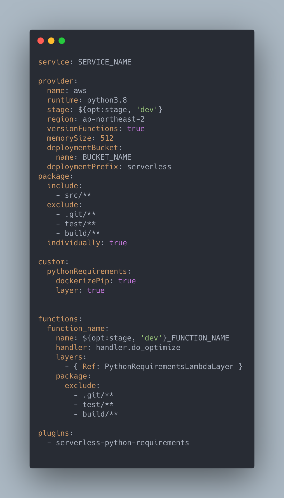
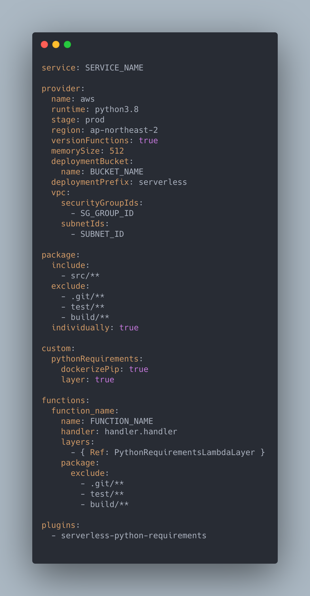

# Serverless Framework Setup for AWS Lambda

> serverless.yml 파일 작성법 및 deploy commands를 정리해요

 

## 1. serverless.yml 파일 작성법

- serverless.yml 파일은 project의 root경로에 생성한다
- 해당 파일을 기준으로 Serverless Framework는 배포한다

 

### ex1)

 

### **service**

- Project 이름

 

### **provider**

- **name**
  - Cloud service provider에 대한 정보를 기재한다
    - 여기서는 AWS Lambda 에 배포하기 위한 yaml file 이므로 *aws* 가 기재되어 있다
- **runtime**
  - 사용하는 runtime version을 기재한다
- **stage**
  - 배포하려는 stage를 기재한다
    - `${opt: stage, 'dev'}`
      - local 환경에서 sls 명령어를 활용하여 배포 시 stage option을 주면 해당 stage로, 따로 명령어를 주지 않으면 default로 dev가 적용된다
        - ex) sls deploy -s prod
          - stage 설정을 위한 option
            1. `-s`
            2. `--stage`
- **region**
  - 배포하는 lambda의 region 정보를 기재한다
- **versionFunctions**
  - versioning을 원하면 true로 설정한다
- **memorySize**
  - memory size를 기재한다
    - default로는 1024가 설정되어 있다
- **deploymentBucket**
  - 배포되면 저장될 AWS S3 bucket의 이름을 지정한다
    - 따로 설정하지 않으면 새로운 bucket이 생성된다
- **deploymentPrefix**
  - 배포되는 bucket 내에 prefix를 지정하여 저장할 수 있다
    - default로는 serverless로 설정되어 있다

 

### package

- **include**
  - deployment package에 포함시킬 directory를 기재한다
- **exclude**
  - deployment package에 포함시키지 않을 directory를 기재한다
- **individually**
  - function별로 각각 packaging 하길 원하면 ture로 설정한다
    - default값은 false이다

 

### custom

- **pythonRequirements**
  - `serverless-python-requirements plugin` 사용을 위해 필요한 부분이다
    - **dockerizePip**
      - docker packaging 을 사용하려면 true 로 설정한다
        - default는 false 이다
    - **layer**
      - 생성된 dependency를 Lambda Layer로 생성하려면 true로 설정한다
        - default는 false 이다

 

### functions

- **function_name**

  - 함수명 (serverless framework에서 사용될 함수명이다. Lambda 함수명 아님)

    - **name**

      - AWS Lambda에 생성되는 function name이다

        - stage에 따라 다른 함수를 생성하기 위해

          `${opt: stage, 'dev'}`

          로 설정했다

          - 위의 provider >stage 에 같은 설정이 되어있다

    - **handler**

      - 해당 함수의 파일과 함수명을 기재한다
        - ex) handler.do_optimize
          - 해당 Lambda function은 handler.py 내의 do_optimize() 함수에서 실행된다

    - **layers**

      - 해당 함수에 등록할 layer를 기재한다
        - 여기서는 serverless-python-requirements plugin 을 활용하여 생성한 layer를 lambda layer로 등록하므로 `- { Ref: PythonRequirementsLambdaLayer }` 로 설정하였다

 

### plugins

- npm으로 설치한 serverless plugin 중 사용할 plugin을 기재한다
  - 해당 프로젝트의 root 에 external plugin이 설치되어 있어야만 정상 작동한다

 

 

### ex2)

 

### provider

- **vpc**
  - Lambda 함수의 VPC에 대한 정보를 기재한다
- **securityGroupIds**
  - 해당  lambda 함수의 Security group ID를 기재한다
- **subnetIds**
  - 해당 lambda 함수의 subnet ID를 기재한다

 

`+`

#### 주의

VPC 정보를 `serverless.yml`에 기재하지 않으면 lambda 함수만 배포 하는것이 아닌 전체 배포 시, VPC 정보가 **초기화** 되고 AWS Console에서 재 설정 해야한다!

꼭 Serverless.yml에  VPC 정보를 기재하자!

 

 

## 2. Deploy commands

명령어 중 일부만 이곳에 정리 하므로 전체 command 를 확인하려면 아래의 참고 자료를 이용하면 된다

 

### Stage

- `--stage` or `-s`
  - 배포하려는 stage를 설정할 수 있다
    - ex)
      - sls deploy -s prod

### Function

- `--function` or `-f`
  - 특정 함수만 배포할 수 있다
    - 위의 예시에서 Lambda Layer를 함께 생성해서 배포하므로 최초 배포 후 재배포 시, code 만 변경 되었으면 layer를 다시 생성할 필요 없으므로 해당 option을 활용하면 된다
      - ex)
        - sls deploy -f do_optimize

 

 

 

`+`

### 참고 자료

- [Serverless.yml Reference](https://www.serverless.com/framework/docs/providers/aws/guide/serverless.yml/)
- [Serverless Python Requirements Plugin](https://www.serverless.com/plugins/serverless-python-requirements)
- [Serverless deploy commands](https://www.serverless.com/framework/docs/providers/aws/cli-reference/deploy/)
