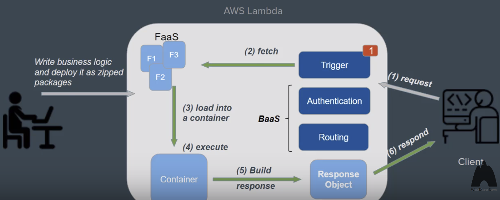

# Serverless

```
Serverless != No service

Serverless == you do not have a server that you are going to be managing & putting entire application
```

### How we got here?

1. D.I.A.Y

2. Cloud & VIrtualization

3. IaaS

4. PaaS

5. CaaS

​          ---> and Serverless!!

#### Serverless

> Building software without worrying about servers

### How does serverless work?



### Pros and cons

- pros
  - less server-side work
  - reduced cost (also through economy of scale)
  - reduced risk and increased efficiency
  - auto-scaling
  - shorter lead time
- cons
  - managing state is relatively complex
  - higher latency
  - vendor lock-in

<br/>

### Serverless providers

1. AWS Lambda
2. Google cloud functions
3. Google Firebase

<br/>

### What you can do with Serverless

- Static websites (Amazon S3)
- Small e-commerce platforms
- Chatbots
- IoT services
- Big data applications
- Event-driven systems
