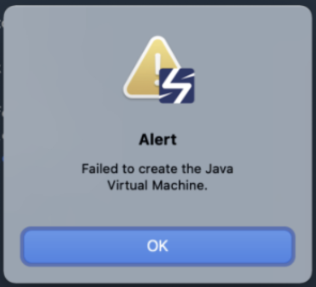

# macOS Bigsur 업데이트 후 scouter client JVM 오류 해결하기

<br>

<br>

### Problem

: Bigsur로 업데이트 한 후 아래와 같이 JVM을 생성할 수 없다는 error를 뱉는 현상이 발생



<br>

<br>

### Cause

- Bigsur로 업데이트를 할 경우 기본적으로 java가 설치되어 있다
  - Scouter와 Bigsur에 설정된 java가 바라보는 java version이 달라서 발생한 문제로 보임

<br>

<br>

### Solution

: scouter.client.app/Contents/Eclipse/scouter.ini 파일에 설치한 jdk 경로를 명시해서 해결

```bash
-vm
/Library/Java/JavaVirtualMachines/jdk1.8.0_271.jdk/Contents/Home/bin/java
```

<br>

<br>

#### Reference

: <https://github.com/scouter-project/scouter/issues/764>
