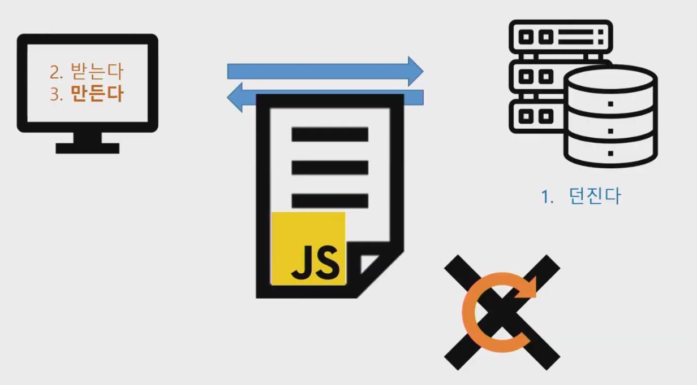
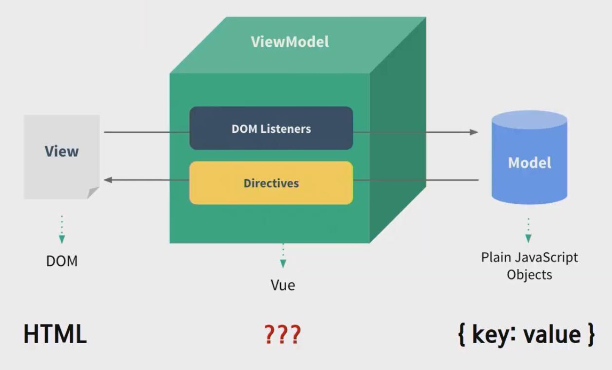
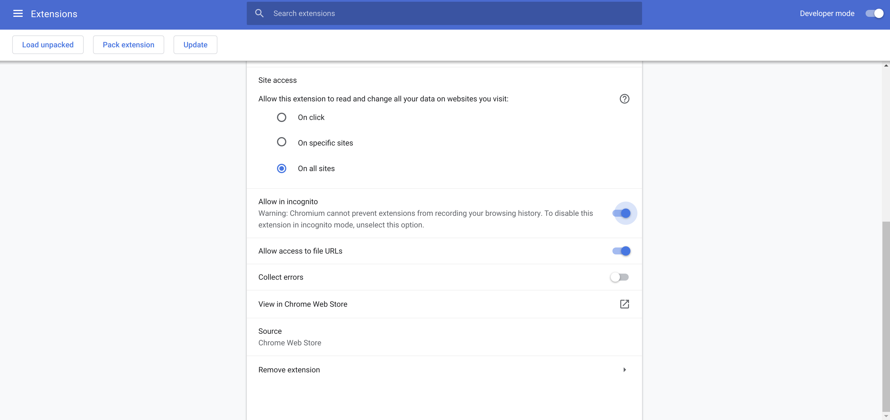

# Intro to Vue.js

> What, Why, and How

<br>

<br>

## 1. What is Vue.js?

> a **progressive framework** for building user interfaces

<br>

#### 1. Front End

<br>

#### 2. SPA (Single Page Application)

- 단일 페이지로 구성된 웹 어플리케이션

- 화면이동 시에 필요한 데이터를 서버사이드에서 HTML으로 전달받지 않고(서버사이드 렌더링 X), 필요한 데이터만 서버로부터 JSON으로 전달 받아 동적으로 렌더링

  - client side rendering!

- 모든 HTML을 클라이언트가 갖고 있고 서버사이드에는 필요한 데이터를 요청하고 JSON으로 받기 때문에 기존의 어플리케이션에 비해 화면을 구성하는 속도가 빠르다

- **장점**

  - 하나하나 화면 전체를 렌더링할 필요가 없기 때문에 화면이동이 빠르다.
  - 화면에 필요한 부분의 데이터만 받아서 렌더링 하기 때문에 처리과정이 효율적이다.
  - 유저에 입장해서 사용하기 편리하다.

- **단점**

  - 처음 화면을 로딩할 때, 모든 화면이 미리 준비되어 있어야 하기 때문에 로딩에 시간이 걸린다.

  - 어플리케이션을 구현하는데 보다 시간이 걸리며 복잡하다.

    참고: [https://velog.io/@josworks27/SPA-%EA%B0%9C%EB%85%90](https://velog.io/@josworks27/SPA-개념)

<br>

#### 3. Client Side Rendering



<br>

#### 4. MVVN (Model View ViewModel) Pattern



- **구조**
  - Model
    - 어플리케이션에서 사용되는 데이터와 그 데이터를 처리하는 부분
  - View
    - 사용자에서 보여지는 UI 부분입니다.
  - View Model
    - View를 표현하기 위해 만든 View를 위한 Model
    - View를 나타내 주기 위한 Model이자 View를 나타내기 위한 데이터 처리를 하는 부분

- **동작 순서**
  - 사용자의 Action들은 View를 통해 들어오게 됨
  - View에 Action이 들어오면, Command 패턴으로 View Model에 Action을 전달
  - View Model은 Model에게 데이터를 요청
  - Model은 View Model에게 요청받은 데이터를 응답
  - View Model은 응답 받은 데이터를 가공하여 저장
  - View는 View Model과 Data Binding하여 화면을 나타냄

- **장점**

  - MVVM 패턴은 View와 Model 사이의 의존성이 없다

  - 또한 Command 패턴과 Data Binding을 사용하여 View와 View Model 사이의 의존성 또한 없앤 디자인패턴

  - 각각의 부분은 독립적이기 때문에 모듈화 하여 개발할 수 있음

    출처: <https://beomy.tistory.com/43> [beomy]

- **Vue.js** 는 MVVM 패턴의 ViewModel 레이어에 해당하는 View 단 라이브러리이다

<br>

#### 5. 반응형 (Reactive)

<br>

<br>

### Vue vs React

<br>

#### 공통점

- **가상 DOM**을 활용
- **반응적**이고 **조합 가능**한 component 제공
- `core library`에만 집중하고 있고 routing 및 전역 상태를 관리하는 `companion library`가 있음

<br>

`+`

Vue.js 와 다른 프레임워크와의 비교

<https://kr.vuejs.org/v2/guide/comparison.html>

<br>

## 2. Why Vue.js?

1. 배우기 쉽다!
2. $ (절약)
   - Client Side Rendering
3. UX 향상
   - 비동기 / SPA
4. 프레임워크 (프렌체이즈)의 장점 (DX 향상 - 개발자 경험 향상)
   - No etc, 선택과 집중
   - 유지/보수 용이
   - Community와 library

<br><br>

## 3. How?

<br>

### Setups

- VS Code
  
  - `Vetur` 설치
  
- Chrome Web Store

  - `Vue.js devtools`

    - 밑의 두 가지 선택하기

    

- CDN

  - (지금은) 위의 개발 version 사용하기
  
  ```html
<!-- development version, includes helpful console warnings -->
  <script src="https://cdn.jsdelivr.net/npm/vue/dist/vue.js"></script>
  
  <!-- production version, optimized for size and speed -->
  <script src="https://cdn.jsdelivr.net/npm/vue"></script>

  ```
  
  <br>

<br>

### Docs

https://kr.vuejs.org/v2/guide/index.html

- 정말 잘 정리되어 있다! 따라해보며 익히기!

<br>

<br>

## 4. Getting started with Vue.js 

<br>

### 4-0. `el` attribute

- Vue instance 안에 `el` 속성을 통해 Vue instance가 그려질 지점을 지정

ex)

> 00_el.html

```html
<body>
    <div id="app">

    </div>

    <script src="https://cdn.jsdelivr.net/npm/vue/dist/vue.js"></script>
    <script>
        // el은 Vue instance의 속성이다
        const app = new Vue({
            el: '#app', // 어떤 요소에 mount 할 지 결정하는 구간
        })
        console.log(app)
        console.log(app.$el)
    </script>
</body>
```

<br>

### 4-1. `data` attribute

- 화면에 보여질 데이터를 정의

ex)

> 01_data.html

```html
<body>
    <div id="app">
    </div>
    <script src="https://cdn.jsdelivr.net/npm/vue/dist/vue.js"></script>
    <script>
        const app = new Vue({
            el:'#app',
            // Data를 선언하는 방법
            data: { // MVVM 의 Model을 담당하는 구간
                message:'Hello Vue!'
            }
        })
        console.log(app.message) 
    </script>
</body>
```

<br>

### 4-2. Interpolation

ex)

> 02_interpolation.html

```html
<body>
    {{ message }}
    <div id="app">
        {{ message }}
    </div>
    <script src="https://cdn.jsdelivr.net/npm/vue/dist/vue.js"></script>
    <script>
        const app = new Vue({
            el:'#app',
            data: {
                message:'Hello Vue!'
            }
        })
        console.log(app.message) 
    </script>
</body>
```

<br>

### 4-3. `v-text`

- Vannila JS의 DomElement.innertext와 같음
- v- 접두사로 시작하는 것들을 모두 directive(명령)라고 부른다

ex)

> 03_v-text.html

```html
<div id="app">
        <p v-text="message"></p>
        <p> {{message}}</p>
    </div>
    <script src="https://cdn.jsdelivr.net/npm/vue/dist/vue.js"></script>
    <script>
        const app = new Vue({
            el:'#app',
            data: {
                message:'완전히 같아요!'
            }
        })
        console.log(app.message) 
    </script>
</body>
```

<br>

### 4-4. `v-if`

- if 평가에서 false이면 화면에 나오지 않는다

ex)

> 04_v-if.html

```html
<body>
    <div id="app">
        <p v-if="bool1">
            true
        </p>
        <p v-if="bool2">
            false
        </p>

        <p v-if="str1">
            'Yes'
        </p>
        <p v-if="str2">
            ''
        </p>

        <p v-if="num1">
            1
        </p>
        <p v-if="num2">
            0
        </p>

        <!-- JavaScript 는 empty array도 true-->
        <p v-if="arr">
            [] => js는 빈 배열이 true 평가
        </p>
        <p v-if="arr.length">
            [].length를 통해 0인지로 확인
        </p>
    </div>
    <script src="https://cdn.jsdelivr.net/npm/vue/dist/vue.js"></script>
    <script>
        const app = new Vue({
            el:'#app',
            data: {
                bool1: true,
                bool2: false,
                str1: 'Yes',
                str2: '',
                num1: 1,
                num2: 0,
                arr: [],
            }
        })
        console.log(app.message) 
    </script>
</body>
```

<br>

### 4-5. `v-if`, `v-else-if`, `v-else`

ex)

> 05_v-if-elseif-else.html

```html
<body>
    <div id="app">
        <p v-if="username === 'master'">
            Hello Master
        </p>
        <p v-else>
            Hello User
        </p>

        <p v-if="number > 0">
            양수
        </p>
        <p v-else-if="number < 0">
            음수
        </p>
        <p v-else>
            0
        </p>
    </div>
    <script src="https://cdn.jsdelivr.net/npm/vue/dist/vue.js"></script>
    <script>
        const app = new Vue({
            el:'#app',
            data: {
             username: 'master',
             number: 0,
            }
        })
    </script>
</body>
```

<br>

### 4-6. `v-for`

ex)

> 06_v-for.html

```html
<body>
    <div id="app">
        <ul>
            <li v-for="number in numbers">{{ number +1 }}</li>
        </ul>

        <ol>
            <li v-for="teacher in teachers"> {{ teacher.name }}</li>
        </ol>
    </div>
    <script src="https://cdn.jsdelivr.net/npm/vue/dist/vue.js"></script>
    <script>
        const app = new Vue({
            el:'#app',
            data: { 
                numbers: [0,1,2,3,4,5],
                teachers: [
                    { name: 'neo'},
                    { name: 'tak'},
                ],
            }
        })
    </script>
</body>
```

<br>

### 4-7. `v-bind`

- 표준 HTML 속성과 Vue Instance를 연동할 때 사용 (+ a)
- `v-bind:` 를 줄여서 `:` 으로 쓸 수 있다!

ex)

> 07_v-bind.html

```html
<body>
    <div id="app">
        <a href=" {{ googleUrl }}">Bad Google link</a>
        <a v-bind:href="googleUrl">Good Google link</a>
        <a :href="naverUrl">Naver link</a>
        
    </div>
    <script src="https://cdn.jsdelivr.net/npm/vue/dist/vue.js"></script>
    <script>
        const app = new Vue({
            el:'#app',
            data: { 
                googleUrl: 'https://google.com',
                naverUrl: 'https://naver.com',
                randomImageUrl: 'https://picsum.photos/200',
                altText: 'random-image',
            }
        })
    </script>
</body>
```

<br>

### 4-8. `methods` attribute

ex)

>08_methods.html

```html
<body>
    <div id="app">
        {{ message }}
    </div>
    <script src="https://cdn.jsdelivr.net/npm/vue/dist/vue.js"></script>
    <script>
        const app = new Vue({
            el:'#app',
            data: { 
                message:'Hello Vue!'
            },
            methods: {
                alertWarning: function() {
                    alert('WARNING!')
                },
                // Syntatic sugar : 위와 아래는 완전히 같다!
                alertMessage(){
                    alert(this.message)
                    // Vue 세상의 this -> JS와 다르게 적용됨
                    // : 내부적으로 proxy system이 적용되기 때문 
                },
                changeMessage(){
                    this.message = 'Changed message'
                }
            }
        })
    </script>
```

<br>

### 4-9 `v-on`

- listener를 등록하는 것
- `v-on:` 을 줄여서 `@`으로 쓸 수 있다!

ex)

> 09_v-on.html

```html
<body>
    <div id="app">
        <h1>{{ message }}</h1>
        <button v-on:click="alertWarning"> Alert Warning </button>
        <button v-on:click="alertMessage"> Alert Message </button>
        <button @click="changeMessage"> Change Message </button>
        <hr/>
        <!-- enter key 눌렸을 때 event 발생-->
        <input v-on:keyup.enter="onKeyUp" type="text">
    </div>
    <script src="https://cdn.jsdelivr.net/npm/vue/dist/vue.js"></script>
    <script>
        const app = new Vue({
            el:'#app',
            data: { 
                message:'Hello Vue!'
            },
            methods: {
                alertWarning: function() {
                    alert('WARNING!')
                },
                alertMessage(){
                    alert(this.message)
                },
                changeMessage(){
                    this.message = 'Changed message'
                },
                onKeyUp(event) {
                    this.message = event.target.value
                }
            }
        })
    </script>
</body>
```

<br>

### 4-10. `v-model`

> input, select, textarea 에서만 가능한 양방향 binding

- `v-model` 디렉티브를 사용하여 폼 input과 textarea 엘리먼트에 양방향 데이터 바인딩을 생성할 수 있다
- `v-model`은 기본적으로 사용자 입력 이벤트에 대한 데이터를 업데이트하는 **“syntax sugar”** 다
- `v-model`은 모든 form 엘리먼트의 초기 `value`와 `checked` 그리고 `selected` 속성을 무시한다
  - 항상 Vue 인스턴스 데이터를 원본 소스로 취급
  - 컴포넌트의 `data` 옵션 안에 있는 JavaScript에서 초기값을 선언해야함!

ex)

> 10_v-model.html

```html
<body>
    <div id="app">
        <h1> {{ message }}</h1>
        <!-- 사용자 입력 <=> data를 완전히 동기화 시키고 싶다! -->
        <!-- v-model => input, select, textarea 에서만 가능한 양방향 binding -->
        <hr/>
        <!-- 단방향 binding ( input => data )-->
        1way:
        <input @keyup="onInputChange" type="text">
        <hr/>
        <!-- 양방향 binding ( input <=> data )-->
        2way:
        <input @keyup="onInputChange" type="text" :value="message" />
        <hr/>
        <!-- v-model -->
        v-model/2way:
        <input v-model="message" type="text">
    </div>
    <script src="https://cdn.jsdelivr.net/npm/vue/dist/vue.js"></script>
    <script>
        const app = new Vue({
            el: '#app',
            data: {
                message: 'hi',
            },
            methods: {
                onInputChange(event){    
                    this.message = event.target.value
                }
            }
        })
    </script>
</body>
```

<br>

### 4-11. `v-show`

- **v-if** 는 평가(t/f) 가 자주 바뀌지 않을 때 유리하다
- => 초기 rendering cost가 적다
- **v-show**는 평가 (t/f)가 자주 바뀔 때 좋다
  - => toggle cost가 적다
  - v-show는 이미 DOM 에 준비 해놨는데 display만 none 임!

ex)

> 11_v-show.html

```html
<div id="app">
        <button @click="changeF">changeF</button>
        <p v-if="t">
            This is v-if with true
        </p>
        <p v-if="f">
            This is v-if with false
        </p>
        <p v-show="t">
            This is v-show with true
        </p>
        <p v-show="f">
            This is v-show wit false
        </p>
    </div>
    <script src="https://cdn.jsdelivr.net/npm/vue/dist/vue.js"></script>
    <script>
        const app = new Vue({
            el:'#app',
            data: {
                t: true,
                f:false,
            },
            methods: {
                changeF(){
                    this.f = !this.f
                }
            }
        })
    </script>
</body>
```

<br>

<br>

`+`

## Lodash

> A modern JavaScript utility library delivering modularity, performance & extras.
>
> <https://lodash.com/>

<br>

#### CDN

```html
<script src="https://cdnjs.cloudflare.com/ajax/libs/lodash.js/4.17.15/lodash.min.js"></script>
```

<br>
