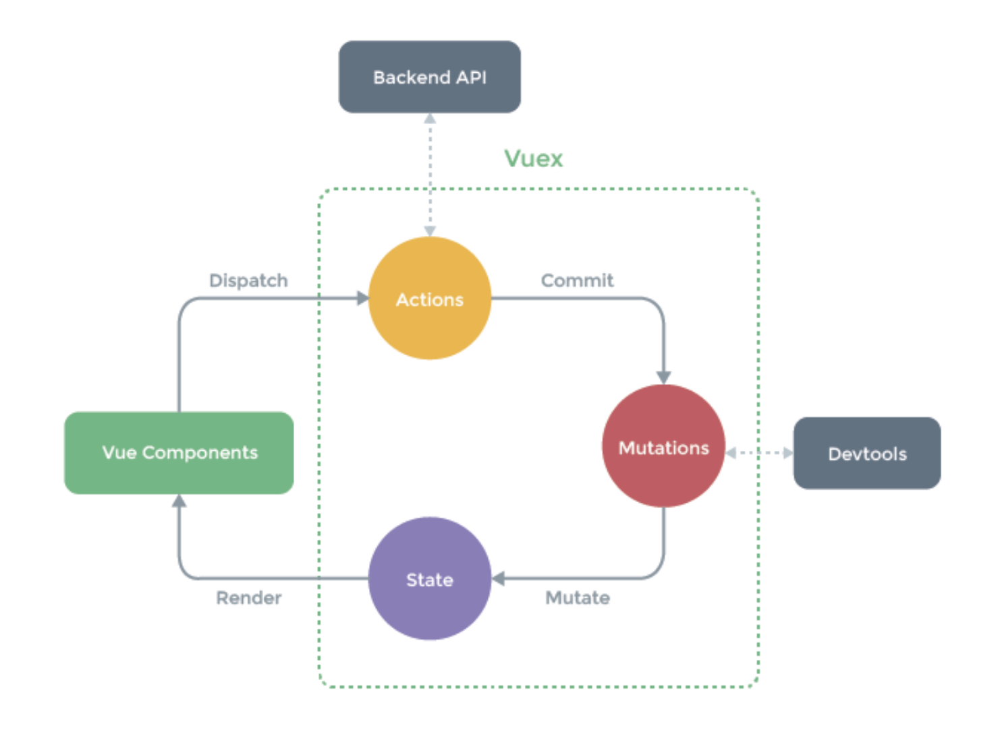

# Vuex

<br>

## What is Vuex?

> <https://vuex.vuejs.org/>

<br>

- Application에 대한 **상태 관리 패턴** + **라이브러리**
- Application 의 모든 component에 대한 `중앙 집중식 저장소 역할` 을 하며, 예측 가능한 방식으로 상태를 변경할 수 있다

<br>

<br>

## When Should I Use It?

<br>

- Vue는 **단방향 데이터 흐름**을 갖고있음 => 단순함
  - 만약 **공통의 상태**를 공유하는 **여러 컴포넌트** 가 있는 경우 단순함이 저하됨
    - 컴포넌트에서 공유된 상태를 추출하고 전역 **싱글톤**으로 관리해야 함!
      - 이를 통해 모든 컴포넌트는 트리에 상관없이 상태에 **access** 하거나 동작을 **trigger** 할 수 있다
  - 상태 관리 및 특정 규칙 적용과 관련된 개념을 정의하고 분리함으로써 코드의 **구조**와 **유지 관리 기능**을 향상시킴

<br>



<br>

- Vuex는 공유된 상태 관리에 유용하지만, 개념을 학습해야해서 개발 하는데 오래 걸릴 수 있다

- 앱이 단순하다면 필요 없지만, **중대형 SPA**를 구축하는 경우 Vuex를 사용하는 것이 좋다!
  - `Flux` library 를 참고하기!

<br>

<br>

## vuex의 속성 4가지

<br>

### 1. `state`

- Vue component에서 data로 볼 수 있음
- **원본 소스** 역할을 함
- View와 직접적으로 연결되어 있는 **model**
- 직접적인 변경 불가
  - `mutation`을 통해서만 변경 가능
    - mutation을 통해 state 의 변경이 일어나면 **반응적으로** View가 update 됨

<br>

### 2. `mutations`

- `state` 를 변경하는 유일한 방법
- **event**와 유사
- 함수로 구현 됨
  - 첫 번째 인자 `state`
  - 두 번째 인자 `payload`
    - payload는 여러 필드를 포함할 수 있는 객체형태 가능
- 일반적으로 직접 호출 불가
  - **commit** 을 통해서만 가능하다

<br>

### 3. `action`

- `mutation` 과 비슷하지만, `mutation` 과 달리 **비동기 작업**이 가능하다

- mutation에 대한 commit 가능
- 첫 번째 인자를 **context** 인자로 받을 수 있다
  - **context** 인자는 `state`, `commit`, `dispatch`, `rootstate`와 같은 속성들을 포함한다
- 두 번째 인자는 mutatation과 동일하게 **payload** 로 받을 수 있다
- **dispatch**를 통해 호출 할 수 있다
- 실무에서는 **Axios**를 통한 API 호추로가 그 결과에 대해 return 하거나 mutation 으로 commit하여 상태를 변경하는 ㅇ요도로 사용된다

<br>

### 4. `getters`

- Vue component의 **computed** 와 같다
  - 계산된 속성이다
- 특정 state에 대해 어떠한 연산을 하고 그 결과를 View에 binding 할 수 있다
- state의 변경 여부에 따라 getter는 재계산되고, View역시 update하게 된다
  - 단, 이때 state는 원본 데이터로서 변경이 일어나지 않는다!

<br>

<br>

## Usage

<br>

> Add vuex

```bash
vue add vuex
```

<br>

<br>

<br>
