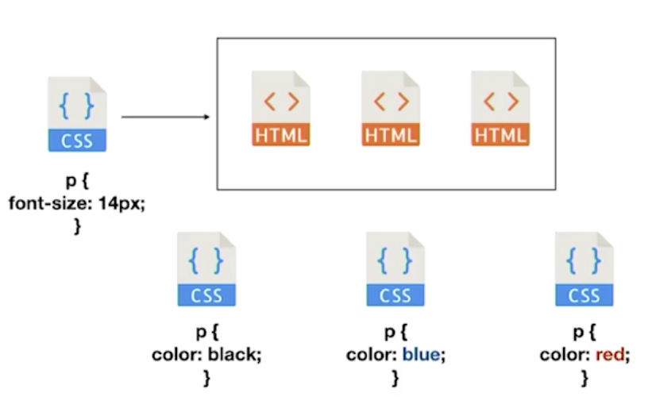
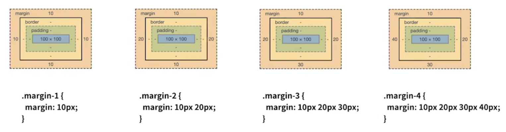
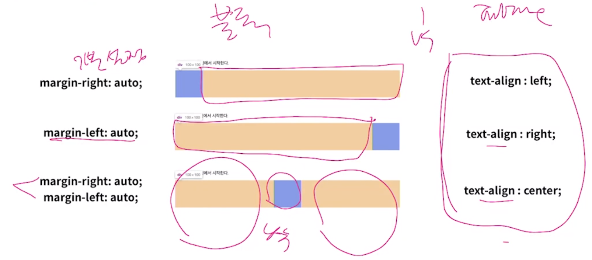

# CSS Basics

<br>

<Br>

#### Table of Contents

- CSS 정의 방법 / 선택자 /속성 선언
- 의사 클래스 (pseudo class)
- 미디어 쿼리
- 상속 및 우선순위   -> *이러닝 오류 있음 주의!*

<br>

### Why CSS (Cascading Style Sheets)  ?

- `HTML`은 문서의 구조화 (**Markup**)

- `CSS` 은 **스타일을 정의**한다

<br>

### CSS 기본 사용법

```html
h2 {
 color: blue;
 font-size: 20px;
}
```

- h2   =>   `Selector`
- color   =>  `Property`
- blue   =>  `Value`

<br>

### CSS 정의방법

<br>

1. #### In-line Styling

   ```html
   <div style="color: blue; font-size: 100px;">
      Inline CSS example! 
   </div>
   ```

   - 해당 tag에 직접 `style` 속성을 활용

   <br>

2. #### 내부 참조 (embedding)

   ```html
   <head>
       <title> CSS Tutorial </title>
       <style>
           h1 {
             color: blue;
               font-size: 100px;
           }
       </style>
   </head>
   ```

   - HTML file 내에 `<style>` tag 내에 지정

   <br>

3. #### 외부 참조 (link file)

   float.html

   ```html
   <head>
       <style>
           <link rel="stylesheet" href="float.css">
       </style>
   </head>
   <body>
       <div id="link_it">CSS sample </div>
   </body>
   ```

   float.css

   ```css
   #link_it {
       background-color: black;
       color: white;
   }
   ```

   <br>

   <br>

#### 어떤 CSS 정의 방법이 옳을까?



- 외부참조를 하는 것이 반복되는 코드를 줄일 수 있다!

<br>

<br>

### CSS Selector

> HTML 문서에 특정한 요소를 선택하여 스타일링 하기 위해서는 반드시 **선택자** 라는 개념이 필요하다

- 기초 선택자

- 고급 선택자

  - 자손 선택자 / 직계 자손 선택자
  - 형제 / 인접형제 선택자, 전체 선택자

- 의사 클래스 (pseudo class)

  - link, 동적 의사 클래스
  - 구조적 의사 클래스

  - 기타 의사 클래스, 의사 앨리먼트

<br>

#### CSS Tip

: 되는 것 vs 하면 안되는 것을 잘 구분하기

<br>

<br>

### CSS 상속

- 속성 중에는 상속 되는것과 상속 않는 것이 있다

- #### 상속 되는 것

    - `Text` 관련 요소 (front, color, text-align, opacity, visibility)

- #### 상속 되지 않는 것

    - `Box model 관련 요소 (width, height, padding, border, box-sizing, display)
    - `position` 관련 요소 (position, top/right/bottom/left, z-index)

<br>

### `+`  CSS Inheritance from MDN

- In CSS, inheritance controls what happens when no value is specified for a property on an element. Refer to any CSS property definition to see whether a specific property inherits by default ("`Inherited: yes`") or not ("Inherited: no").

<br>

### CSS 적용 우선순위 (Cascading order)

1. 중요도 (Importance) - 사용시 주의 (왜냐면 최강!!)
   - `important`
     - vendor, bootstrap 등 내가 작성하지 않고 외부에서 받아온 CSS나 JavaScript 기반의 라이브러리들을 사용할 시 우선순위를 주기 위해 overriding 할 때 사용
     - 그 외에는 잘 쓰지 않는다 (너무 강력해서!)

```css
h3 {
 color: violet !important
}
```

<br>

2. 우선 순위 (Specificity)

   - in-line / id 선택자 / class 선택자 / 속성 선택자, Pseudo-class / 요소 선택자

   <br>

3. Source code 순서
   - *나중에 정의된 것이 더 우선순위를 갖는다!!!*

<br>

<br>

### 크기단위 (상대)

- `px`
- `%`
- `em`
  - 배수단위
  - 요소에 지정된 size에 상대적인 size를 가짐
- `rem`
  - 최상위 요소(HTML)의 사이즈를 기순으로 배수 단위를 가짐
- viewport 기준 단위
  - `vw`, `vh`, `vmin`, `vmax`

<br>

#### `em` vs `rem`

- #### em
  
  - 자기가 갖을 수 있는 크기의 배수
  - 상속을 받아서 그 수에 대해 em
  - 24px 일때 1.5em == 36px
  
- #### rem
  
  - root em  
    - root를 기준으로 함 (browser 기준!)
  
  - 기본적으로 browser pixcel size == 16px
  - 1.5 rem == 24px

<br>

<br>

### 색상 단위

- HEX (00~ff)
  - #ffffff
- RGB (0, 255)
  - rgb(0,0,0)
- RGBA
  - rgba(0, 0, 0, 0.5)

<br>

<br>

### Box model

> 모든 html은 box model을 갖고있음

<br>



- 상하좌우
- 상하 / 좌우
- 상 / 좌우 / 하
- 상 / 우 / 하 / 좌

<br>

<br>

#### box-sizing

- 기본적인 모든 요소의 `box-sizing`은 `content-box`  (browser default 값임)
  - padding을 제외한 순수 contents 영역만을 box로 지정
- 다만, 우리가 일반적으로 영역을 볼 때는 padding을 포함한 border까지의 너비를 100px로 보는 것을 원함
  - 그 경우 `box-sizing`을 `border-box`로 설정한다!

Tip!

```css
box-sizing: border-box;
```

<br>

<br>

#### Margin Collapsing

: 인접 형제 요소간의 margin이 겹쳐서 보임

<br>

<br>

### display inline vs block

- block level 요소와 inline level 요소 구분 (HTML 4.1까지만)
- 대표적인 **block** level 요소
  - div
  - ul / ol / li
  - p
  - hr
  - form
- 대표적인 **inline** level 요소
  - span
  - a
  - img
  - input, label
  - b, em i, strong

<br>

#### 1. display: block

- 줄 바꿈이 일어나는 요소
- **화면 크기 전체의 가로폭을 차지한다**
  - 기본적으로 화면 너비의 100%를 가짐
  - 너비를 가질 수 없다면, 자동으로 **margin**을 줘버림
  - 그래서 줄 바꿈이 일어남!
- block level 요소 안에 inline level 요소가 들어갈 수 있음

<br>

#### 2. display: inline

- 줄 바꿈이 일어나지 않는 행의 일부 요소
- **content 너비만큼 가로폭을 차지한다**
- width, height, margin-top, margin-bottom을 지정할 수 없다
- 상하여백은 `line-height`로 지정한다

<br>

#### 3. inline-block

- block과 inline level 요소의 특징을 모두 갖는다
- inline처럼 한 줄에 표시한다
- block 처럼 `width`, `height`, `margin` 속성을 모두 지정할 수 있다

<br>

#### 속성에 따른 수평 정렬



- inline 요소는 `text-align` 속성을 쓸 수 있음
- block 요소는 `margin` 을 기준으로 정렬해야함
