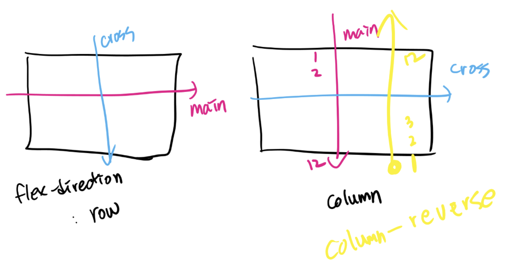

# Grid System

<br>

<br>

### HTML / CSS 배치

- 배치 핵심

  : 왼쪽 위에 쌓인다 (박스모델)

  - 어떻게?
    - block
    - inline

- 배치 흐름을 바꾸는 방법
  - float
  - position
    - flex: flexible box

<br>

<br>

## flex

> `flex` 이전에는 배치를 위해서 `float` , `position` 지정을 해야했음

<br>


<br>

### flex 주요 개념

- `container`
- `item`

```html
<style>
    .container {
        display: flex;
    }
</style>


<div class="container">
    <div class="item"></div>
    <div class="item"></div>
</div>
```

<br>

- #### 축

  - `main axis`

    : 주축

    - `flex-direction: row;` 일 때 가로 축
    - `flex-direction: column;` 일 때 세로 축
    - `flex-direction: column-reverse;` 일 때 *밑에서 위로 올라가는* 세로 축
    - `flex-direction: row-reverse;` 일 때 *오른쪽에서 왼쪽으로 가는* 가로 축

  - `cross axis`

    : 크로스축

<br>

<br>

### flex 정의 시

1. 모든 항목들은 `main axis (주축)`을 기준으로 배치가 시작됨
   - 기본은 `row`
   - 만약, `row-reverse`로 지정하게 되면, 오른쪽 끝부터 배치가 시작됨
2. 모든 `item`은 기본적으로 row를 기준으로 배치됨
   - `flex-direction` : `row` 값으로 기본 설정 됨
3. 모든 `item`은 `cross axis`를 모두 채운다
   - 높이를 모두 채운다
     - `align-items: stretch;` 가 기본값이기 때문
4. 모든 `item`은 본인의 너비 혹은 content 영역만큼 너비를 가지게 된다
   - 경우에 따라서, 본인이 지정받은 너비보다 작을 수 있다
     - `flex-wrap: nowrap` 이 기본값이기 때문
     - ex) 전체 item의 너비의 합이 container의 너비보다 작을 때 보다 작을 때
5. 각 영역은 content 크기 / 너비만큼 영역을 차지함
   - 더 작을 수도 있음!
6. 모든 영역은 cross axis (크로스 축)을 채우고 있는 모습임

<br>



<br>

<br>

### flex 속성

<br>

#### 1. flex-wrap

- 기본 값 `nowrap`
  - 한 줄안에 무조건 담는다
- `wrap`
  - 각각의 너비만큼 가지게 되고 자리가 없으면 밑으로 내려감
  - 흘러 넘치지 않게 설정해주는 것!
- `wrap-reverse`
  - Items wrap round to additional lines in reverse

<br>

#### 2. flex-grow

> `flex-grow`는 남은 너비를 각각 비율로 나눠서 가져감

- 기본값 `0`

<br>

#### 3. flex-flow

> Shorthand property for `flex-direction` and `flex-wrap`

- 기본값 `row wrap`

  

- `row-reverse nowrap`

  

- `column wrap-reverse`

  

- `column wrap`

  

<br>

#### 4. justify-content

> main 축을 기준으로 정렬한다

- 기본값: `flex-start`
- `flex-start`
- `flex-end`
- `center`
- `space-around`
- `space-between`
- `space-evenly`

<br>

#### 5. align-items

> crosss 축을 기준으로 정렬한다

- `stretch`

  : 기본값

- `flex-start`

  : 상단 정렬

- `flex-end`

  : 하단 정렬

- `baseline`

  : items are aligned such as their baselines

- `center`

  : 중앙 정렬

  

<br>

#### 6. align-content

> Sets the distribution of space between and around content items along a flexbox's cross-axis or a gird's block axis

<br>

*`align-content` has no effect when there is onlyl one line of flex items!*

<br>

- 기본값: `stretch`

- `flex-start`

- `flex-end`

- `center`

- `space-between`

- `space-around`

  

<br>

#### 7. order

> item의 순서를 정의할 수 있다

- 기본값: `0`
- 음수값도 가질 수 있음

<br>

#### 8.  align-self

> item에 직접 align을 지정할 수 있음

<br>

<br>

*flex는 `margin-top: auto`가 가능하다!*

<br>

<br>

#### Wrap-up

- justify - main 축

- align - cross 축

- content - 여러축

- items - 한 줄

- self - 개별요소
