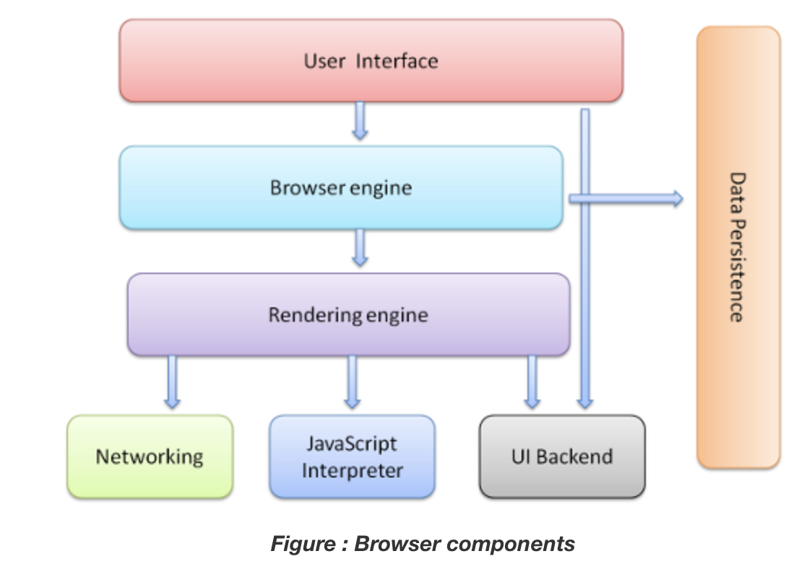

# How Browsers Work

> Back to basics!
>
> Reference: [How Browsers Work: Behind the scenes of modern web browsers](https://www.html5rocks.com/en/tutorials/internals/howbrowserswork/)

 

 

### Browser의 주요 기능

- Browser의 주요 기능은 사용자가 선택한 **resource**을 server에 **요청**하고 browser에 **표시**하는 것이다
  - Resource는 보통 HTML 문서지만, PDF, Image 혹은 다른 형태일 수 있다
  - Resource의 주소는 **URI (Uniform Resource Identifier)**에 의해 정해진다
- Browsesr는 HTML과 CSS의 `명세`에 따라 HTML file을 해석해서 표시한다
  - 명세는 Web 표준화 기구인 **W3C(World Wide Web Consortium)** 에서 정한다
  - 과거에는 browser들이 일부만 이 명세에 따라 구현하고 나머지는 독자적인 방법으로 확장함으로써 심각한 **호환성 문제**를 야기했지만, 현재는 대부분의 browser가 표준 명세를 따른다

 

### Browser의 기본 구조

1. **User Interface**
   - 주소 표시줄, 이전/다음 버튼, Bookmark 등 
   - 요청한 page를 보여주는 창을 제외한 나머지 모든 부분
2. **Browser engine**
   - `User Interface`와 `Rendering engine` 사이의 동작을 제어 
3. **Rendering engine**
   - 사용자가 요청한 contents를 표시
     - ex) HTML을 요청하면 HTML과 CSS를 parsing 하여 화면에 표시함
4. **Networking**
   - HTTP request와 같은 network 호출에 사용됨
5. **UI Backend**
6. **JavaScript Interpreter**
7. **Data Persistence**