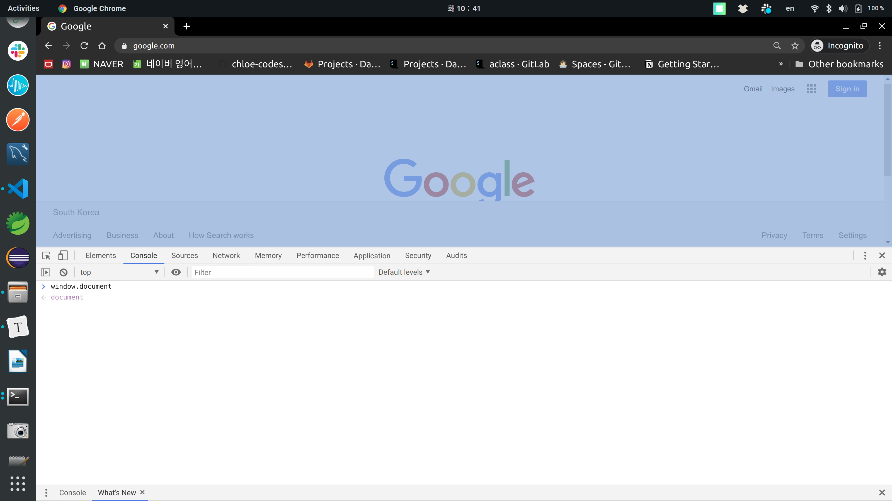
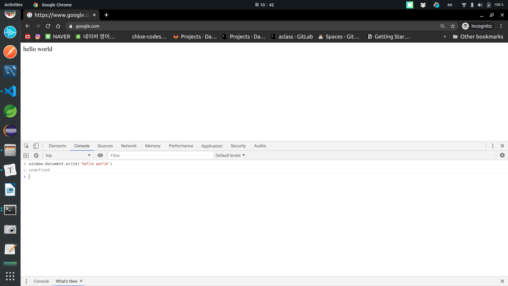
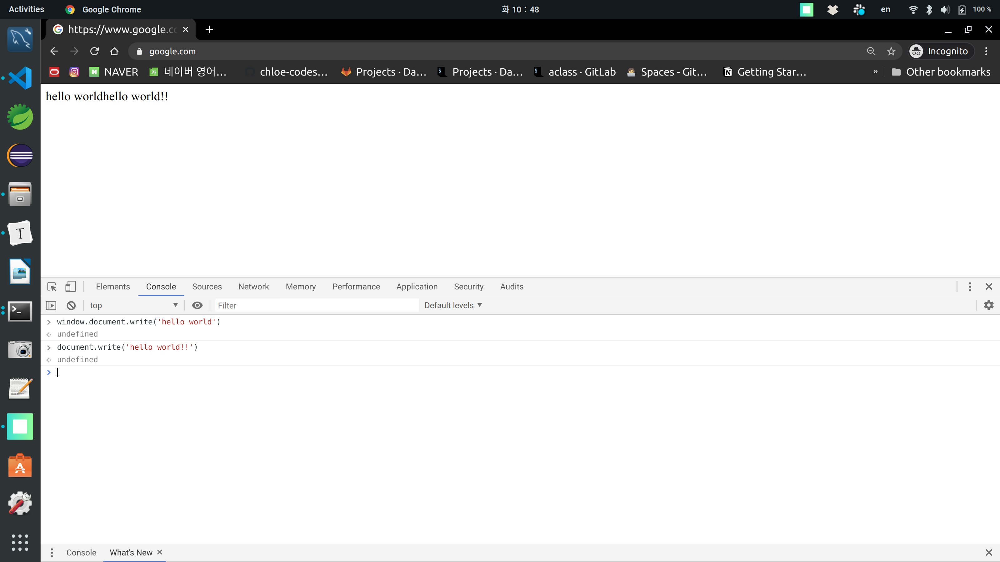

# JavaScript Basic Syntax

<br>

## JavaScript 란?

> Browser를 조작하기 위한 언어

- 브라우저의
- 브라우저에 의한
- 브라우저를 위한

<br>

*JavaScript는 표준과의 전쟁이다!*

<br>

### JQuery

- JQuery를 사용하면 속도는 약간 느려질 수 있지만 `cross-browsing` issue를 없애준다

<br>

<br>

## Vanilla JS

: 우후죽순 생겨나는 JavaScript Library 그만쓰자! 는 캠페인

- Vanilla == '**순정**'
- 아무런 library도 설치하지 않고 JavaScript를 쓰는 것!

<br>

<br>

## JavaScript

<br>

> 최상단에 `window`가 있음

- window.document



<br>

> write 하기

- window.document.write()



<br>

> 최상단은 항상 `window` 이기 때문에 생략 가능하다



<br>

<br>

### ASI (Automatic Semicolon Insertion)

: The principle of the feature is to provide a little leniency when evaluating the syntax of a JavaScript program by conceptually inserting missing semicolons

<br>

<br>

## 3대 구성요소

1. #### BOM (Browser Object Model)

2. #### DOM (Documenet Object Model)

   - DOM 조작
   - JavaScript의 존재 이유

3. #### ES (EcmaScript)

<br>

<br>

## ES (EcmaScript)

<br>

### let vs const

<br>

#### let

: 재 할당이 가능하다

#### const

: 재 할당이 불가능하다 !== 값이 바뀌지 않는다

<br>

<br>

### Naming Convention  

- lower cammel case 사용하기!

- snake case 안된다!

  ```javascript
  const addOneToNumber // good
  const add_one_to_number //bad
  ```

  <br>

<br>

### 절대 느슨한 일치 연산자를 사용하지 않는다

- `==`, `!=`   =>  X
- `===`, `!==`   =>  O

<br>

<br>

### Function => `1급 객체`

1. 변수에 저장할 수 있다.

2. 함수의 리턴값이 될 수 있다.

3. 함수의 인자가 될 수 있다.

<br>

<br>

## DOM (Document Object Model) 조작

- String 인 HTML을 Object로 바꾸고
- **이해**하고 **해석**해서
- DOM Tree를 만들고
- 화면에 rendering (그림 그리기)

<br>

정리:

- 세상의 data는 전부 String (HTML)
- 이것을 해석하는 parse/pasing 과정을 거쳐야 한다 (DOM이 해석)

<br>

<br>

### Selecting

### : `querySelector` ,  `querySelectorAll`

<br>

<br>

### Create

### : `.classList.add()`

```javascript
const myP = document.createElement('p')
myP.innerText = 'Greater'
        
const myPStr = '<p>Greate</p>'
myPStr.classList // undifined -> string이니까
myP.classList.add('wow') // object는 가능
```

<br>

<br>

<hr>

<br>

<br>

## I. Scope

> 중2변 히키코모리 막내동생 법칙

- 중괄호가 있을 경우, Scope를 만든다!!
  1. function일 경우
  2. 제어문 (if / while / switch (control)) 등5 일 경우
- `var`  function에서만 scope로 묶였음
- `let` 은 중괄호가 있을 경우 (scope) 동일하게 작동

<br>

<br>

## II. `var`, `let`, `const`

- `var`
  - 할당 자유
  - 선언 자유
  - **함수** 스코프 (절대 쓰지 않는다.)
- `let`
  - 할당 자유
  - 선언은 한번
  - **블록** 스코프
- `const`
  - 할당 한번
  - 선언 한번
  - **블록** 스코프

<br>

<br>

### Identifier (식별자) Convention

- **변수, 함수, 객체**: 캐멀 케이스 (`camelCase`)
- **class, 생성자**: 파스칼 케이스 (`PascalCase`)
- **상수**: 대분자 스케이크 케이스 (`SNAKE_CASE`)

<br>

<br>

## III. Hoisting (호이스팅)

> 1. var를 쓰지 않는다
> 2. function 선언형으로 쓰지 않는다

<br>

- 선언형으로 쓰면 생각대로 코드가 움직이지 않음
  - why?
    - 실행 전에 한 번 훑어서, 선언 이전에 참조가 가능하게 함

<br>

```javascript
// 선언형
function hello() {}

// 표현식
const hello = function() {}
```

<br>

<br>

## V. 자료형

<br>

### (1) 숫자

<br>

```js
const num1 = 123
const num2 = -2.88
const a = NaN // Not a Number
const b = Infinity
const c = -Infinity
```

<br>

### (2) 글자

- 합체 (concatenation)
  - `+`
- 수술 (interpolation)
  - `template literal ${}`

<br>

```js
const firstName = 'Chloe'
const lastName = 'Kim'
const middleName = 'Juhyun'

const fullName = firstName + lastName
const greeting = `Hello ${middleName}`
```

<br>

<br>

### (3) Boolean

- 뭐가 참에 가깝고, 뭐가 거짓에 가깝냐
- `true`, `false`  (소문자)

<br>

#### 1. Truthy

> Falsy 가 아닌 모든 값들

- `[]` - emptyArray
- `{}` - emptyObject

<br>

#### 2. Falsy

> 없거나, 정의되지 않은 것

- `null`
- `undefined`
- `""`
- `0`
- `[] == true`
- `![]`

<br>

<br>

## VI. 자료구조

> 어떻게 저장하고, 조작하는지 (CRUD)  => method를 보자

- Array (`list`)
  - array helper method
- Object (`dict`)

<br>

<br>

## VII. 함수

- 선언식 (statement)
- 표현식 (expression)

<br>

### Arrow Function

> (Class) Method(OOP) 함수가 아닌 곳에서만 사용

1. Class 정의에서는 arrow 함수 사용하지 말자!
   - why?
     - `this`, `arguments`, `super`, `new.target` 등을 binding 하지 않기 때문
2. 생성자로 사용 X
3. Event Listener Callback function으로 사용 X

<br>

ex)

```js
// 1. 선언식
function add (num1, num2){

    return num1 + num2
}

add(1,2)
// def add(num1, num2):


// 2. 표현식
const sub = function(num1, num2){
    return num1 - num2
}

sub(2,1)
// sub = lambda 입력값: 출력값


// 3. Arrow Function
const arrow = function(name){
    return `hello ${name}`
}

const arrow = (name) => {
    return `hello!! ${name}`
}

// 인자가 하나일 때
const arrow = name => {
    return `hello!!! ${name}`
}

// 한줄로 줄여라 
const arrow = name => {return `hello!{name}`}

//arrow function 끝판왕
// (1) 인자는 1개
// (2) return이 존재 & expression
const arrow = name => `hello!!!! ${name}`
```

<br>

<br>

## VIII. OOP

<br>

- 매우 유연한 객체를 통한 OOP

- Class를 잠시 잊어라!
  - Prototypal Inheritance
- ES6+ 부터 `class` 도입

ex)

```js
const chloe = {
    'name': 'Chloe',
    birth: '1995',
    'greeting': function(){
        return `Hi, This is ${name}`
    },
    farewell(){
        return `Bye~~ -${this.name}-`
    }
}

class Person {
    constructor(name, birth){
        this.name = name
        this.birth = birth
    }
    greeting() {
        return `Hi, This is ${this.name}`
    }
}

const camila = new Person('Camila', 1995)
const bella = new Person('Bella', 1993)


console.log(camila.name)
console.log(camila.greeting())
console.log(bella.name)
console.log(bella.greeting())

// 중간에 추가 가능!! -> 유연하다
bella.money = 100000000
console.log(bella.money)

/*
Python 에서는..

class Person:
    def __init__(self, name, birth):
        self.name = name
        self.birth = brith

    def greeting(self):
        return f'Hi, This is {self.name}'


*/
console.log(chloe.name)
console.log(chloe['birth'])
console.log(chloe.greeting())
console.log(chloe.farewell())
```
