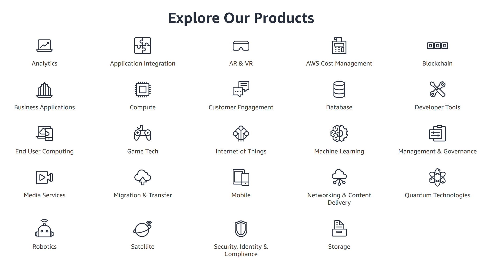

# AWS Storages

 

#### Contents

- Storage
- Data Backup
- Snapshot
- S3 Glacier
- AMI & Market Place

 

#### Useful Information

1. Amazon Elastic Block Store (Amazon EBS) provides highly available, consistent, and low-latency block storage for Amazon EC2
2. EBS is suitable for workloads that need permanent storage access from a single EC2 instance
3. EBS serves permanent local storage service for Amazon EC2, RDBMS & NoSQL, data warehousing, enterprise applications, big data, backup and restore

  

## Storage

- What is Storage?
  - A component that performs the role of storing data on a computer
    - Think of it as a component that performs the same role as a computer's hard disk!

- Storage can be **directly connected to servers**, and separate **storage networks** can be configured to store large amounts of data

  1. **Direct Connection to Server Method**
     - DAS (Direct Attached Storage)

  2. **Method of connecting storage via high-speed network**
     - NAS (Network Attached Storage)
       - Uses `LAN (Local Area Network)` connection, so costs are low
       - Accesses data in **file units**
       - Appears as a file server to the OS
     - SAN (Storage Area Network)
       - Easy to expand
       - Suitable for large-scale enterprise environments, configures **high-speed** **dedicated networks** to provide fast storage services
       - Stores data at the **block level**
       - From the OS perspective, SAN typically appears as a disk with a separately configured storage network

 

 

## AWS Cloud Storage

> A reliable, scalable, and secure place to store data

- A very important component of cloud computing that stores information used by applications
- All big data analysis, data warehouse, Internet of Things (IoT), database, backup, and archive applications require some form of data storage architecture
- Cloud storage typically offers better reliability, scalability, and security than traditional `on-premise` storage systems
- AWS provides a full range of cloud storage services to support both application and archive compliance requirements
- You can start designing your Cloud IT environment foundation by selecting object, file, block storage services and cloud data migration options

 

### Amazon Simple Storage Service (Amazon S3)

: A scalable and reliable platform that enables access to data over the internet for user-created content, active archives, serverless computing, big data storage, data warehouses, backup & restore

- `Object Store`
  - Object storage designed to store and access any type of data over the Internet
  - Secure, provides 99.9999999% durability, and can scale to trillions of objects

 

### Amazon EBS (Elastic Block Store)

> : **Block Level** storage service connected to EC2
>
> Think of it as a **server hard disk** attached to a server!

- Persistent block-level storage volumes for EC2 instances
- **Reliable** and has **low latency**
- Size can be selected from 1GB to 1TB in 1GB increments
- Costs are charged based on **size**/**usage duration**
  - For `magnetic` storage, costs are also charged for the number of **I/O operations**!
- Can be used independently of EC2 instances and can be switched to other EC2 instances
- Data is stored permanently and can be created in the desired Availability Zone (AZ)
- EBS volumes can be **created/restored** from backed-up snapshots
  - Can also be created in other AZs!

 

### Amazon Elastic File System (EFS)

> Re-sizable and cloud native file system for Linux

- Provides a simple, scalable, and elastic file system for Linux-based workloads that can be used with AWS Cloud services and on-premise resources
- This product is built to scale on-demand up to petabytes (2^15) *without disrupting applications*, and automatically grows and shrinks as you add and remove files, so applications can have the storage they need when they need it
- Designed to provide massively parallel shared access to thousands of Amazon EC2 instances, so applications can achieve high levels of aggregate throughput and IOPS (Input/Output Operations Per Second) while maintaining low latencies

 

### AWS Backup

> Centrally manage and automate backups across AWS services

- A fully managed backup service that makes it easy to centralize and automate data backup across AWS services, not only in the cloud but also on-premise using AWS Storage Gateway
- AWS Backup allows you to monitor backup activities and configure backup policies centrally for AWS resources such as Amazon EBS volumes, Amazon RDS databases, Amazon DynamoDB tables, Amazon EFS file systems, and AWS Storage Gateway volumes
- AWS Backup provides a *fully managed* policy-based backup solution to simplify backup management and help meet business and regulatory backup compliance requirements

 

### AWS Storage Gateway

> Hybrid cloud storage supporting seamless integration and optimized data transfer

- A software appliance that seamlessly connects on-premise environments to Amazon cloud storage
- Provides local storage with highly optimized connectivity to AWS cloud storage, useful for migration, bursting, and storage tiering use

 

 

## AWS Backup

> AWS EC2 Service has features like AMI, EBS, Snapshot, etc., making backup easy, and data can be easily preserved even if instances are terminated

 

### AWS EC2 Backup

 

 

- Even if you're not using EC2 instances, leaving them on will continue to incur charges, so unused instances should be stopped and removed
- When you don't know when you'll use them again, or for DB instances with a lot of accumulated data, backup is necessary
- Most EC2 instances have a root volume, and if needed, additional EBS volumes can be attached to instances. AMIs are created through create image, and snapshots are needed for each EBS volume
  - `AMI (Amazon Machine Image)`
    - Contains all information needed to start an instance
    - ex) OS information, AMI access permissions, EBS volume mapping information, etc.
  - `EBS (Elastic Block Store)`
    - Computer's disk drive, i.e., contains data
    - To properly backup and restore one instance, you need 1 AMI and n EBS volumes attached to it
  - `Create Image`
    - In the EC2 console, right-click on the instance you want to snapshot and click 'Image' -> 'Create Image' to snapshot and save the entire instance and its attached EBS volumes at once

 

 

## Snapshot

- Snapshot is a technical term for technology that saves the **state** of a **data storage device** at a specific time as a separate file or image
- By storing data using the snapshot function, you can **restore lost data** and restore data to a specific point in time
  - Think of `Git` snapshots!
- Performed for tasks such as **data analysis**, **data protection**, and **data replication**
  - Even in failure situations like **Disaster Recovery**, data restoration can be the best **data protection measure** in important and urgent situations!
- In situations requiring **data continuity**, it not only **protects** data but also provides high application **availability**, simplifies **backup management** of large-scale data, and **minimizes** operational management **costs**
- Amazon Web Services provides snapshots for `EBS (Elastic Block Storage)` to easily support server data **backup/restore** and instance migration through EBS **copy** functionality to other EC2 regions
  - It also provides various **disaster recovery scenarios** using this!

 

### Amazon EBS Snapshot

> Feature that can create snapshots of EBS Volume Data for backup and storage
>
> -> Think of it as a feature that can backup an entire computer hard disk

- You can backup Amazon EBS Volume data to Amazon S3 by creating snapshots at specified times
- Even during the snapshot process, existing services can be used immediately *without EBS or EC2 service interruption*
- Can be used for EBS Volume size adjustment
- Can be shared with other authorized users using `snapshot sharing functionality`
- Can be copied to other regions
- Snapshots are *incremental backups* so only blocks of devices that have changed since the last snapshot are stored
  - This minimizes the time needed to create snapshots and saves storage costs by not duplicating data
- When you delete a snapshot, only data unique to that snapshot is removed
- Each snapshot contains all the information needed to restore data from the time the snapshot was created to a new EBS Volume
- When creating an EBS Volume based on a snapshot, the new volume exactly matches the original volume used to create that snapshot
- The replicated volume loads data in the background so users can use it immediately
- When accessing data that hasn't been loaded yet, the volume immediately downloads the requested data from Amazon S3 and continues loading the remaining data in the background
- `Multi-volume snapshots`
  - You can use snapshots to create backups of critical workloads such as file systems or databases that span multiple EBS Volumes
  - Multi-volume snapshots allow you to create point-in-time, data-coordinated, and crash-consistent snapshots from multiple EBS volumes connected to an EC2 instance
  - Since snapshots are automatically created from multiple EBS Volumes, there's no need to stop instances or coordinate between volumes to maintain interruption consistency!

 

#### Improving Amazon EBS Performance and Security

1. `Provisioned IOPS (I/O Operations Per Second)`
   - An option available when creating EBS that allows you to specify disk IOPS performance
   - EBS suitable for providing high-performance services!
2. `EBS-Optimized Instance`
   - A feature that optimizes disk performance by configuring the use of dedicated network bandwidth for EBS disk services
3. `EBS Security`
   - Encryption keys can be created directly in AWS KMS or use default keys
   - Encrypted snapshots cannot be used even when shared with other AWS accounts

 

 

## Amazon S3 (Simple Storage Service)

> Object storage built to store and retrieve any amount of data from anywhere

 

### What is Amazon S3?

- An **Internet-based storage service** that can store unlimited amounts and you only pay for what you use
- Creates a unique area called a `Bucket` within a region and stores data as objects in **key-value** format
- Costs are **very low** and simple static websites can be created
- S3 servers are based on **storage technology** and only support **file-level** access, so they cannot replace `EBS (Elastic Block Storage)` services
- You pay monthly costs for the storage space you use, and total costs are calculated based on **data size stored**, **number of access requests**, and **data download (Network Out) capacity**
- Easy file sharing through URLs
- Boasts 99.999999999% durability
- Free tier usage limits:
  - 5GB Amazon S3 standard storage
  - 20,000 `GET` requests and 2,000 `PUT` requests available

 

### Amazon S3 Use Cases

| Use Case | Content |
|----------|---------|
| **Backup & Restore** | - Provides excellent **durability** and **scalability** - Provides data protection through version management and **backup/restore** functionality for enterprise data through **hybrid configuration** |
| **Data Archiving** | Provides various Storage classes to meet compliance, archive requirements for customers in regulated industries (finance and healthcare), or active archive requirements for organizations that need rare but quick access to archive data |
| **Data Lake for Big Data Analysis** | Regardless of what files you store, such as pharmaceutical or financial data, multimedia files like photos and videos, you can use Amazon S3 as a `Data Lake` for **big data analysis** |
| **Hybrid Cloud Storage** | In conjunction with AWS Storage Gateway, you can utilize cloud storage in `On-premise` environments and smoothly perform data backup and disaster recovery |
| **Disaster Recovery** | Utilizes S3's excellent **durability** and **reliability** global infrastructure to provide excellent data protection and **Cross Region Replication (CRR)** services to other regions |

 

 

## Amazon S3 Glacier

> Secure and reliable long-term object storage for data archiving

- Very low-cost cloud for data archiving and long-term backup
- Designed to provide 99.999999999% reliability
- Provides in-place querying capabilities so you can run analytics directly on stored archive data
- Customers can store data at the low cost of $0.004 USD per GB per month, enabling significant cost savings compared to on-premise solutions
- Provides 3 options for accessing archives (taking minutes to hours) to support various retrieval needs while keeping costs low

  

## AMI & Market Place

 

### Amazon Machine Image (AMI)

- Provides information needed to start an instance
- You must specify an AMI when starting an instance
- When you need multiple instances with the same configuration, you can start multiple instances from one AMI
- When you need instances with different configurations, you can start instances using various AMIs
- `AMI Components`
  - Templates for one or more EBS Snapshots or instance root volumes (ex. OS, Application Server, Applications)
  - Launch permissions that control which AWS accounts can use the AMI to start instances
  - **Block Device Mapping** that specifies volumes to attach to instances when started

 

### AWS Marketplace

- A `Digital Catalog` that has gone through a curation process so customers can find, purchase, deploy, and manage third-party software and services needed to develop solutions and run businesses
- Thousands of software products in popular categories such as Security, Network, Storage, ML, Business Intelligence, Database, DevOps, etc.
- Customers can use AWS Marketplace as buyers/sellers or both 
