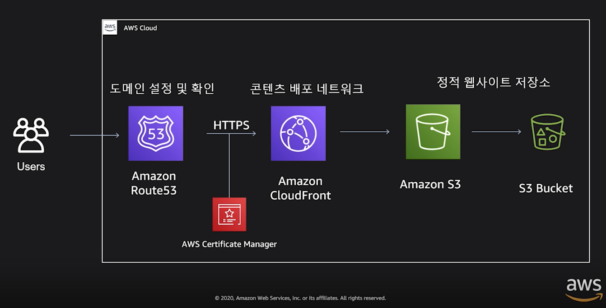

# Building My First Web Application on AWS

> Presenter: Seok-chan Yoon, AWS Principal Tech Evangelist

 

 

### 3 Ways to Easily Deploy Applications Through AWS

1. Static websites and frontend apps
2. Virtual server-based backend apps
3. Fully managed server and DB-based apps

 

 

## 1. Static Websites and Frontend Apps

 

### 1-1. AWS-Based Static Website Deployment Method

 

### 1-2. AWS Amplify Console

> Deploy static websites and frontend apps with just a few clicks

 

#### Static Website Deployment Tool

: Suitable for various static websites or serverless web apps

- **Single Page Apps**
  - Supports single-page web-based mobile apps built with `React`, `Angular`, `Vue`, `Ember`
- **Blogs and Websites**
  - Can deploy blog-based information sites through static website generators like `Gatsby`, `Hugo`, `Jekyll`
- **Full-stack Serverless Apps**
  - Can deploy full-stack serverless apps by adding dynamic functionality using `GraphQL` or `REST API`

 

#### Continuous Integration and Deployment (CI/CD) Capable

: DevOps-based deployment possible without complex CI/CD tools

- **Simplify App Deployment Process**
  - Simplifies deployment process by continuously integrating source changes like `git push` during development
- **Atomic Deployment**
  - Immediate deployment after code updates; even if it fails, immediate rollback ensures no service impact

- **Feature-based Branch Support**
  - Can deploy by connecting new features to branches without affecting production services

  
