# DevOps Culture Best Practices and Implementation Tools

> Presenter: Sun-jun Park, AWS Solutions Architect

 

 

## 1. Amazon's DevOps

 

### Amazon in the Early 2000s

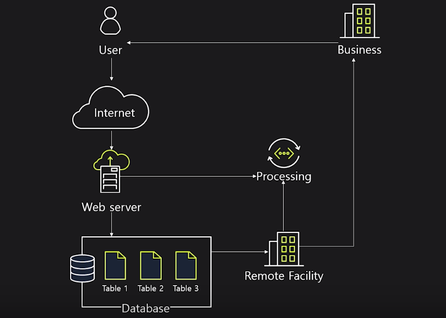

- It was one giant **monolithic application**
  - No problems for small applications or small-scale development environments, but it became problematic for rapidly growing Amazon
    - Problems:
      1. Lack of scalability
      2. Component problems causing entire system failures
      3. Slow deployment speed
      4. Lack of diversity

 

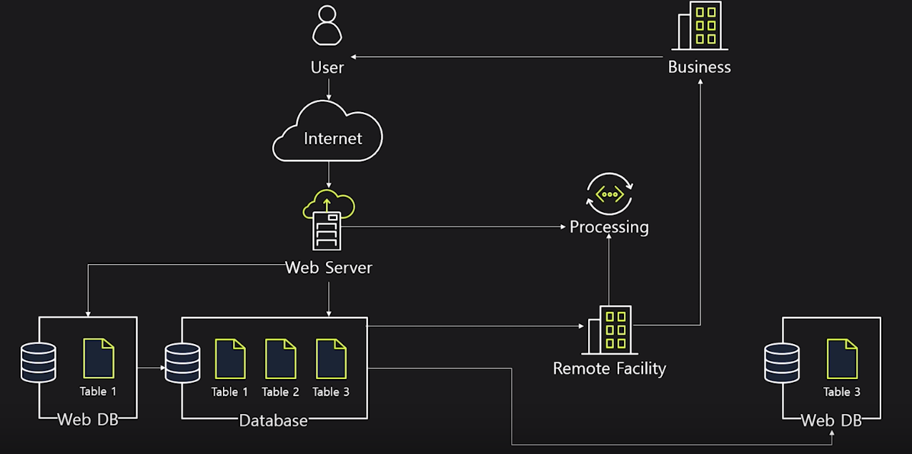

- Started separating data

 

### Service Evolution

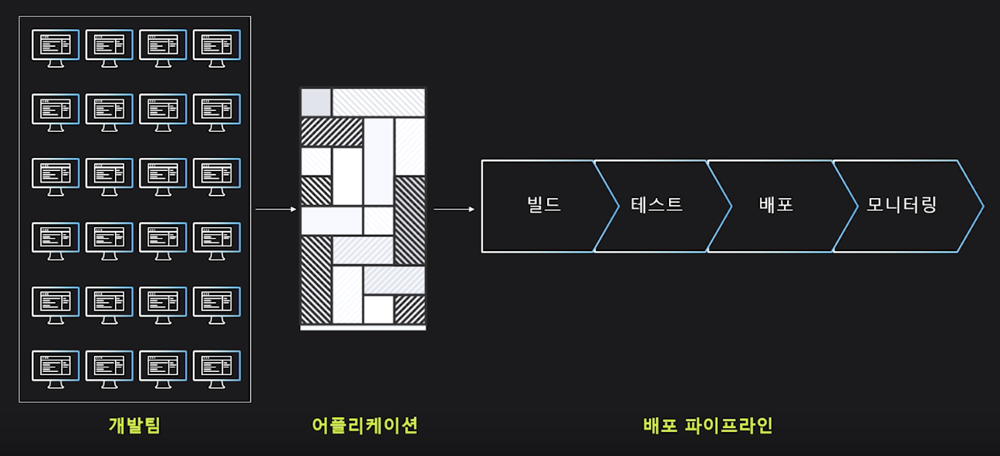

- There were difficulties where the entire process from development to deployment took days to weeks

 

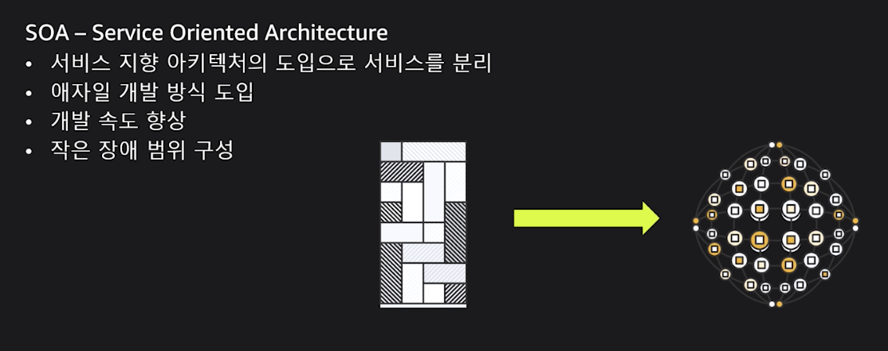

- Introduced **SOA** (Service Oriented Architecture) and began breaking down and decomposing applications by units

 

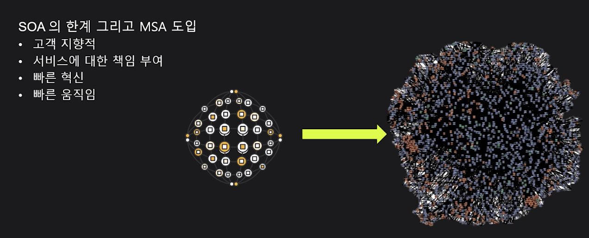

- Introduced **MSA** (Micro Service Architecture) to get closer to customers and quickly apply customer feedback

 

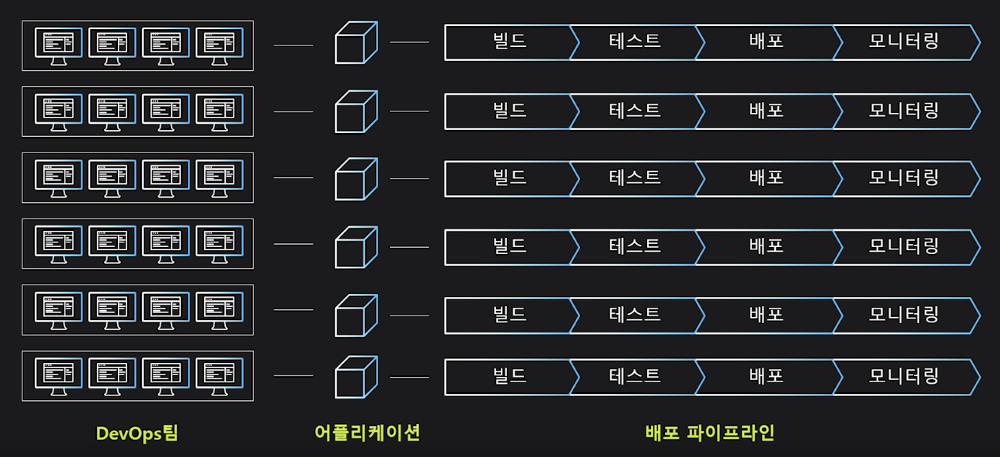

- Provided each service team with their own tools,
  - Provided a **self-service** environment
  - Allowing each team to own & manage their own deployment processes
- Standardized all inter-service communication through **APIs**,
  - Eliminating **dependencies** between backends

- Based on the principle that the team that developed the service knows that service best, when bugs occur, they immediately fix them
  - Gave **operation** and **monitoring** authority
  - To perform service **build** / **test**

 

### 2-Pizza Team

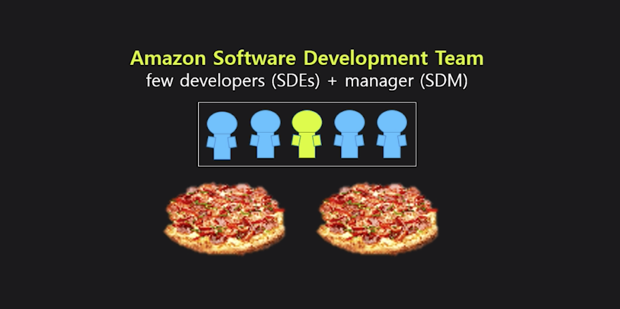

- Teams responsible for each service are organized into units that can have lunch with 2 pizzas for efficient movement and communication
  - Haha.. pizza..

 

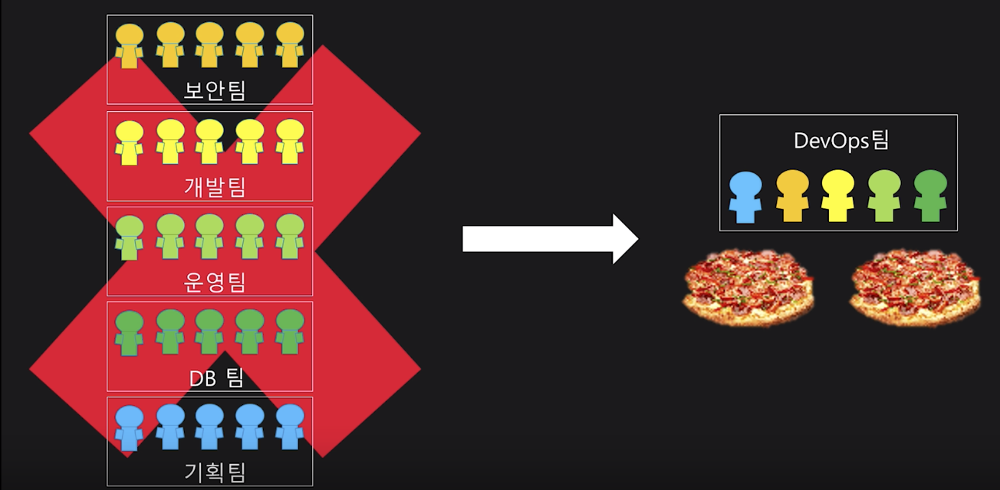

- These teams consist of team members who, for their service:
  - Create or manage databases,
  - Develop code,
  - Operate,
  - Plan,
  - Handle security

 

### 2-Pizza Team Responsibilities and Roles

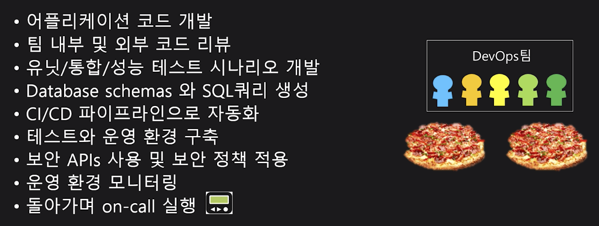

 

 

## DevOps Best Practices

 

### Best Practices

- DevOps Best Practices have various approaches and should be approached differently according to the company's current situation
  - However, there are 4 fundamental principles

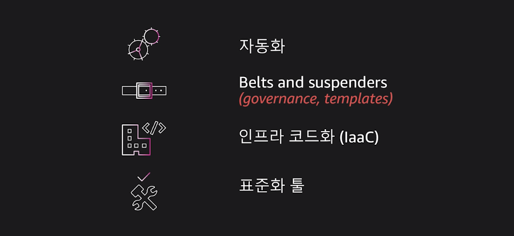

- **Automation**
  - Automate most processes that can be automated,
  - Bring business speed advantages through automation,
  - Increase operation uptime,
  - Reduce errors

- **Belts and suspenders**
  - *Wearing a belt and suspenders to keep pants as safe as possible*
    - Definition of establishing **concrete** configurations as practices and building **governance**
      - ex)
        - Support teams to start **standardized** architecture and development through `Best practice templates`
- **IaaC**
  - When infrastructure and applications are expressed as code, best practices can be shared and configured across the organization
- **Tool standardization**
  - Through standardized tools
    - Developers can easily start when moving between teams or starting new projects,
    - Does not create difficulties when trying new things

 

### Automate everything

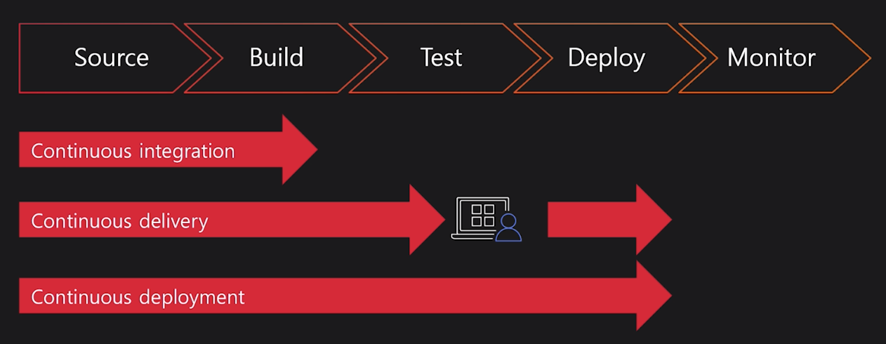

 

### CI (Continuous Integration)

1. Automatically start new builds when new code is checked into the source repository
2. Write and test code in consistent and repeatable environments
3. Prepare artifacts for continuous deployment
4. Proceed with feedback loop and resolution when builds fail

 

### CD (Continuous Delivery / Deployment)

1. Automatically deploy new changes to staging area for testing
2. Safely deploy to production environment without affecting customers or services
3. Provide services to customers more quickly
   - Increase deployment frequency and reduce change lead time and change failure rate

 

### Belts and suspenders

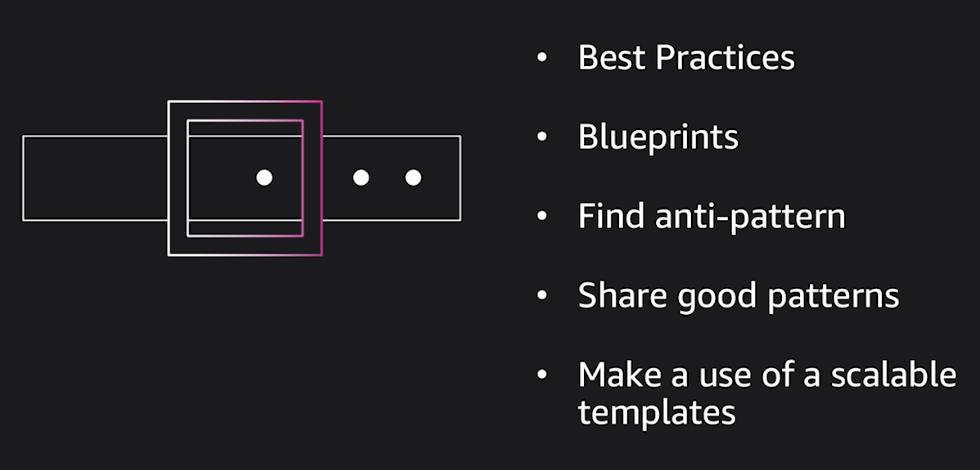

- Discover best practices and template repetitive tasks
  - Prevent good templates or patterns from being owned by one developer and becoming siloed
    - Develop quickly at the team level
    - Iterate repetitive tasks using templates!
- Amazon applies the above method through **peer review**

 

### IaaC

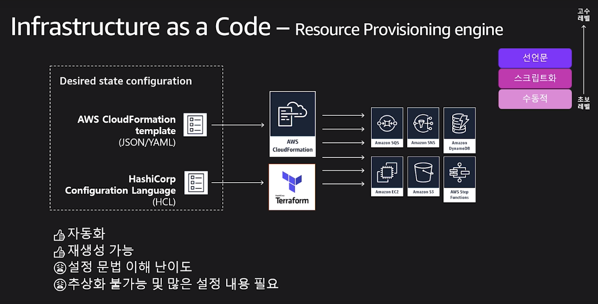

 

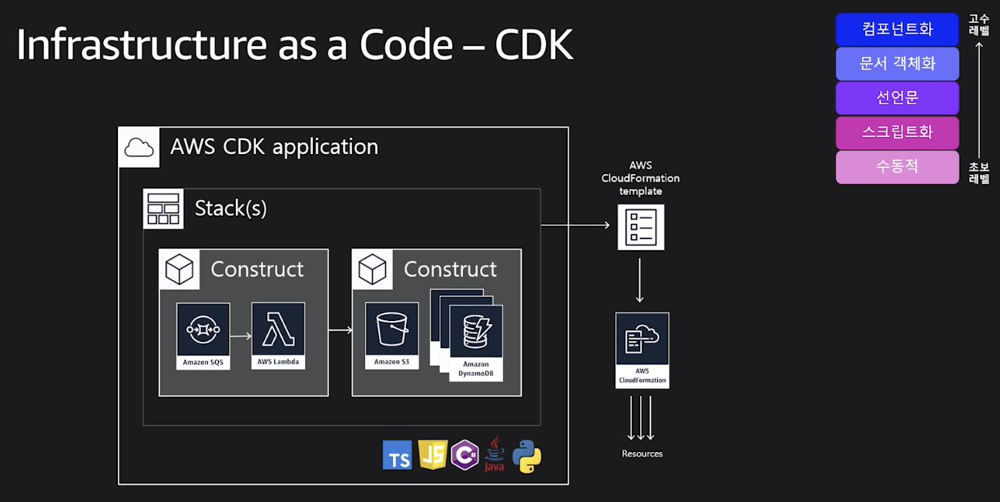

 

### Deploying Infrastructure Environment Using CDK

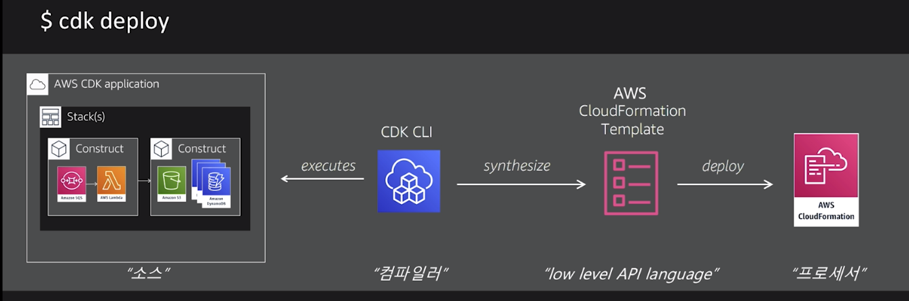

 

 

## DevOps Tools

 

### DevOps Using AWS Services - Stage 1

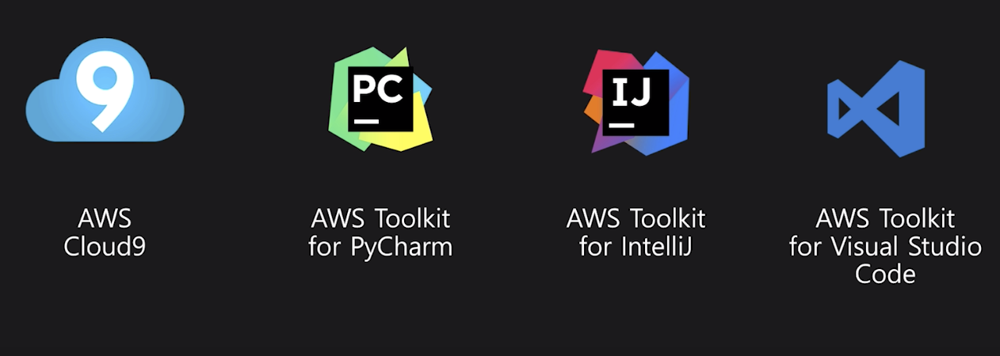

 

### DevOps Using AWS Services - Stage 2

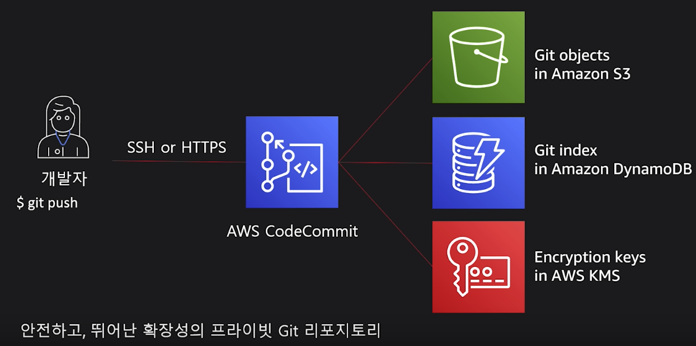

 

### DevOps Using AWS Services - Stage 3

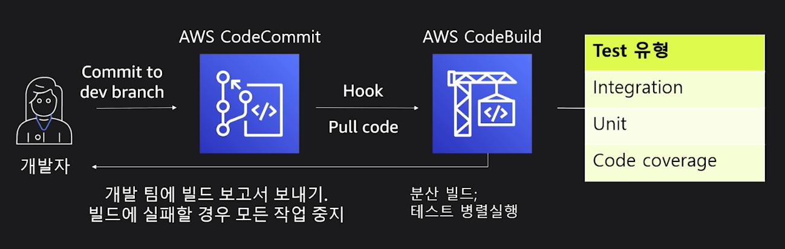

 

### DevOps Using AWS Services - Stage 4

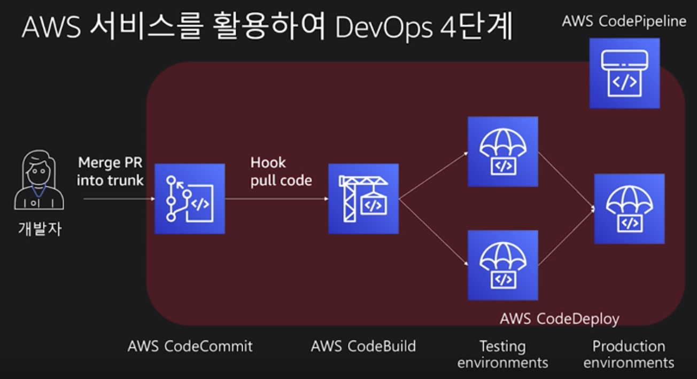

 

### AWS DevOps Tools - CI/CD

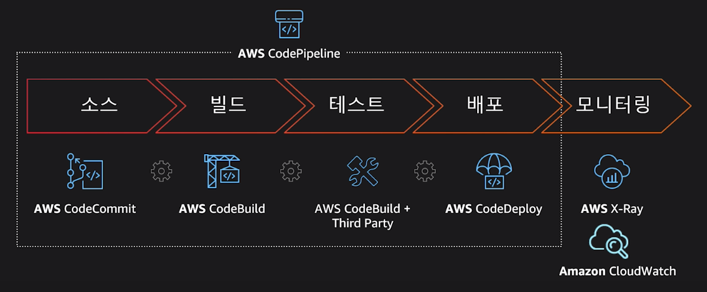

 

 

`+`

#### Brief Review

It was a very informative presentation where I could learn how and why AWS applied DevOps! 
