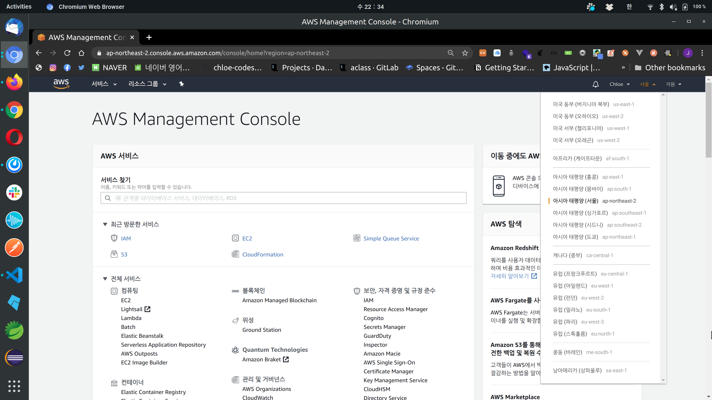
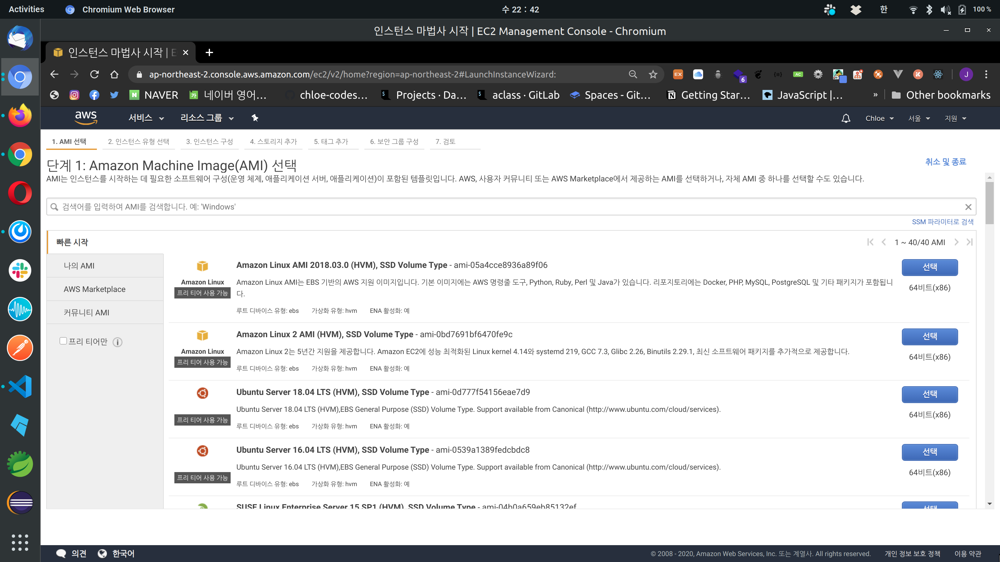
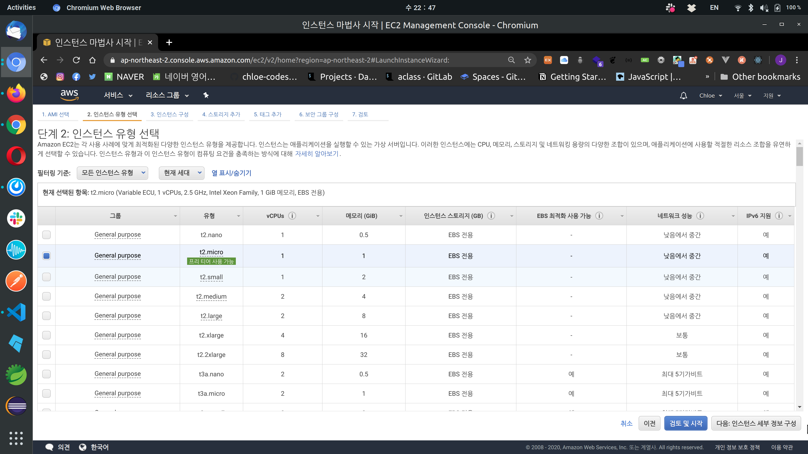
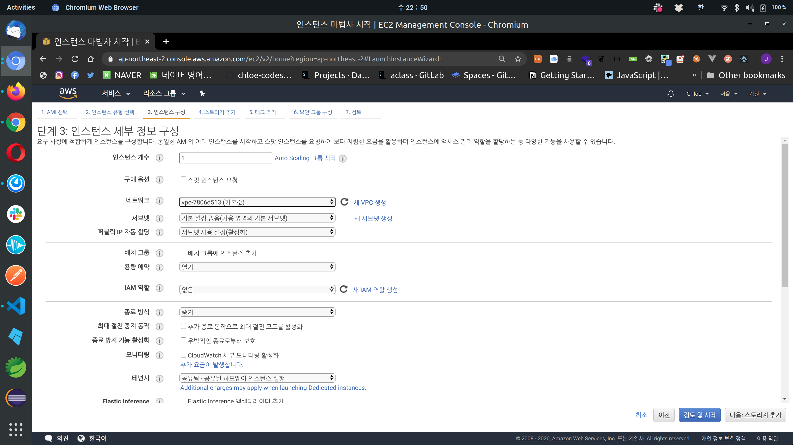
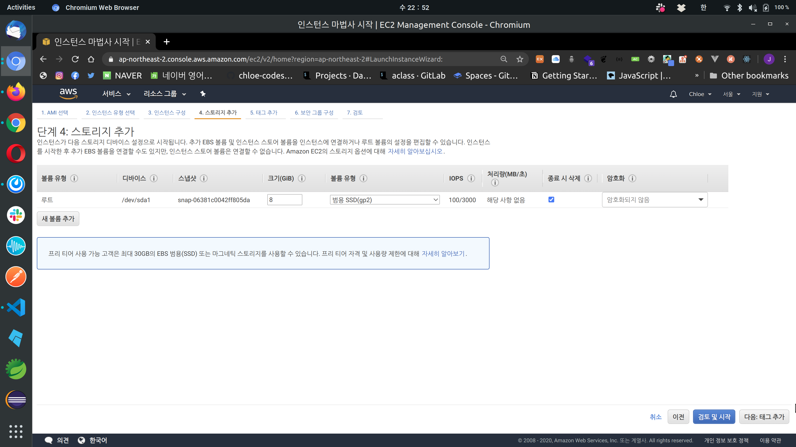
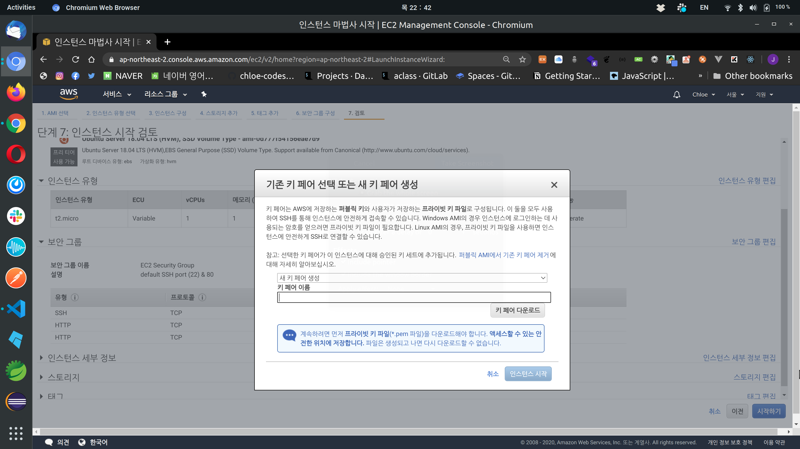
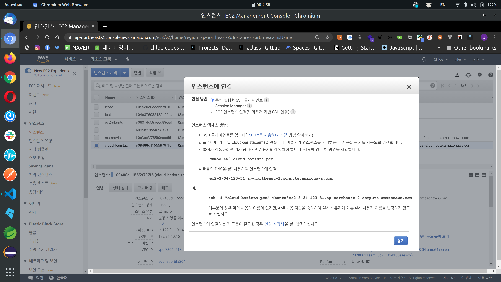
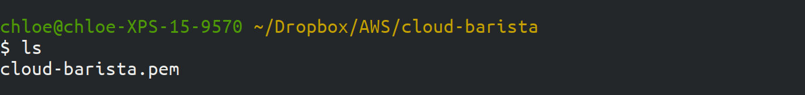
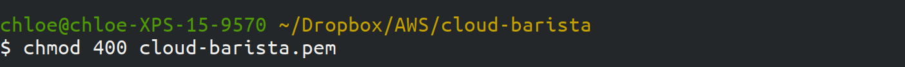
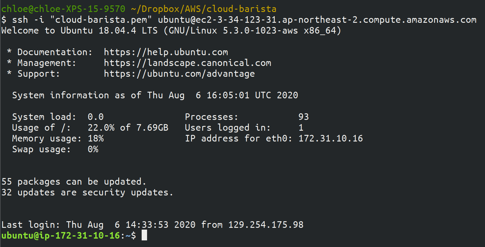

# Amazon EC2 - Creating an AWS EC2 Instance

 

## AWS EC2 Key Concepts

 

### Key Concepts

 

#### Virtual Machine (VM)

- Computer resources implemented as software rather than on dedicated hardware devices

 

#### Instance

- A VM running on the AWS cloud

 

#### Amazon Machine Image (AMI)

- A template containing the software configuration (operating system, application server, and applications) required to launch an instance

 

#### Instance Type

- Various configurations of CPU, memory, storage, and networking capacity for instances

 

#### Amazon Elastic Block Store (EBS)

- Persistent storage volumes for use with Amazon EC2 instances

 

#### Instance Store

- Temporary storage that's physically attached to the host computer for an instance

 

#### Amazon Virtual Private Cloud (VPC)

- A virtual network dedicated to your AWS account

 

#### Region

- A geographical area where AWS infrastructure is located

 

#### Availability Zone

- One or more discrete data centers with redundant power, networking, and connectivity in an AWS Region

 

#### VM Image

- A file containing the state information of a virtual machine

 

#### Security Group

- A service that controls/regulates network access like a firewall

 

#### Secure Shell (SSH)

- An application or protocol for logging into another computer over a network or executing commands on a remote system

 

#### Key Pair

- A pair of keys consisting of a public key and private key based on RSA algorithm, used to access VM instances

 

 

### Amazon EC2 Basics

- With Amazon EC2 (Elastic Compute Cloud) infrastructure, you can run **server instances** that execute **AMI (Amazon Machine Images)**
- The range of available **instance types** is very broad depending on `memory`, `processing power`, and `local disk storage`
- Each instance is protected by a **firewall**, which blocks all internal/external connections
  - When launching an instance, you can configure multiple **security groups** to the instance, and use security groups to control access to the instance!
- When an instance is launched, the EC2 infrastructure provides the instance with an **IP address** and **DNS entry**!
  - However, the IP address and DNS entry are **temporary**!
    - When an instance **shuts down**, the IP address and DNS entry assigned to the instance are **released**
  - In such cases, if you need an IP address that continues to be maintained even after shutdown or can be mapped to one of many machines, you can use an **Elastic IP address**!
    - This address is effectively owned by the AWS account, not by a specific EC2 instance
      - So once allocated, it becomes yours until you release it!

 

 

## Creating an EC2 Instance

 

### 1. Region Configuration

- When running a server in Korea, `Asia Pacific (Seoul)` is the fastest with the shortest latency, so choose **ap-northeast-2**

 

### 2. AMI (Amazon Machine Image) Selection

- There are many diverse Images to choose from as AMI
- If you have a separate server for the app you want to deploy or have a preferred distro, select that Image
  - I love Ubuntu, so I selected `Ubuntu Server 18.04 LTS (HVM)`

 

### 3. Instance Type Selection

- Select the instance type that matches the required performance
- Of course, the higher the performance, the higher the price
- For practice purposes, I selected `t2.micro` which can be used with the **free tier**

 

### 4. Instance Details Configuration

- When creating an EC2 instance, VPC is automatically created
  - [VPC Summary](https://chloe-codes1.gitbook.io/til/aws/aws_tips/amazon_vpc_basics)

 

### 5. Add Storage

- I used the default settings

 

### 6. Add Tags

- #### What is a Tag?

  - It means a `key` and `value` pair that users specify to make AWS resource management convenient
  - Can be removed from resources at any time
  - In **IAM**, you can set users who can control (edit, create, delete) tags

 

### 7. Security Group Configuration

- #### What is a Security Group?
  
  - It allows detailed control of EC2's **inbound** and **outbound** traffic
  
- Enter the security group name and description
  
  - I added a description that this is a security group that allows default SSH port (22) and port 80

 

### 8. Review

 

### 9. Key Pair Creation

- A key pair is necessary to access the instance **remotely**
- Click `Create a new key pair`, write the key pair name, and click `Download Key Pair`
- **Remember that once a key pair is issued, there is no way to get it again, so you must keep it safe!**

 

### 10. Connecting After Instance Creation

- When you click `Connect` in the AWS Console, you'll see the screen above - just follow the instructions!

#### 10-1. Navigate to Where the PEM Key is Stored

#### 10-2. Grant User Read Permission

- The `chmod` command is used to change access permissions (file mode) for files or directories

- `chmod 400` gives only read permission to the User and removes read permission from everyone else

- ##### Meaning of Each Digit

  - First digit means **User**
  - Second digit means **Group**
  - Third digit means **Other**

- ##### Meaning of Numbers

  - **4** means **Read** permission
  - **2** means **Write** permission
  - **1** means **Execute** permission

#### 10-3. Connect via SSH

- #### What is SSH?

  SSH stands for **Secure Shell Protocol**, which is one of the Network Protocols used to communicate **securely** when computers communicate with each other through public networks like the internet

- Use the format `SSH -i [user account] [server address]`

 

 

*EC2 creation and connection complete!*

 

 

 

`+`

## EC2 Configuration Related Tips

 

### 1. Burstable instances

- **Amazon burstable instances** provide `burst` functionality that increases performance as needed for momentary CPU loads
- Supported instance families are **T2**, **T3**, and **T4**
  - T3 and T4 default to Unlimited,
  - T2 defaults to Standard 
