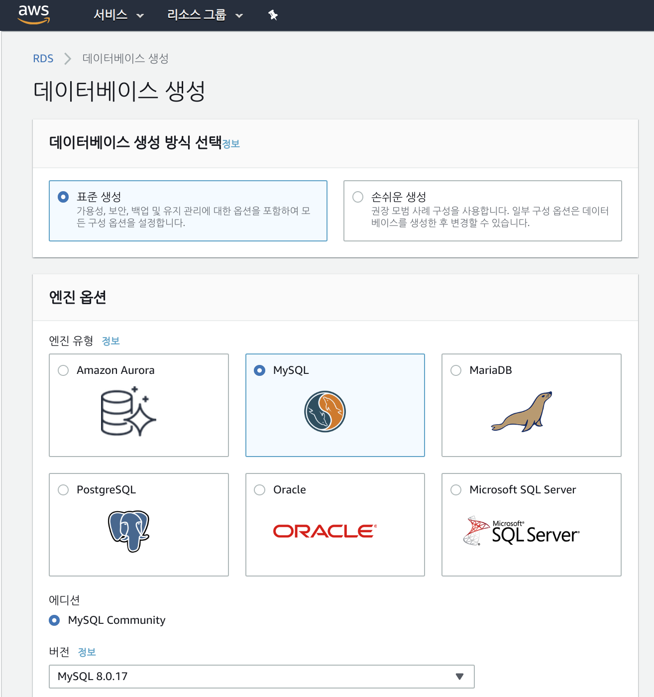
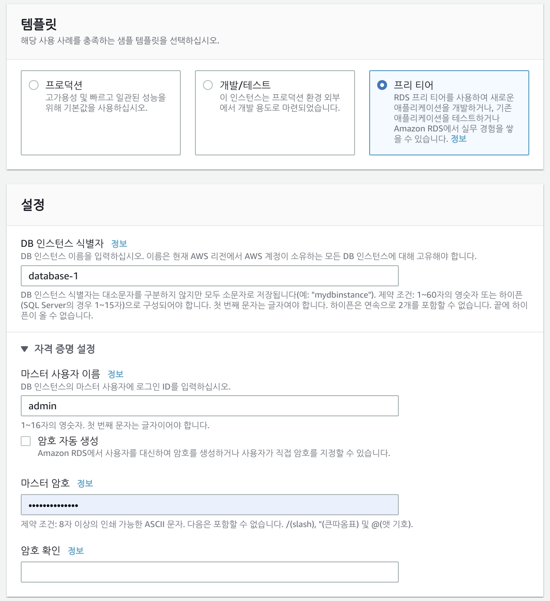
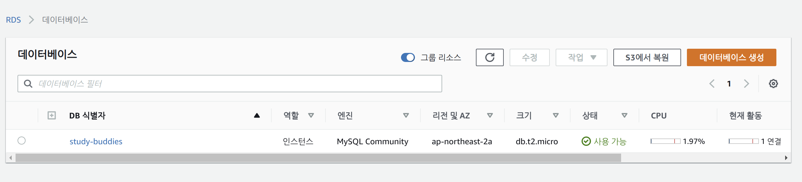

# Amazon RDS for MySQL

> Enjoying the remaining free tier while using RDS

<br>

<br>

## Creating an RDS MySQL Database





<br>

- Important Notes!
  - Remember the `Master username` and `Master password`
    - You can check the entered password briefly during database creation, but it disappears soon, so record it well!

<br>

It takes about 5 minutes to create the database!

<br>

<br>

### Creation Complete



- Click on the DB identifier to see detailed information!
  - Remember the `endpoint` from the detailed information
    - You'll need it to connect from local to RDS - MySQL!

<br>

<br>

## Connecting with MySQL CLI

<br>

```bash
$ mysql -u <MASTERUSER> --host endpoint -P <DBPORT> -p
``` 
