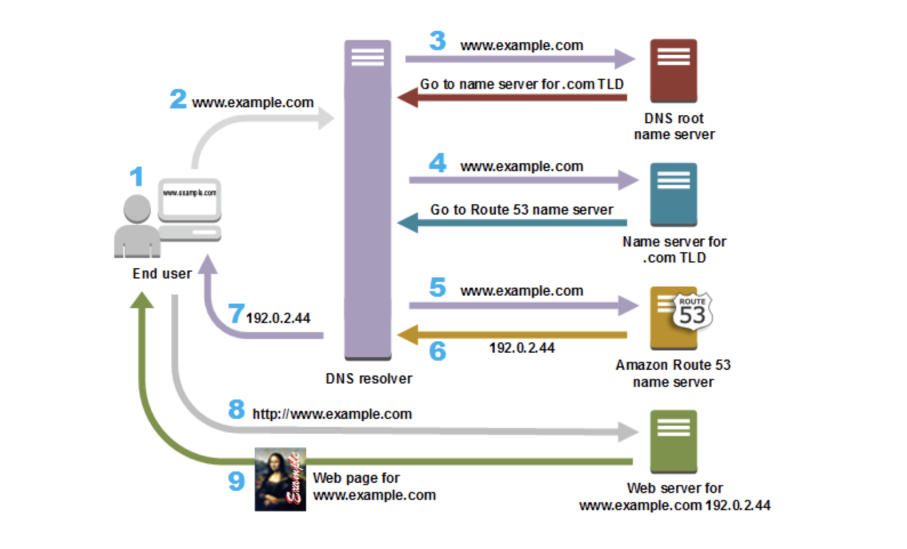

# Amazon Route 53

> Let's learn about Amazon Route 53
>
> Reference: [aws docs](https://docs.aws.amazon.com/Route53/latest/DeveloperGuide/Welcome.html)

 

 

## What is Amazon Route 53?

 

### Amazon Route 53

- A highly **available** and **scalable** DNS (Domain Name System) web service
- Using Route 53, you can perform:
  1. Domain name registration
  2. DNS Routing
  3. Resource health checking in combination
- If you choose all three functions above, each step is performed in the following order

 

#### 1. Register domain names

- A website needs a name like *example.com*
- With Route 53, you can register a **domain name** for your desired website or web application

 

#### 2. Route internet traffic to the resources for your domain

- When a user opens a web browser and enters a **domain name (example.com)** or **subdomain name (chloe.example.com)** in the address bar, Route 53 connects the browser to that website or web application

 

#### 3. Check the health of your resources

- Route 53 sends automated requests over the internet to resources like web servers to verify they are accessible, usable, and **functioning normally**
- When resources become unavailable:
  - You can receive notifications
  - Route traffic to healthy resources instead of unhealthy ones

 

 

## How Amazon Route 53 routes traffic for your domain

 

After configuring **Amazon Route 53** to route traffic to resources like web servers or `Amazon S3` buckets, when someone requests content from <www.example.com>, the following logic executes within milliseconds:

1. A user opens a web browser, enters <www.example.com> in the address bar, and presses Enter.

2. The request for <www.example.com> is routed to a DNS resolver, typically managed by an Internet Service Provider (ISP) such as a cable internet provider, DSL broadband provider, or corporate network.

3. The ISP's DNS resolver forwards the request for <www.example.com> to a DNS root name server.

4. The DNS resolver forwards the request for <www.example.com> to one of the TLD name servers for .com domains. The name server for .com domains responds to the request with the names of the four Route 53 name servers associated with the example.com domain.

   The DNS resolver caches the four Route 53 name servers. The next time someone browses to example.com, the resolver skips steps 3 and 4 because it already has the name servers for example.com. Name servers are typically cached for two days.

5. The DNS resolver chooses a Route 53 name server and forwards the request for <www.example.com> to that name server.

6. The Route 53 name server looks in the example.com hosted zone for the <www.example.com> record, gets the associated value, such as the IP address for a web server 192.0.2.44, and returns the IP address to the DNS resolver.

7. The DNS resolver finally has the IP address that the user needs. The resolver returns that value to the web browser.

8. The web browser sends a request for <www.example.com> to the IP address that it got from the DNS resolver. This is where your content is, for example, a web server running on an Amazon EC2 instance or an Amazon S3 bucket configured as a website endpoint.

9. The web server or other resource at 192.0.2.44 returns the web page for <www.example.com> to the web browser, and the web browser displays the page.

 

 

## Supported DNS Record Types

<https://docs.aws.amazon.com/ko_kr/Route53/latest/DeveloperGuide/ResourceRecordTypes.html> 
