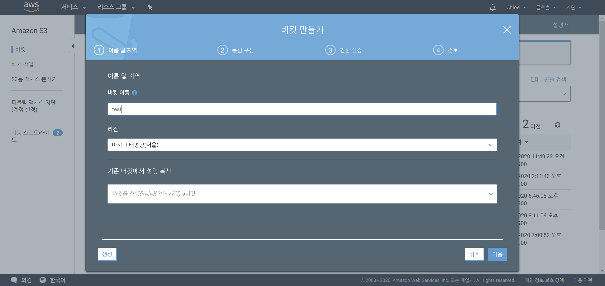
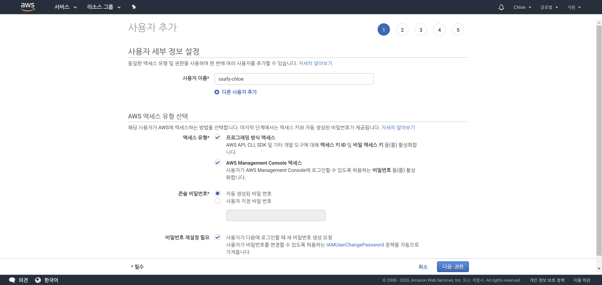
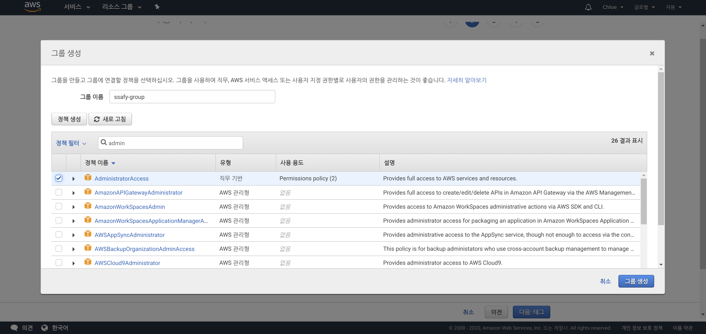
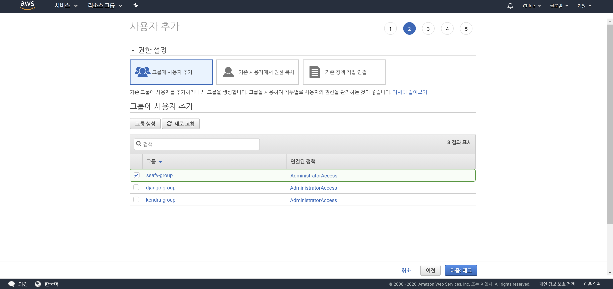
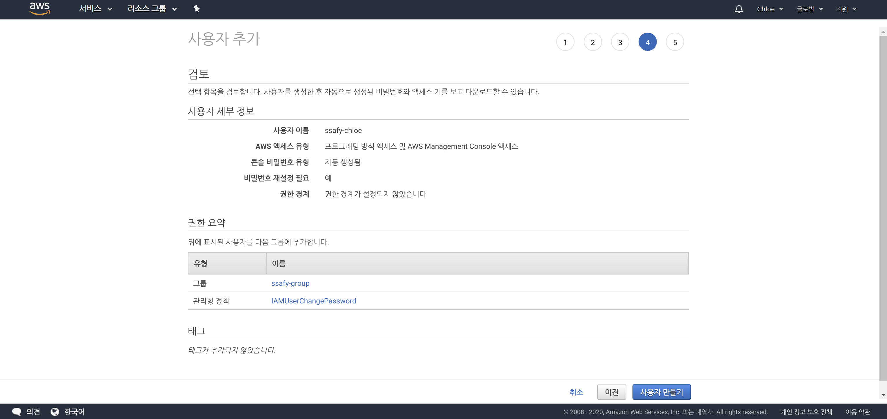
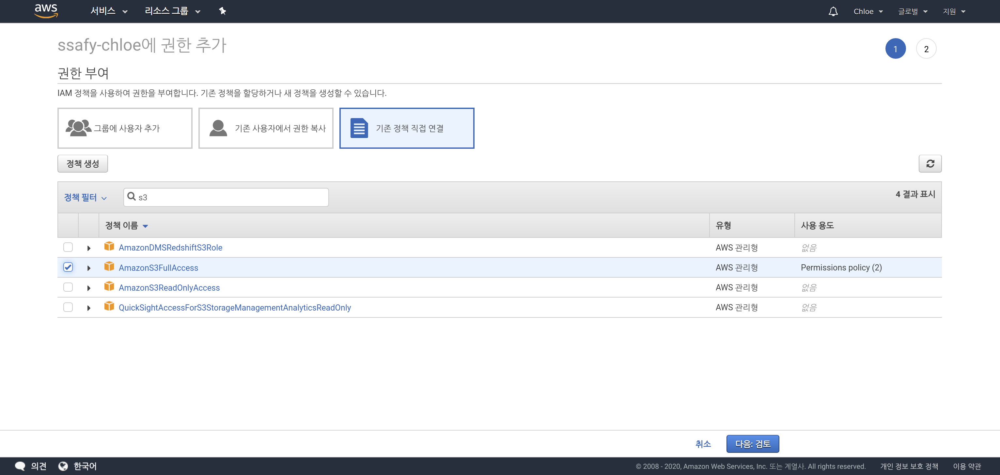
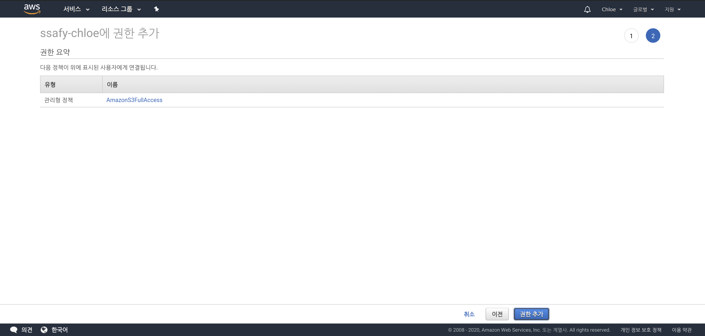

# Amazon S3 - Creating a Bucket

> Back to basics!
>
> Summary of how to create an S3 bucket

 

 

## 1. Creating a Bucket

- Click **Create bucket** in `S3` on the `AWS Management Console`

 

### 1-1. Create Bucket

- Set only the bucket name and create everything else with default settings

 

### 1-2. Disable Block Public Access

 

 

## 2. Getting Keys

- Click **Add user** in `IAM` on the `AWS Management Console`

 

### 2-1. Add User

- Specify a username, select the checkbox above, then proceed to the next step

 

### 2-2. Create Group

- If you don't have an existing group, create a new group
- Select `Administrator Access` as the policy, then click Create group

 

### 2-3. Add User to Group

- Add the user to the group created above

 

### 2-4. Review and Download Credentials (.csv)

- After reviewing your final settings, click **Create user**
- Once the user is created, download the `.csv` file containing **credentials**
  - This credentials file contains the **Access Key ID** and **Secret Access Key**
    - Download it and store it in a safe place!!!!!

 

### 2-5. Add User Permissions

- Click **Add permissions** to add `S3` bucket permissions to the user created above

 

- Click **Attach existing policies directly**
- Search for `S3` in the search bar
- Select the `AmazonS3FullAccess` policy from the search results
- Click **Next**

 

### 2-6. Review Permission Addition

- After reviewing the added permissions, click **Add permissions**

 

*Done! So simple!* 
