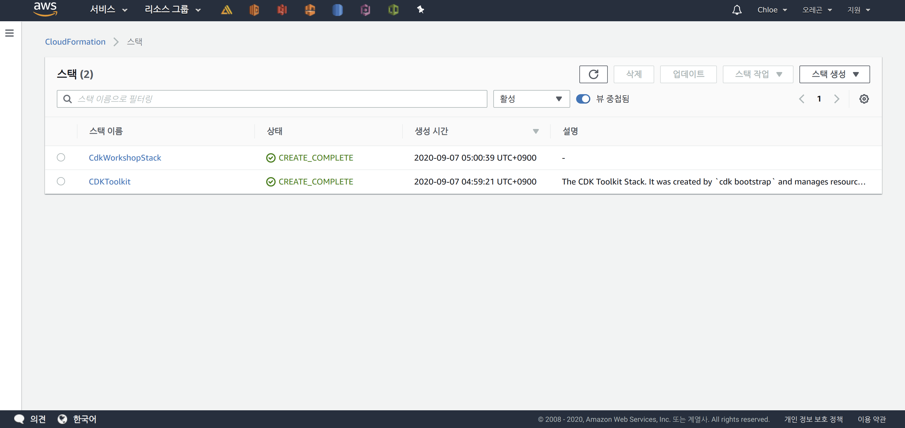

# AWS CDK Workshop

<br>

## 1. New Project

<br>

### Installing TypeScript

```bash
$ npm install -g typescript
```

<br>

### Making a New Directory

```bash
$ mkdir cdk-workshop && cd cdk-workshop
```

<br>

### CDK Init

```bash
chloe@chloe-XPS-15-9570 ~/Workspace/aws-test/cdk-workshop
$ cdk init sample-app --language typescript
Applying project template sample-app for typescript
Initializing a new git repository...
Executing npm install...
npm WARN deprecated request@2.88.2: request has been deprecated, see https://github.com/request/request/issues/3142
npm WARN deprecated har-validator@5.1.5: this library is no longer supported

> core-js@2.6.11 postinstall /home/chloe/Workspace/aws-test/cdk-workshop/node_modules/core-js
> node -e "try{require('./postinstall')}catch(e){}"

npm notice created a lockfile as package-lock.json. You should commit this file.
npm WARN cdk-workshop@0.1.0 No repository field.
npm WARN cdk-workshop@0.1.0 No license field.

added 254 packages from 184 contributors and audited 900 packages in 17.017s

29 packages are looking for funding
  run `npm fund` for details

found 1 low severity vulnerability
  run `npm audit fix` to fix them, or `npm audit` for details

 ✅ Your CDK TypeScript project is ready!

   cat README.md for next steps
```

<br>

### Project Structure

```bash
chloe@chloe-XPS-15-9570 ~/Workspace/aws-test/cdk-workshop
$ tree -I node_modules
.
├── README.md
│   └── bin
│       └── cdk-workshop.ts
├── cdk.json
├── jest.config.js
├── lib
│   └── cdk-workshop-stack.ts
├── package-lock.json
├── package.json
├── test
│   └── cdk-workshop.test.ts
└── tsconfig.json

3 directories, 9 files
```

- `bin/cdk-workshop.ts` is the **entry point** of the CDK application.
  - It loads the stack defined in `lib/cdk-workshop-stack.ts`

- `lib/cdk-workshop-stack.ts` is where the main **stack** for the CDK application is defined.

- `cdk.json` tells the toolkit how to execute the app
  - In this case, it tells to run "npx ts-node bin/cdk-workshop.ts"

- `package.json` defines the npm module.
  - Includes npm scripts and dependencies.

- `tsconfig.json` is the **TypeScript compiler** configuration file.

<br>

## 2. CDK Application

<br>

### Setting up

- `cdk-workshop.ts` is the **entry point** of the CDK app

```bash
chloe@chloe-XPS-15-9570 ~/Workspace/aws-test/cdk-workshop
$ cat bin/cdk-workshop.ts
#!/usr/bin/env node
import * as cdk from '@aws-cdk/core';
import { CdkWorkshopStack } from '../lib/cdk-workshop-stack';

const app = new cdk.App();
new CdkWorkshopStack(app, 'CdkWorkshopStack');
```

- This code loads and instantiates the `CdkWorkshopStack` class from the `lib/cdk-workshop-stack.ts` file

- Let's take a look at `lib/cdk-workshop-stack.ts`:

```bash
chloe@chloe-XPS-15-9570 ~/Workspace/aws-test/cdk-workshop
$ cat lib/cdk-workshop-stack.ts
import * as sns from '@aws-cdk/aws-sns';
import * as subs from '@aws-cdk/aws-sns-subscriptions';
import * as sqs from '@aws-cdk/aws-sns-subscriptions';
import * as cdk from '@aws-cdk/core';

export class CdkWorkshopStack extends cdk.Stack {
  constructor(scope: cdk.App, id: string, props?: cdk.StackProps) {
    super(scope, id, props);

    const queue = new sqs.Queue(this, 'CdkWorkshopQueue', {
      visibilityTimeout: cdk.Duration.seconds(300)
    });

    const topic = new sns.Topic(this, 'CdkWorkshopTopic');

    topic.addSubscription(new subs.SqsSubscription(queue));
  }
}
```

<br>

### Analysis

- Stack defines:

1. **SQS Queue** (`new sqs.Queue`)
2. **SNS Topic** (`new sns.Topic`)
3. **Subscription** between the queue and topic, so all messages sent to the topic will be delivered to the queue

<br>

## 3. CDK Concepts

<br>

- The **CDK application** is a collection of **stacks**

- This CDK app contains a single stack (CdkWorkshopStack)

- A **stack** is a unit of deployment:
  - All resources in a single stack are deployed together

- A **stack** contains **constructs**
  - Each construct defines one or more AWS resources

- **Constructs** (from AWS CDK):
  - CDK offers a collection of constructs called **AWS Construct Library**
  - The constructs represent **all AWS services**
  
  - Three different **levels** of constructs:

<br>

### 1. CFN Resources (Level 1)

- These constructs directly represent all resources available in AWS CloudFormation
  - CFN resources have names starting with `Cfn`
  - For example, in the EC2 library, CfnInstance represents the AWS::EC2::Instance CFN resource
- You must explicitly configure all resource properties, which requires a complete understanding of the details of the underlying CloudFormation resource

<br>

### 2. AWS Constructs (Level 2)

- **Level 2 constructs** are also called **AWS constructs**
- Level 2 constructs provide the same AWS resources as Level 1, but with **richer API** and **sensible defaults**
  - If a well-designed class can be built for a CloudFormation resource, it will be included in the AWS Construct Library
- AWS constructs offer convenient defaults and boilerplate, making it easy to work without being an expert on the specific AWS service

<br>

### 3. Patterns (Level 3)

- **Patterns** declare multiple resources in order to create **architectural patterns**
- Helps you get up and running on AWS easily because patterns encode AWS best practices and offer a **simple intention-based API**

<br>

**Example of Three Levels:**

- For **Amazon S3**:

1. `s3.CfnBucket` represents the `AWS::S3::Bucket` CFN resource

2. `s3.Bucket` represents a Level 2 construct for an S3 bucket

3. `s3-deployment.BucketDeployment` represents a Level 3 construct
   - It populates S3 buckets with the contents of .zip files from other S3 buckets or local disk

<br>

## 4. CDK Synthesize

<br>

- CDK applications are effectively **high-level code**
  - When deployed, it needs to be **synthesized** to CloudFormation templates

- **Synthesizing** means converting source code to **CloudFormation template**

- The `cdk synth` command is used to synthesize CDK apps

```bash
chloe@chloe-XPS-15-9570 ~/Workspace/aws-test/cdk-workshop
$ cdk synth
Resources:
  CdkWorkshopQueue50D9D426:
    Type: AWS::SQS::Queue
    Properties:
      VisibilityTimeoutInSeconds: 300
    Metadata:
      aws:cdk:path: CdkWorkshopStack/CdkWorkshopQueue/Resource
  CdkWorkshopTopic58CFDD3D:
    Type: AWS::SNS::Topic
    Metadata:
      aws:cdk:path: CdkWorkshopStack/CdkWorkshopTopic/Resource
  CdkWorkshopTopicCdkWorkshopQueueSubscription88D211C7:
    Type: AWS::SNS::Subscription
    Properties:
      Protocol: sqs
      TopicArn:
        Ref: CdkWorkshopTopic58CFDD3D
      Endpoint:
        Fn::GetAtt:
          - CdkWorkshopQueue50D9D426
          - Arn
    Metadata:
      aws:cdk:path: CdkWorkshopStack/CdkWorkshopTopic/CdkWorkshopQueueSubscription/Resource
  CdkWorkshopQueuePolicyAF2494A5:
    Type: AWS::SQS::QueuePolicy
    Properties:
      PolicyDocument:
        Statement:
          - Action: sqs:SendMessage
            Condition:
              ArnEquals:
                aws:SourceArn:
                  Ref: CdkWorkshopTopic58CFDD3D
            Effect: Allow
            Principal:
              Service: sns.amazonaws.com
            Resource:
              Fn::GetAtt:
                - CdkWorkshopQueue50D9D426
                - Arn
        Version: "2012-10-17"
      Queues:
        - Ref: CdkWorkshopQueue50D9D426
    Metadata:
      aws:cdk:path: CdkWorkshopStack/CdkWorkshopQueue/Policy/Resource
  CDKMetadata:
    Type: AWS::CDK::Metadata
    Properties:
      Modules: aws-cdk=1.61.1,@aws-cdk/aws-cloudwatch=1.61.1,@aws-cdk/aws-iam=1.61.1,@aws-cdk/aws-kms=1.61.1,@aws-cdk/aws-sns=1.61.1,@aws-cdk/aws-sns-subscriptions=1.61.1,@aws-cdk/aws-sqs=1.61.1,@aws-cdk/cloud-assembly-schema=1.61.1,@aws-cdk/core=1.61.1,@aws-cdk/cx-api=1.61.1,@aws-cdk/region-info=1.61.1,jsii-runtime=node.js/v12.17.0
    Condition: CDKMetadataAvailable
Conditions:
  CDKMetadataAvailable:
    Fn::Or:
      - Fn::Or:
          - Fn::Equals:
              - Ref: AWS::Region
              - ap-east-1
          - Fn::Equals:
              - Ref: AWS::Region
              - ap-northeast-1
          - Fn::Equals:
              - Ref: AWS::Region
              - ap-northeast-2
          - Fn::Equals:
              - Ref: AWS::Region
              - ap-south-1
          - Fn::Equals:
              - Ref: AWS::Region
              - ap-southeast-1
          - Fn::Equals:
              - Ref: AWS::Region
              - ap-southeast-2
          - Fn::Equals:
              - Ref: AWS::Region
              - ca-central-1
          - Fn::Equals:
              - Ref: AWS::Region
              - cn-north-1
          - Fn::Equals:
              - Ref: AWS::Region
              - cn-northwest-1
          - Fn::Equals:
              - Ref: AWS::Region
              - eu-central-1
      - Fn::Or:
          - Fn::Equals:
              - Ref: AWS::Region
              - eu-north-1
          - Fn::Equals:
              - Ref: AWS::Region
              - eu-west-1
          - Fn::Equals:
              - Ref: AWS::Region
              - eu-west-2
          - Fn::Equals:
              - Ref: AWS::Region
              - eu-west-3
          - Fn::Equals:
              - Ref: AWS::Region
              - me-south-1
          - Fn::Equals:
              - Ref: AWS::Region
              - sa-east-1
          - Fn::Equals:
              - Ref: AWS::Region
              - us-east-1
          - Fn::Equals:
              - Ref: AWS::Region
              - us-east-2
          - Fn::Equals:
              - Ref: AWS::Region
              - us-west-1
          - Fn::Equals:
              - Ref: AWS::Region
              - us-west-2
```

- Running the `cdk synth` command in the directory where `cdk.json` file exists outputs the **CloudFormation template** as shown above

- This template creates the following 4 resources:

1. #### AWS::SQS::Queue

     - SQS queue

2. #### AWS::SNS::Topic

     - SNS topic

3. #### AWS::SNS::Subscription

     - Subscription definition between the queue and topic

4. #### AWS::SQS::QueuePolicy

     - **IAM** policy that allows the topic to send `messages` to the queue

- **AWS::CDK::Metadata** is a resource automatically created in every stack by the `CDK toolkit`
  
  - It is used by the CDK team to identify and analyze security issues!

<br>

<br>

## 5. CDK Deploy

<br>

### Environment Bootstrap

- To deploy an AWS CDK app to an environment (account/region), you must first install a `bootstrap stack`
  - The **bootstrap stack** contains resources required for the toolkit's operation
    - e.g., **S3 bucket** to store `CFN` templates and assets created during the deployment process
- You can install the bootstrap stack for an environment using the `cdk bootstrap` command

```bash
chloe@chloe-XPS-15-9570 ~/Workspace/aws-test/cdk-workshop
$ cdk bootstrap
 ⏳  Bootstrapping environment aws://213888382832/us-west-2...
CDKToolkit: creating CloudFormation changeset...
[██████████████████████████████████████████████████████████] (3/3)


 ✅  Environment aws://213888382832/us-west-2 bootstrapped.
**************************************************
*** Newer version of CDK is available [1.62.0] ***
*** Upgrade recommended                        ***
**************************************************
```

- If you get an **Access Denied** error here, it means:
  1. AWS CLI is not properly configured, or
  2. The **AWS profile** being used doesn't have permission to perform the `cloudformation:CreateChangeSet` operation
- Once the above command runs successfully, you can deploy CDK apps!

<br>

### Deploying

- Use the `cdk deploy` command to deploy the CDK app

```bash
chloe@chloe-XPS-15-9570 ~/Workspace/aws-test/cdk-workshop
$ cdk deploy
This deployment will make potentially sensitive changes according to your current security approval level (--require-approval broadening).
Please confirm you intend to make the following modifications:

IAM Statement Changes
┌───┬─────────────────────────┬────────┬─────────────────┬─────────────────────────┬─────────────────────────┐
│   │ Resource                │ Effect │ Action          │ Principal               │ Condition               │
├───┼─────────────────────────┼────────┼─────────────────┼─────────────────────────┼─────────────────────────┤
│ + │ ${CdkWorkshopQueue.Arn} │ Allow  │ sqs:SendMessage │ Service:sns.amazonaws.c │ "ArnEquals": {          │
│   │                         │        │                 │ om                      │   "aws:SourceArn": "${C │
│   │                         │        │                 │                         │ dkWorkshopTopic}"       │
│   │                         │        │                 │                         │ }                       │
└───┴─────────────────────────┴────────┴─────────────────┴─────────────────────────┴─────────────────────────┘
(NOTE: There may be security-related changes not in this list. See https://github.com/aws/aws-cdk/issues/1299)

Do you wish to deploy these changes (y/n)?
```

- The above warning is displayed when the app being deployed includes items that require **security review**
  - Since the Topic needs to send messages to the Queue, enter **y** to deploy the stack and create the resources!

```bash
CdkWorkshopStack: deploying...
CdkWorkshopStack: creating CloudFormation changeset...
[██████████████████████████████████████████████████████████] (6/6)


 ✅  CdkWorkshopStack

Stack ARN:
arn:aws:cloudformation:us-west-2:213888382832:stack/CdkWorkshopStack/fa564140-f078-11ea-b665-0a050e07f862
```

- Execution result explanation:
  - `us-west-2` is the **region** where the app was created,
  - `213888382832` is the **account ID**, and
  - `fa564140-f078-11ea-b665-0a050e07f862` is the **stack ID**

<br>

### CloudFormation Console

- CDK apps are deployed through AWS `CloudFormation`
- CDK stacks have a 1:1 mapping with `CloudFormation` stacks
  - This means you can use CloudFormation to manage the stack!

> CloudFormation console



- Select `CdkWorkshopStack` and click the **Resources** tab to check the physical IDs of the created resources

> Checking physical IDs

 
