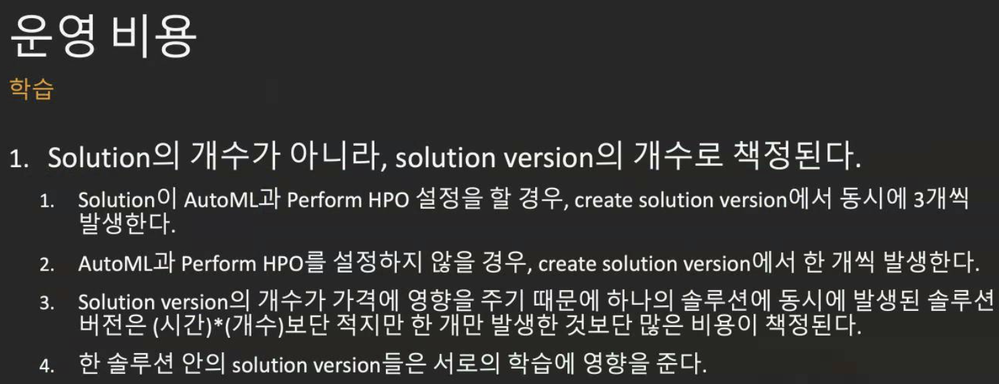

# AWS Data Science Meetup - 3/5

 

> Conducted as an online meetup due to Coronavirus

 

 

## Developing Personalization/Recommendation Services with Amazon Personalize

> Speaker: Hyunwoo Bae
>
> "*Sharing experiences from researching Amazon Personalize.*"

 

#### Table of Contents

- Things the official documentation doesn't explain
- Things non-data experts might be curious about
- Errors that occur when using Personalize
- Answers received from direct inquiries to AWS

 

 

### What is Amazon Personalize?

> A machine learning service that enables developers to easily create individualized recommendations for customers using their applications

- Uses proven machine learning technology that Amazon.com has used for years, so developers without machine learning experience can easily build complex `customization features` into applications
- Using Amazon Personalize, you can provide activity streams from applications such as clicks, page views, sign-ups, purchases, as well as inventory of items you want to recommend such as articles, products, videos, or music
- You can provide additional **demographic information** about users such as age and **geographic location**
- Amazon Personalize **processes** and **reviews** data, **identifies** meaningful patterns, **selects** the right algorithms, and **trains** and **optimizes** `customization models` tailored to your data
- All analyzed data is kept private and secure and used only for custom recommendations
- You can start `custom recommendations` through simple API calls
- **Pay only for what you use** with no minimum fees or upfront commitments

 

*Amazon Personalize is like having Amazon.com's machine learning personalization team available at all times!*

 

 

### Newly Released

 

> ### Amazon Personalize Can Now Use 10x More Item Attributes to Improve Recommendation Relevance

 

#### Overview

[Amazon Personalize](http://docs.aws.amazon.com/personalize) is a `machine learning service` that enables users without machine learning experience to personalize websites, apps, ads, emails, etc. using `custom machine learning models` that can be created in Amazon Personalize. AWS is pleased to announce that Amazon Personalize now **supports 10x more item attributes**. Previously, you could use **up to 5** item attributes while building ML models in Amazon Personalize. This limit has now been increased to **50**. You can now use more information about items (e.g., category, brand, price, duration, size, author, release year, etc.) to improve recommendation relevance.

 

#### How?

To add item data to Personalize, you first define a schema to tell Personalize the column names in your item dataset and whether you want to send categorical or numerical values. Then, using this schema, you can create a dataset and import items as CSV files through S3. After importing 'user' and 'interaction' datasets following the same steps, you can train custom private personalization models with just a few clicks.

 

#### Availability

The increased limit for item metadata is now available in US East (N. Virginia, Ohio), US West (Oregon), Canada (Central), EU (Ireland), and Asia Pacific (Sydney, Tokyo, Mumbai, Singapore, **Seoul**) AWS regions. For more information, see the Amazon Personalize [getting started](https://docs.aws.amazon.com/personalize/latest/dg/getting-started.html) guide.

 

 

### Details

 

 

 

 

 

Batch inference

- Definitely a more cost-effective method
- Use in combination with Real-Time depending on service characteristics and recipes you want to utilize 
