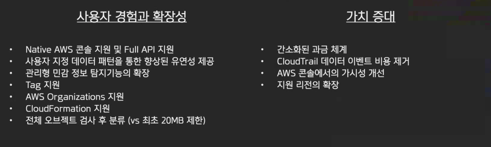

# AWS Security Meetup - 7/22/2020

 

## 1. AWS New WAF – Introduction to Key Features of the New AWS WAF

> Presenter: Joy Jung (AWS Solutions Architect)

 

### What is AWS WAF (Web Application Firewall)?

- AWS WAF is a web application firewall that helps protect your web applications or APIs against common web exploits that may affect availability, compromise security, or consume excessive resources.
- AWS WAF gives you control over how traffic reaches your applications by enabling you to create security rules that block common attack patterns, such as SQL injection or cross-site scripting, and rules that filter out specific traffic patterns you define.

 

 

### AWS WAF Classic vs. WAF

#### New API

- Unique namespace called "wafv2"
- Single API usage without "waf" or "waf-regional"

 

#### New Rule Creation Method

- No individual APIs for each tool type
- JSON format document-based rule creation
- Configure all rules with JSON file and simply call `UpdateWebACL` API for application

 

#### New Ruleset Capacity: WAF Capacity Unit (WCU)

- No longer limited to 10 rules per WebACL
- Elimination of various service limitations
  - ex) Filter count limitations

 

#### New Console Experience

- Simplified and intuitive changes

 

#### New Detection Capabilities

- QR logic, multi-transformation

 

#### Built-In Managed Ruleset: AWS Managed Rules

- Rulesets managed and maintained by AWS
- Reflects security knowledge and threat detection acquired internally by Amazon
- Includes OWASP Top 10 and anti-bot IP reputation list

 

 

### Workshop URL

: <https://go.aws/2xx2XT9>

- Takes about 1.5 hours! I need to try it

 

 

## 2. AWS New Macie/Detective – Introduction to Key Features of the New Macie Service and New Security Service Detective

> Presenter: Eun-soo Shin (AWS Security Specialist Solutions Architect)

 

### How Our Macie Has Changed

 

#### 1. Amazon Macie - A Completely New Service (Not an Upgrade!)

- Renamed existing Macie service - `Macie Classic`
- Customers using Macie Classic can also use the new Macie simultaneously

 

#### 2. Improved by Reflecting Customer Requirements from the Past 2 Years

- Optimized for monitoring data stored in AWS and detecting sensitive information

 

#### 3. Macie Classic Customers Can Also Use the New Macie and Can Migrate According to the Following Policy

- Export existing classification results
- Deactivate Macie Classic

 

 

### Macie vs Macie Classic

> Major Changes

- Anomaly detection and CloudTrail log analysis for S3 have been migrated to GuardDuty

 

 

 

`+`

### Impressions

I felt once again that the services provided by AWS are truly diverse...!

There are so many products I need to try and want to try! The journey is long!! 
