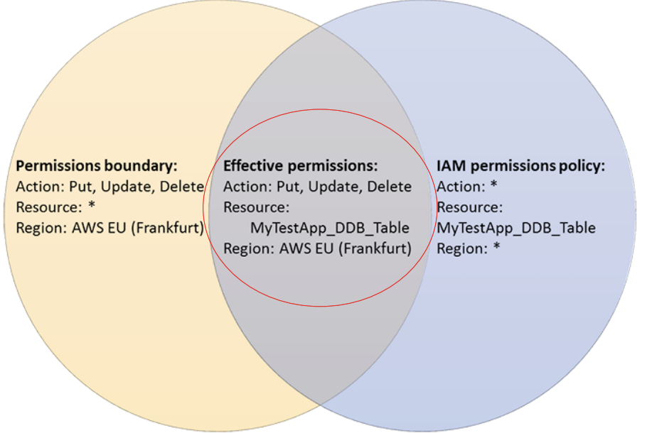

# AWS Well-architected Framework - Security Pillar

> Addresses security issues that AWS customers tend to make mistakes on

 

 

## Security Design Principles

 

#### Implement Strong **Identity** Management Foundation

- Implement the **principle of least privilege** and appropriately apply **separation of duties** controls in the authorization process for interactions between AWS resources

#### Ensure Traceability

- **Real-time monitoring/logging/auditing** of all changes and operations
- Configure **automated response** environments

#### Apply Security at All Layers

- Apply necessary security functions and controls at **all layers** (Edge, VPC, ELB, EC2, OS, and applications), not just a single security layer

#### Automate Security Best Practices

- Implement **template-based** environments with verified security standards pre-applied and version controlled to automatically support safe `scaling environments`

#### Protect Data in Transit and at Rest

- **Classify** data by sensitivity level
- Apply `encryption`, `tokenization`, and access controls as needed

#### Maximize Isolation of Users from Data

- Apply **automated processing** processes to prevent administrator errors and minimize direct data access and manual processing
  - However, other measures must be accompanied

#### Prepare Adequately for Security Events

- Prepare and execute security incident **response simulations**
- Use automated tools to improve detection/investigation and recovery speed

 

 

## 1. Security Governance

 

### Sec 1) How securely are you operating your workloads?

> Best Practices

1. Operate workloads separately with **multi-account** structure
2. Implement **secure access** to AWS accounts
3. **Establish security control objectives** and perform **continuous verification**
4. Secure **response systems** for **latest security threats**
5. Reflect **latest security requirements**, **trends**, and **regulations** in workloads
6. Implement **automated testing and verification stages** in processes or deployment pipelines
7. **Identify potential threats** through threat modeling and prioritize them
8. Regularly evaluate and apply **new security services / features / products**
   - New features are continuously updated
     - Need to evaluate and apply these!

 

#### AWS Account Planning

- By business unit
- By development cycle
- By project

 

#### AWS Landing Zone

- AWS staff is deployed to build `CloudFormation`

 

#### AWS Control Tower

> <https://aws.amazon.com/controltower/>

- `Landing Zone` automatic configuration service
- Creates 2 core accounts
  1. `Log_archive`
  2. `Audit`
- Core/Custom OU structure and Account Factory
- Provides Single Sign-On using AWS SSO
  - with Active Directory custom option
- Provides 25 built-in guard rails for detection and prevention

 

 

## 2. Identity & Access Management

 

### Sec 2) How do you manage identities for users and systems?

> Best Practices

1. Apply **strong authentication** techniques such as MFA
2. Use **temporary credentials** instead of permanent credentials
3. **Securely store and manage** credentials
4. Build **centralized IDP (identity provider)** environment and **integrate with HR events**
5. **Periodic rotation** and auditing of permanent credentials
6. Actively utilize user groups and attributes defined in IDP for access control
   - Align permissions using attributes such as what attributes users have and what department they belong to
     - The key is automatic application based on attributes!
   - Manage with tagging on attributes, so you can change user permissions by just changing attributes - convenient!

 

#### AWS SSO

- AWS SSO enables administrators to configure and maintain all the necessary permissions for your accounts automatically, without requiring any additional setup in the individual accounts.

 

### Credential Report & Config Rule

#### Config Rule

- Use managed rules (`access-keys-rotated`)
  - Periodically check access keys that exceed the parameter (`maxAccessKeyAge`) day criteria
    - Manage permissions by setting rules such as recording whether access keys were changed periodically with timestamps
      - Need to set cycles!
        - How?
          - Map scripts that get temporary credentials each time AWS CLI is used to rotate credentials
- Default value
  - 90 days
- Applications such as lambda functions that automatically rotate detected targets and notify owners are possible

 

### AWS Secret Manager

 

 

### Server User Management Cases

#### 1. AWS AD Domain Join

- <https://aws.amazon.com/blogs/security/how-to-domain-join-amazon-ec2-instances-aws-managed-microsoft-ad-directory-multiple-accounts-vpcs/>

 

#### 2. Session Manager

- <https://docs.aws.amazon.com/systems-manager/latest/userguide/session-manager.html>

- Minimize permissions that can access servers
  - How?
    - Script repetitive tasks using `documents`
      - System manager has documents
    - <https://docs.aws.amazon.com/systems-manager/latest/userguide/sysman-ssm-docs.html>

 

#### 3. Instance Connect

- Automatically deploy SSH public keys to instance metadata through `SendSSHPublicKey` action
  - Exists for only 60 seconds (short-term)

 

 

### Sec3) How do you manage permissions for users and systems?

> Best Practices

1. **Define detailed permission requirements for each access control case** such as user types and access methods
2. Adhere to the **principle of least privilege** at the most detailed level possible
3. Define **emergency access approval** processes
4. Configure procedures for **constant revocation of unused permissions**
5. Set up **permission guard rails** that support delegation systems
6. Configure **permission creation, modification, and revocation procedures** linked to HR events
7. Configure constant monitoring and alert systems for **public and cross-account access**
8. Strengthen monitoring and governance of **shared resources**

 

### IAM Access Advisor

- Verify least privilege assignment for identity-based policies
- Provide history of executed actions
  - S3

 

### IAM Access Analyzer

- Verify least privilege assignment for resource-based policies
- Analyze access policies for target resources to identify areas where public or other account access is allowed
- Detect the moment policies change through constant monitoring/exploration
  - Forward to `Security Hub` after detection
- Take immediate action in case of unintended changes

 

### IAM Policy - Permission Boundary

- Limit the maximum permissions a user can have
  - Set boundaries for the maximum permissions each user can have
  - Applied in the form of **intersection** with permissions granted by `Identity-based` policies (filter role)
    - Cannot be specified by group!

 

 

 

## Hands-On: Incident Response Workshop in AWS Environment

<http://gslim-public-workshops.s3-website.ap-northeast-2.amazonaws.com/incidentresponseworkshop/>

 

 

`+`

### Look it up

- Groups are only used when granting policies!?!?!
- AWS Lambda Layer
  - <https://docs.aws.amazon.com/lambda/latest/dg/configuration-layers.html>
- VPC Flow log
- Amazon GuardDuty
  - <https://aws.amazon.com/guardduty/>
  - Runbook 
