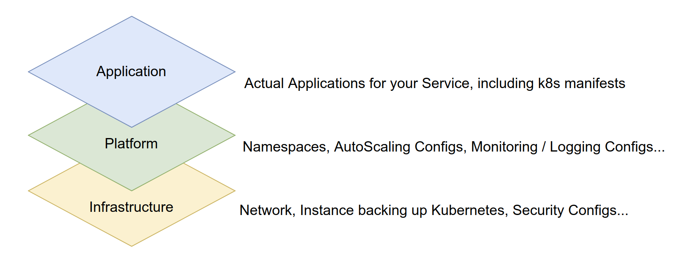
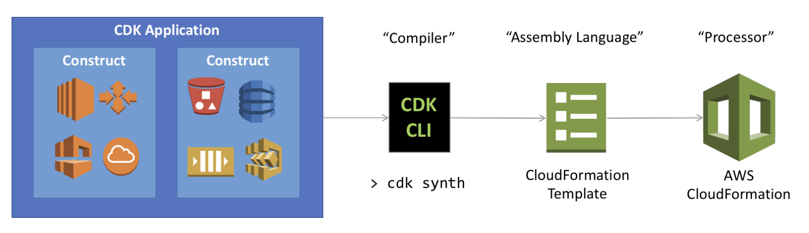
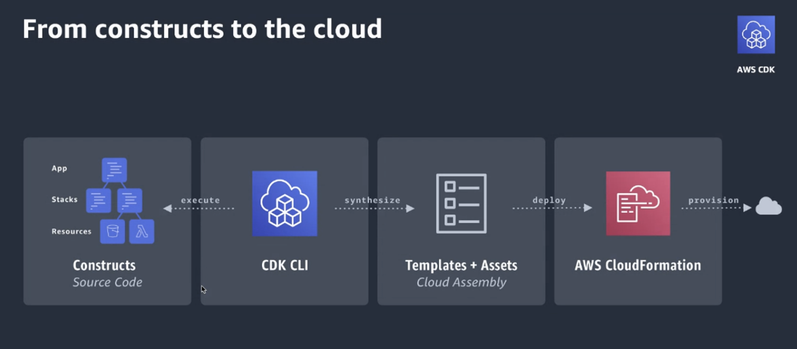
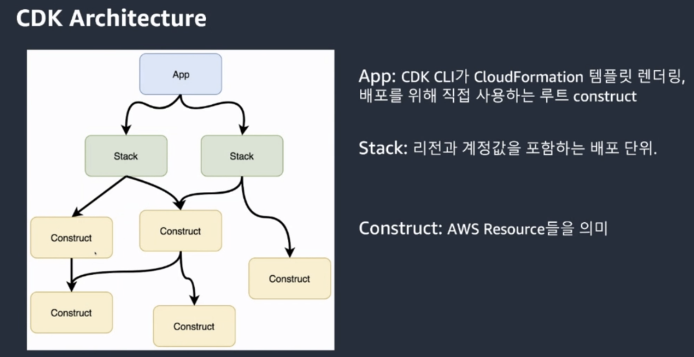
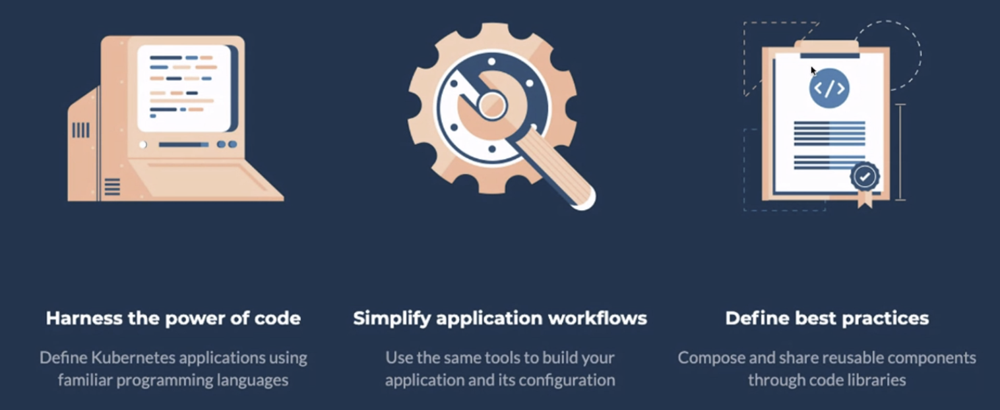

# DevAx Connect) Managing EKS Cluster Fullstack with CDK - 9/1/2020

> Presenter: AWS Solutions Architect Jiwon Yeom
>
> Material: [AWS workshop](http://demogo-multiregion-eks.s3-website.ap-northeast-2.amazonaws.com/ko/10-intro/100-for-whom/)

 

 

## What It Means to Manage Kubernetes Clusters Fullstack with IaC

 

- Defining infrastructure as code (Infrastructure as Code, IaC) in the cloud is not a choice but a necessity

- When deploying Kubernetes clusters to the cloud, there are three main types of code to consider:

   

  

### 1. Infrastructure

- When deploying a single EKS cluster on AWS Cloud,
  - VPC configuration
  - Subnets within it
  - Security groups
  - Various IAM roles and policies, etc., require multiple configurations
- As usage expands through region expansion, account expansion, etc., **infrastructure definition code** becomes more complex

 

### 2. Platform

- After defining infrastructure as code, there are resources that must be managed at the cluster level
  - ex)
    - Separating namespaces and specifying **[ResourceQuota](https://kubernetes.io/docs/concepts/policy/resource-quotas/)** for them, or configuring **auto-scaling**, **monitoring**, **logging settings**, etc.

 

### 3. Application

- Depending on the organization, who handles it may vary, but at the **application layer** as well:

  1. Deployment scripts

  2. K8s manifest

     These should also be managed as code together

 

 

### Why IaC for the Entire Stack is Needed

 

1. By managing all **modeling resources** as a **single source**, you can **standardize** components used across the entire organization
   - This enables compliance with enterprise policies and faster response when issues occur
2. Automation and deployment application resources are **provisioned** in a **safe** and **repeatable manner**, allowing you to **build** and **rebuild** infrastructure and applications without performing manual tasks or writing custom scripts
   - This also reduces human errors!

3. Version control like code - By codifying infrastructure, you can treat **infrastructure** as **simple code**
   - You can write infrastructure with your preferred code editor, check it into a version control system, and review files with team members before deploying to production
   - Each **code version** represents the **state of infrastructure**, and if issues occur after changes, you can use previous code for **quick rollback** to previous infrastructure versions

 

 

## AWS CDK (Cloud Development Kit)

 

- AWS CDK is an **open-source software development framework** that allows you to **model** and **provision** cloud application resources using familiar programming languages!

- Cloud application provisioning can be a challenging process that requires:
  - Manual tasks, or
  - Writing custom scripts, or
  - Maintaining templates, or
  - Learning domain-specific languages
- AWS CDK uses the **familiarity** and **expressiveness** of **programming languages** to model applications
- AWS CDK provides high-level components that preconfigure cloud resources with **proven defaults**, allowing you to build cloud applications **even if you're not an expert**

 

 

 

 

 

## CDK8S

 

 

*[From here](http://demogo-multiregion-eks.s3-website.ap-northeast-2.amazonaws.com/ko/10-intro/300-cdk/) onwards needs to be organized again...hehe* 
