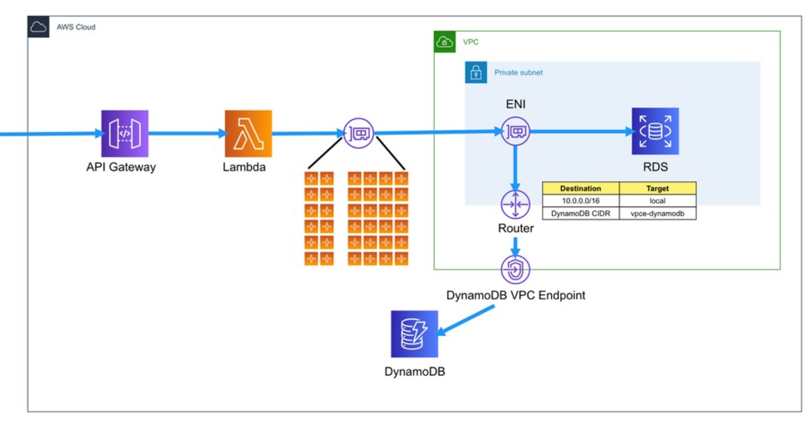

# What Are AWS Elastic Network Interfaces (ENI)

> Let's learn about ENI
>
> Reference: <https://speakerdeck.com/twkiiim/amazon-vpc-deep-dive-eni-reul-almyeon-vpc-ga-boinda>

<br>

<br>

## What is ENI?

<br>

### ENI (Elastic Network Interface)

- A concept corresponding to a **virtual network card** in VPC
  - Can have one or more IP addresses that belong to the `Private IP` range within the VPC
    - ex) Primary, Secondary
- Can also have a `Public IP` by associating an **EIP (Elastic IP)**
- It's the target to which **Security Groups** are attached
  - Security Groups are attached to ENI!
- Has a **MAC Address**
- ENI is also responsible for **Source/Destination check**
- **VPC Flow Logs** are also created based on ENI

- EC2 can be accessed through ENI
- If it's a public subnet, ENI also has EIP (Elastic IP) attached
- Security Groups are also applied to ENI
  - Multiple Security Groups can be applied

<br>

<br>

## Understanding ENI through Lambda

<br>

### Changes in VPC Lambda Model

#### Past VPC Lambda


<br>

#### Current VPC Lambda


<br>

Looking at the [announcement](https://aws.amazon.com/blogs/compute/announcing-improved-vpc-networking-for-aws-lambda-functions/) about VPC Lambda improvements, we can see the following content:

```
What's changing
Starting today, we're changing the way that your functions connect to your VPCs. AWS Hyperplane, the Network Function Virtualization platform used for Network Load Balancer and NAT Gateway, has supported inter-VPC connectivity for offerings like AWS PrivateLink, and we are now leveraging Hyperplane to provide NAT capabilities from the Lambda VPC to customer VPCs.

The Hyperplane ENI is a managed network resource that the Lambda service controls, allowing multiple execution environments to securely access resources inside of VPCs in your account. Instead of the previous solution of mapping network interfaces in your VPC directly to Lambda execution environments, network interfaces in your VPC are mapped to the Hyperplane ENI and the functions connect using it.
```

What is Hyperplane here?

<br>

### AWS Hyperplane

- A **Load Balancing Service** used **internally** by AWS
- Based on S3 API's Load Balancer
- Has been used in EFS (Elastic File System) from the beginning
- Started being used in various services
  - API Gateway's VPC Link
  - NLB (Network Load Balancer)
  - NAT Gateway
  - **VPC Lambda**

- It's a fleet configuration of EC2 instances
  - That is, it scales up/down & in/out as needed
- ENI accessible to Hyperplane exists within AWS internally

<br>



- Actually, there's a VPC inside AWS Lambda as shown above, but it's not visible because AWS manages it
- When configuring VPC Lambda, you select a **Subnet**, at which point **ENI** is automatically created within that subnet and connected to the **Hyperplane ENI** inside **AWS Lambda**!

<br>

<br>

### Other Services Integrated with VPC

- They integrate with **directly created VPCs** by selecting VPC and Subnet
- **ENI** is automatically created in the corresponding subnet, enabling communication with **VPC internal resources**!! 
