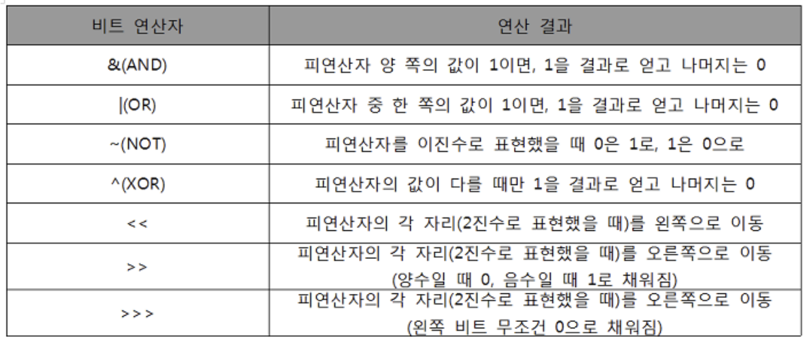

# Algorithm Basics

<br>

### What is Software Problem-Solving Capability?

: The ability to understand various constraints and requirements for programming and find the best solution

- The ability to connect knowledge of programming languages, libraries, data structures, and algorithms to create the bigger picture

<br>

<br>

## Algorithm Efficiency

### 1. Space Efficiency and Time Efficiency

- Space efficiency refers to how much memory space is required
- Time efficiency refers to how much time is required
- When efficiency is expressed inversely, it becomes complexity
  - The higher the complexity, the lower the efficiency

<br>

### 2. Time Complexity Analysis

- Processing time varies depending on hardware environment
- Processing time varies depending on software environment
- Therefore, analysis is difficult due to these environmental differences

<br>

### 3. Asymptotic Notation of Complexity

- Time (or space) complexity is expressed as a function of input size, and this function is usually a polynomial with multiple terms

<br>

<br>

## O (Big-Oh) Notation

### 1. Definition

- T(n): Execution time
- T(n) = O(f(n)) only when there exist constants c and n0 such that T(n) <= c*f(n)
- However, constants c and initial value n0 are independent of the value of n

<br>

### 2. Notation

- O-notation
  - Represents the asymptotic **upper bound** of complexity
  - If complexity is T(n) = 2n^2 - 7n +4, then the O notation of T(n) is O(n^2)
  - The simplified expression of T(n) is n^2
  - "Even in the worst case, it will be at most this much"
- Big-Omega notation
  - Represents the asymptotic **lower bound** of complexity
  - "At least this much will be required"

<br>

*Omega < Theta < Big O*

<br>

<br>

### Commonly Used O-notations

- `O(1)`
  - Constant time
- `O(logn)`
  - Logarithmic time
- `O(n)`
  - Linear time
- `O(nlogn)`
  - Log-linear time
- `O(n^2)`
  - Quadratic time
- `O(n^3)`
  - Cubic time
- `O(2^n)`
  - Exponential time

<br>

<br>

## Bit Operations

<br>

### Bit Operators



<br>

- Integers can be represented in 2 bytes or 4 bytes
- When exceeding the range:
  - Either discard
  - Or apply correction
- Integers have a sign bit at the front

<br>

### N & 1

- Determines whether a positive integer value stored in a variable is odd or even
  - N%2
- Uses % operation to determine if the last bit value is 1 or 0, determining odd or even

<br>

### 1 << n

- Has the value of 2^n
- Represents the number of all subsets when there are n elements
- `Power set` (all subsets)
  - All subsets including the empty set and itself
  - Calculating the 2 cases where each element is included or not included gives the number of all subsets

<br>

### i & (1 << j) = (i >> j) &1

- The calculation result indicates whether the j-th bit of i is 1 or not

<br>

### Applying bit operator ^ twice returns the original value

<br>

### Bit Operation Example 1

```python
def Bbit_print(i):
    output = ''
    for j in range(7, -1, -1):
        output += "1" if i&(1<<j) else "0"
    print(output)

for i in range(-5, 6):
    print("%3d = " %i, end='')
    Bbit_print(i)
```

<br>

<br>

## Endianness

- Refers to the method of arranging multiple consecutive objects in a one-dimensional space such as computer memory, and differs by HW architecture
- `Caution!`
  - When converting between byte units and word units for speed improvement, incorrect understanding can cause errors

<br>

### Big-endian

- Usually the larger unit comes first
- Network
  - ex) internet protocol, IBM z/architecture (only some mainframe computers..)

<br>

### Little-endian

- Smaller unit comes first
- Most desktop computers
  - ex) Intel, ARM processor

<br>

### Endian Check Code

```python
# ver1)
n = 0x00111111
if n&0xff: #0xff = 11111111!
    print("little endian")
else:
    print("big endian")

print('-'*20)

#ver2) Using python sys library
import sys
if sys.byteorder == "little":
    print("Little endian platform")
else:
    print("Big endian platform")
```

<br>

<br>

## Real Number

<br>

### Limitations of Computer Arithmetic

- The difference between mathematical real numbers and computer floating-point numbers
- Computers cannot perfectly represent all real numbers due to limited memory
- Therefore, approximation is used, which can lead to errors

<br>

### Floating Point Representation

- Uses IEEE 754 standard
- Single precision (32-bit): 1 sign bit + 8 exponent bits + 23 mantissa bits
- Double precision (64-bit): 1 sign bit + 11 exponent bits + 52 mantissa bits

<br>

### Comparison of Real Numbers

- Due to rounding errors, direct comparison may not work correctly
- Use epsilon (small value) for comparison

```python
def is_equal(a, b, epsilon=1e-9):
    return abs(a - b) < epsilon
```

<br>

<br>

## Performance Measurement

<br>

### Theoretical Analysis

- Using Big-O notation
- Analyzing algorithm complexity without implementation
- Independent of hardware and software environment

<br>

### Empirical Analysis

- Measuring actual execution time
- Depends on hardware and software environment
- Useful for comparing actual performance

<br>

### Profiling

- Analyzing which parts of the program consume the most time
- Helps identify bottlenecks
- Various profiling tools available by language

<br>

<br>

## Algorithm Design Techniques

<br>

### Brute Force

- Try all possible solutions
- Simple but often inefficient
- Useful when problem size is small

<br>

### Divide and Conquer

- Divide problem into smaller subproblems
- Solve subproblems recursively
- Combine solutions
- Examples: Merge Sort, Quick Sort

<br>

### Greedy Algorithm

- Make locally optimal choice at each step
- Hope to find global optimum
- Not always optimal, but often efficient
- Examples: Huffman Coding, Dijkstra's Algorithm

<br>

### Dynamic Programming

- Break down problem into overlapping subproblems
- Store solutions to avoid redundant calculations
- Examples: Fibonacci sequence, Longest Common Subsequence

<br>

### Backtracking

- Build solution incrementally
- Abandon partial solutions that cannot lead to complete solution
- Examples: N-Queens problem, Sudoku solver

<br>

<br>

## Common Data Structures

<br>

### Array

- Fixed-size sequential collection
- Random access: O(1)
- Insertion/Deletion: O(n)

<br>

### Linked List

- Dynamic collection of nodes
- Sequential access: O(n)
- Insertion/Deletion: O(1) if position known

<br>

### Stack

- Last In First Out (LIFO)
- Push/Pop operations: O(1)
- Applications: Expression evaluation, Function calls

<br>

### Queue

- First In First Out (FIFO)
- Enqueue/Dequeue operations: O(1)
- Applications: BFS, Process scheduling

<br>

### Hash Table

- Key-value mapping
- Average case operations: O(1)
- Worst case operations: O(n)

<br>

### Tree

- Hierarchical structure
- Binary Search Tree operations: O(log n) average
- Applications: Searching, Sorting

<br>

### Graph

- Collection of vertices and edges
- Representations: Adjacency matrix, Adjacency list
- Applications: Network routing, Social networks 
