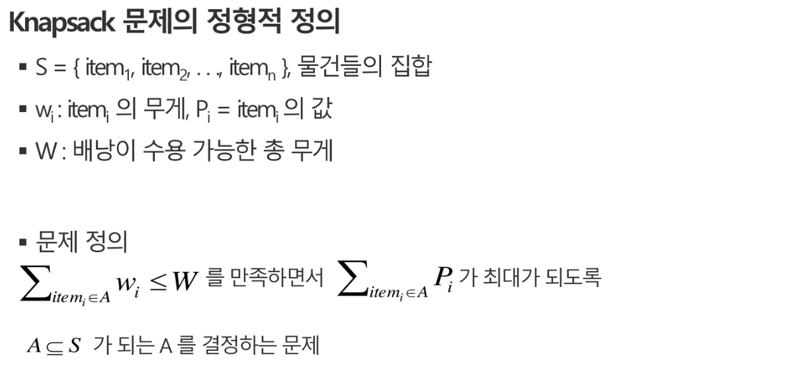
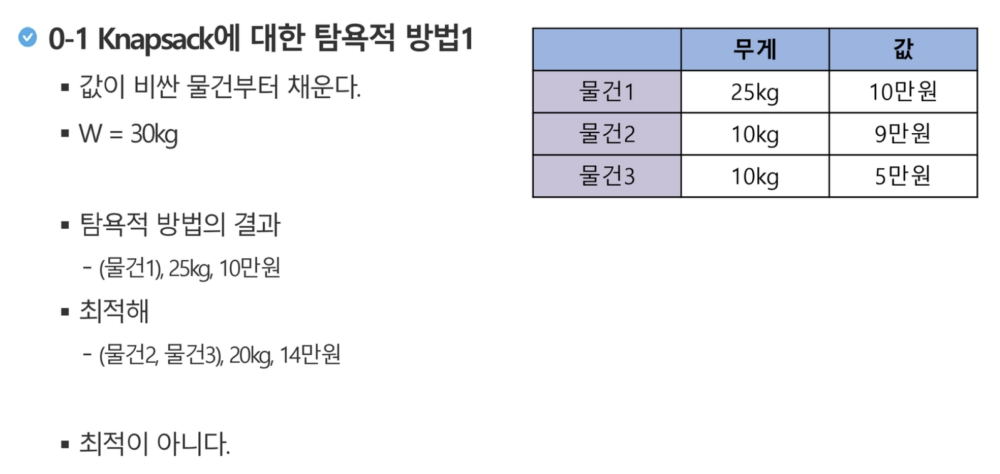
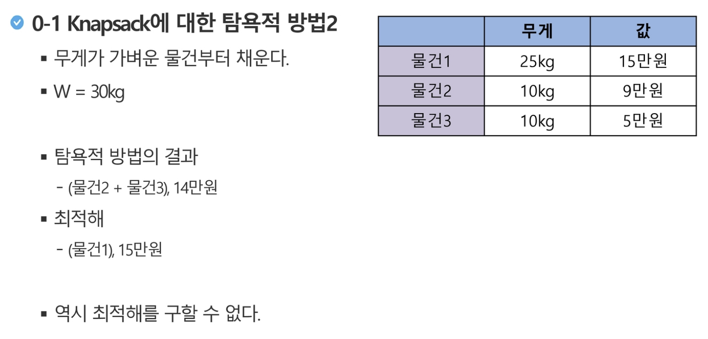
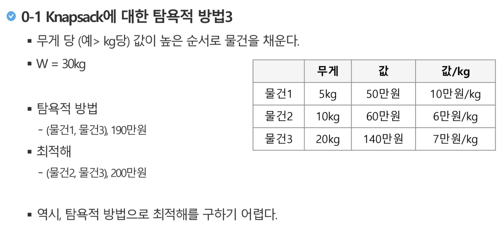
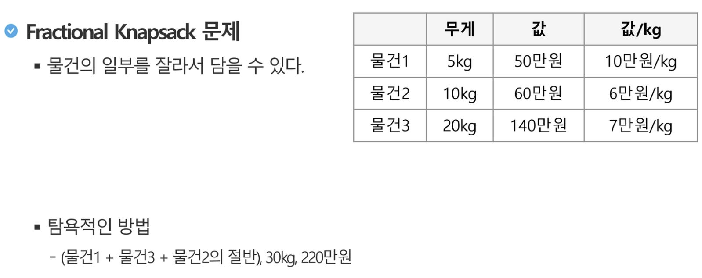
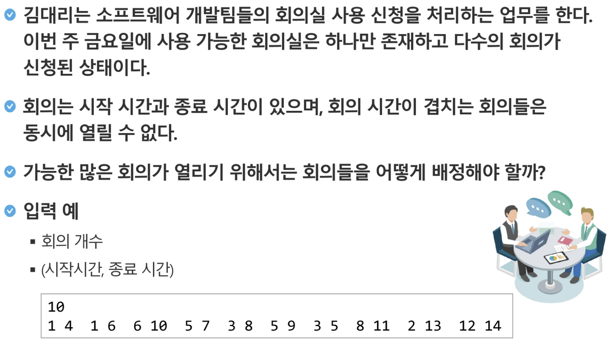
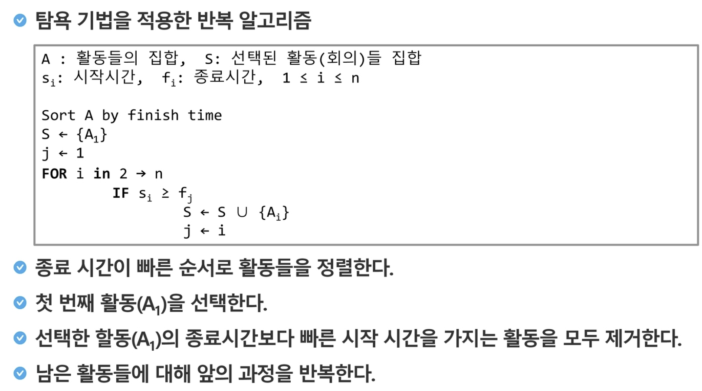
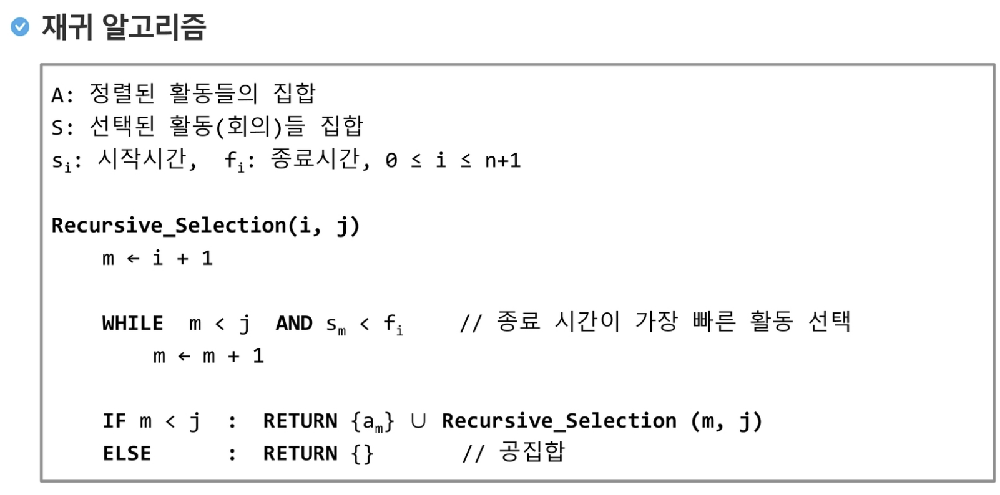

# Greedy Algorithm

 

## What is Greedy?

- Greedy algorithm is a myopic method used to find **optimal solutions**
- Generally, implementing ideas that come to mind without verification becomes a Greedy approach

 

- When choosing one among several cases, proceed by selecting what seems optimal at that moment to reach the final solution.

  - Decisions made at each point are locally optimal, but collecting these choices to create the final solution **does not guarantee optimality**
- Once a choice is made, it is never reconsidered
  - Due to this characteristic, most greedy algorithms are **simple**
  - Applied to limited problems
- `Optimization problems` are problems that find the best (maximum or minimum) solution among possible solutions

 

 

## How it works?

 

### 1. Solution Selection

- Find the optimal solution to a subproblem in the current state, then add it to the solution set (`Solution Set`)

### 2. Feasibility Check

- Check whether the new solution set is feasible
- That is, check whether problem constraints are violated

### 3. Solution Check

- Check whether the new solution set becomes a solution to the problem
- If the complete problem solution is not yet complete, restart from solution selection in step 1

 

#### *There is no guarantee that the optimal solution will be found!*

 

 

### ex1) Knapsack Problem

- A thief broke into a warehouse to steal from the rich.
- The thief plans to carry stolen items in a backpack. The backpack has a fixed total weight (W) limit for items.
- There are several items (n items) in the warehouse, each with a defined weight and value.
- Before being caught by security, items with maximum value must be packed without exceeding the weight capacity of the backpack.

 

Example)

|       | Weight | Value  |
| :---: | :----: | :----: |
| Item1 |  25kg  | 100,000 won |
| Item2 |  10kg  | 90,000 won  |
| Item3 |  10kg  | 50,000 won  |

 

 

#### Complete Search Method for 0-1 Knapsack

> Use complete search to find all subsets of item set S.

- Discard sets where the total weight exceeds W, and select the set with the highest total value from the remaining sets
- As the number of items increases, time complexity increases exponentially
  - Number of subsets of size n: 2^n

 

 

 

 

 

 

### ex2) Meeting Room Assignment Problem

 

 

 

 

 

## Essential Elements of Greedy Algorithm

 

### 1. Greedy Choice Property

- Show that greedy choice can lead to optimal solution
  - That is, greedy choice is always safe

 

### 2. Optimal Substructure Property

- Formalize the optimization problem
  - Making one choice leaves one subproblem to solve

 

### 3. Prove that `optimal solution to original problem == greedy choice + optimal solution to subproblem`

 

 

## Greedy Algorithm vs Dynamic Programming

 

| Greedy Algorithm                                             | Dynamic Programming                                    |
| :----------------------------------------------------------- | ------------------------------------------------------ |
| At each step, quickly select what looks best  -> **Local optimal choice** | Each step's choice is based on solved subproblem solutions |
| (Greedy) choice is made before solving subproblems        | Subproblems are solved first                              |
| Top-down approach                                                | Bottom-up approach                                         |
| Generally fast and simple                                       | Slower and more complex                                      | 
