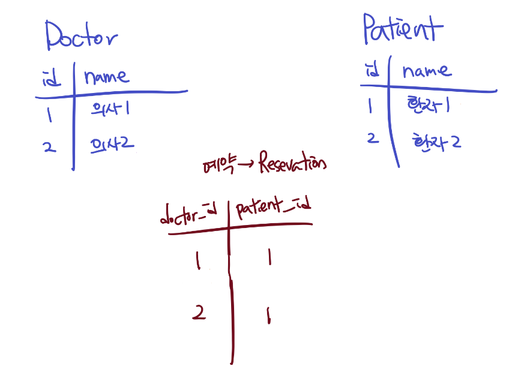
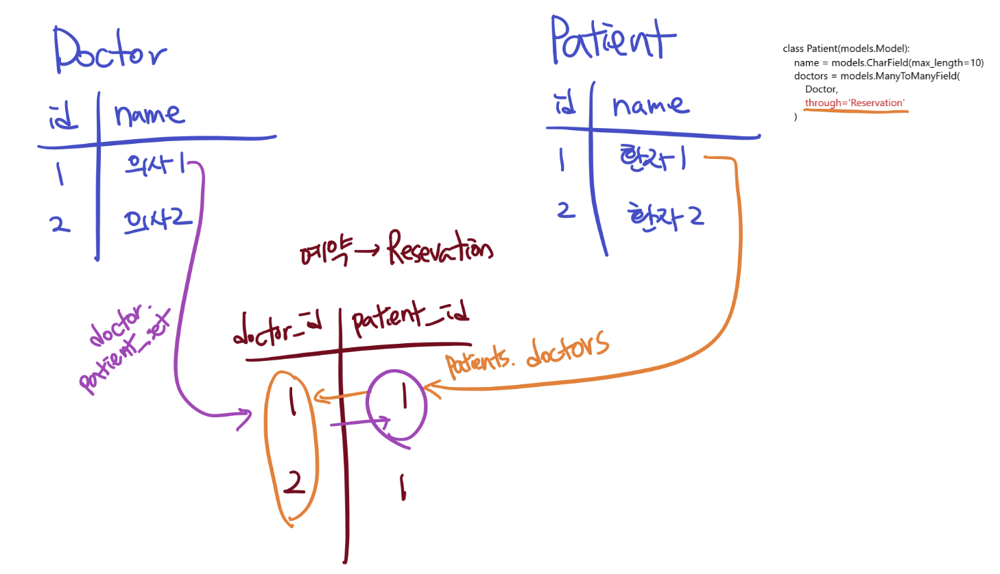
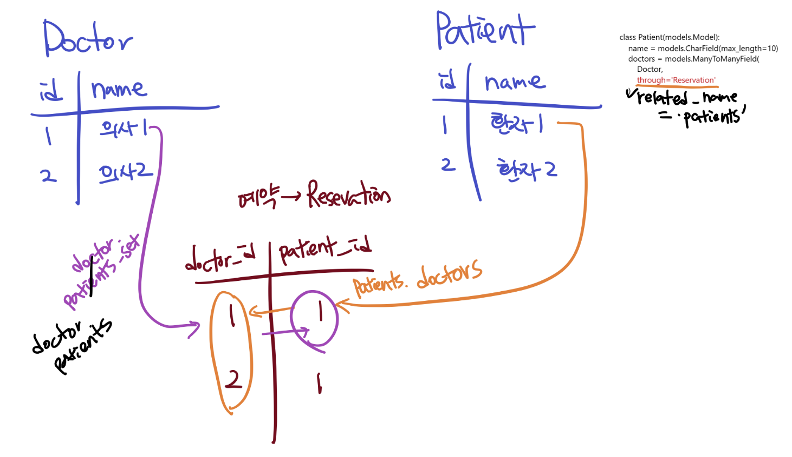

# Many to Many (M:N)

<br>

## M:N

- M has many N
- N has many M

<br>

### Naming convention

- `1:N`

  - **Definition**: Model singular (.user)
  - **Reverse reference**: model_set (.article_set)

- `M:N`

  - **Definition and reverse reference**: Model plural (.like_users, like_articles)

<br>

### M:N Relationship Access



<br>

### 1. Simple Intuitive Modeling

> Transfer the above diagram to models.py

```python
class Doctor(models.Model):
    name = models.CharField(max_length=10)

class Patient(models.Model):
    name = models.CharField(max_length=10)

class Reservation(models.Model):
    doctor = models.ForeignKey(Doctor, on_delete=models.CASCADE)
    patient = models.ForeignKey(Patient, on_delete=models.CASCADE)
```

- Create patients/doctors

  ```python
  d1 = Doctor.objects.create(name='dr.john')
  d2 = Doctor.objects.create(name='dr.kim')
  
  p1 = Patient.objects.create(name='구름')
  p2 = Patient.objects.create(name='근제')
  ```

- Create reservations

  ```python
  Reservation.objects.create(doctor=d1, patient=p1)
  Reservation.objects.create(doctor=d1, patient=p2)
  Reservation.objects.create(doctor=d2, patient=p1)
  ```

- Doctor #1's reservation list

  ```python
  d1.reservation_set.all()
  ```

- Patient #1's reservation list

  ```python
  p1.reservation_set.all()
  ```

- Print doctor #1's patients

  ```python
  for reservation in d1.reservation_set.all():
      print(reservation.patient.name)
  ```

<br>

<br>

### 2. Using Intermediate Model

> To directly access doctors - patients / patients - doctors, use `ManyToManyField`.
>
> Declare intermediate model through `through` option.

<br>



<br>

```python
class Doctor(models.Model):
    name = models.CharField(max_length=10)

class Patient(models.Model):
    name = models.CharField(max_length=10)
    # M:N field! Access to Doctor through reservation
    doctors = models.ManyToManyField(Doctor, 
                                    through='Reservation')

class Reservation(models.Model):
    doctor = models.ForeignKey(Doctor, on_delete=models.CASCADE)
    patient = models.ForeignKey(Patient, on_delete=models.CASCADE)
```

- No need to create migration files or migrate.

  - There are no changes to the database, only differences in ORM manipulation.

- Get doctor, patient objects

  ```python
  p1 = Patient.objects.get(pk=1)
  d1 = Doctor.objects.get(pk=1)
  ```

- Patient #1's doctor list

  > `Patient` with `ManyToManyField` defined uses direct reference

  ```python
  p1.doctors.all()
  ```

- Doctor #1's patient list

  > `Doctor` is not direct reference but reverse reference of `Patient` model.
  >
  > So, reference according to basic naming convention

  ```python
  d1.patient_set.all()                                                                   
  ```

- ##### `related_name` : reverse reference option

    <br>

    **Default value is `{model name}_set`**

    

    - There are situations where reverse reference setting must be set
      - When **makemigrations** in `django`, it directly raises an error
      - ex) Author(User)-Article(Article), LikedUser(User)-Article(Article)
        - If you define both Article classes without related_name, reverse reference issues occur

    ```python
    class Doctor(models.Model):
        name = models.TextField()
    
    class Patient(models.Model):
        name = models.TextField()
        # Reverse reference setting. related_name
        doctors = models.ManyToManyField(Doctor, 
                            through='Reservation',
                            related_name='patients')
    
    class Reservation(models.Model):
        doctor = models.ForeignKey(Doctor, on_delete=models.CASCADE)
        patient = models.ForeignKey(Patient, on_delete=models.CASCADE)
    ```

<br>

<br>

### 3. Setting without Intermediate Model

> Generally, when no additional fields are needed and only id values exist, declare as follows.

```python
class Doctor(models.Model):
    name = models.TextField()

class Patient(models.Model):
    name = models.TextField()
    doctors = models.ManyToManyField(Doctor, 
                        related_name='patients')
```

- In this case, a table named appname_patient_doctors is created.

- To Create/Delete in this table (to create or delete reservations), use the following methods:

  ```python
  d1.patients.add(p1)
  # Let's check each one.
  d1.patients.all()
  p1.doctors.all()
  ```

  ```python
  d1.patients.remove(p1)
  # Let's check each one.
  d1.patients.all()
  p1.doctors.all()
  ```

### Conclusion

- When intermediate model is not needed
  - Declare `ManyToManyField` in specific Class (automatic intermediate table declaration)
- When intermediate model is needed (when additional information is needed)
  - Define intermediate model first
  - Manipulate through `through` option in `ManyToManyField` in specific Class

`+`

- In `ManyToMany`, always declare `related_name` in plural form!!

<br><br>

### Getting desired values by id

```shell
In [13]: Reservation.objects.filter(doctor_id=3)                                                                   
Out[13]: <QuerySet [<Reservation: Reservation object (3)>]>
```

<br><br>

### Delete

> Inconvenient version.

```shell
In [18]: Reservation.objects.filter(patient_id=1,doctor_id=1).delete()                                             
Out[18]: (1, {'manytomany.Reservation': 1})
```

<br>

<br>

## Like Feature

<br>

```python
class Post(models.Model):
    title = models.CharField(max_length=100)
    content = models.TextField()
    image = models.ImageField(blank=True)
    # Not stored in DB, cut and displayed when called
    image_thumbnail = ImageSpecField(source='image',
                                      processors=[ResizeToFill(300, 300)],
                                      format='JPEG',
                                      options={'quality': 60})
    created_at = models.DateTimeField(auto_now_add=True)
    updated_at = models.DateTimeField(auto_now=True)
    user = models.ForeignKey(settings.AUTH_USER_MODEL, on_delete=models.CASCADE)
    #Like feature
    users = models.ManyToManyField(settings.AUTH_USER_MODEL,
                                    related_name='like_posts')
```

<br>

```bash
$ python manage.py makemigrations
SystemCheckError: System check identified some issues:

ERRORS:
posts.Post.user: (fields.E304) Reverse accessor for 'Post.user' clashes with reverse accessor for 'Post.users'.
        HINT: Add or change a related_name argument to the definition for 'Post.user' or 'Post.users'.
posts.Post.users: (fields.E304) Reverse accessor for 'Post.users' clashes with reverse accessor for 'Post.user'.
        HINT: Add or change a related_name argument to the definition for 'Post.users' or 'Post.user'.
```

<br>

- URL - variable routing
- View - Cancel if liked, like if not liked (Toggle)

<br>

<br>

## Follow Feature

<br>

- URL - variable routing
  - accounts/1/follow
- View
  - add if followed
  - remove if not followed
- Template(response)
  - User detail redirect

<br>

<br> 
