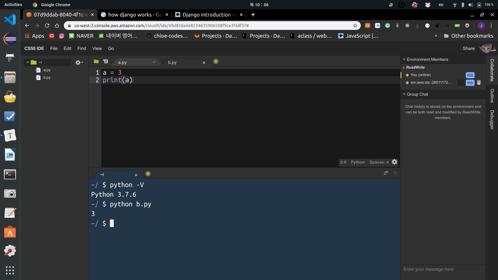
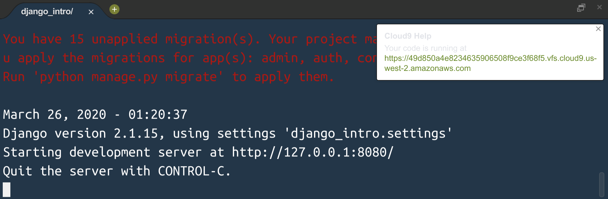
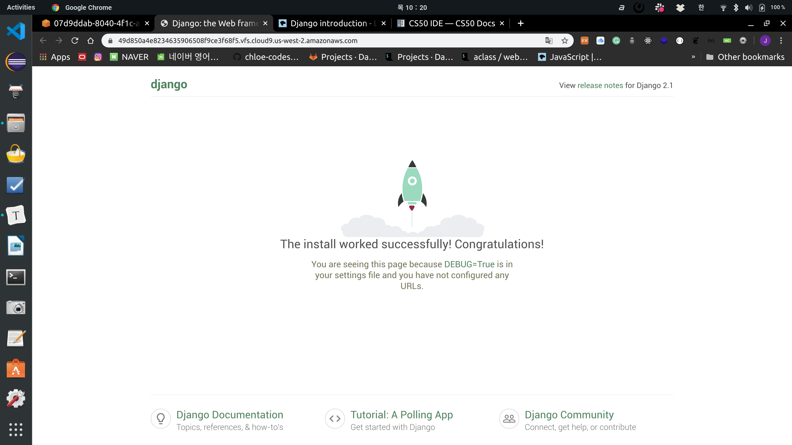
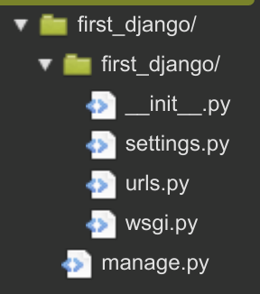
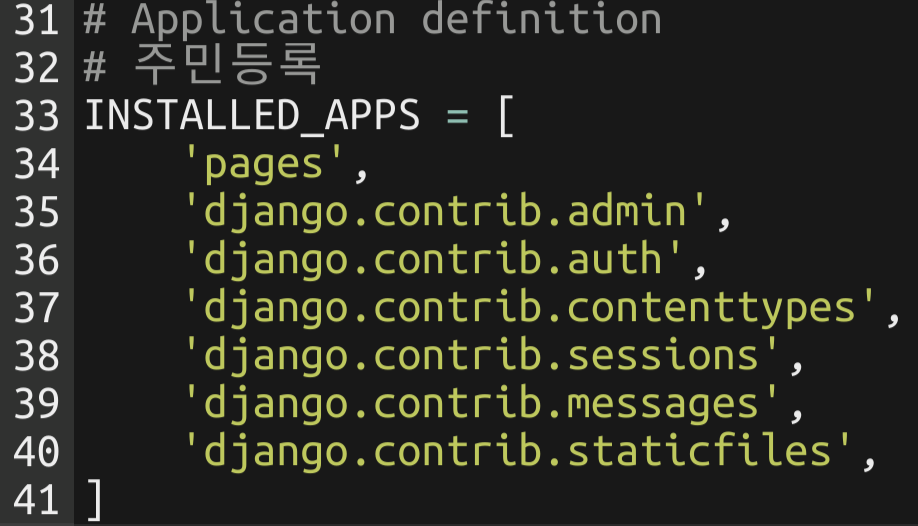
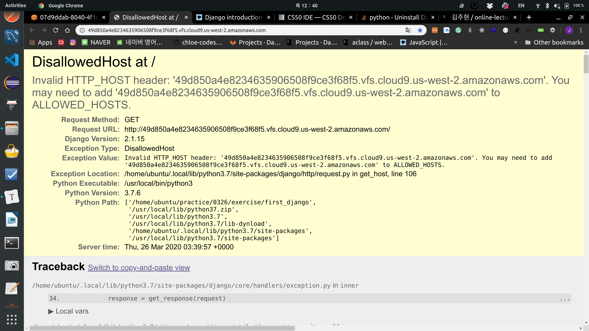

# Intro to Django

> https://developer.mozilla.org/en-US/docs/Learn/Server-side/Django/Introduction

<br>

<br>

### What is django?

: Python web framework

- High-level Python web framework that enables rapid development of **secure** and **maintainable** websites
- Free & open source

<br>

#### web framework

- Aims to reduce difficulties encountered in web page development process

- A collection of classes and libraries that implement the standard structure of applications

<br>

#### Why do we have to learn django?

1. `Portable`
   - Python based which means it runs on many platforms
2. `Complete`
   - **Django** follows the *"Batteries included"* philosophy
     - Everything you need is part of the one *"product"*
     - Works seamlessly together
     - Follows consistent design principles
     - Has extensive and [up-to-date documentation](https://docs.djangoproject.com/en/stable/).
3. `Versatile`
   - Can be used to build almost any type of website
     - Can work with any **client-side** framework
     - Can deliver content in almost any format (including HTML, RSS feeds, JSON, XML, etc)
4. `Secure`
   - Provides a secure way to manage user accounts & passwords
     - By avoiding common mistakes like putting session information in cookies where it is vulnerable
       - Instead cookies just contain a key
       - And the actual data is stored in the db
     - By avoiding directly store passwords rather than **password hash**
5. `Scalable`
   - Uses a component-based *"shared-nothing"* architecture
     - each part of the architecture is independent of the others
     - can be replaced or changed if needed
   - Can scale for increase traffic by adding hardware at any level
     - caching servers
     - database servers
     - application servers
6. `Maintainable`
   - Follows DRY (Don't Repeat Yourself) principle
     - No unnecessary duplication
   - Promotes the grouping of related functionality into reusable
7. Many companies are utilizing it
   - Spotify
   - Instagram
   - Dropbox
   - Delivery Hero
   - etc.

<br>

<br>

#### Web protocol we know

- Request
- Response

<br>

<br>

### How does django work?

- Django follows the **MVC (Model View Controller) pattern**.

  - MVC: One of the Software design patterns

    | MVC Pattern |  django  |
    | :---------: | :------: |
    |    Model    |  Model   |
    |    View     | Template |
    | Controller  |   View   |

- **MTV**

  - **M**: Data management
  - **T**: Interface (screen)
  - **V**: Intermediate management (interaction)


<br>

<br>

### Run django on CS 50 IDE

<br>

#### CS 50 IDE

: CS50 IDE is a **cloud-based** Integrated Development Environment powered by [**AWS Cloud9**](https://aws.amazon.com/cloud9/) that features a cloud-based Ubuntu environment, a browser-based editor that supports syntax highlighting and word completion, a GUI-based GDB debugging, themes, customizable layouts, keyboard shortcuts, and many more features. Since it's cloud-based, you can continue working on your problem sets even if you use a different computer!

<br>

#### AWS Cloud 9

> Cloud-based IDE (Integrated Development Environment)

- OS: Ubuntu 18.04.4 LTS
  - python 3.7.6
- Advantage of not affecting the local development environment

<br>



<br>

#### Django installation

```shell
$ pip install django==2.1.15
```

- Download version 2.1.15

<br>

#### Django uninstall

```shell
$ pip uninstall django
```

<br>

#### Create project

```shell
$ django-admin startproject {project name}
```

<br>

#### Run server

- Edit line 28 of settings.py

```python
ALLOWED_HOSTS = ['*']
```

<br>

- Always check the directory where the command is executed when running the server

```shell
$ cd djanggo_intro/
$ ls
$ python manage.py runserver 8080
```

- For the running server, click the URL in the right area

  

- To stop the server, use `ctrl + c` in terminal

<br>

> Server running screen



<br>

<br>

#### Create app

```shell
$ python manage.py startapp pages
```

<br>

<br>

#### Start Project

```shell
$ django-admin startproject first_django
```

- `project` is the *atomic* unit of Django!

<br>

#### Created project folder structure

<br>



<br>

#### Create Pages

```shell
$ python manage.py startapp pages
```

#### Git

```shell
$ git init
$ ls -al
$ rm -rf .git
```

#### `INSTALLED_APPS`  

: Registration



- Added `pages` for registration

<br>

#### Start Server

```shell
$ python manage.py runserver 8080
```

<br>



<br>

#### Check Port Number

```shell
$ echo $PORT
8080
```

- Can confirm connection to ports 80 and 8080

<br>

#### Check IP

```shell
$ echo $IP
127.0.0.1
```

<br>

*Django has `DEBUG=True` as default*

<br>

<br>

### urls.py

> Gatekeeper

```python
from django.contrib import admin
from django.urls import path

urlpatterns = [
    path('request URL/', handling view(controller) function)
    path('admin/', admin.site.urls),
]
```

- `path('request URL/', handling view(controller) function)`
  - Django's characteristic is that URLs end with `/`!

<br>

### pages/views.py

```python
from django.shortcuts import render

# Create your views here.

def hello():
    return render(request,'HTML file name')
```

- Every time hello() is called, the object that called the function enters as the first argument
  - When defining a function in view, always define the first argument as `request`!

```python
def lotto(request):
    import random
    pick = random.sample(range(1,46),6)
    context = {'pick':pick}
    return render(request, 'lotto.html', context)
```

- First argument - `request`
- Second argument - file name
- Third argument - context
  - Context must always be a **dictionary**!

<br>

### Create pages/templates folder

- The name must be `templates`

<br>

#### Kill running python files

```shell
$ killall python
$ killall python3
```

<br>

<br>

## Wrap-up

<br>

### App Creation

- Django consists of one project with multiple apps
  - ex) Creating a community
    - App related to members - `accounts`
    - App related to posts - `posts`

```shell
$ python manage.py startapp {app name}
```

- After creating an app, must register it in `INSTALLED_APPS` in `settings.py`

  ```python
  INSTALLED_APPS = [
      ...
      'pages',
  ]
  ```

<br>

<br>

### Basic Flow

<br>

#### 1. URL Configuration

- `urls.py`

  ```python
  # django_intro/urls.py
  from pages import views
  
  urlpatterns = [
      path('lotto/', views.lotto),
  ]
  ```

  - URLs in path are always closed with `/`

  <br>

#### 2. View Configuration

- `views.py`

  ```python
  # pages/views.py
  
  import random
  def lotto(request):
      pick = random.sample(range(1,46),6)
      context = {
          'pick': pick
      }
      return render(request, 'lotto.html', context)
  ```

- When defining functions, always write the first argument as `request`

  - Why? Because internally when processing requests, it needs to send an object containing request information when calling functions

- Return through `render` function

  - First argument: `request`
  - Second argument: template file (`html`)
  - Third argument
    - dictionary type
    - Pass values to be used in template

<br>

#### 3. Create `templates` file

- The `html` file to return is always created inside the `templates` folder 
