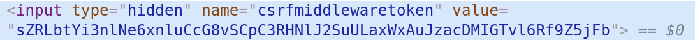

# URL Name

<br>

<br>

### 1. DB

<br>

#### DB initialization

1. Delete `db.sqlite3`
2. Delete `migration` files

<br>

#### Check `migration` files

```bash
python manage.py showmigrations
```

<br>

#### Create `migrations` again

```bash
python manage.py makemigrations
```

<br>

#### Output corresponding `SQL` statement

```bash
$ python manage.py sqlmigrate articles 0001
       [app_label] [migration_name]
BEGIN;
--
-- Create model Article
--
CREATE TABLE "articles_article" ("id" integer NOT NULL PRIMARY KEY AUTOINCREMENT, "title" varchar(140) NOT NULL, "content" text NOT NULL, "created_at" datetime NOT NULL, "updated_at" datetime NOT NULL);
COMMIT;
```

<br>

#### Run `migrate`

```bash
$ python manage.py migrate
  [app_label] [migration_name]
```

<br>

#### `create()`

> For creation, you can also do it as follows!

1.

   ```python
   Article.objects.create(title='title', content='content')
   ```

2.

   ```python
   article = Article(title='title', content='content')
   article.save()
   ```

<br>

#### `IntegrityError`

: This exception is raised when the relational integrity of the data is affected.

<br>

<br>

### 2. `GET` & `POST` method

- GET
  - Retrieve data
  - **Display** of specific resources
  - `<a>` tag, `<form>` tag and requests sent from browser address bar, etc.
  - Data is transmitted using `URL` (querystring)
    - Has size limitations & security issues
- POST
  - Post data
  - **Submit** to specific resources (server state change)
  - Usually sent to server through HTML `Form`, creating server changes
  - Data is transmitted in the `body` of HTTP request message

<br>

#### HTTP (Hyper Text Transfer Protocol)

- Protocol that allows resources to be fetched
- Foundation of all exchanges on the web

<br>

#### Request



- URL (Uniform Resource Locators)
  - Address of unique resource defined on the web
- protocol :// domain: port/ path/?parameters#anchor

<br>

#### Response


<br>

> views.py modification

```python
def create(request):
    article = Article()
    article.title= request.POST.get('title')
    article.content = request.POST.get('content')
    article.save()
    return redirect(f'/articles/{article.pk}/')
```

<br>

#### Adding `CSRF` token

```html
<form action="/articles/create/" method="POST">
    
</form>
```

<br>

> You can see that `csrf token` is added as a hidden value


<br>

#### Send simple request with Curl

```bash
curl -X GET http://chloecodes1.pythonanywhere.com/community/
```

<br>

#### Using Telnet

> Installation

```bash
sudo apt-get install telnetd
```

<br>

> Send request

```bash
telnet google.com 80
```

<br>

<br>

### 3. Specifying `app_name`

<br>

> urls.py

```python
from django.urls import path
from . import views

app_name = 'articles'

urlpatterns = [
    # /articles/
    path('', views.index, name='index'),
    path('new/', views.new, name='new'),
    path('create/',views.create, name='create'),
    path('<int:pk>/',views.detail, name='detail'),
    path('delete/<int:pk>/',views.delete, name='delete'),
    path('edit/<int:pk>/', views.edit, name='edit'),
    path('update/<int:pk>/', views.update, name='update'),
]
```

<br>

> views.py

```python
from django.shortcuts import render, redirect, get_object_or_404
from .models import Article

# Create your views here.

def index(request):
    articles = Article.objects.all()
    context = {
        'articles': articles
    }

    return render(request, 'articles/index.html', context)

def new(request):
    return render(request, 'articles/new.html')

def create(request):
    article = Article()
    article.title= request.POST.get('title')
    article.content = request.POST.get('content')
    article.save()

    # return redirect(f'/articles/{article.pk}/')
    return redirect('articles:detail', article.pk)


def detail(request, pk):
    article = Article.objects.get(id=pk)
    context = {
        'article':article
    }
    return render(request,'articles/detail.html', context)


def delete (request, pk):
    article = Article.objects.get(id=pk)
    article.delete()

    # return redirect(f'/articles/')
    return redirect('articles:index')


def edit(request, pk):
    article = get_object_or_404(Article, id = pk)
    context = {
        'article': article
    }

    return render(request, 'articles/edit.html', context)

def update (request,pk):
    article = Article.objects.get(id=pk)
    article.title = request.POST.get('title')
    article.content = request.POST.get('content')
    article.save()

    return redirect(f'/articles/{article.pk}/')
```

<br>

> In html

```html
<a class="navbar-brand" href=""> ... </a>

<a href=""> ... </a>

<form class="form-inline" action="" method="POST"> ... </form>
```

<br>

<br>

### 4. get_object_or_404

`article = Article.objects.get(id=pk)`

- get() raises error if value doesn't exist
  - Method that returns only one

- So what we use is

  ```python
  from django.shortcuts import render, redirect, get_object_or_404
   ...
  article = get_object_or_404(Article, id=pk)
  ```

<br>

<br>

### 5. Static files

<br>

> settings.py

```python
# Attached in front of serving URL
STATIC_URL = '/static/'

# Specify static folder not in app directory
STATICFILES_DIRS = [
    os.path.join(BASE_DIR, 'static')
]
```

<br>

<br>

<br>

`+`

### Traceroute

> `TraceRoute` - Linux / `TRACERT` - Windows

<br>

*A command that tracks the path information to reach a specified host and the delay time at each path, simply think of it as a path tracking tool (uses ICMP!)*

<br>

- A network command that tracks **path information** to reach a specified host and **delay time** at each path, useful for finding out where bottlenecks occur when *a specific site is not accessible or has delays*.

- By checking each path that gets connected, you can confirm **which path (Routing)** is used for connection, **how much** speed delay exists in **which section**, and **where** packets stopped

- However, values may vary due to many influences such as *time zone/internal traffic/server status*, so repeated confirmation is necessary!

<br>

> Install traceroute

```bash
sudo apt-get install traceroute
```

<br>

> Use traceroute

```bash
$ traceroute www.google.com
traceroute to www.google.com (172.217.31.164), 30 hops max, 60 byte packets
 1  _gateway (172.30.1.254)  5.195 ms  5.127 ms  5.105 ms
 2  220.78.3.1 (220.78.3.1)  5.071 ms * *
 3  125.141.249.21 (125.141.249.21)  5.364 ms  5.308 ms  5.262 ms
 4  * * *
 5  * * *
 6  112.174.73.178 (112.174.73.178)  6.510 ms 112.174.47.162 (112.174.47.162)  5.301 ms 112.174.73.178 (112.174.73.178)  4.858 ms
 7  74.125.52.16 (74.125.52.16)  31.913 ms  31.801 ms  33.951 ms
 8  108.170.242.129 (108.170.242.129)  36.142 ms 108.170.242.97 (108.170.242.97)  34.386 ms  34.811 ms
 9  209.85.253.109 (209.85.253.109)  36.711 ms  36.555 ms  36.483 ms
10  nrt12s22-in-f4.1e100.net (172.217.31.164)  34.998 ms  33.267 ms  32.844 ms
```

<br>

<br>

### MVC Pattern

- model driven design
- data modeling 
