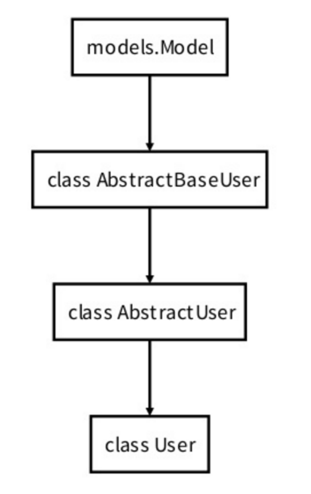
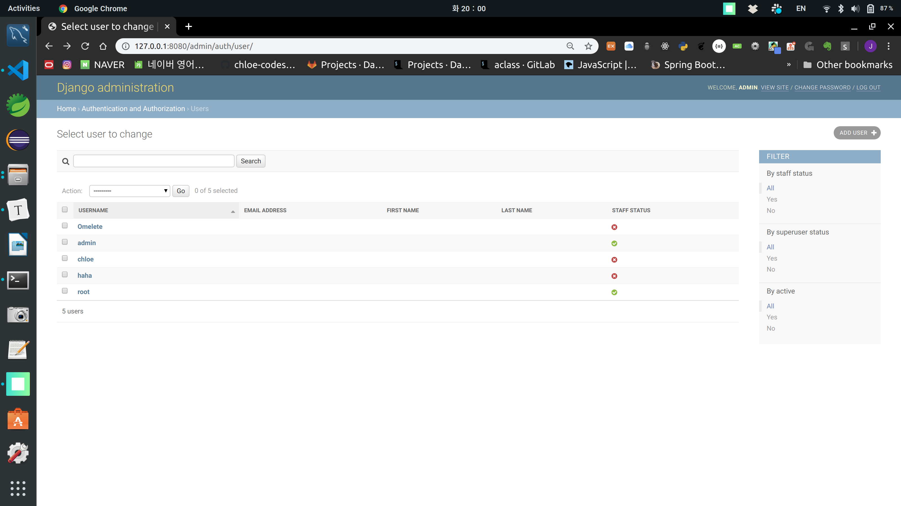

# Authentication

<br>

<br>

## User Registration

- Password provision and confirmation
  - Define additional columns in `UserCreationForm`
  - Check if they match in save logic
- Encrypted password storage
  - `User.objects.create_user(username, email=None, password=None)`
  - `user.set_password(password)`

<br>

<br>

## Login

<br>

*Is the user a logged in person?*

<br>

### Stateless & Connectionless

- Each request is an independent event
  - `cookie` connects this!

<br>

<br>

## User Object

```python
from django.contrib.auth.models import User
```

- core of the **authentication system**
- [`'superusers'`](https://docs.djangoproject.com/en/3.0/ref/contrib/auth/#django.contrib.auth.models.User.is_superuser) or admin [`'staff'`](https://docs.djangoproject.com/en/3.0/ref/contrib/auth/#django.contrib.auth.models.User.is_staff) users are just user objects with special attributes set, not different classes of user objects

<br>



<br>

- `AbstractBaseUser`
- `AbstractUser`
- `User`

<br>



<br>

### Primary attributes of default user

- `username`
- `password`
- `email`
- `first_name`
- `last_name`

<br>

<br>

### Creating Users

```python
from django.contrib.auth.models import User
user = User.objects.create_user('chloe', 'email-address@gmail.com', 'password-goes-here')

# At this point, user is a User object that has already been saved to the database. 

# You can continue to change its attributes, if you want to change other fields.
user.last_name = 'kim'
user.save()
```

<br>

<br>

### Changing Password

#### 1. Using command line

```bash
$ python manage.py changepassword haha
Changing password for user 'haha'
Password: 
Password (again): 
```

<br>

#### 2. Using `set_password()`

```shell
In [6]: ha = User.objects.get(username='haha')                                                                  

In [7]: ha                                                                                                      
Out[7]: <User: haha>

In [8]: ha.set_password('dkgkgkgk')                                                                             
In [9]: ha.save()             
```

<br>

<br>

### Authenticating Users

<br>

#### authenticate(*request*=None, ***credentials*)

- use it to verify a set of credentials
- takes credentials as keyword arguments
  - **username** and **password** for the default cases
- returns `User` object if credentials are valid for a backend

```python
from django.contrib.auth import authenticate
user = authenticate(username='chloe', password='dkgkgkgk')
if user is not None:
    # A backend authenticated the credentials
else:
    # No backend authenticated the credentials
```

<br>

<br>

<br>

Shopping Cart

1. User  ---> Shopping Cart ---> Coupang
2. User  <---    Cookie    <--- Coupang

- Shopping Cart == `cookie`
- Purchase History == `data`

<br>

*Login == create*

*Logout == delete*

<br>

<br>

### Login Form

```python
from django.contrib.auth.forms import UserCreationForm, AuthenticationForm
```

- `AuthenticationForm` is not a **ModelForm** but just a **Form**!

<br>

### Login Function

```python
from django.contrib.auth import get_user_model, login
```

<br>

```python
def signin(request):
    if request.method == 'POST':
        # Value sent by user -> form
        form = AuthenticationForm(request, request.POST)
        # Validation
        # -> Login when validation is complete
        if form.is_valid():
            login(request, form.get_user())
            return redirect('accounts:index')
    else:    
        form = AuthenticationForm()
    context = {
        'form':form 
    }
    return render(request, 'accounts/signin.html', context)
```

- Filter **POST** first with the first `if` to handle `else` statement smoothly
  - why?
    - If you filter **GET** first, when **POST** doesn't pass `.is_valid()` and falls to `else`, you have to write code to render again!
    - That is, *use **POST** first for code economy!*

`+`

#### Reason for branching **POST** first

1. Code conciseness
2. REST API support

- Currently we only support GET & POST, but when configuring methods RESTfully later, multiple methods like GET/POST/PUT/DELETE will come, and handling GET method at the end allows for the most concise code configuration!

<br>

<br>

## Message Framework

**new**

-> Post writing page (form)

**create**

-> Save to DB

-> render

-> redirect(success status)

-> redirect('articles:index')

<br>

*HTTP is a repetition of request and response!*

<br>

#### HTTP

- stateless
  - Once a request is sent, the state (past) cannot be known
  - All requests & responses are one-time
  - HTTP is a disconnected protocol
- connectionless

<br>

### Message Framework

- It's meaningful to pass the previous state to the next `Request` & `Response`
  - Fallback Storage
    - If Cookie doesn't work, use Session

<br>

<br>

## Dynamic view

<br>

Article CRUD

- title, content, created_at, updated_at

User CRUD (Manual < Django)

<br><br>

`+`

- in memory cache -> Think of it as cache loaded into ram
  - memcached
  - redis

- Google ad ID......gdpr
- macaddress = device information 
