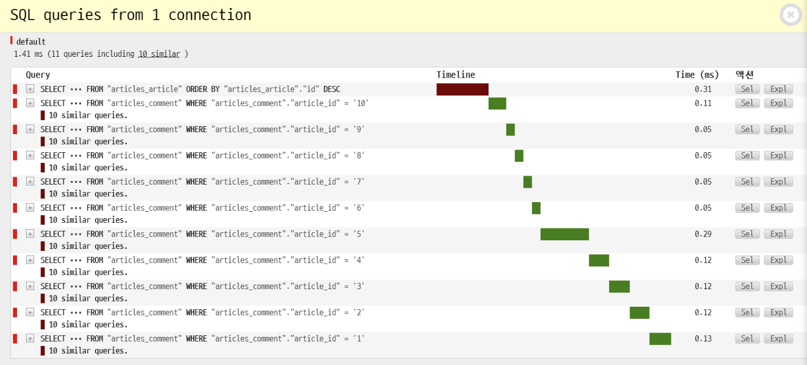
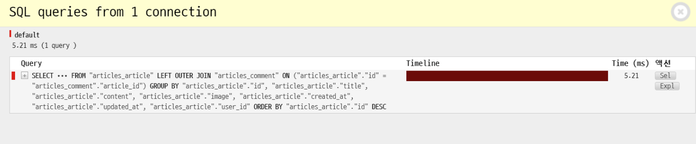
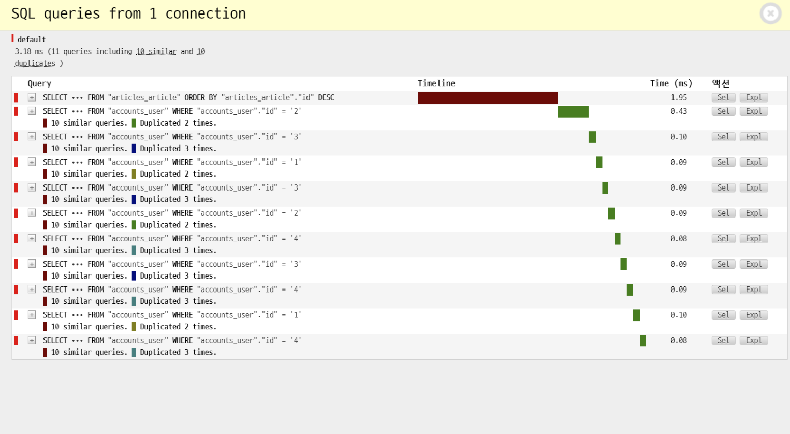
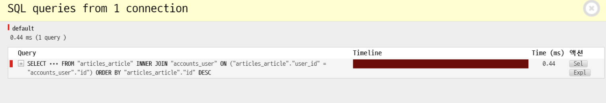
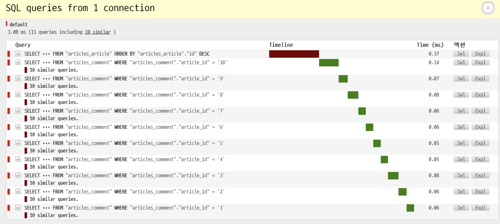
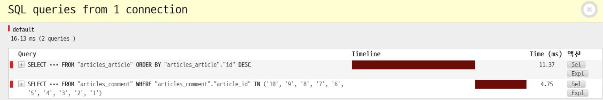
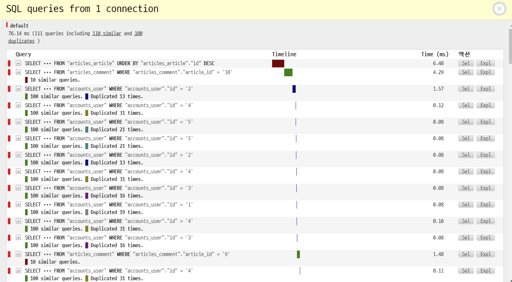
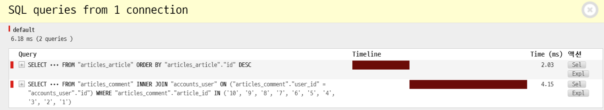

# Optimization

<br>

<br>

### SQL statement execution

- Iteration
- Slicing
  - Basically no
  - Only when using step
    - [3:10:2]
- repr
- len
- bool

<br>

<br>

## Query improvement

<br>

### Essential library: [django debug toolbar](https://django-debug-toolbar.readthedocs.io/en/latest/installation.html)

#### installation

```bash
pip install django-debug-toolbar
```

<br>

#### Prerequisites

> `settings.py`

```python
INSTALLED_APPS = [
    ...
    'debug_toolbar',
]
```

<br>

#### Setting up URLconf

> `urls.py` in the root directory

```python
from django.contrib import admin
from django.urls import path, include
from django.conf import settings
from django.conf.urls.static import static

if settings.DEBUG:
    import debug_toolbar
    urlpatterns = [
        path('__debug__/', include(debug_toolbar.urls)),
        path('admin/', admin.site.urls),
        path('posts/', include('posts.urls')),
        path('accounts/', include('accounts.urls')),
    ] + static(settings.MEDIA_URL, document_root=settings.MEDIA_ROOT)
```

<br>

#### Enabling middleware

> `settings.py`

```python
MIDDLEWARE = [
 ...
    'debug_toolbar.middleware.DebugToolbarMiddleware',
    ...
]
```

<br>

#### Configuring Internal IPs

> `settings.py`

```python
INTERNAL_IPS = [
    ...
    '127.0.0.1',
    ...
]
```

<br>

<br>

### 0. Related documentation

- #### Database optimization

  : <https://docs.djangoproject.com/en/3.0/topics/db/optimization/>

  - Understanding QuerySet execution: <https://docs.djangoproject.com/en/3.0/topics/db/optimization/#understand-queryset-evaluation>

    - Lazy, executed when evaluated, and can utilize cache. (check each document)

- #### `count`, `exists`

    - <https://docs.djangoproject.com/en/3.0/topics/db/optimization/#don-t-overuse-count-and-exists>
    - Generally good to use, but in the situation of the example code, you can solve it by getting length based on cached values

- #### `select_related`

    : <https://docs.djangoproject.com/en/3.0/ref/models/querysets/#django.db.models.query.QuerySet.select_related>

- #### `prefetch_related`

    : <https://docs.djangoproject.com/en/3.0/ref/models/querysets/#prefetch-related>

<br>

<br>

### 1. Output comment count - Using `annotate()`

> N+1 problem

<br>

#### Before improvement (11 times)

```python
# views.py
posts = Post.objects.order_by('-pk')
```

```html
<p>Comment count: {{ article.comment_set.count }}</p>
```

<br>



<br>

#### After improvement (1 time)

```python
# views.py
Post.objects.annotate(comment_set_count=Count('comment')).order_by('-pk')
```

```html
<!-- Note! Call with comment_set_count -->
<p>Comment count: {{ post.comment_set_count }}</p>
```

<br>



<br>

<br>

### 2. Output post author name - Using `select_related()`

> `select_related` fetches data through SQL JOIN
>
> In 1:1, 1:N relationships with reference relationship (N -> 1, where foreignkey is defined)

<br>

#### Before improvement (11 times)

```python
# views.py
posts = Post.objects.order_by('-pk')
```

```html
<h3>{{ article.user.username }}</h3>
```

<br>



<br>

#### After improvement (1 time)

```python
# views.py
Post.objects.select_related('user').order_by('-pk')
```

```html
<!-- No change -->
<h3>{{ article.user.username }}</h3>
```

<br>



<br>

<br>

### 3. Output comments for each post - Using `prefetch_related()`

> `prefetch_related` fetches data through Python join
>
> In M:N, 1:N relationships with reverse reference relationship (1->N)

<br>

#### Before improvement (11 times)

```python
# views.py
posts = Post.objects.order_by('-pk')
```

```html

 <p>{{ comment.content }}</p>

```

<br>



<br>

#### After improvement (2 times)

```python
posts = Post.objects.prefetch_related('comment_set').order_by('-pk')
```

```html
<!-- No change -->

 <p>{{ comment.content }}</p>

```

<br>



<br>

<br>

### 4. Output author name and comments for each post

<br>

#### Before improvement (111 times)

```python
# views.py
posts = Post.objects.order_by('-pk')
```

```html

 <p>{{ comment.user.username }} : {{ comment.content }}</p>

```

<br>



<br>

#### After improvement (2 times)

```python
# views.py
from django.db.models import Prefetch

posts = Post.objects.prefetch_related(
     Prefetch('comment_set',
  queryset=Comment.objects.select_related('user'))
 ).order_by('-pk')
```

```html

 <p>{{ comment.user.username }} : {{ comment.content }}</p>

```

<br>



<br>

<br>

## SQL Join

<br>


<br>

ex)

```mysql
-- Post(A) + Comment(B)
SELECT * FROM article
LEFT OUTER JOIN comment
ON article.id = comment.article_id;

-- Post(A) + User
SELECT * FROM article
INNER JOIN user
ON article.user_id = user.id;
```

<br>

<br>

`+`

## Setting profile photo using Gravatar

<https://en.gravatar.com/site/implement/>

<br>

### Method 1) @property setting

> accounts > models.py

```python
from django.db import models
from django.conf import settings
from django.contrib.auth.models import AbstractUser
import hashlib

# Create your models here.
# No model needed! Will use User from Django package!

# Creating custom user model
class User(AbstractUser):
    followers = models.ManyToManyField(
        settings.AUTH_USER_MODEL,
        related_name = 'followings'
    )

    @property
    def gravatar_url(self):
        return f"https://s.gravatar.com/avatar/{hashlib.md5(self.email.encode('utf-8').strip().lower()).hexdigest()}?s=50&d=mp"
```

<br>

### Method 2) Create templatetags

> accounts > templatetags > gravatar.py

```python
import hashlib
from django import template
from django.template.defaultfilters import stringfilter

register = template.Library()

@register.filter
@stringfilter
def profile_url(email):
    return f"https://s.gravatar.com/avatar/{hashlib.md5(email.encode('utf-8').strip().lower()).hexdigest()}?s=50&d=mp"
```

- Must create `__init__.py` inside `templatetags` directory!

<br>

<br>

### Templates

> templates > _nav.html

```html


...
<!--Method 1-->                  


<!--Method 2-->

          
...          
``` 
