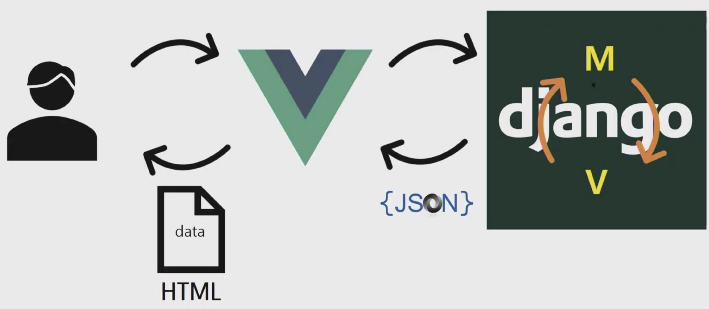
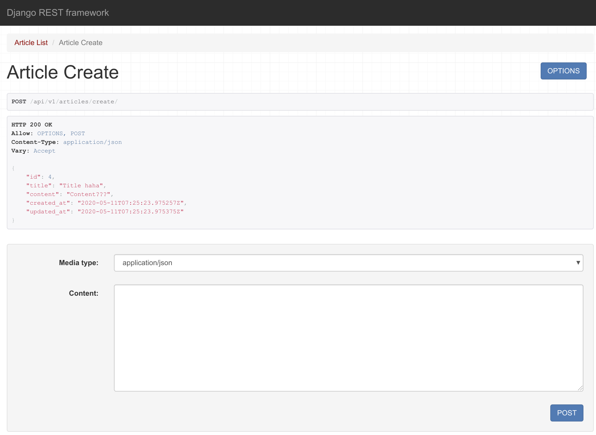
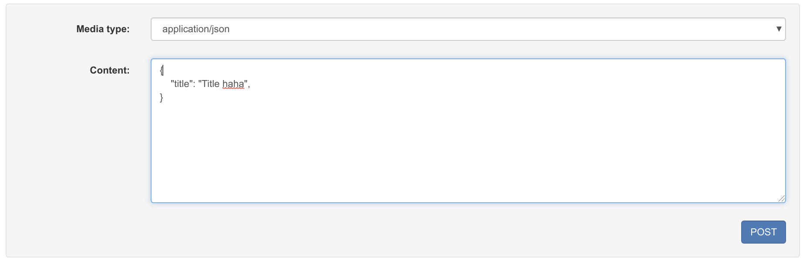
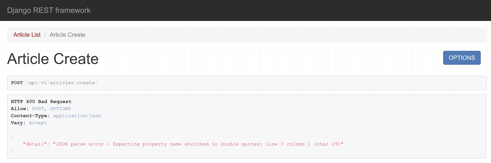

# Django REST Framework

<br>

<br>

### What is MVT?

Model: Data structuring

View: Where data flows

Template: Where data is displayed

<br>

### What is API?

- Application Programming Interface
  - Developer interface
    - Developers only need **Data**!

<br>

### Request

: Requests are sent via URL!

<br>

### Data notation

: Convention

<br>

- JSON
  - JavaScript Object Notation
  - Javascript object-style **notation**
- XML
  - eXtended Markup Language (W3C, 1996)

<br>

### Why not HTML?

: Key values are not reflected!

- That's why **XML** was introduced, allowing us to define `tags` as we wish

<br>

### Why JSON

- XML is longer due to closing tags
  - Money

<br>

### What we need to do

: *In Django, provide only data in JSON format!*

<br>

### JSON ... and then?



<br>

### Reasons for separating Javascript & framework

1. For better user experience

   - Bad UX -> No Users -> No Money

   - data -> What do humans like?
   - Mobile applications (web)
   - **churn (attrition rate)**
   - JS essential (Adobe Flash)

2. Because separation is convenient

<br>

<br>

### Reinstalling Django

```bash
pip uninstall django

pip install django==2.1.15
```

<br>

<br>

## Using Faker

<br>

### Install faker

```bash
pip install faker
```

<br>

### Create dummy data

```shell
In [1]: from faker import Faker                                                                                     

In [2]: f = Faker()                                                                                                 

In [3]: f.text()                                                                                                    
Out[3]: 'Soldier live various argue many expect important once. Next possible whom I.\nSome national left wall score few else always. Action less culture spring any night.'

In [4]: f.name()                                                                                                    
Out[4]: 'Jenna Davis'

In [5]: f.paragraph()                                                                                               
Out[5]: 'Improve knowledge hot matter himself. Growth water act bill to can discuss there. Follow out person vote action someone.'

In [6]: f.paragraph(4)                                                                                              
Out[6]: 'Early program four bill. Computer ...'
```

<br>

<br>

## RESTful API

> Reference: <https://meetup.toast.com/posts/92>

: A way to organize URLs neatly (common rules / conventions)

<br>

### RESTful

1. HTTP verb (GET, POST)
2. Composed of nouns (plural form)

<br>

### Rules

- Don't put verbs in URL! -> Use `HTTP method`
  - C (POST)
    - `(POST) / articles /`
  - R (GET)
    - index (all information) - `(GET) / articles /`
    - detail (one information) - `(GET) / articles / <id>`
  - U (PUT/PATCH)
    - `(PUT) / articles / <id>`
  - D (DELETE)
    - `(DELETE) / articles / <id>`
- Only put objects in URL -> In plural form
  - Data

<br>

<br>

### API related URLs

1. subdomain
   - ex)
     - lab.ssafy.com
     - api.github.com
2. Separated URL /api/
   - ssafy.com/api/lectures/
   - github.com/api/repos/

3. versioning
   - ssafy.com/api/v1/lectures/
   - POST /api/articles/1/like/
   - POST /api/articles/1/comments/like/

<br>

<br>

## Django REST Framework (DRF)

> Install djangorestframework

```bash
pip install djangorestframework
```

<br>

> Check if installed

```bash
$ pip show djangorestframework
Name: djangorestframework
Version: 3.11.0
Summary: Web APIs for Django, made easy.
Home-page: https://www.django-rest-framework.org/
Author: Tom Christie
Author-email: tom@tomchristie.com
License: BSD
Location: /home/chloe/.local/lib/python3.6/site-packages
Requires: django
Required-by: drf-serializer-cache
```

<br>

## Serialize (Serialization)

> Format conversion (data transmission/movement)

<br>

dict -> JSON (**stringify**, `serialize`)

JSON -> dict (**parse**, `deserialize`)

<br>

### Serialization  

### : Object(language, database) -> String (JSON)

<br>

<br>

### CREATE



<br>

<br>

### Pretty error output with `raise_exception`

ex)

```python
@api_view(['POST'])
def article_create(request):
    # Create article
    serializer = ArticleSerializer(data=request.data)
    if serializer.is_valid(raise_exception=True):
        serializer.save()
    return Response(serializer.data)
```

<br>

> Send only one



<br>

> Error message



<br>

<br>

## yasg

- Automatically generates API related documentation

### Install DRF yasg

> <https://drf-yasg.readthedocs.io/en/stable/readme.html>

```bash
pip install drf-yasg
```

<br>

<br>

## Loading dummy data as JSON

<br>

### Put `dummy.json` in fixtures folder

```
├── api
│   ├── __init__.py
│   ├── settings.py
│   ├── urls.py
│   └── wsgi.py
├── db.sqlite3
├── manage.py
└── musics
    ├── admin.py
    ├── apps.py
    ├── fixtures
    │   └── dummy.json
    ├── __init__.py
    ├── migrations
    ├── models.py
    ├── serializers.py
    ├── tests.py
    ├── urls.py
    └── views.py

7 directories, 29 files
```

<br>

### Put dummy.json into DB with `loaddata`

```bash
$ python manage.py loaddata dummy.json
Installed 14 object(s) from 1 fixture(s)
```

<br>

### Dump data from DB with `dumpdata`

```json
$ python manage.py dumpdata musics
[{"model": "musics.artist", "pk": 1, "fields": {"name": "Coldplay"}}, {"model": "musics.artist", "pk": 2, "fields": {"name": "Maroon5"}}, {"model": "musics.music", "pk": 1, "fields": {"artist": 2, "title": "Girls Like You"}}, {"model": "musics.music", "pk": 2, "fields": {"artist": 2, "title": "Sunday Morning"}}, {"model": "musics.music", "pk": 3, "fields": {"artist": 1, "title": "viva la vida"}}, {"model": "musics.music", "pk": 4, "fields": {"artist": 1, "title": "paradise"}}, {"model": "musics.comment", "pk": 1, "fields": {"music": 1, "content": "Girls Like You!!!"}}, {"model": "musics.comment", "pk": 2, "fields": {"music": 1, "content": "Maroon Five is awesome!"}}, {"model": "musics.comment", "pk": 3, "fields": {"music": 2, "content": "Sunday Morning~~~"}}, {"model": "musics.comment", "pk": 4, "fields": {"music": 2, "content": "But tomorrow is Monday"}}, {"model": "musics.comment", "pk": 5, "fields": {"music": 3, "content": "Still good after 10 years"}}, {"model": "musics.comment", "pk": 6, "fields": {"music": 3, "content": "I feel like I became a king!"}}, {"model": "musics.comment", "pk": 7, "fields": {"music": 4, "content": "Paradise para-para-paradise~"}}, {"model": "musics.comment", "pk": 8, "fields": {"music": 4, "content": "Hidden masterpiece!!!"}}]
```

<br>

### Create JSON file from dumped data with `dumpdata`

> This way they stick together

```bash
python manage.py dumpdata musics > dump.json
```

<br>

### Make it pretty with indenting

> `--indent 2`  -> Give indenting of 2

```bash
python manage.py dumpdata musics --indent 2 > dump2.json
```

<br>

> result

```json
[
{
  "model": "musics.artist",
  "pk": 1,
  "fields": {
    "name": "Coldplay"
  }
},
{
  "model": "musics.artist",
  "pk": 2,
  "fields": {
    "name": "Maroon5"
  }
},
{
  "model": "musics.music",
  "pk": 1,
  "fields": {
    "artist": 2,
    "title": "Girls Like You"
  }
},
{
  "model": "musics.music",
  "pk": 2,
  "fields": {
    "artist": 2,
    "title": "Sunday Morning"
  }
},
{
  "model": "musics.music",
  "pk": 3,
  "fields": {
    "artist": 1,
    "title": "viva la vida"
  }
},
{
  "model": "musics.music",
  "pk": 4,
  "fields": {
    "artist": 1,
    "title": "paradise"
  }
},
{
  "model": "musics.comment",
  "pk": 1,
  "fields": {
    "music": 1,
    "content": "Girls Like You!!!"
  }
},
{
  "model": "musics.comment",
  "pk": 2,
  "fields": {
    "music": 1,
    "content": "Maroon Five is awesome!"
  }
},
{
  "model": "musics.comment",
  "pk": 3,
  "fields": {
    "music": 2,
    "content": "Sunday Morning~~~"
  }
},
{
  "model": "musics.comment",
  "pk": 4,
  "fields": {
    "music": 2,
    "content": "But tomorrow is Monday"
  }
},
{
  "model": "musics.comment",
  "pk": 5,
  "fields": {
    "music": 3,
    "content": "Still good after 10 years"
  }
},
{
  "model": "musics.comment",
  "pk": 6,
  "fields": {
    "music": 3,
    "content": "I feel like I became a king!"
  }
},
{
  "model": "musics.comment",
  "pk": 7,
  "fields": {
    "music": 4,
    "content": "Paradise para-para-paradise~"
  }
},
{
  "model": "musics.comment",
  "pk": 8,
  "fields": {
    "music": 4,
    "content": "Hidden masterpiece!!!"
  }
}
]
``` 
