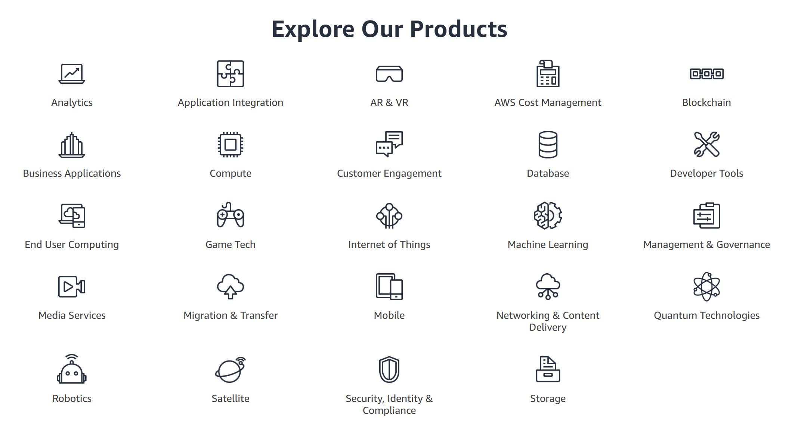
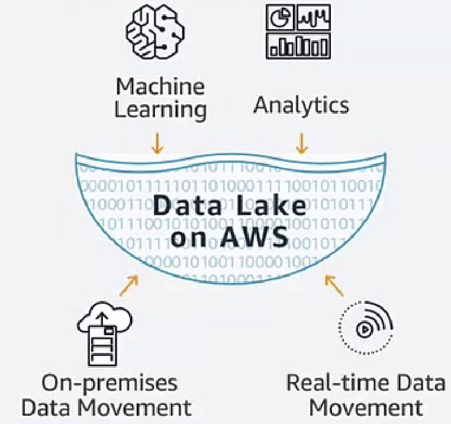

# AWS Main Products

 

 

 

## Networking and Content Delivery

The different products in the networking and content delivery services of AWS are as follows:

 

- #### Amazon Virtual Private Cloud (VPC)

[AWS VPC](https://www.whizlabs.com/blog/aws-vpc/) helps in provisioning a logically isolated section of the AWS cloud for launching AWS resources in a virtual network. VPC provides better control over the virtual networking environment.

- #### AWS PrivateLink

[AWS PrivateLink](https://aws.amazon.com/privatelink/) is one of the prominent mentions in a new AWS cheat sheet. It provides better data security and private connectivity between AWS services, VPCs, and on-premises applications.

- #### Amazon CloudFront

[Amazon CloudFront](https://www.whizlabs.com/blog/aws-cloudfront-introduction/) is the ideal content delivery network (CDN) of AWS. It helps in the secure delivery of data, applications, APIs, and videos to customers all over the world.

- #### Amazon Route 53

The Domain Name System (DNS) web service of AWS is ideal for routing end users to internet applications. [Route 53](https://www.whizlabs.com/blog/route-53-policies/) is crucial for connecting user requests to infrastructure running on AWS.

- #### AWS Direct Connect

[AWS Direct Connect](https://aws.amazon.com/directconnect/) is a cloud service solution for establishing a dedicated network connection between on-premises and AWS.

- #### AWS Cloud Map

The [Cloud Map](https://aws.amazon.com/cloud-map/) is one of the latest entries in AWS glossary. It is the cloud resource discovery service on AWS that helps in registering application resources. This AWS product also helps in checking the health of resources consistently.

- #### AWS App Mesh

The [App Mesh](https://aws.amazon.com/app-mesh/) is a service mesh for easier application-level networking and communication between services across various types of infrastructure.

- #### AWS Transit Gateway

The [Transit Gateway](https://aws.amazon.com/transit-gateway/) is an AWS networking and CDN product. It helps in connecting Amazon VPCs and on-premises networks with a single gateway.

- #### AWS Global Accelerator

[Global Accelerator](https://aws.amazon.com/global-accelerator/) is one of the prominent additions among AWS terms recently. It is a networking service for improving the availability and performance of applications offered to global users.

- #### Elastic Load Balancing

[ELB](https://www.whizlabs.com/blog/how-elastic-load-balancing-works/) is a helpful product for the automatic distribution of incoming application traffic among multiple targets.

  

## Computing

The computing services category has many entries in the AWS products cheat sheet. The following products are visible in the updated AWS cheat sheet 2019.

 

- #### Amazon EC2 (Elastic Compute Cloud)

[EC2](https://aws.amazon.com/ec2/) provides virtual servers capable of giving scalable computing capacity on the cloud.

- #### Amazon EC2 Auto Scaling

[EC2 Auto Scaling](https://aws.amazon.com/ec2/autoscaling/) is a reliable tool for maintaining application availability and automatic addition or exclusion of EC2 instances.

- #### Amazon Elastic Container Service (ECS)

The [Elastic Container Service](https://aws.amazon.com/ecs/) is a comparatively new addition to the AWS glossary. It is a container orchestration service with support for Docker containers and higher performance and scalability.

- #### Amazon Elastic Container Service for Kubernetes

[Amazon Elastic Container Service for Kubernetes](https://aws.amazon.com/blogs/aws/amazon-elastic-container-service-for-kubernetes/) is fit for easier deployment, management, and scaling containerized applications through Kubernetes on AWS.

`Kubernetes`

: 컨테이너를 쉽고 빠르게 배포/확장하고 관리를 자동화해주는 오픈소스 플랫폼

  

## Amazon Elastic Container Registry

[Amazon ECR](https://aws.amazon.com/ecr/) completely managed Docker container registry provides ease of storing, management, and deployment of Docker container images.  

- #### Amazon Lightsail

[Lightsail](https://aws.amazon.com/lightsail/) is the perfect product in AWS terminology cheat sheet for using AWS for simple virtual private server (VPS) solutions.

- #### AWS Batch

[AWS Batch](https://aws.amazon.com/batch/) is helpful for the dynamic provision of the right quantity and type of compute resources. AWS Batch is fit for running multiple batch computing jobs on AWS with ease and efficiency.

- #### AWS Elastic Beanstalk

[Elastic Beanstalk](https://aws.amazon.com/elasticbeanstalk/) serves as an application container for container deployment and management.

- #### AWS Fargate

[Fargate](https://aws.amazon.com/fargate/) is a compute engine for Amazon ECS and helps in running containers without managing servers or clusters.

- #### AWS Lambda

[AWS Lambda](https://aws.amazon.com/lambda/) is one of the significant AWS terms for ensuring responsive execution of code and automatic management of computing resources.

- #### AWS Serverless Application Repository

As the name implies, [AWS Serverless Application Repository](https://aws.amazon.com/serverless/serverlessrepo/) provides a managed repository for storing serverless applications.

- #### AWS VMware Cloud

[AWS VMware](https://aws.amazon.com/vmware/) provides the opportunity for migrating on-premises VMware based environments to AWS cloud.

- #### AWS Outposts

[AWS Outposts](https://aws.amazon.com/outposts/) is still in the review stage for the AWS cheat sheet 2019. It can help in obtaining the facilities of AWS services, operating models, and infrastructure to any datacenter.

  

## Storage

You can also find many dominant names from AWS glossary in the storage services category as follows.

- #### Amazon S3

[Amazon S3](https://www.whizlabs.com/blog/aws-s3/) helps in storing almost any type of data object or flat files in the cloud.

- #### Amazon Elastic Block Store (EBS)

[EBS](https://aws.amazon.com/ebs/) helps in providing persistent block storage volumes with Amazon EC2 instances in the AWS cloud.

- #### Amazon Elastic File System (EFS)

[Amazon EFS](https://aws.amazon.com/efs/) gives a simple and elastic file system for Linux-based workloads.

- #### Amazon S3 Glacier

[Amazon S3 Glacier](https://aws.amazon.com/glacier/) is the ideal source for secure and durable low-cost storage for cold data.

- #### AWS Storage Gateway

[AWS Storage Gateway](https://aws.amazon.com/storagegateway/?whats-new-cards.sort-by=item.additionalFields.postDateTime&whats-new-cards.sort-order=desc) is not new in the AWS terminology cheat sheet. It is a hybrid storage service for enabling on-premises applications for seamless AWS cloud storage applications.

- #### AWS Snow Family

[Snow Family](https://aws.amazon.com/snow/) comprises of various physical devices and capacity points primarily suited for data transfer in and out of AWS.

- #### Amazon FSx for Lustre

[Amazon FSx for Lustre](https://aws.amazon.com/fsx/lustre/) is another name in AWS cheat sheet. It is a high-performance file system tailored for faster workload processing.

- #### Amazon FSx for Windows File Server

[This product](https://aws.amazon.com/fsx/windows/) gives a completely managed native Microsoft Windows file system for easy migration of Windows-based applications.

- #### AWS Backup

[AWS Backup](https://aws.amazon.com/backup/) is a fully managed backup service of AWS for easy centralization and automation of data backups throughout the AWS landscape.

  

## Database

 

- #### Amazon Aurora

The mention of [Amazon Aurora](https://aws.amazon.com/rds/aurora/) in AWS cheat sheet is not new. It is a relational database compatible with MySQL and PostgreSQL with traits of availability, performance, simplicity, and cost-effectiveness.

- #### Amazon RDS

[RDS](https://aws.amazon.com/rds/) helps in the easier establishment, operations, and scaling of a relational database on the cloud.

- #### Amazon DynamoDB

[DynamoDB](https://aws.amazon.com/dynamodb/) is a document and key-value pair database that is highly efficient.

- #### Amazon ElastiCache

[ElastiCache](https://aws.amazon.com/elasticache/) is one of the oldest products in the AWS cheat sheet. It is ideal for seamless deployment, execution, and scaling of renowned in-memory data stores compatible with opensource.

- #### Amazon Neptune

[Neptune](https://aws.amazon.com/neptune/) is a graph database service that is fully managed, fast, and reliable. It helps in building and running applications which can work with highly connected datasets easily.

- #### AWS Database Migration Service

This is one of the oldest AWS terms which has been in place since 2016. As the name implies, [AWS Database Migration Service](https://aws.amazon.com/dms/) helps in secure and quick migration of databases to AWS.

- #### Amazon Timestream

[Timestream](https://aws.amazon.com/timestream/) is a new, scalable, fast, and fully managed time-series database service. It is ideal for IoT and operational applications and is known for efficient data storage and processing in time intervals.

- #### Amazon RDS on VMware

[This product](https://aws.amazon.com/rds/vmware/) is still in preview and can help in deploying a managed database in on-premises VMware environments.

- #### Amazon DocumentDB

Recently launched, [DocumentDB](https://www.whizlabs.com/blog/amazon-documentdb/) is a highly available and scalable, fully-managed document database service with support for MongoDB workloads.

The two other products in storage services of AWS include Amazon RedShift and Amazon Quantum Ledger Database. We shall reflect on these products in the Analytics and Blockchain categories, respectively.

  

## Analytics

Analytics have become very important for data-driven organizations in the present time. So, AWS has also introduced certain products for supporting analytics tasks. Let us take a look at the AWS products cheat sheet for the Analytics services category.  

- #### Amazon Athena

[Amazon Athena](https://aws.amazon.com/athena/) is an interactive query service tailored for easier analysis of data in S3 by leveraging standard SQL.

- #### Amazon CloudSearch

[CloudSearch](https://aws.amazon.com/cloudsearch/) is one of the oldest mentions in AWS cheat sheet. It helps in establishing, managing, and scaling a search solution for a website or application with simplicity and cost-effectiveness.

- #### Amazon Elasticsearch Service

[Amazon Elasticsearch Service](https://aws.amazon.com/elasticsearch-service/) – Users can deploy, secure, and operate Elasticsearch according to scale with zero downtime.

- #### Amazon EMR

[Elastic Map Reduce or EMR](https://aws.amazon.com/emr/) is a product providing a managed `Hadoop` (= software framework for distributed storage )  framework for easier, faster, and cost-effective means for data processing.

- #### Amazon Kinesis

[Amazon Kinesis](https://aws.amazon.com/kinesis/) is a prolific tool for collection, processing, and analysis of real-time streaming data to obtain insights and take decisions on time.

- #### Amazon Redshift

[RedShift](https://aws.amazon.com/redshift/) provides a faster and scalable data warehouse for simpler and cost-effective analysis of data in your data lake and data warehouse.

- #### Amazon Quicksight

[Amazon QuickSight](https://aws.amazon.com/quicksight/) is an important product for delivery of insights to every individual in the organization.

- #### AWS Data Pipeline

[AWS Data Pipeline](https://aws.amazon.com/datapipeline/) is a regular in AWS products cheat sheet. It is a web service for reliable data processing and data migration between compute and storage services on AWS.

- #### AWS Glue

[AWS Glue](https://aws.amazon.com/glue/) is an ETL (Extract, Transform, and Load) service for easier preparation and loading of data for analytics.

- #### Amazon Managed to Stream for Kafka

[This product](https://aws.amazon.com/msk/) is helpful for building and running applications using Apache Kafka for processing streaming data.

- #### AWS Lake Formation

[Lake Formation](https://aws.amazon.com/lake-formation/) helps in collection and cataloging of data from databases and data storage. It is ideal for setting up a secure data lake within a limited time.

-> Data lake(가공전의 raw data) 및 analysis solution 구축을 위한 가장 포괄적이고, 안전하고, 확장 가능하며 비용 효율적인 service portfolio

-> AWS는 보안 또는 governance (관리) 를 저하하지 않으면서 모든 관련 데이터에 쉽게 access 할 수 있는 가장 광범위한 분석 및 machine learning service를 제공함

  

## Security and Identity Management

Security and identity are other formidable principles of AWS service. The common entries in AWS cheat sheet in this category are as follows.  

- #### AWS Resource Access Manager (RAM)

[Resource Access Manager](https://aws.amazon.com/ram/) service helps in easily sharing AWS resources with the highest security possible.

- #### AWS Identity and Access Management (IAM)

[AWS IAM](https://aws.amazon.com/iam/) in the AWS services cheat sheet is one of the oldest entries. IAM is the go-to option for managing access to AWS services and resources with high security.

- #### Amazon Cloud Directory

[Amazon Cloud Directory](https://aws.amazon.com/cloud-directory/) helps in building flexible cloud-native directories to ensure appropriate organization of data hierarchy across multiple dimensions.

- #### Amazon Cognito

[Amazon Cognito](https://aws.amazon.com/cognito/) is an effective tool for adding user sign-up, sign-in, and access privileges to web and mobile apps easily and effectively.

- #### AWS Single Sign-On

The [Cloud SSO](https://aws.amazon.com/single-sign-on/) service helps in easier central management of SSO access to multiple business applications and AWS accounts.

- #### Amazon GuardDuty

[Amazon GuardDuty](https://aws.amazon.com/guardduty/) is a threat-detection service meant for continuous monitoring to find out unauthorized behavior or malicious activity.

- #### Amazon Inspector

[Inspector](https://aws.amazon.com/inspector/) is an automated security assessment tool for improving security and compliance for applications with deployment on AWS.

- #### Amazon Macie

[Macie](https://aws.amazon.com/macie/) is a security service in this AWS cheat sheet that is an ideal security tool. Macie uses machine learning for automatic discovery, classification, and protection for sensitive data in AWS.

- #### AWS Certificate Manager

AWS certificate manager helps in provisioning, management, and deployment of public and private SSL/TLS certificates with security.

- #### AWS CloudHSM

The [CloudHSM](https://aws.amazon.com/cloudhsm/) is a cloud-based hardware security model (HSM). This product can help in the easy generation and use of its own encryption keys on the AWS cloud.

- #### AWS Directory Service

The [AWS directory service](https://aws.amazon.com/directoryservice/) has Microsoft Active Directory as its basic foundation. It can help in enable AWS resources and directory-aware workloads to use managed Active Directory.

- #### AWS Firewall Manager

[Firewall Manager](https://aws.amazon.com/firewall-manager/) is a security management service on AWS which helps in easier central configuration and management of AWS WAF rules.

- #### AWS Key Management Service

[AWS Key management service](https://www.whizlabs.com/blog/aws-kms/) is also one of the notable entries in AWS services cheat sheet. It is a secure and durable service that helps in creating and managing keys alongside establishing control over encryption usage.

- #### AWS Secrets Manager

[This tool](https://aws.amazon.com/secrets-manager/) can help in safeguarding the secrets that are important for accessing applications, IT resources, and services.

- #### AWS Shield

[Shield](https://aws.amazon.com/shield/) is a type of Distributed Denial of Service (DDoS) mechanism which is fully managed and protects applications on AWS.

- #### AWS WAF

[Web Application Firewall](https://aws.amazon.com/waf/) is ideal for preventing the vulnerability of web applications. It helps in protecting application availability, resources, and security.

- #### AWS Artifact

[AWS artifacts](https://aws.amazon.com/artifact/) provide information related to compliance. Artifacts include Service Organization Control (SOC) reports, Payment Card Industry (PCI) reports and other certifications.

- #### AWS Security Hub

[AWS Security Hub](https://aws.amazon.com/security-hub/) is also one of the notable names in AWS Glossary which has not made its mark yet. The Security Hub can provide a detailed view of security alerts with high-priority and compliance status of various AWS accounts.

  

## Management Tools

Finally, another formidable entry among AWS products in this cheat sheet is in the management tools category.

- #### AWS Chatbot

The interactive [chatbot](https://aws.amazon.com/chatbot/) helps in monitoring and interaction with AWS resources

- #### Amazon CloudWatch

[CloudWatch](https://aws.amazon.com/cloudwatch/) is one of the earliest AWS terms. It serves as a monitoring and management service for developers, site reliability engineers, IT managers, and system operators.

- #### AWS Auto Scaling

[Auto Scaling](https://aws.amazon.com/autoscaling/) is an important addition in AWS terminology cheat sheet. It helps in monitoring applications and automatic capacity adjustments.

- #### AWS CloudFormation

[CloudFormation](https://aws.amazon.com/cloudformation/) is the common terminology for describing and provisioning of all infrastructure resources in a cloud environment.

- #### AWS CloudTrail

[CloudTrail](https://aws.amazon.com/cloudtrail/) is a service for ensuring governance, compliance, operational auditing, and risk auditing functions.

- #### AWS Config

[Config](https://aws.amazon.com/config/) service helps in the assessment, auditing, and evaluation of AWS resource configurations.

- #### AWS OpsWorks

[OpsWorks](https://aws.amazon.com/opsworks/) is a configuration management service for providing managed instances of Puppet and Chef.

- #### AWS Service Catalog

[This product](https://aws.amazon.com/servicecatalog/?aws-service-catalog.sort-by=item.additionalFields.createdDate&aws-service-catalog.sort-order=desc) in the AWS cheat sheet 2019 helps businesses in the creation and management of catalogs for AWS-approved IT services.

- #### AWS Systems Manager

The [AWS systems manager](https://aws.amazon.com/systems-manager/) is an ideal tool for better transparency and control over the AWS infrastructure.

- #### AWS Trusted Advisor

The [AWS Trusted Advisor](https://aws.amazon.com/premiumsupport/technology/trusted-advisor/) is a helpful online instrument for real-time guidance on the provisioning of resources.

- #### AWS Personal Health Dashboard

The [personal health dashboard](https://aws.amazon.com/premiumsupport/technology/personal-health-dashboard/) helps in viewing alerts and guidance on resolving issues in case of disruptive events.

- #### AWS Control Tower

The [Control Tower](https://aws.amazon.com/controltower/) is suitable for automating set-up of the landing zone and configuration of AWS management and security services.

- #### AWS License Manager

The [AWS License Manager](https://aws.amazon.com/license-manager/) improves the ease of managing licenses in on-premises and AWS servers.

- #### AWS well-architected Tool

The [AWS well-architected tool](https://aws.amazon.com/well-architected-tool/) is used for reviewing the state of workloads and comparing them with the latest best practices in AWS architecture.

- #### AWS Console Mobile Application

The new [Console Mobile Application](https://aws.amazon.com/console/mobile/) on AWS cheat sheet 2019 is helpful for users to view and manage a specific set of resources. This product can help in supporting incident response without any disruption.

- #### AWS Management Console

The [Management Console](https://aws.amazon.com/console/) is a helpful avenue for cloud management of all aspects, such as security credentials or cost management.

- #### AWS Managed Services

[AWS Managed Services](https://aws.amazon.com/managed-services/) is a unique addition in the AWS services cheat sheet. This service provides AWS operations on your behalf by a Managed Service Provider.

- #### AWS Organizations

[AWS Organizations](https://aws.amazon.com/organizations/) is a new tool for central governance of the environment alongside the growth and scaling of workloads on AWS.

- #### AWS Command Line Interface (CLI)

The [AWS Command Line Interface](https://aws.amazon.com/cli/) is also an important product in the management tools category of AWS services. However, we shall throw light on AWS CLI in the developer tools section of this AWS cheat sheet.

  

## Application Services

 

- #### Amazon EventBridge

This entry in AWS glossary is recent, and it is a serverless event bus. [EventBridge](https://aws.amazon.com/eventbridge/) helps in connection of applications by using data from AWS services, own apps, and SaaS apps.

- #### AWS Step Functions

[This product](https://aws.amazon.com/step-functions/) helps in the coordination of multiple AWS servers to form serverless workflows.

- #### Amazon Simple Queue Service (SQS)

A [simple message queuing service](https://aws.amazon.com/sqs/) for decoupling and scaling microservices, serverless applications, and distributed systems.

- #### Amazon Simple Notification Service (SNS)

[AWS SNS](https://aws.amazon.com/sns/) gives a messaging service for decoupling microservices, serverless applications, and distributed systems.

- #### Amazon MQ

[Amazon MQ](https://aws.amazon.com/amazon-mq/) is a managed message broker service. MQ is built with Apache ActiveMQ in mind and helps in easy setup and operations of message brokers in the cloud.

- #### Amazon AppSync

[AppSync](https://aws.amazon.com/appsync/) is a recent addition among AWS terms. It is an AWS product for simplifying application development through the creation of a flexible API.

  

## Developer Tools

 

- #### AWS Cloud Development Kit

The [Cloud Development Kit](https://aws.amazon.com/cdk/) is an open-source development framework. It helps in modeling and provisioning cloud application resources effectively.

- #### AWS Codestar

[AWS Codestar](https://aws.amazon.com/codestar/) helps in quick development and deployment of applications on AWS.

- #### AWS CodeCommit

[CodeCommit](https://aws.amazon.com/codecommit/) is a fully-managed source control service that helps in easier team collaboration on code.

- #### AWS CodeBuild

[CodeBuild](https://aws.amazon.com/codebuild/) is a completely managed continuous integration service for the compilation of source code, running tests and producing software packages.

- #### AWS CodeDeploy

[CodeDeploy](https://aws.amazon.com/codedeploy/) is a fully managed deployment service for automation of software deployments.

- #### AWS CodePipeline

[CodePipeline](https://aws.amazon.com/codepipeline/) is one of the prominent names in AWS glossary since 2015. It is a fully managed continuous delivery service for automation of release pipelines.

- #### AWS Cloud9

[Cloud9](https://aws.amazon.com/cloud9/) is a cloud-based integrated development environment (IDE) for writing, running, and debugging code.

- #### AWS X-ray

[X-ray](https://aws.amazon.com/xray/) product of AWS helps in the analysis and debugging of the production stage, distributed applications.

- #### AWS Command Line Interface

The [Command Line Interface (CLI)](https://aws.amazon.com/cli/) tool provides an integrated solution for the management of AWS services.

- #### Amazon Corretto

[Corretto](https://aws.amazon.com/corretto/) is one of the latest additions in the AWS Cheat sheet. It is a free, multi-platform distribution of Open Java Development Kit ready for production.

- #### AWS Tools and SDKs

[Tools and SDKs on AWS](https://aws.amazon.com/getting-started/tools-sdks/) help in accessing and managing AWS services with desired development platform or language.

  

## Mobile Services

 

- #### AWS Amplify

[AWS Amplify](https://aws.amazon.com/amplify/) is a recent addition in AWS glossary after 2017. It helps in the creation, configuration, and implementation of scalable mobile and web apps based on AWS.

- #### Amazon API Gateway

[This product](https://aws.amazon.com/api-gateway/) helps developers for easy creation, publishing, maintenance, monitoring, and security of APIs at different scales.

- #### AWS Device Farm

[AWS Device Farm](https://aws.amazon.com/device-farm/) is an app testing service for testing and interacting with Android, iOS, or web apps on many devices simultaneously.

The other two products in this category are Amazon Pinpoint and AWS AppSync. We have discussed AWS AppSync in the Application services section. Amazon Pinpoint is relevant to the customer engagement services section.  

  

## AR & VR

 

- #### Amazon Sumerian

[Sumerian](https://aws.amazon.com/sumerian/) is the latest addition in the AWS cheat sheet. It helps in creating and running virtual reality (VR), 3D, and augmented reality (AR) applications easily and quickly.

ex 1 ) 전 세계의 신규 입사자를 교육할 수 있는 가상 강의실 구축

ex 2 ) 원격으로 건물을 돌아볼 수 있는 가상 환경 구축

  

## AWS Cost Management

 

- #### AWS Cost Explorer

[AWS Cost Explorer](https://aws.amazon.com/aws-cost-management/aws-cost-explorer/) is very helpful in visualization, understanding, and management of AWS costs and usage over time.

- #### AWS Budgets

[AWS Budgets](https://aws.amazon.com/aws-cost-management/aws-budgets/) allows users to set custom budgets for alerts when overspending is evident.

- #### Reserved Instance Reporting

[The reports](https://aws.amazon.com/aws-cost-management/reserved-instance-reporting/) can help in identifying custom RI utilization and coverage targets and visualization of progress towards objectives.

- #### AWS Cost and Usage Report

The [Cost and Usage report](https://docs.aws.amazon.com/awsaccountbilling/latest/aboutv2/billing-reports-costusage.html) on AWS is a helpful tool in the AWS cheat sheet 2019. It can provide a clear impression of AWS usage in the individual service category and for IAM users in terms of hourly or daily line items.

  

## Blockchain

 

- #### Amazon Managed Blockchain

[This AWS product](https://aws.amazon.com/managed-blockchain/) is still in preview. It can help in easier setup, deployment, and management of scalable blockchain networks.

- #### Amazon Quantum Ledger Database (QLDB)

The [QLDB](https://aws.amazon.com/qldb/) is also in preview and can come into AWS services cheat sheet very soon. It serves as a ledger database for providing a transparent, verifiable, and immutable transaction log under the ownership of a central trusted authority.

  

## Enterprise Apps

 

- #### Alexa for Business

[Organizations and employees could use Alexa](https://aws.amazon.com/alexaforbusiness/) for achieving better productivity with this product.

- #### Amazon Chime

A unique addition to the modern AWS cheat sheet, the [Amazon Chime](https://aws.amazon.com/chime/) is a communications service. It helps in the meeting, chatting, and addressing calls using only a single application.

- #### Amazon WorkMail

[Amazon WorkMail](https://aws.amazon.com/workmail/) is a high-security managed business email and calendar service providing support for existing desktop and mobile email client applications.

  

## Customer Engagement

 

- #### Amazon Connect

The [self-service contact center service](https://aws.amazon.com/connect/) based on the AWS cloud helps in simpler delivery of customer service.

- #### Amazon Pinpoint

A helpful new addition among AWS terms, [Pinpoint](https://aws.amazon.com/pinpoint/) helps in sending targeted messages to the audience through various channels.

- #### Amazon Simple Email Service (SES)

[SES](https://aws.amazon.com/ses/) is a prolific email sending service meant for sending marketing, transactional, or notification emails.

  

## End-User Computing

 

- #### Amazon WorkSpaces

[WorkSpaces](https://aws.amazon.com/workspaces/) are helpful tools for provisioning Windows or Linux IS in few minutes. It helps in quick scalability for providing multiple OS platforms to workers throughout the world.

- #### Amazon AppStream 2.0

This is a completely [managed application streaming service](https://aws.amazon.com/appstream2/) in this AWS cheat sheet.

- #### Amazon WorkDocs

[WorkDocs](https://aws.amazon.com/workdocs/) is reliable content creation, storage, and collaboration service on AWS.

- #### Amazon WorkLink

[WorkLink](https://aws.amazon.com/worklink/) is a prominent addition in this AWS cheat sheet that provides easy and secure access to the internal website, web apps, and web content.

  

## Game Tech

 

- #### Amazon GameLift

[GameLift](https://aws.amazon.com/gamelift/) is the managed service for deployment, operations, and scaling of dedicated game servers ideal for session-based multiplayer games.

- #### Amazon Lumberyard

[Lumberyard](https://aws.amazon.com/lumberyard/) is the free cross-platform AAA game engine with prominent integration with Twitch and AWS.

  

## Internet of Things

 

- #### AWS IoT Core

[IoT Core](https://aws.amazon.com/iot-core/) is one of the notable additions in the AWS cheat sheet. It is a managed cloud service for secure and easy interaction of connected devices with cloud applications and devices.

- #### Amazon FreeRTOS

[FreeRTOS](https://aws.amazon.com/freertos/) is an OS for microcontrollers for easier programming, deployment, security, connection, and management of small, low-power edge devices.

- #### AWS Greengrass

[Greengrass](https://aws.amazon.com/greengrass/) provides an extension of AWS to edge devices for acting locally on data generated.

- #### AWS IoT 1-Click

[IoT 1-Click](https://aws.amazon.com/iot-1-click/) is a credible AWS cheat sheet entry that helps simple devices in triggering AWS Lambda functions for executing a specific action.

- #### AWS IoT Analytics

[AWS IoT Analytics](https://aws.amazon.com/iot-analytics/) is an ideal tool for running and operating comprehensive analytics for massive volumes of IoT data.

- #### AWS IoT Button

This addition in AWS cheat sheet is a [programmable button](https://aws.amazon.com/iotbutton/) depending on Amazon Dash Button hardware.

- #### AWS IoT Device Defender

[AWS IoT Device Defender](https://aws.amazon.com/iot-device-defender/) is an ideal AWS product for fully managed services to secure the collection of IoT devices.

- #### AWS IoT Device Management

[IoT Device Management](https://aws.amazon.com/iot-device-management/) in AWS cheat sheet is ideal for easy onboarding, organization, monitoring, and remote management of IoT devices at scale.

- #### AWS IoT Events

[IoT Events](https://aws.amazon.com/iot-events/) is a fully managed IoT service for easier detection and response to IoT sensor and application events.

- #### AWS IoT SiteWise

[IoT SiteWise](https://aws.amazon.com/iot-sitewise/) is an ideal managed service for easier collection and organization of data from industrial equipment.

- #### AWS Partner Device Catalog

[This product](https://devices.amazonaws.com/) is the latest addition in the AWS cheat sheet as a hardware validation and benefits program.

- #### AWS IoT Things Graph

[AWS IoT Things Graph](https://aws.amazon.com/iot-things-graph/) is helpful for easier visualization of connectivity between different devices and web services for building IoT applications.

  

## Machine Learning

 

- #### Amazon SageMaker

The ML tool of AWS is the right entry in the AWS cheat sheet. [Amazon SageMaker](https://www.whizlabs.com/blog/aws-sagemaker/) helps developers and data scientist to build, train, and deploy machine learning models faster.

- #### Amazon Comprehend

This is a [natural language processing (NLP) tool](https://aws.amazon.com/comprehend/) that helps in finding patterns and insights in text.

- #### Amazon Lex

[Amazon Lex](https://aws.amazon.com/lex/) helps in creating conversational interfaces for any voice or text-based application.

- #### Amazon Polly

[Amazon Polly](https://aws.amazon.com/polly/) helps in the conversion of text into lifelike speech.

- #### Amazon Rekognition

[Amazon Rekognition](https://aws.amazon.com/rekognition/) helps in easier addition of video and image analysis to applications.

- #### Amazon Translate

This [neural machine translation service](https://aws.amazon.com/translate/) is the latest addition in AWS cheat sheet.

- #### Amazon Transcribe

[Amazon Transcribe](https://aws.amazon.com/transcribe/) is an automatic speech recognition (ASR) service for adding speech-to-text capabilities in applications.

- #### AWS DeepLens

[DeepLens](https://aws.amazon.com/deeplens/) is an ideal instrument for developers to leverage deep learning.

- #### AWS Deep Learning AMIs

[Deep Learning AMIs](https://aws.amazon.com/machine-learning/amis/) provide tools and infrastructure to speed up deep learning at any scale in the cloud.

- #### Apache MXNet on AWS

[The training and inference framework](https://aws.amazon.com/mxnet/) provides a concise and easy-to-use API for machine learning.

- #### TensorFlow on AWS

[TensorFlow](https://aws.amazon.com/tensorflow/) is a framework that aptly fits the AWS cheat sheet as a tool for a better starting point for deep learning.

- #### Amazon Personalize

[Personalize](https://aws.amazon.com/personalize/) is a machine learning service for creating individualized recommendations for application users.

- #### Amazon Forecast

[This AWS product](https://aws.amazon.com/forecast/) is in preview and provides highly precise forecasts based on machine learning.

- #### Amazon Inferentia

[Amazon Inferentia](https://aws.amazon.com/machine-learning/inferentia/) is a machine learning inference chip tailored for delivering high performance at low cost.

- #### Amazon Textract

[Textract](https://aws.amazon.com/textract/) helps in the automatic extraction of data and text from scanned documents.

- #### Amazon Elastic Inference

A prominent addition in AWS cheat sheet, [Amazon Elastic Interference](https://aws.amazon.com/machine-learning/elastic-inference/) helps in attaching low-cost GPU-based acceleration to Amazon SageMaker and EC2 instances.

- #### Amazon SageMaker Ground Truth

[This tool](https://aws.amazon.com/sagemaker/groundtruth/) helps in building highly precise training datasets for machine learning.

- #### AWS DeepRacer

[DeepRacer](https://aws.amazon.com/deepracer/) is the autonomous scale car for practical experience in reinforcement learning.

- #### AWS Deep Learning Containers

[This product](https://aws.amazon.com/machine-learning/containers/) involves pre-installed docker images with deep learning frameworks. It ensures easier deployment of custom machine learning (ML) environments.

  

## Migration and Transfer

 

- #### CloudEndure Migration

[CloudEndure Migration tool](https://aws.amazon.com/cloudendure-migration/) helps in simpler, faster, and reduced cost cloud migration.

- #### AWS Application Discovery Service

[This product](https://aws.amazon.com/application-discovery/) helps in planning migration projects based on data from on-premises data centers.

- #### AWS Migration Hub

[AWS Migration Hub](https://aws.amazon.com/migration-hub/) is a single location facility for tracking the progress of application migration.

- #### AWS Server Migration Service

[AWS Server Migration Service](https://aws.amazon.com/server-migration-service/) is an Agentless service for migration of multiple on-premise workloads.

- #### AWS Snowball Family

[AWS Snowball Family](https://aws.amazon.com/snow/) provides the facility of different physical devices and capacity points in this service.

- #### AWS DataSync

[AWS DataSync](https://aws.amazon.com/datasync/?whats-new-cards.sort-by=item.additionalFields.postDateTime&whats-new-cards.sort-order=desc) is a data transfer service for easier automation of data moving between on-premises storage and Amazon S3 or EFS.

- #### AWS Transfer for SFTP

[AWS Transfer for SFTP](https://aws.amazon.com/sftp/?whats-new-cards.sort-by=item.additionalFields.postDateTime&whats-new-cards.sort-order=desc) is a completely managed service for easier transfer of files to and from Amazon S3 through the Secure Shell (SSH) File Transfer Protocol.

  

## Robotics

 

- #### AWS RoboMaker

[AWS RoboMaker](https://aws.amazon.com/robomaker/) is an ideal tool for developing, testing, and deployment of intelligent robotics applications at scale.

  

## Satellite

 

- #### AWS Ground Station

Presently in preview, addition to [AWS Ground Station](https://aws.amazon.com/ground-station/) in the AWS cheat sheet can help in controlling satellite communications.

  

 

## AWS에서의 Application 통합

> Micro service, Distributed System, Serverless Application 통합

- 좀 더 쉽게 개발, 배포 및 유지 관리 할 수 있는 작고 독립적인 building block으로 구성
- Micro service, Distributed System, Serverless Application 내에 결합되지 않은 구성 요소 간 communication을 활서오하하여 사용자가 확장 가능하고, 복원력이 뛰어난 solution 구축 가능
- 메시지 대기열, 게시 및 구독, application orchestration, GraphQL API를 통해 AWS는 거의 모든 application 내의 통합을 실현

  
