# DevOps 문화 모범 사례와 구현 도구 살펴보기

> 발표자: 박선준, AWS 솔루션즈 아키텍트

 

 

## 1. 아마존의 DevOps

 

### 2000년대 초반의 Amazon

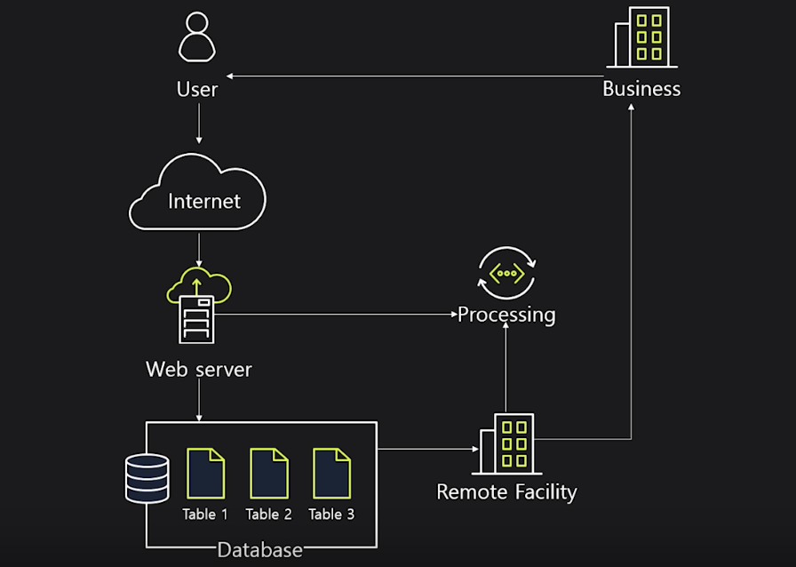

- 하나의 거대한 **monolitic application**이었음
  - 작은 application이나 소규모의 개발 환경에는 문제가 없지만, 빠르게 성장하고 있는 Amazon에게는 문제가 되었음
    - 문제점들
      1. 확장성 부재
      2. 컴포넌트 문제로 전체 시스템 장애
      3. 느린 배포 속도
      4. 다양성 부족

 

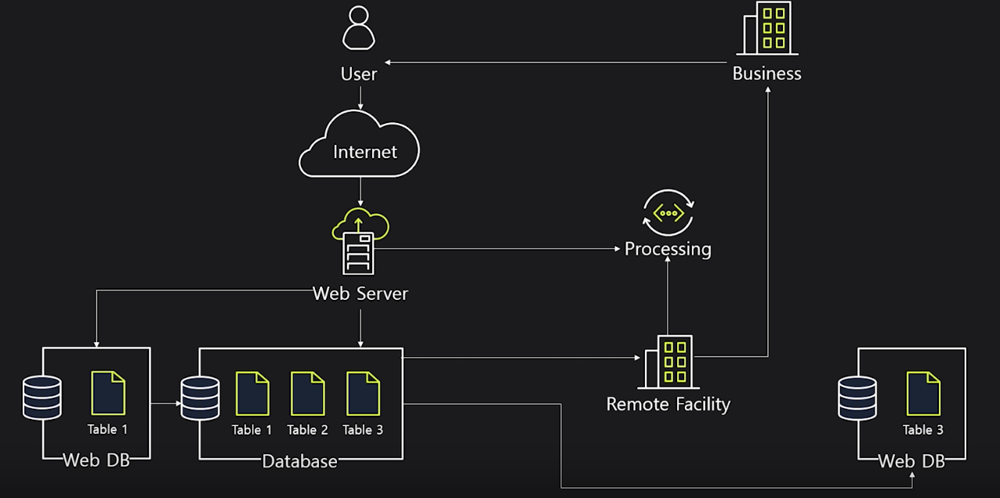

- 데이터를 분리하기 시작함

 

### 서비스 진화

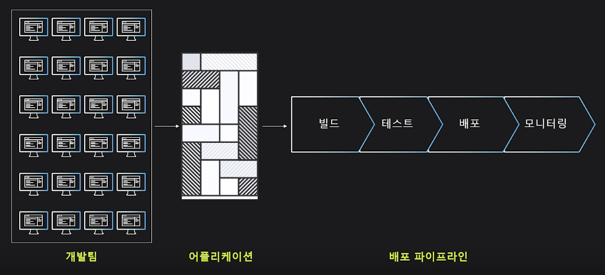

- 개발에서 배포까지의 일련의 과정이 수일에서 수주까지 걸리는 어려움이 있었음

 

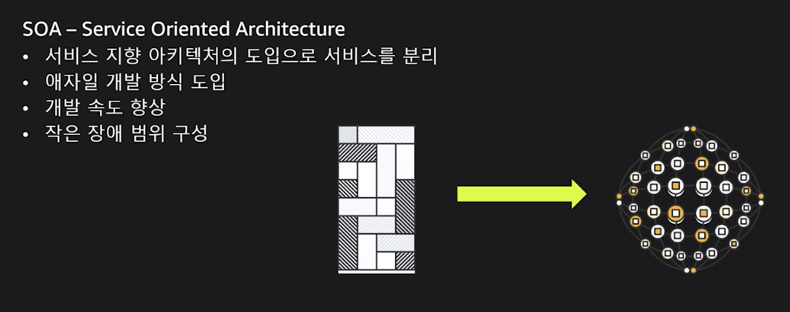

- **SOA**(Service Oriented Architecture, 서비스 지향 아키텍처)를 도입하며 application을 단위별로 쪼개고, 분해하기 시작함

 

- **MSA** (Micro Service Architecture) 를 도입하여 고객에게 더 가깝게 다가가서 고객의 목소리를 빠르게 적용하는 혁신을 함

 

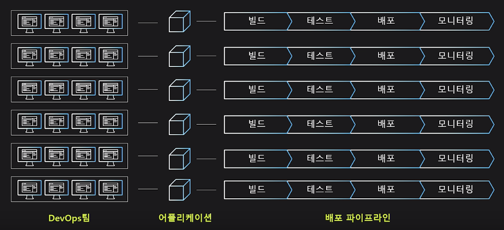

- 각 서비스를 담당하는 팀에 그들만의 tool을 제공하고,
  - **self-service** 환경을 제공하여
  - 각 팀에 자체 배포 process를  소유 & 관리하게 함
- 서비스간의 통신은 모두 **API**로 **표준화**하고,
  - backend 간의 **dependency**를 없애게 됨

- 서비스를 개발한 팀이 가장 해당 서비스를 잘 안다는 기준 아래서 bug가 발생하면 바로 수정을 하는 형식의
  - **운영** 권한과 **모니터링** 권한을 주고
  - 서비스 **빌드** / **테스트** 를 하도록 함

 

### 2-Pizza Team

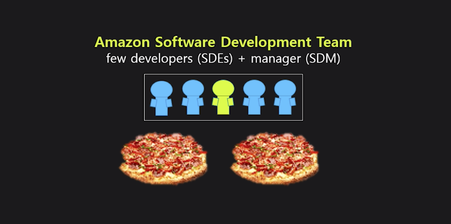

- 각 서비스를 담당하는 팀은 효율적인 움직임과 커뮤니케이션을 위해 2개의 피자로 점심을 해결할 수 있는 단위로 조직함
  - ㅋㅋ..피자..

 

- 이러한 팀들은 서비스를 위해
  - 데이터베이스를 생성하거나 관리하고,
  - 코드를 개발하고,
  - 운영하고,
  - 기획하고,
  - 보안을 담당하는 팀원들로 구성 됨

 

### 2-Pizza Team의 책임 및 역할

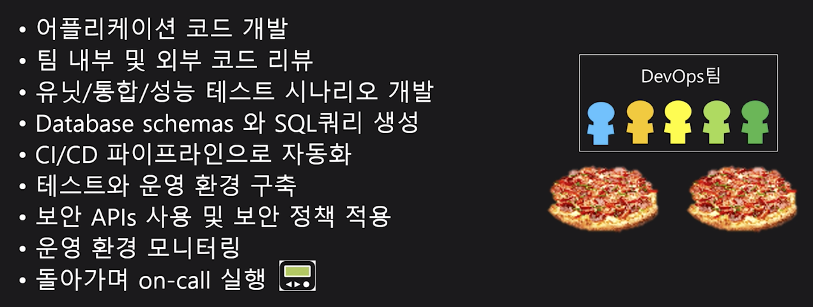

 

 

## DevOps Best Practices

 

### Best Practices

- DevOps Best Practice는 다양한 접근 방법이 있고, 기업의 현 상황에 따라서 다르게 접근해야 한다
  - 하지만 그 기준이 되는 4가지 원칙이 있다

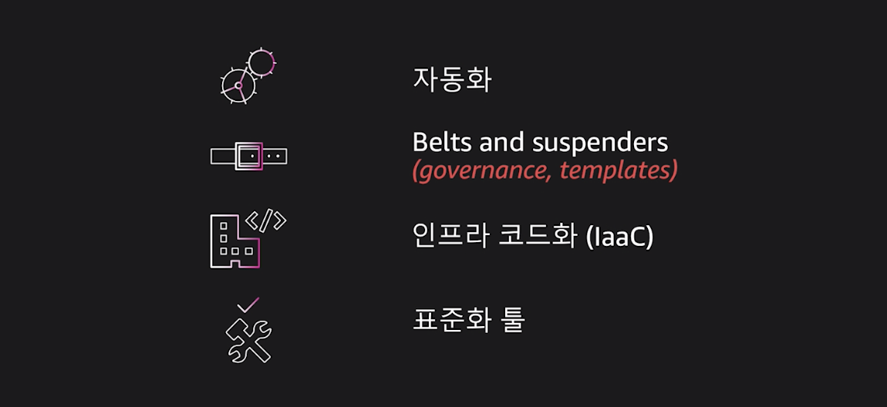

- **자동화**
  - 자동화 할 수 있는 대부분의 process를 자동화하고,
  - 자동화를 통해서 business 속도에 이점을 가져오고,
  - Operation 가동 시간을 증가시키고,
  - 오류를 감소시킬 수 있다

- **Belts and suspenders**
  - *벨트를 메고 멜빵으로 최대한 안전하게 바지를 입는다*
    - **concrete**형 구성을 practice화 하고, **governance**를 구축해야 한다는 정의
      - ex)
        - `Best practice template`을 통해 팀이 **표준화** 된 architecture 및 개발을 시작하도록 지원함
- **IaaC**
  - Infra와 application을 code로 표현하면 조직 전체에 걸쳐서 모범 사례를 공유하고, 구성할 수 있다
- **도구 표준화**
  - 표준화 된 tool을 통해
    - 개발자들이 팀간 이동이나 새로운 프로젝트 시작 할 때 쉽게 시작할 수 있고,
    - 새로운 것을 시도함에 있어서 어려움을 주지 않는다

 

### Automate everything

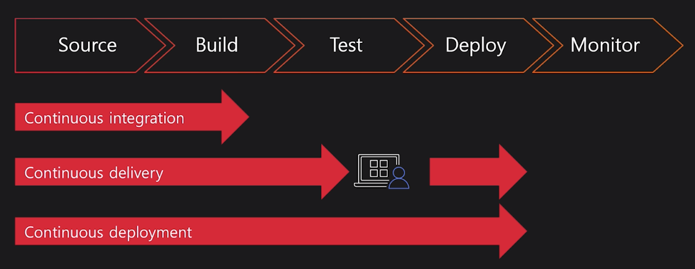

 

### CI (Continuous Integration)

1. 새로운 코드가 소스 저장소에 check-in 되면 자동으로 새 build 시작
2. 일관되고 반복 가능한 환경에서 코드 작성 및 테스트
3. Artifact를 지속적으로 배포할 수 있도록 준비
4. Build 실패 시 feedback loop 진행 및 해결

 

### CD (Continuous Delivery / Deployment)

1. Test를 위해 staging area에 새로운 변경 사항을 자동으로 배포
2. 고객이나 서비스에 영향 없이 운영 환경에 안전하게 구축
3. 고객에게 보다 신속하게 서비스 제공
   - 구축 빈도를 높이고 변경 리드 타임 및 변경 실패율 감소

 

### Belts and suspenders

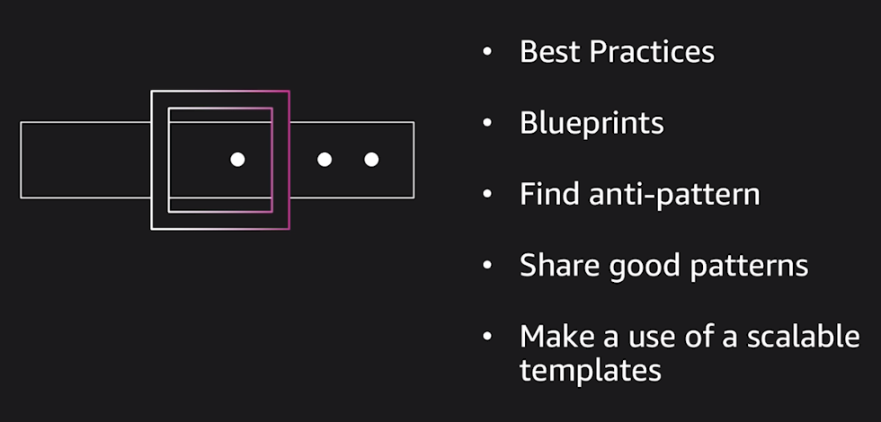

- 모범 사례를 발굴하고, 반복적인 작업을 template화 해서
  - 좋은 template이나 pattern들을 한 명의 개발자가 소유하지 않고 silo화 되는 것을 막아서
    - 팀 단위로 빠르게 개발을 하고
    - 반복되는 작업을 template을 사용해서 iteration 할 수 있다!
- Amazon은 **peer review**를 통해 위의 방식을 적용한다

 

### IaaC

 

 

### CDK를 활용하여 Infra 환경 배포하기

 

 

## DevOps Tools

 

### AWS 서비스를 활용하여 DevOps - 1단계

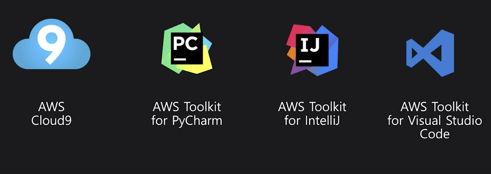

 

### AWS 서비스를 활용하여 DevOps - 2단계

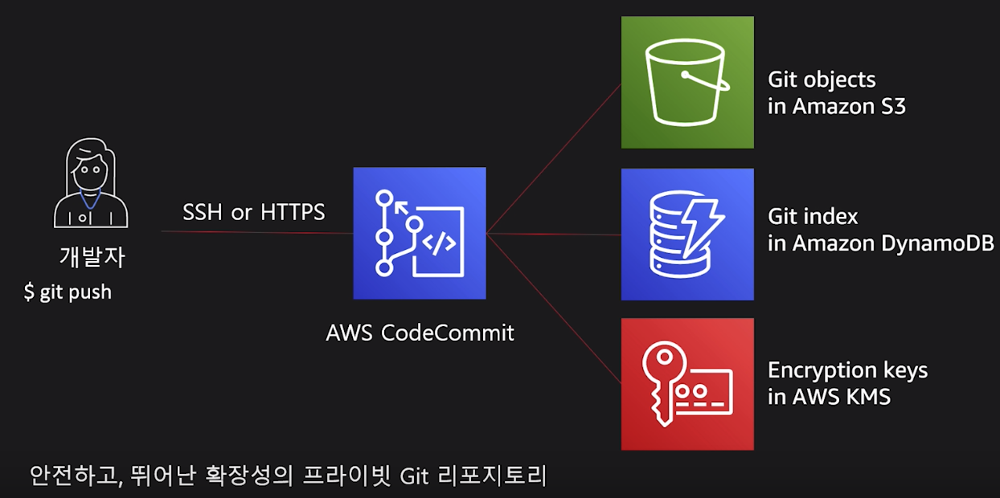

 

### AWS 서비스를 활용하여 DevOps - 3단계

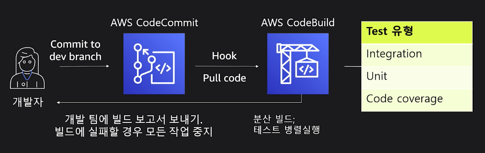

 

### AWS 서비스를 활용하여 DevOps - 4단계

 

### AWS DevOps 도구들 - CI/CD

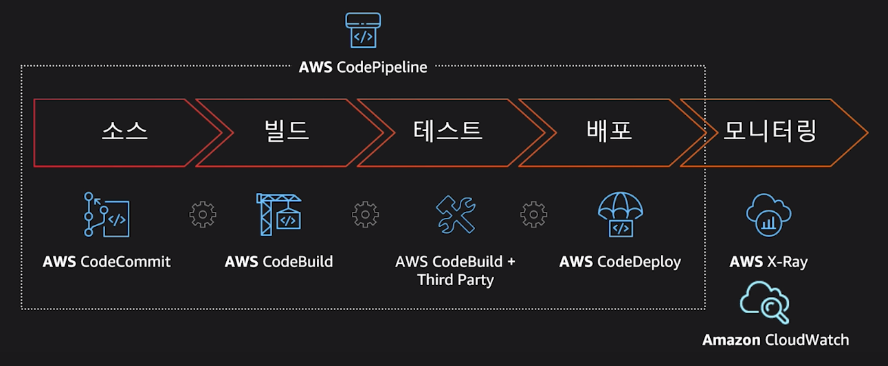

 

 

`+`

#### 짤막 후기

AWS가 어떻게 DevOps를 적용하고, 왜 적용했는지 알 수 있는 넘넘 유익한 강연이었다!
