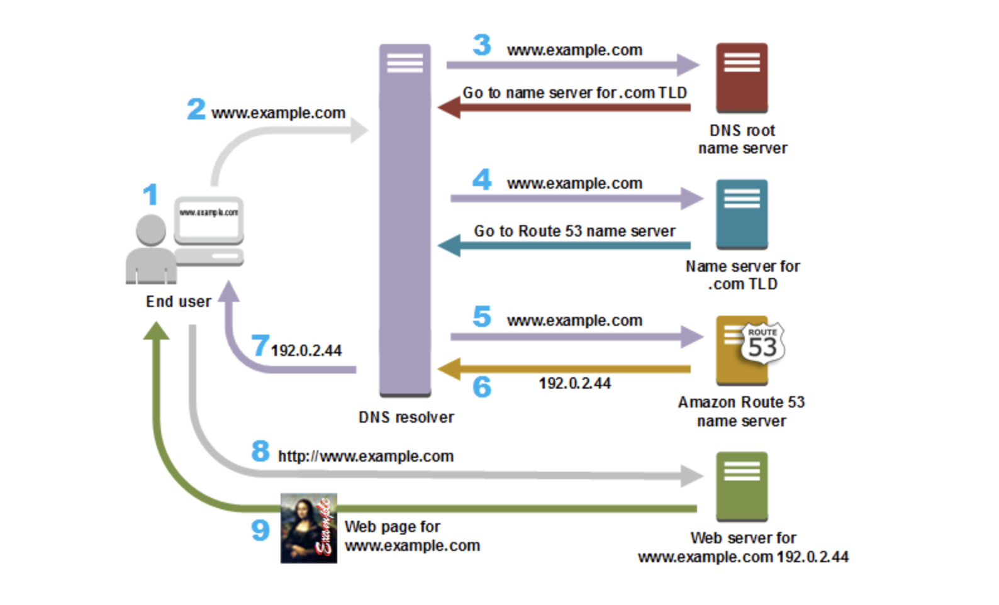

# Amazon Route 53

> Amazon Route 53 에 대해 알아보아요
>
> Reference: [aws docs](https://docs.aws.amazon.com/Route53/latest/DeveloperGuide/Welcome.html)

 

 

## What is Amazon Route 53?

 

### Amazon Route 53

- **가용성** 과 **확장성** 이 뛰어난 DNS (Domain Name System) web service
- Route 53을 사용하여
  1. Domain name 등록
  2. DNS Routing
  3. Resource 상태 확인을 조합하여 실행할 수 있다
- 만약 위의 세 가지 기능을 모두 선택하면, 아래의 순서대로 각 단계를 수행한다

 

#### 1. Register domain names

- website에는 *example.com* 과 같은 이름이 필요하다
- Route 53으로 원하는 website 혹은 web application에 **domain name**을 등록할 수 있다

 

#### 2. Route internet traffic to the resources for your domain

- User가 web broser를 열어 address bar에 **domain name (example.com)** 또는 **subdomain name (chloe.exaple.com)**을 입력하면, Route 53이 browser와 해당 website 혹은 web application을 연결해준다

 

#### 3. Check the health of your resources

- Route 53은 internet을 통해 web server 같은 resource로 자동화된 요청을 보내서, 접근 및 사용이 가능하고 **정상 작동중**인지 확인한다
- Resource를 사용할 수 없는 상태일 때,
  - 알림을 수신하고
  - 비정상 resource가 아닌 곳으로 traffic을 routing 할 수도 있다

 

 

## How Amazon Route 53 routes traffic for your domain

 

Web server나 `Amazon S3` bucket 같은 resource로 traffic을 routing 하도록 **Amazon Route 53** 을 구성한 후, 누군가 <www.example.com의> content를 요청하면 몇 밀리초 안에 아래와 같은 로직이 실행된다

1. 사용자가 웹 브라우저를 열어 주소 표시줄에 <www.example.com을> 입력하고 Enter 키를 누릅니다.

2. <www.example.com에> 대한 요청은 일반적으로 케이블 인터넷 공급업체, DSL 광대역 공급업체 또는 기업 네트워크 같은 인터넷 서비스 제공업체(ISP)가 관리하는 DNS 해석기로 라우팅됩니다.

3. ISP의 DNS 해석기는 <www.example.com에> 대한 요청을 DNS 루트 이름 서버에 전달합니다.

4. DNS 해석기는 <www.example.com에> 대한 요청을 이번에는 .com 도메인의 TLD 이름 서버 중 하나에 다시 전달합니다. .com 도메인의 이름 서버는 example.com 도메인과 연관된 4개의 Route 53 이름 서버의 이름을 사용하여 요청에 응답합니다.

   DNS 해석기는 4개의 Route 53 이름 서버를 캐시에 저장합니다. 다음에 누군가 example.com을 찾아볼 때 example.com의 이름 서버가 이미 있으므로 해석기는 3단계와 4단계를 건너뜁니다. 이름 서버는 일반적으로 2일 동안 캐시에 저장됩니다.

5. DNS 해석기는 Route 53 이름 서버 하나를 선택하여 <www.example.com에> 대한 요청을 해당 이름 서버에 전달합니다.

6. Route 53 이름 서버는 example.com 호스팅 영역에서 <www.example.com> 레코드를 찾아 웹 서버의 IP 주소 192.0.2.44 등 연관된 값을 받아 이 IP 주소를 DNS 해석 프로그램에 반환합니다.

7. DNS 해석기가 마침내 사용자에게 필요한 IP 주소를 해석해 냅니다. 해석기는 이 값을 웹 브라우저로 반환합니다.

8. 웹 브라우저는 DNS 해석기로부터 얻은 IP 주소로 <www.example.com에> 대한 요청을 전송합니다. 여기가 콘텐츠가 있는 곳, 예컨대 Amazon EC2 인스턴스 또는 웹 사이트 엔드포인트로 구성된 Amazon S3 버킷에서 실행되는 웹 서버입니다.

9. 192.0.2.44에 있는 웹 서버 또는 그 밖의 리소스는 <www.example.com의> 웹 페이지를 웹 브라우저에게 반환하고, 웹 브라우저는 이 페이지를 표시합니다.

 

 

## 지원되는 DNS Record 유형

<https://docs.aws.amazon.com/ko_kr/Route53/latest/DeveloperGuide/ResourceRecordTypes.html>
