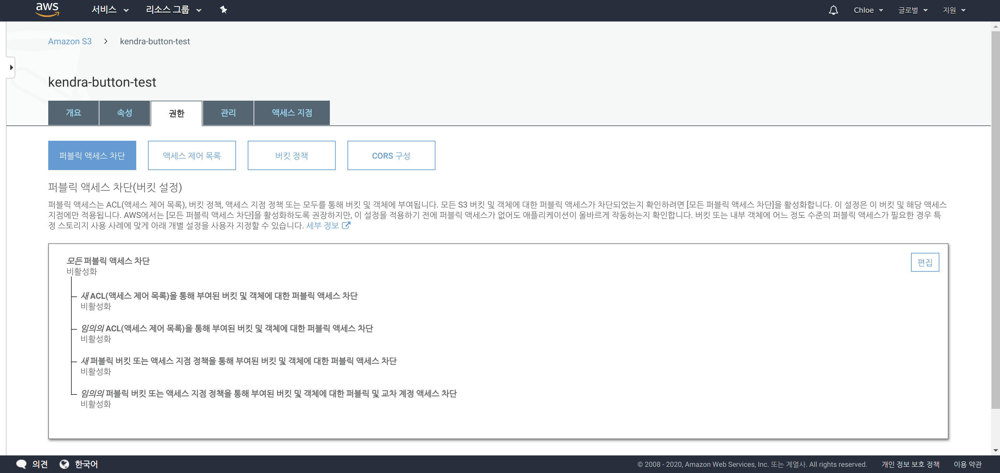
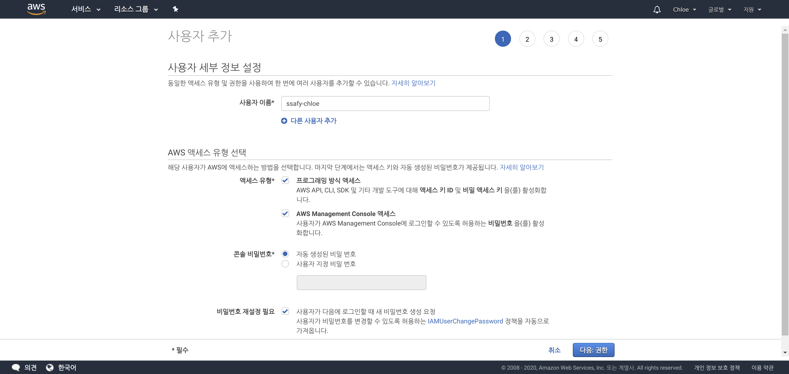
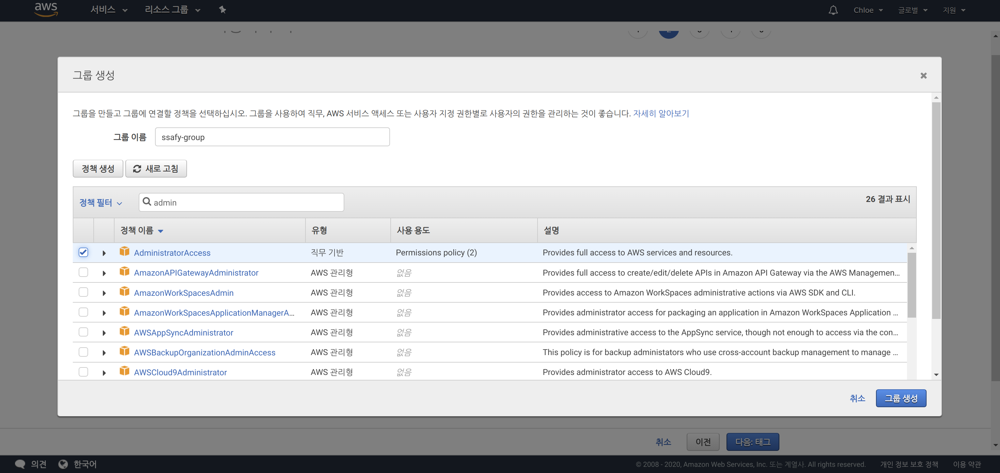
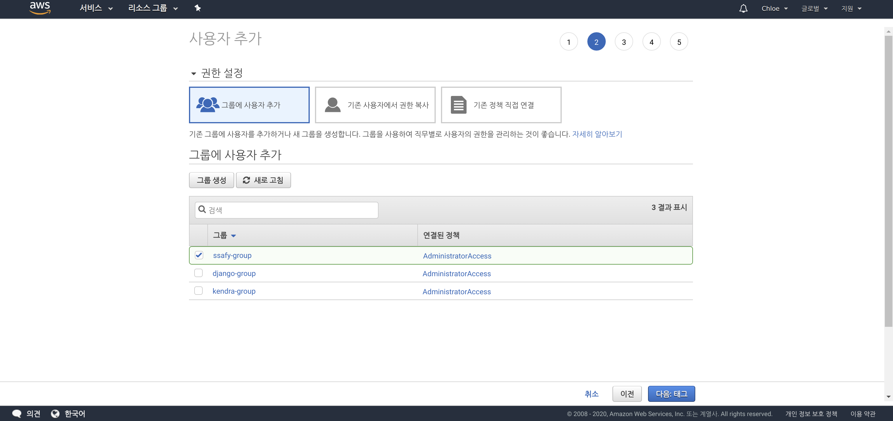
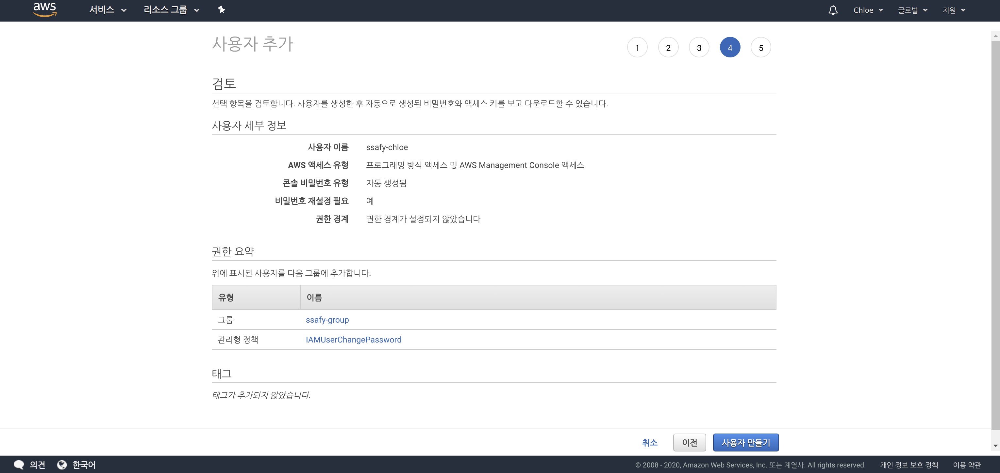
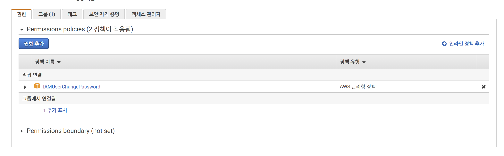
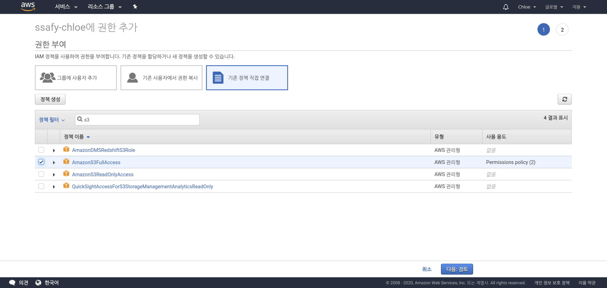
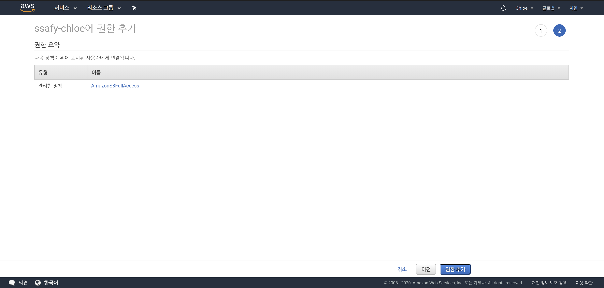

# Amazon S3 - Creating a Bucket

> Back to basics!
>
> S3 버킷 만드는 법 정리해용

 

 

## 1. 버킷 만들기

- `AWS Management Console` 의 `S3` 에서 **버킷 만들기**를 클릭한다

 

### 1-1. 버킷 생성하기

- 버킷 이름만 설정하고 나머지는 모두 default로 생성한다

 

### 1-2. 퍼블릭 액세스 차단 비활성화

 

 

## 2. Key 발급 받기

- `AWS Management Console`의 `IAM` 에서 **사용자 추가** 를 클릭한다 

 

### 2-1. 사용자 추가하기

- 사용자 이름을 지정하고, 위의 체크박스를 선택한 후 다음으로 넘어간다

 

### 2-2. 그룹 생성하기

- 기존에 생성한 그룹이 없다면, 새 그룹을 생성한다
- 정책으로는 `Administrator Acess` 를 선택한 후, 그룹 생성을 클릭한다

 

### 2-3. 그룹에 사용자 추가

- 위에서 생성한 그룹에 사용자를 추가한다

 

### 2-4. 검토 및 자격 증명(.csv) 다운받기

- 마지막으로 설정한 사항을 확인한 후, **사용자 만들기**를 클릭한다
- 사용자가 생성되면, **자격 증명** 이 담긴 `.csv` 파일을 다운로드 받는다
  - 이 자격 증명 파일에는 **Access Key ID** 와 **Secret Access Key** 가 저장되어 있다
    - 다운받아 안전한 곳에 보관하자!!!!!

 

### 2-5. 사용자 권한 추가 

- 위에서 생성한 사용자에 `S3` 버킷 권한을 추가하기 위해 **권한 추가** 를 클릭한다

 

- **기존 정책 직접 연결**을 클릭한다
- 검색 창에 `S3`를 검색한다
- 검색 결과에서 `AmazonS3FullAccess` 정책을 선택한다
- **다음** 을 클릭한다

 

### 2-6. 권한 추가 검토

- 추가한 권한을 검토 한 후, **권한 추가**를 클릭한다

 

*끝~! 왕 간단!*