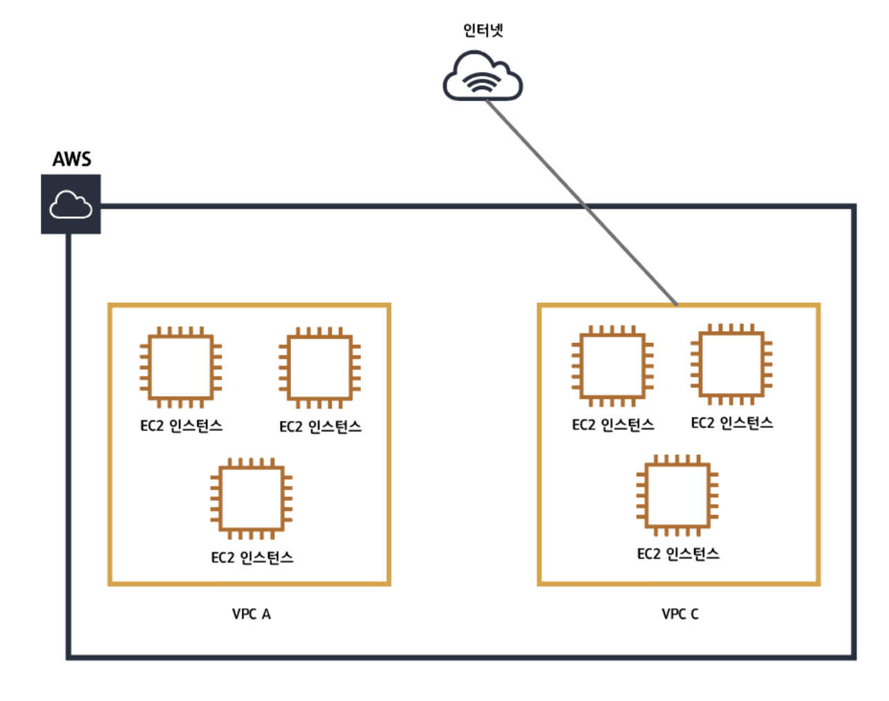
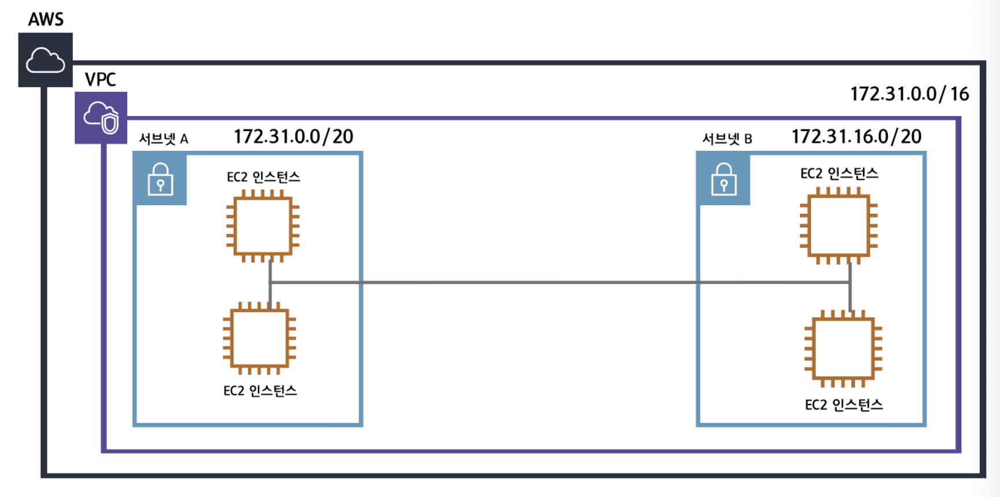
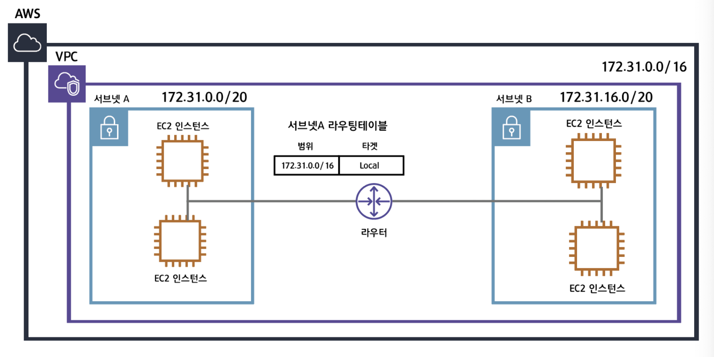
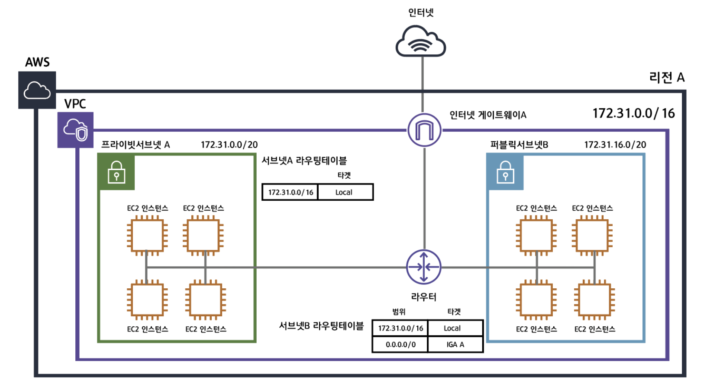
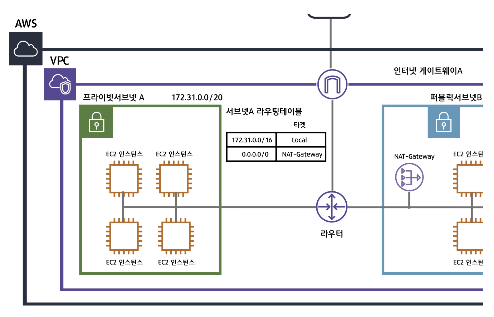
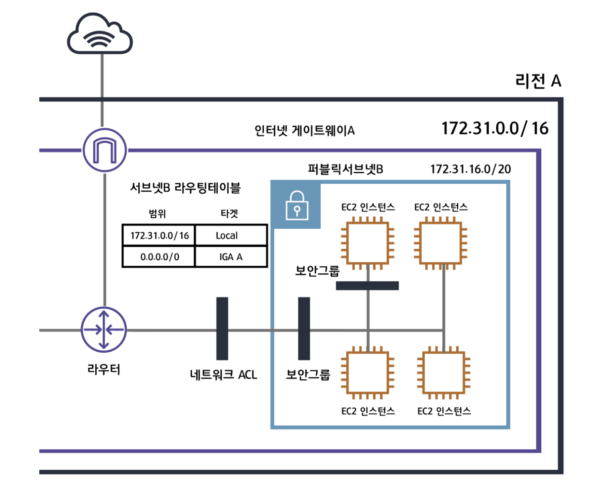

# Amazon VPC

> 꼭 알고 넘어가야 하는 AWS VPC!
>
> Reference: [인프런] DevOps : Infrastructure as Code with Terraform and AWS 강좌 by 송주영님, [medium.com/harrythegreat](https://medium.com/harrythegreat/aws-%EA%B0%80%EC%9E%A5%EC%89%BD%EA%B2%8C-vpc-%EA%B0%9C%EB%85%90%EC%9E%A1%EA%B8%B0-71eef95a7098)

 

 

## Amazon VPC란?

- Amazon에서 제공하는 **private**한 네트워크 망 서비스
  - 사용자에게 aws 계정 전용 네트워크망을 만들어주는 서비스
- VPC를 적용하면
  - VPC별로 Network를 구성할 수 있고,
  - 각각의 VPC에 따라 Network 설정을 다르게 줄 수 있다
- 각각의 VPC는 완전히 독립된 네트워크처럼 작동한다

 

 

## VPC의 핵심 구성요소

 

### Virtual Private Cloud (VPC)

- 사용자의 AWS 계정 전용 가상 네트워크
  - VPC를 구축하기 위해서는 VPC의 IP 범위를 `RFC1918`이라는 **사설 IP 대역**에 맞추어 구축해야한다
    - **VPC에서 사용하는 사설 IP 대역**
      - 10.0.0.0 ~ 10.255.255.255(10/8 prefix)
      - 172.16.0.0 ~ 172.31.255.255(182.16/12 prefix)
      - 192.168.0.0 ~ 192.168.255.255(192.168/16 prefix)
  - 한 번 설정된 IP 대역은 수정할 수 없다
  - 각 VPC는 하나의 Region에 종속된다
  - 각각의 VPC는 완전히 독립적이기 때문에 VPC 간의 통신을 원한다면 `VPC 피어링 서비스`를 고려해 볼 수 있다

 

### Subnet

> 특정 Availability Zone 에 속한 네트워크 그룹으로 VPC 내에서도 나눠진 독립적인 네트워크 구역

- VPC의 IP address 범위
  - 해당 VPC 안에서 IP 주소 범위를 어디까지 나누느냐에 대한 것
    - VPC를 잘게 쪼개는 과정
  - Subnet을 나누는 이유는 더 많은 네트워크망을 만들기 위해서이다
  - 각각의 서브넷은 가용 영역 (AZ, Availability Zone) 안에 존재하며, Subnet 안에 `RDS`, `EC2`와 같은 resourece들을 위치시킬 수 있다
- Public Subnet vs Private Subnet
  - **Public Subnet**
    - EC2 같은 machine에 `공인 IP`가 붙어있으면 보통 Public subnet에 위치한 EC2 인스턴스라고 볼 수 있다
  - **Private Subnet**
    - `공인 IP`를 가지고 있지 않지만, `NAT Gateway`를 통해 인터넷을 할 수 있는 Subnet을 Private Subnet이라고 부른다
      - 즉, 인터넷과 연결되어있는 subnet을 **Public Subnet**, 인터넷과 연결되어있지 않은 subnet을 **Private Subnet** 이라고 한다

 

### Routing Table

- `Network traffic`을 **전달할 위치**를 결정하는데 사용되는 **routing**이라는 **규칙 집합**
  - 어떤 machine (ex. EC2)에서 **outbound**로 나가는 traffic이 어디로 나가느냐에 대한것
    - 내부로 나가느냐 외부로 나가느냐에 대한 규칙을 정하는 table
  - 네트워크 요청이 발생하면 data는 우선 **router**로 향하게 된다
    - 네트워크 요청은 각각 정의된 **routing table**에 따라 작동한다
      - 위의 그림에서,
        - **서브넷 A 라우팅테이블**은 `172.31.0.0/16`, 즉, VPC 안의 네트워크 범위를 갖는 네트워크 요청은 local에서 찾도록 되어있다
          - but, 그 이외에 외부로 통하는 traffic은 처리할 수 없다
            - 이럴 때 Internet Gateway를 사용한다

 

### Internet Gateway

- VPC의 **resource**와 **인터넷** 간의 통신을 활성화하기 위해 VPC에 연결하는 **gateway**
  - 인터넷을 연결하기 위해 필요한 서비스
    - VPC와 인터넷을 연결해주는 하나의 관문
      - 위의 그림에서,
        - **서브넷 B 라우팅 테이블**을 보면 `0.0.0.0/0`으로 정의되어있다
          - 이것은 모든 traffic에 **대하여 IGA(Internet Gateway) A**로 향하라는 뜻이다
            - **Routing table**은 가장 먼저 목적지의 주소가 `172.31.0.0/16`에 매칭되는지 확인한 후,
              - 매칭되지 않는다면 **IGA A**로 traffic을 보낸다
  - 라우팅 테이블에 인터넷으로 나가는 서비스가 `Internet Gateway` 를 통한다면 **Public Subnet**이라고 부른다

 

### NAT Gateway

- `Network 주소 변환`을 통해 **Private subnet**에서 **인터넷** 또는 **기타 AWS 서비스**에 연결하는 gateway
  - 라이팅 테이블에 인터넷으로 나가는 서비스가 `NAT Gateway`를 통한다면 **Private Subnet**이라고 부른다
- **Private Subnet**이 인터넷과 통신하기 위한 **outbound instance**
  - Public 상에서 동작하는 NAT Gateway는 private subnet에서 외부로 요청하는 outbound traffic을 받아 `Internet Gateway`와 연결한다

 

### Security Group

- **instance**에 대한 `Inbound` 및 `Outbound` traffic을 제어하는 **가상 방화벽** 역할을 하는 규칙 집합
  - Inbound traffic을 어떤 규칙을 통해서 허용할 것인지
  - Outbound traffic을 어떤 규칙을 통해서 허용할 것인지에 관한 규칙을 가지고 있는 집합
- Network ACL과 보안 그룹은 **방화벽**과 같은 역할을 하며 **Inbound traffic**과 **Outbound traffic** 보안정책을 설정할 수 있다
  - **보안그룹 vs Network ACL**
    - `보안그룹`은 **stateful** 한 방식으로,
      - 동작하는 보안그룹은 모든 허용을 차단하도록 기본 설정 되어있다
        - 그래서 필요한 설정을 허용해줘야 한다
      - Network ACL과 다르게 보안그룹은 별도의 traffic을 설정할 수 있으며,
        - Subnet에도 설정할 수 있지만 각각의 EC2 instance에도 적용할 수 있다
    - `Network ACL`은 **stateless** 하게 작동하며,
      - 모든 traffic이 기본 설정으로 되어있기 때문에
        - 불필요한 traffic을 막도록 해야한다
          - Subnet 단위로 적용되며, resource별로는 설정할 수 없다
    - Network ACL과 보안그룹이 충돌한다면 보안그룹이 더 높은 우선순위를 갖는다!

  

### VPC Endpoint

- VPC에 종속되어 있는 VPC 내부의 여러 AWS 서비스 간에 **Internet Gateway**나 **NAT Gateway**를 통하지 않고 바로 AWS 서비스를 사용할 수 있는 AWS 의 서비스
  - `Internet gateway`, `NAT device`, `VPC 연결` 또는 AWS Direct Connect 연결을 필요로 하지 않고, `PrivateLink` 구동 지원 및 AWS 서비스 및 VPC Endpoint service에 VPC를 비공개로 연결할 수 있다
  - **VPC의 Instance**는 **서비스의 resource** 와 통신하는 데 **Public IP**를 필요로 하지 않는다!
  - VPC와 기타 서비스 간의 traffic은 Amazon Network를 벗어나지 않는다
