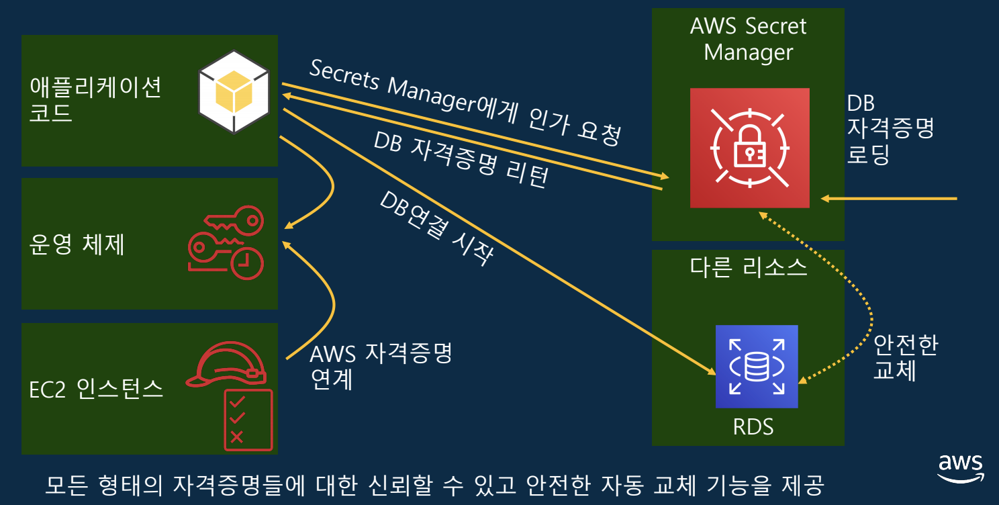
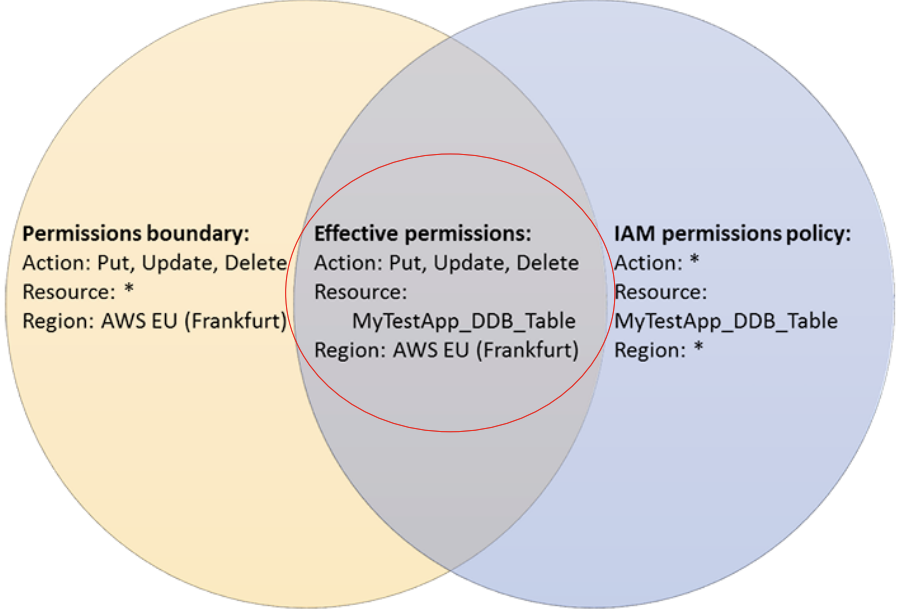

# AWS Well-architected Framework - Security Pillar

> AWS 고객들이 실수하기 쉬운 보안 이슈를 다뤄요

 

 

## 보안 디자인 원칙

 

#### 강력한 **Identity** 관리 기반을 구현

- **최소 권한 부여 원칙** 을 구현하고, AWS Resource 간의 상호 작용에 대한 인가 과정에서 적절하게 **직무 분리** 통제 적용

#### 책임 추적성 확보

- 모든 변경 사항과 작업들을 **실시간 모니터링/로깅/감사**
- **자동 대응** 환경 구성

#### 모든 계층에 보안 적용

- 단일 보안 계층이 아닌 **모든 계층** (Edge, VPC, ELB, EC2, OS 및 application) 에 필요한 보안 기능 적용 및 통제

#### Best practice `자동 적용`

- 검증된 보안기준이 선 적용되어 버전 관리되는 **Template 기반** 으로, **자동**으로 안전하게 `Scailing 환경`을 지원할 수 있도록 구현

#### 전송 중 및 유휴 시 Data 보호

- Data를 민감도 level로 **분류** 하고,
- 필요시`암호화`, `토큰화` 및 access 제어

#### Data로 부터 사용자를 최대한 격리

- 관리자의 실수 방지를 위해 **자동 처리** process를 적용하고, data 직접 access 및 수동 처리 과정을 최소화
  - but, 다른 수단이 동반되어야 함

#### 보안 이벤트에 대한 충분한 대비

- 보안 사고 **대응 simulation** 을 준비 및 실행
- 자동화된 도구를 사용하여 탐지/조사 및 복구 속도 향상

 

 

## 1. 보안 governance

 

### Sec 1) Workload를 얼마나 안전하게 운영하고 있는가?

> 모범 사례

1. **Multi-account** 로 workload 분리 운영
2. AWS account로의 **안전한 접근** 구현
3. 보안 통제 **목표를 수립** 하고, **지속적인 검증** 수행
4. **최신 보안 위협**에 **대응 체계** 확보
5. **최신 보안 요건**, **trend**, **규정** 들을 workload에 반영
6. Process나 배포 pipeline 상에 **자동화된 Testing 및 검증 단계** 구현
7. 위협모델을 통해 **잠재적인 위협들을 식별** 하고 우선순위 부여
8. 주기적으로 **새로운 보안 서비스 / 기능 / 제품** 에 대해 평가 및 적용
   - New feature 가 계속 update 되고 있음
     - 이것에 대한 평가 및 적용 필요!

 

#### AWS Account Planning

- 사업부 별
- 개발주기 별
- 프로젝트 별

 

#### AWS Landing Zone

- AWS 직원이 투입되어 `CloudFormation` 을 구축해줌

 

#### AWS Control Tower

> <https://aws.amazon.com/controltower/>

- `Landing Zone` 자동 구성 서비스
- 2개의 core account 생성
  1. `Log_archive`
  2. `Audit`
- Core/Custom OU 구조와 Account Factory wprhd
- AWS SSO를 이용한 Single Sign-On 제공
  - with Active Directory custom option
- 탐지 및 방지 용 25개의 Built-In guard rail 제공

 

 

## 2. Identity& Access 관리

 

### Sec 2) 사용자와 시스템에 대한 Identity를 어떻게 관리하는가?

> 모범 사례

1. MFA 등 **강력한 인증** 기법 적용
2. 상시 자격증명 대신 **임시 자격증명** 활용
3. 자격증명을 **안전하게 보관 및 관리**
4. **중앙화된 IDP (identity provider)** 환경 구축과 **인사 이벤트 연동**
5. 상시 자격증명의 **주기적인 교체** 와 감사
6. IDP에 정의된 사용자 그룹과 속성을 접근제어에 적극 활용
   - 사용자가 무슨 속성을 가지고있고, 부서가 어떻게 되는지 등의 속성을 활용하여 권한을 align 한다
     - 속성에 따라 자동으로 적용되는 것이 포인트!
   - 속성에 tagging을 해서 관리하므로, 속성만 바꾸면 사용자의 권한을 바꿀 수 있어서 간편!

 

#### AWS SSO

- AWS SSO enables administrators to configure and maintain all the necessary permissions for your accounts automatically, without requiring any additional setup in the individual accounts.

 

### Credential Report & Config Rule

#### Config Rule

- 관리형 규칙 (`access-keys-rotated`) 이용
  - Parameter (`maxAccessKeyAge`) 일수 기준 초과된 Acess key들을 주기적으로 점검
    - 주기적으로 Access key를 변경했는지 여부를 timestamp로 기록하는 등 규칙을 정해서 권한 관리
      - 주기 설정 필요함!
        - How?
          - AWS CLI 에 사용시마다 임시 자격증명을 받아오는 script를 mapping 해서 자격증명을 교체
- 기본 값
  - 90일
- 적발된 대상을 자동으로 교체하고 소유자에게 알려주는 람다 함수 등의 응용 가능

 

### AWS Secret Manager

 

 

### 서버 사용자 관리 케이스

#### 1. AWS AD Domain Join

- <https://aws.amazon.com/blogs/security/how-to-domain-join-amazon-ec2-instances-aws-managed-microsoft-ad-directory-multiple-accounts-vpcs/>

 

#### 2. Session Manager

- <https://docs.aws.amazon.com/systems-manager/latest/userguide/session-manager.html>

- Server에 접근할 수 있는 권한을 최소화하라
  - How?
    - 반복적으로 하는 작업을 `document`를 사용하여 스크립트화
      - System manager는 document를 갖고 있는다
    - <https://docs.aws.amazon.com/systems-manager/latest/userguide/sysman-ssm-docs.html>

 

#### 3. Instance Connect

- `SendSSHPublicKey` Action을 통해 SSH 공개키를 instance metadata에 자동 배포
  - 60초 동안만 존재 (short-term)

 

 

### Sec3) 사용자와 시스템에 대한 권한을 어떻게 관리하는가?

> 모범 사례

1. 사용자 유형, 접근 수단 등 각 **접근 제어 케이스별 상세 권한 요건 정의** 하기
2. 최대한 상세한 레벨에서 **최소 권한 부여** 원칙 준수
3. **비상시 접근 승인** 프로세스 규정
4. **미사용 권한에 대한 상시 회수** 절차 구성
5. 위임 체계를 지원하는 **궈한 가드레일** 설정
6. 인사 이벤트와 연동되는 **권한 생성, 변경, 회수 절차** 구성
7. **퍼블릭 및 어카운트 간 접근** 에 대한 상시 모니터링 및 경부 체계 구성
8. **공유 리소스** 들에 대한 모니터링 및 거버닝 강화

 

### IAM Access Advisor

- Identity 기반 정책에 대한 최소 구너한 부여 검증
- 실행 action에 대한 이력 제공
  - S3

 

### IAM Access Analyzer

- Resource 기반 정책에 대한 최소 권한 부여 검증
- 대상 resource에 대한 접근 정책을 분석하여 public 또는 타 account 접근이 허용된 부분을 알려줌
- 상시 모니터링/탐색으로 정책이 변경되는 순간 탐지
  - 탐지 후 `Security Hub` 로 전달
- 의도치 않은 변경의 경우, 즉각 조치

 

### IAM Policy -Permission Boundary

- 사용자가 가질 수 있는 최대 권한을 제한
  - 유저별로 최대한 가질 수 있는 permission에 대한 boundary 를 설정
  - `Identity-based` 정책으로 부여된 권한과 **교집합** 형태로 적용된다 (필터역할)
    - Group 별로는 지정할 수 없다고 함!

 

 

 

## Hands-On: AWS 환경에서의 침해사고 대응 workshop

<http://gslim-public-workshops.s3-website.ap-northeast-2.amazonaws.com/incidentresponseworkshop/>

 

 

`+`

### Look it up

- Group 은 policy 를 부여할때만 사용된다!?!?!
- AWS Lambda Layer
  - <https://docs.aws.amazon.com/lambda/latest/dg/configuration-layers.html>
- VPC Flow log
- Amazon GuardDuty
  - <https://aws.amazon.com/guardduty/>
  - Runbook
