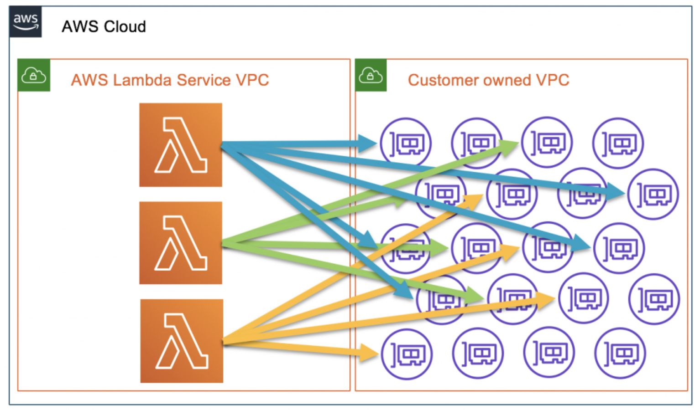
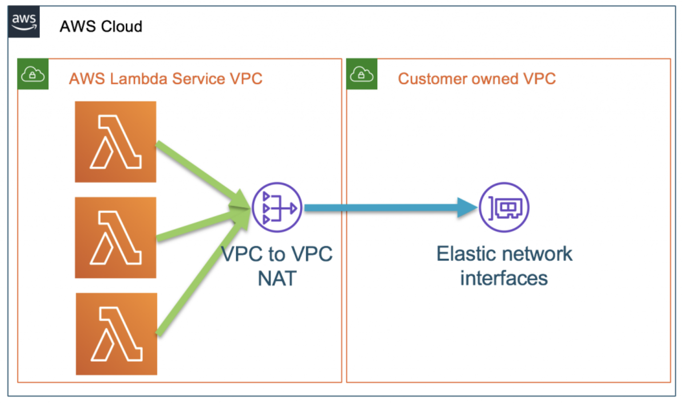
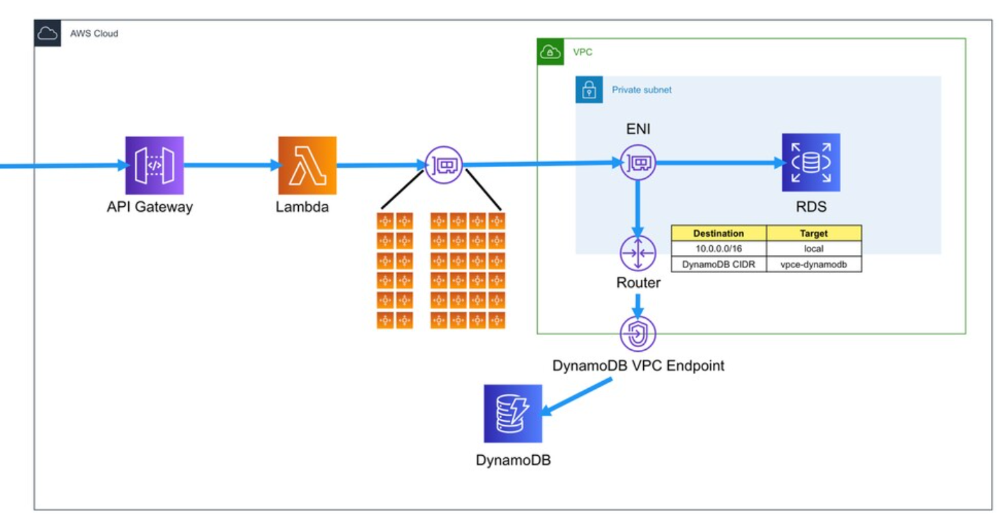

# What Are AWS Elastic Network Interfaces (ENI)

> ENI에 대해 알아보아요
>
> Reference: <https://speakerdeck.com/twkiiim/amazon-vpc-deep-dive-eni-reul-almyeon-vpc-ga-boinda>

<br>

<br>

## ENI 란?

<br>

### ENI (Elastic Network Interface)

- VPC에서 **가상 네트워크카드**에 해당하는 개념
  - VPC 안의 `Private IP` 범위에 속하는 IP 주소를 한 개 이상 가질 수 있다
    - ex) Primary, Secondary
- **EIP (Elastic IP)** 를 associate 해서 `Public IP`도 가질 수 있다
- **Security Group** 이 attach되는 대상이다
  - Security Group은  ENI에 붙는다!
- **MAC Address** 를 갖는다
- **Source/Destination check** 도 ENI가 담당한다
- **VPC Flow Logs**도 ENI를 기반으로 생성된다

- ENI를 통해 EC2에 access 가능하다
- Public subnet이면 ENI에 EIP (Elastic IP)도 붙어있다
- Security Group도 ENI에 적용된다
  - 복수개의 Security Group도 적용 가능하다

<br>

<br>

## Lambda로 ENI 이해하기

<br>

### VPC Lambda model의 변화

#### 과거 VPC Lambda



<br>

#### 현재 VPC Lambda



<br>

VPC Lambda가 개선된다는 [공지](https://aws.amazon.com/blogs/compute/announcing-improved-vpc-networking-for-aws-lambda-functions/) 를 보면 아래와 같은 내용이 있다

```
What’s changing
Starting today, we’re changing the way that your functions connect to your VPCs. AWS Hyperplane, the Network Function Virtualization platform used for Network Load Balancer and NAT Gateway, has supported inter-VPC connectivity for offerings like AWS PrivateLink, and we are now leveraging Hyperplane to provide NAT capabilities from the Lambda VPC to customer VPCs.

The Hyperplane ENI is a managed network resource that the Lambda service controls, allowing multiple execution environments to securely access resources inside of VPCs in your account. Instead of the previous solution of mapping network interfaces in your VPC directly to Lambda execution environments, network interfaces in your VPC are mapped to the Hyperplane ENI and the functions connect using it.
```

여기서 Hyperplane이란?

<br>

### AWS Hyperplane

- AWS **내부**에서 사용되는 **Load Balancing Service**
- S3 API의 Load Balancer가 기반이다
- EFS (Elastic File System) 에서는 초기부터 사용됨
- 다양한 서비스에 이용되기 시작함
  - API Gateway의 VPC Link
  - NLB (Network Load Balancer)
  - NAT Gateway
  - **VPC Lambda**

- EC2 Instance의 Fleet구성이다
  - 즉, 필요에 따라 scale up/down & in/out 된다
- Hyperlane에 access 가능한 ENI는 AWS 내부에 존재한다

<br>



- 사실은 위와 같이 AWS Lambda 내부에도 VPC가 존재하는데, AWS가 관리하기 때문에 보이지 않는다
- VPC Lambda를 설정하면서 **Subnet** 을 선택하게 되는데, 이때 해당 subnet 안에 **ENI** 가 자동으로 생성되어서 **AWS Lambda** 내부의 **Hyperplane ENI** 와 연결된다!

<br>

<br>

### VPC와 연동되는 타 서비스들

- VPC 및 Subnet을 선택해서 **직접 만든 VPC**와 **연동**된다
- 해당 Subnet에 **ENI**가 자동으로 생성되고, 이를 통해 **VPC 내부 resource**와 통신이 가능하다!!
