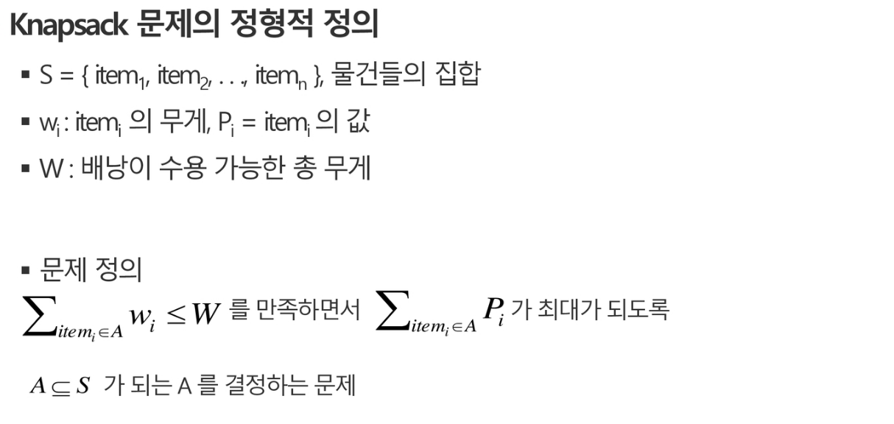
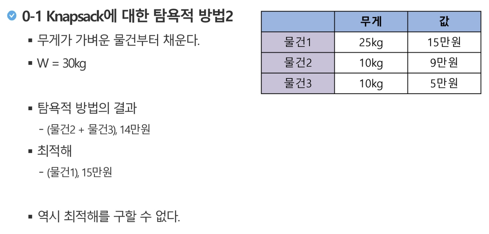
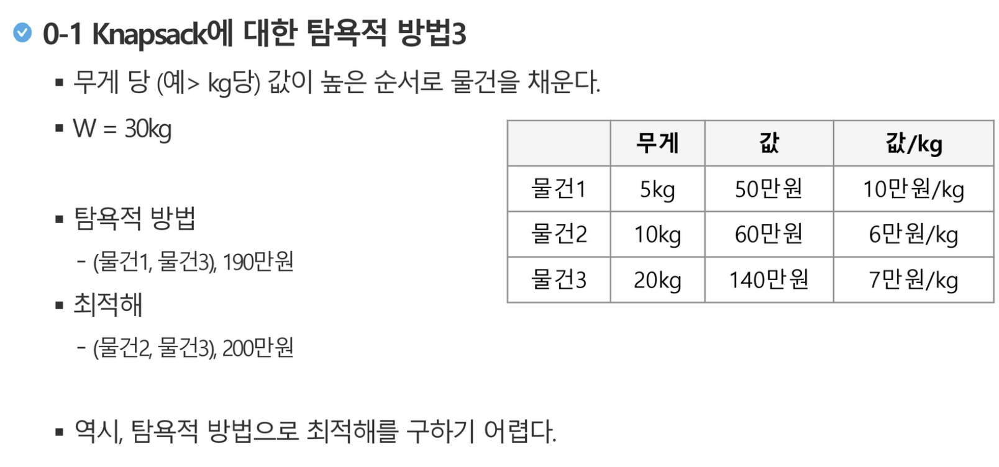
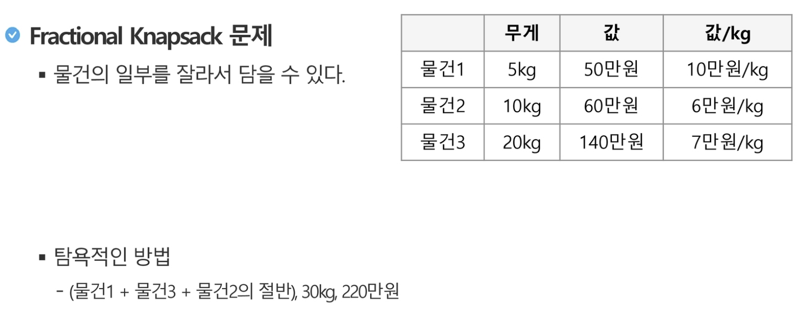
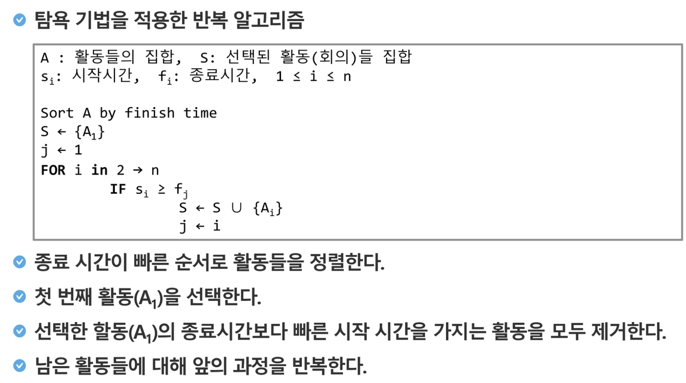

# Greedy Algorithm

 

## What is Greedy?

- 탐욕 알고리즘은 **최적해**를 구하는 데 사용되는 근시안적인 방법
- 일반적으로, 머릿속에 떠오르는 생각을 검증없이 바로 구현하면 Greedy 접근이 됨

 

- 여러 경우 중 하나를 선택할 때마다 그 순간에 최적이라고 생각되는 것을 선택해 나가는 방식으로 진행하여 최종적인 해답에 도달함.

  - 각 지점에서 이루어지는 결정은 지역적으로는 최적이지만, 그 선택들을 계속 수집하여 최종적인 해답을 만들었다고 하여, **그것이 최적이라는 보장은 없다**
- 일단, 한번 선택된 것은 번복하지 않는다
  - 이런 특성 때문에 대부분의 탐욕 알고리즘들은 **단순함**
  - 제한적인 문제들에 적용됨
- `최적화 문제(optimization)`란 가능한 해들 중에서 가장 좋은 (최대 또는 최소) 해를 찾는 문제

 

 

## How it works?

 

### 1. 해 선택

- 현재 상태에서 부분 문제의 최적 해를 구한 뒤, 이를 부분해 집합 (`Solution Set` )에 추가한다

### 2. 실행 가능성 검사

- 새로운 부분 해 집합이 실행가능한지를 확인한다
- 즉, 문제의 제약 조건을 위반하지 않는 지를 검사한다

### 3. 해 검사

- 새로운 부분 해 집합이 문제의 해가 되는지를 확인한다
- 아직 전체 문제의 해가 완성되지 않았다면 1의 해 선택부터 다시 시작한다

 

#### *최적해를 반드시 구한다는 보장이 없다!*

 

 

### ex1) 배낭 짐싸기 (Knapsack) 문제

- 도둑은 부자들의 물건을 훔치기 위해 창고에 침입하였다.
- 도둑은 훔친 물건을 배낭에 담아 올 계획이다. 배낭은 담을수 있는 물건의 총 무게(W)가 정해져 있다.
- 창고에는 어러 개(n개)의 물건들이 있고 각가그이 물건에는 무게와 값이 정해져 있다.
- 경비원에게 발각되기 전에 배낭이 수용할 수 있는 무게를 초과하지 않으면서, 값이 최대가 되는 물건들을 담아야 한다.

 

예)

|       | 무게 |   값   |
| :---: | :--: | :----: |
| 물건1 | 25kg | 10만원 |
| 물건2 | 10kg | 9만원  |
| 물건3 | 10kg | 5만원  |

 

 

#### 0-1 Knapsack에 대한 완전 검색 방법

> 완전 검색으로 물건들의 집합 S에 대한 모든 부분집합을 구한다.

- 부분집합의 총 무게가 W를 초과하는 집합들은 버리고, 나머지 집합에서 총 값이 가장 큰 집합을 선택할 수 있다
- 물건의 개수가 증가하면 시간 복잡도가 지수적으로 증가한다
  - 크기 n인 부분합의 수 2^n

 

 

 

 

 

 

### ex2) 회의실 배정하기 문제

 

 

 

 

 

## Greedy Algorithm의 필수 요소

 

### 1. 탐욕적 선택 속성 (greedy choice property)

- 탐욕적 선택은 최적해로 갈 수 있음을 보여라
  - 즉, 탐욕적 선택은 항상 안전하다

 

### 2. 최적 부분 구조 (optimal substructure property)

- 최적화 문제를 정형화하라
  - 하나의 선택을 하면 풀어야 할 하나의 하위 문제가 남는다

 

### 3. `원문제의 최적해 == 탐욕적 선택 + 하위 문제의 최적해` 임을 증명하라

 

 

## Greedy Algorithm vs Dynamic Programming

 

| Greedy Algorithm                                             | Dynamic Programming                                    |
| :----------------------------------------------------------- | ------------------------------------------------------ |
| 매 단계에서, 가장 좋게 보이는 것을 빠르게 선택한다  -> **지역 최적 선택 (`local optimal choice`)** | 매 단계의 선택은 해결한 하위 문제의 해를 기반으로 한다 |
| 하위 문제를 풀기 전에 (탐욕적) 선택이 먼저 이루어진다        | 하위 문제가 우선 해결된다                              |
| Top-down 방식                                                | Bottom-up 방식                                         |
| 일반적으로 빠르고 간결                                       | 좀 더 느리고 복잡                                      |
