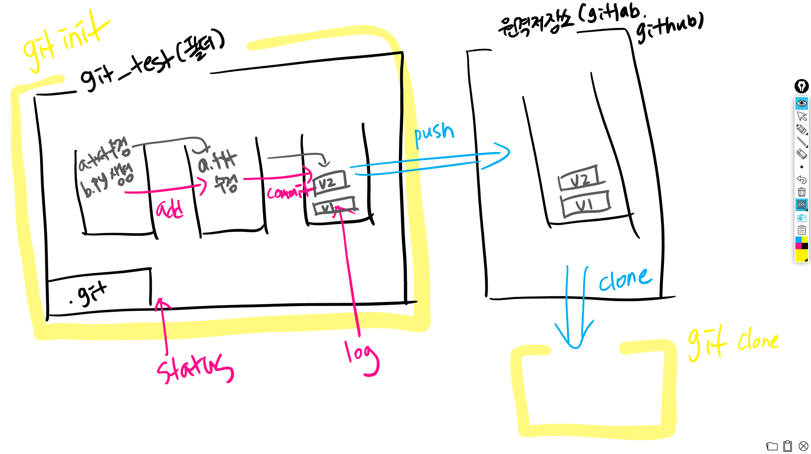

# Git Tutorial

<br>

### Git 이란?

: 분산 버전 관리 시스템 (DVCS)

<br>


<br>

<br>

## Git 주요 명령어

<br>

#### 1. Git 저장소 생성 -  `git init`

```shell
git init
```

<br>

#### 2. Git 버전 관리 -  `git status`

- git의 현재 상태가 어떤지 지속적으로 확인해야함!
- *가장 중요한 git 명령어!*

```shell
$ git status
On branch master

# commit 이 아직 없다 (버전 이력이 없다)
No commits yet

# commit 될 변경 사항
Changes to be committed:
  (use "git reset HEAD <file>..." to unstage)


```

<br>

```bash
$ git add .
$ git status
On branch master

No commits yet

# 커밋 될 변경 사항
Changes to be committed:
 # unstage하려면 아래의 명령어를..
  (use "git rm --cached <file>..." to unstage)
        # 새로운 파일 a.txt 입니다.
        new file:   a.txt
```

<br>

```bash
$ git commit -m 'Init'
[master (root-commit) ebd83a4] Init
 1 file changed, 0 insertions(+), 0 deletions(-)
 create mode 100644 a.txt
 
$ git status
On branch master
# 커밋할 것 없고, 작업 공간도 깨-끗.
nothing to commit, working tree clean

$ git log --oneline
ebd83a4 (HEAD -> master) Init
```

<br>

`+`

### 원격 저장소

- 원격 저장소 등록

  - git아, 원격저장소에(remote) 추가해줘(add) origin이라는 이름으로 url을

  ```bash
  git remote add origin {url}
  ```

  ```bash
  git remote -v
  ```

- push

  ```bash
  git push origin master
  ```

- pull

  ```bash
  git pull origin master
  ```

  <br>

### 원격 저장소 복제

```bash
git clone {url}
```

- clone 명령어는 pull의 역할을 하는 것이 아니라 init의 역할을 하는 것

  - 로컬에서 저장소를 초기화 하는 방법
    - `git init` - 특정 폴더를 저장소로 활용
    - `git clone` - 특정 원격 저장소를 복제

  <br>


